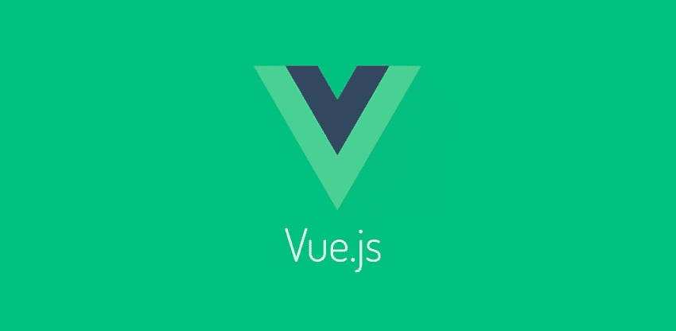

# 渐进式 JavaScript 框架

> 原文:[https://dev . to/mervinsv/the-progressive-JavaScript-framework-4kc](https://dev.to/mervinsv/the-progressive-javascript-framework-4kc)

Vue.js 是由尤雨溪开发的 javascript 框架。它是一个用于构建用户界面的渐进式框架。它侧重于应用程序的视图层，用于构建单页应用程序(SPA)。这个框架像 AngularJS，但是更快更轻。

[T2】](https://res.cloudinary.com/practicaldev/image/fetch/s--yrEHTJ2r--/c_limit%2Cf_auto%2Cfl_progressive%2Cq_auto%2Cw_880/https://coligo.io/vuejs-the-basics/cover-850x416.jpg)

我还在研究这个框架，还没有尝试在实际项目中使用它。据我所知，不像 Reactjs 和 AngularJS 2 那样容易学。并且更容易使用和集成其他库和框架。

与其他框架不同，Vue.js 目前没有稳定的方法来开发移动应用程序。但是开发人员现在正在使用这两个框架来帮助我们构建移动应用程序。这两个框架是 Weex 和 NativeScript。

我喜欢 Vue.js 的一点是，它的体积很小，非常容易集成到应用程序中，就像 jQuery 一样。而且作为一个程序员来说，因为有一个写得很好的文档 [(Vue.js documentation)](https://vuejs.org/v2/guide/) 并且代码结构非常简单，所以也节省了很多构建 app 的时间。

要使用 Vue.js 编写应用程序，您只需了解一些基本的 Javascript 和 HTML 语言。