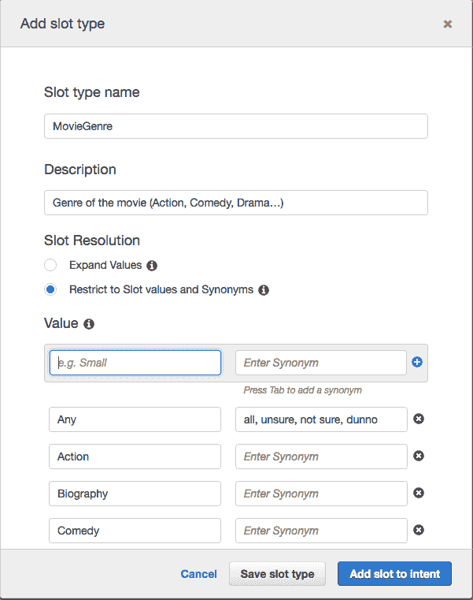
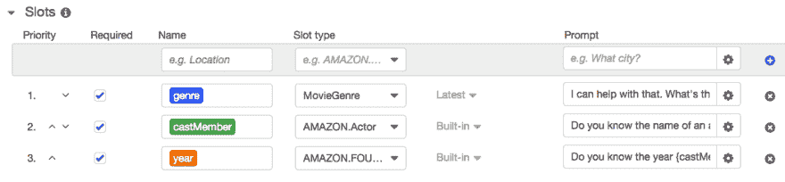
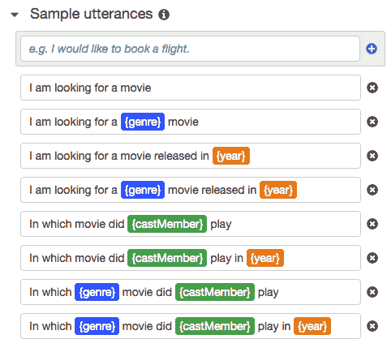
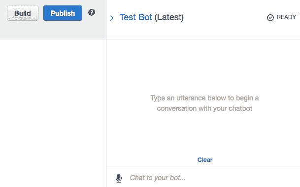
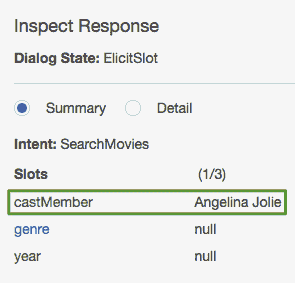
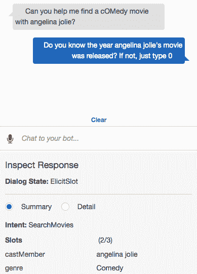

# 构建一个由 Amazon Lex、Lambda 和 MongoDB Atlas 支持的声控电影搜索应用程序——第 2 部分

> 原文:[https://dev . to/MongoDB/building-a-voice-activated-movie-search-app-powered-by-Amazon-lex-lambda-and-MongoDB-atlas-part-2-150h](https://dev.to/mongodb/building-a-voice-activated-movie-search-app-powered-by-amazon-lex-lambda-and-mongodb-atlas---part--2-150h)

### 简介

在你阅读这篇文章之前，先看一下[第 1 部分](https://www.mongodb.com/blog/post/aws-lex-lambda-mongodb-atlas-movie-search-app-part-1?utm_medium=dev-synd&utm_source=dev&utm_content=lex2&jmp=dev-ref)，了解亚马逊 Lex 的简要概述和使用 [MongoDB Atlas](https://www.mongodb.com/cloud/atlas?utm_medium=dev-synd&utm_source=dev&utm_content=lex2&jmp=dev-ref) 建立我们的电影数据库的说明，这是我们完全托管的数据库服务。

提醒一下，本教程分为 4 个部分:

[第 1 部分:Lex 概述、演示场景和数据层设置](https://www.mongodb.com/blog/post/aws-lex-lambda-mongodb-atlas-movie-search-app-part-1?utm_medium=dev-synd&utm_source=dev&utm_content=lex2&jmp=dev-ref)

第 2 部分:设置和测试 Amazon Lex bot(本文)

第 3 部分:部署一个 Lambda 函数作为我们的 Lex bot 实现

在这篇博文中，我们将在 AWS 控制台中设置我们的 Lex bot，并验证它的基本流程是否如预期的那样工作。我们将在本系列文章的第 3 部分实现业务逻辑(利用 MongoDB)。

### 亚马逊 Lex bot 安装说明

在这一节中，我们将介绍创建我们的 *SearchMovies* bot 的整个过程，同时解释我所做的架构决策。

登录到 [AWS 控制台](https://aws.amazon.com/console/)后，选择 Lex 服务(在人工智能部分)并按下**创建**按钮。

选择**自定义机器人**选项，并填写如下表单参数:

机器人名称: **SearchMoviesBot**

输出声音:**无**

会话超时: **5**

杯:否

点击表单底部的**创建**按钮。

将出现一个新页面，您可以在其中创建意图。按下**创建意图**按钮，在**添加意图**弹出页面中，点击**创建新意图**链接，在意图名称栏中输入 ***搜索电影*** 。

在 ***插槽类型*** 部分，添加一个具有以下属性的新插槽类型:

插槽类型名称:***movie genre*T3】**

描述: ***电影类型(动作、喜剧、剧情……)***

槽解析: ***限制为槽值和同义词***

价值观: ***全部，动作，冒险，传记，喜剧，犯罪，剧情，言情，惊悚*T3】**

[T2】](https://res.cloudinary.com/practicaldev/image/fetch/s--1HQ749d1--/c_limit%2Cf_auto%2Cfl_progressive%2Cq_auto%2Cw_880/https://webassets.mongodb.com/_com_assets/cms/image_0-srs3a9ixjq.png)

您可以为所有这些术语添加同义词(它们与我们的示例数据库中电影类型的可能值严格匹配)，但是您想要为其配置同义词的最重要的一个是 ***Any*** 值。我们将使用它作为一个关键字，以避免在用户无法确定他正在寻找的电影类型或想要检索特定演职人员的所有电影的情况下过滤电影类型。当然，你可以自己探索电影数据库，找出并添加我上面没有列出的其他电影类型。完成后，按下**保存槽类型**按钮。

接下来，在 ***插槽*** 部分，添加以下 3 个插槽:

***流派***

类型: ***电影***

提示: ***这个我可以帮忙。电影类型是什么？*T3】**

必填: ***是***

***castMember***

类型: ***亚马逊。演员***

提示: ***你知道那部电影的男演员或女演员的名字吗？*T3】**

必填: ***是***

***年份***

类型: ***亚马逊。*四位数字编号**

提示: ***你知道{castMember}的电影是哪一年上映的吗？如果没有，就键入 0*T3】**

必填: ***是***

按下**保存意图**按钮，并验证您的设置与下面的屏幕截图所示相同:

[T2】](https://res.cloudinary.com/practicaldev/image/fetch/s--whzIPJUF--/c_limit%2Cf_auto%2Cfl_progressive%2Cq_auto%2Cw_880/https://webassets.mongodb.com/_com_assets/cms/image_1-k44ww1m57n.png)

在这里，槽的顺序很重要:一旦检测到用户的第一句话与 Lex 意图匹配，Lex bot 将(默认情况下)通过使用每个槽的提示文本，尝试按照上面指定的优先级顺序从用户那里收集槽值。请注意，您可以在后续的槽提示中使用之前收集的槽值，我在“ *year* ”槽中演示了这一点。例如，如果用户对*剧组成员*时段提示回答*安吉丽娜·朱莉*，则*年份*时段提示将是:*‘你知道安吉丽娜·朱莉的电影是哪一年上映的吗？如果没有，只需键入 0*

请注意，重要的是所有插槽都标记为*。否则，用户指定它们的唯一机会是在原始话语中提及它们。正如您将在下面看到的，我们将从一开始就为 Lex 提供这种识别插槽的能力，但是如果用户选择在不提及任何插槽的情况下开始这个过程，会怎么样呢？如果这些插槽不是必需的，它们默认会被 Lex bot 忽略，所以我们需要将它们标记为*必需的*，以便为用户提供定义它们的选项。*

 *但是如果用户不知道这些提示的答案呢？我们也通过定义“缺省”值来处理这种情况:流派槽的所有值为*，年份槽的值为 ***0*** 。机器人用户必须提供的唯一强制参数是演职人员的姓名；用户可以通过提供电影类型和发行年份来进一步限制搜索。*

 *最后，让我们添加以下示例话语，这些话语与我们期望用户为启动机器人而键入(或说出)的内容相匹配:

我正在找一部电影

我在找一部{流派}电影

我在找一部在{year}上映的电影

我在找一部在{year}年发行的{genre}电影

{castMember}演了哪部电影

{castMember}在{year}出演了哪部电影

{castMember}出演了哪部{genre}电影

{castMember}在{year}年出演了哪部{genre}电影

我想找部电影

我想找一部有{castMember}的电影

按照下面的截图配置话语后，按页面底部的 ***保存意图*** ，然后按页面顶部的 ***构建*** 。这个过程需要几秒钟，因为 AWS 建立了深度学习模型，Lex 将使用它来驱动我们的 *SearchMovies* bot。

[T2】](https://res.cloudinary.com/practicaldev/image/fetch/s--aZOe1vYW--/c_limit%2Cf_auto%2Cfl_progressive%2Cq_auto%2Cw_880/https://webassets.mongodb.com/_com_assets/cms/image_2-x9mh5f359p.png)

现在是测试我们刚刚构建的机器人的时候了！

### 测试机器人

构建过程完成后，测试窗口会自动出现:

[T2】](https://res.cloudinary.com/practicaldev/image/fetch/s--KEq9_1fb--/c_limit%2Cf_auto%2Cfl_progressive%2Cq_auto%2Cw_880/https://webassets.mongodb.com/_com_assets/cms/image_3-aldti5086j.png)

通过键入(或说出)与我们之前配置的示例语句相近的句子来测试机器人。例如，你可以输入“*你能帮我找一部安吉丽娜·朱莉主演的电影吗？并看到机器人将句子识别为有效的开始话语，以及 *{castMember}* 槽值(在这种情况下，*安吉丽娜朱莉*’)。这可以通过查看检查响应面板来验证:*

[T2】](https://res.cloudinary.com/practicaldev/image/fetch/s--ICixOZOu--/c_limit%2Cf_auto%2Cfl_progressive%2Cq_auto%2Cw_880/https://webassets.mongodb.com/_com_assets/cms/image_4-vg1y388asj.png)

此时，电影类型还没有指定，所以 Lex 提示它(因为这是第一个必需的槽)。一旦您回答了这个提示，请注意 Lex 跳过了第二个槽( *{castMember}* )，因为它已经有了那个信息。

反过来，你可以测试一下“你能帮我找一部安吉丽娜·朱莉主演的喜剧电影吗？”话语将立即提示用户填写{year}槽，因为在原始话语中提供了 *{castMember}* 和 *{genre}* 值:

[T2】](https://res.cloudinary.com/practicaldev/image/fetch/s--S1HeSLn7--/c_limit%2Cf_auto%2Cfl_progressive%2Cq_auto%2Cw_880/https://webassets.mongodb.com/_com_assets/cms/image_5-tci29y4wt9.png)

这里需要注意的重要一点是枚举槽类型(比如我们的 *MovieGenre* 类型)是不区分大小写的。这意味着“喜剧”和“喜剧”都将归结为“喜剧”。这意味着我们将能够在电影集合的类型属性上使用常规索引(只要我们在 Lex 中的枚举值与我们数据库中的类型匹配)。

然而，*亚马逊。演员*类型区分大小写——例如，“*安吉丽娜·朱莉*”和“*安吉丽娜·朱莉*”是 Lex 的两个不同值。这意味着我们必须在 **Cast** 属性上定义一个[不区分大小写的索引](https://docs.mongodb.com/manual/core/index-case-insensitive?jmp=adref)(不要担心，在我们的示例电影数据库中已经有这样一个索引，名为‘Cast _ 1’)。注意，为了让查询使用不区分大小写的索引，我们必须确保我们的 find()查询指定了与用于创建索引的排序规则相同的排序规则(locale='en '和 strength=1)。但是现在不要担心:当我们回顾聊天的业务逻辑代码时，我会确保在第 3 部分中再次指出这一点(在我们将部署的 Lambda 函数中)。

### 总结

在这篇博文中，我们创建了 SearchMovies Lex bot 并测试了它的流程。更具体地说，我们:

创建了自定义 Lex 插槽类型(MovieGenre)

已配置的意向槽

定义的示例话语(其中一些使用我们预定义的槽)

测试我们的话语和每个话语开始的特定提示流

我们还确定了一个内置的 Lex slot 的大小写敏感性，它为我们的数据库增加了一个新的索引需求。

在[第 3 部分](https://www.mongodb.com/blog/post/aws-lex-lambda-mongodb-atlas-movie-search-app-part-3?utm_medium=dev-synd&utm_source=dev&utm_content=lex2&jmp=dev-ref)中，我们将讨论 Lex 博客文章系列的核心内容，并部署 Lambda 函数，该函数将允许我们完成机器人的预期动作(在 Lex 术语中称为“实现”)。

同时，我建议阅读下面的内容来加深您对 Lex 和 MongoDB 的了解:

[Lex 内置插槽类型](https://developer.amazon.com/docs/custom-skills/slot-type-reference.html)

[不区分大小写的索引](https://docs.mongodb.com/manual/core/index-case-insensitive?jmp=adref)

_ 关于作者- **拉斐尔·朗德纳** _

Raphael Londner 是 MongoDB 的首席开发人员，专注于云技术，如亚马逊网络服务、微软 Azure 和谷歌云引擎。此前，他是 Okta 的开发者拥护者，也是身份管理领域的创业企业家。你可以在***[@ rlondner](https://www.twitter.com/rlondner)***的推特上关注他。**