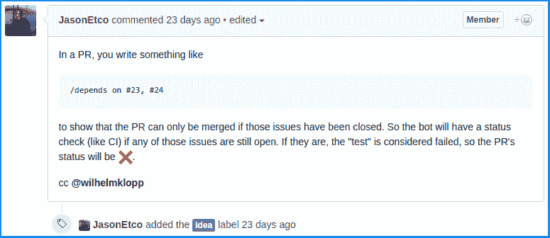
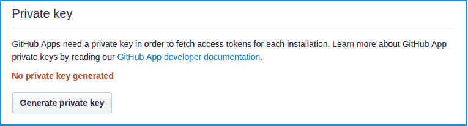
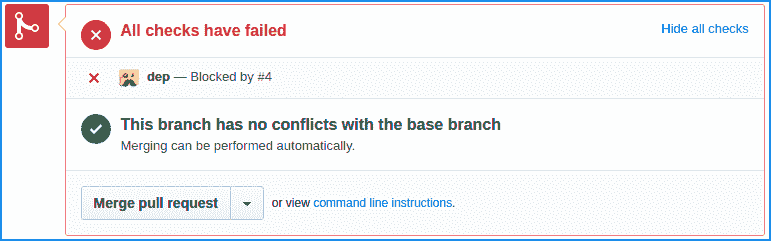

# 让我们建立一个 GitHub (Pro)机器人

> 原文:[https://dev.to/z0al/lets-build-a-github-probot-2ec](https://dev.to/z0al/lets-build-a-github-probot-2ec)

*最初贴在[介质上](https://medium.com/ahmed-t-ali/lets-build-a-github-pro-bot-5e155cec395f)T3】*

今年早些时候，[发布了](https://developer.github.com/changes/2017-05-22-github-apps-production-ship)GitHub 应用程序(之前的集成)。在 GitHub 中，应用程序是一等公民，这意味着它们代表自己行事，就像普通的 GitHub 用户一样。

在 GitHub.com，你可以通过 GitHub 在应用程序名称后添加的“bot”后缀，从视觉上区分应用程序(bot)和普通用户。例如，[绿色守护者](https://greenkeeper.io/)的机器人看起来是这样的:

[T2】](https://res.cloudinary.com/practicaldev/image/fetch/s--9ucpdqQC--/c_limit%2Cf_auto%2Cfl_progressive%2Cq_auto%2Cw_880/https://cdn-images-1.medium.com/max/1024/1%2APqSglnHFhkPdozbeYuLHJw.png)

GitHub 让应用程序订阅某些事件(又名 [webhooks](https://developer.github.com/webhooks) )。当其中一个事件被触发时，它将向一个预先配置的 URL 发送一个 HTTP POST 有效负载。例如，CI 服务需要订阅“推送”事件，以便在推送新代码时运行您的测试。

## 关于 Probot

来自[官方文件](http://probot.github.io/docs/):

> Probot 是在 [Node.js](https://nodejs.org/) 中构建 [GitHub 应用](http://developer.github.com/apps)的框架。它旨在消除所有的苦差事——如接收和验证 webhooks，并进行身份验证——以便您可以专注于您想要构建的功能。

Probot 让你专注于你的应用程序功能，而不是去弄清楚如何正确认证请求，验证 T2 网页钩子的有效载荷，或者模拟 T4 网页钩子的请求。它还预配置了本地隧道，让你的生活更轻松，ðÿ˜

使用 Probot 的另一个好处是能够使用现有的[扩展](https://github.com/probot)来提供漂亮的特性，比如像命令一样的[松弛。](https://github.com/probot/commands)

Probot 是用 [Node.js](http://nodejs.org) 编写的，所以事先熟悉 JavaScript 和 [npm](https://npmjs.com) 对理解本文中的代码片段非常有帮助。

对于 [API](https://developer.github.com/v3/) 调用，Probot [在上下文对象下注入](https://probot.github.io/docs/github-api/)一个经过认证的 [GitHub API 客户端](https://github.com/octokit/node-github)实例。看看这个最小的例子:

```
module.exports = robot => {
  robot.on('issues.opened', async context => {
    // `context` extracts information from the event, which can be passed to
    // GitHub API calls. This will return:
    //   {owner: 'yourname', repo: 'yourrepo', number: 123, body: 'Hello World!}
    const params = context.issue({body: 'Hello World!'})

    // Post a comment on the issue
    return context.github.issues.createComment(params);
  });
} 
```

<svg width="20px" height="20px" viewBox="0 0 24 24" class="highlight-action crayons-icon highlight-action--fullscreen-on"><title>Enter fullscreen mode</title></svg> <svg width="20px" height="20px" viewBox="0 0 24 24" class="highlight-action crayons-icon highlight-action--fullscreen-off"><title>Exit fullscreen mode</title></svg>

## 我们的 App (bot)

在本帖中，我们将尝试实现一个类似于 Travis，Circle 等典型 CI 服务的机器人..但我们将检查是否解决了拉取请求的依赖性，而不是运行测试套件。依赖关系可以是一个问题，也可以是另一个拉取请求。问题在关闭时被视为已解决，但拉取请求在合并或关闭后被视为已解决。

我从[杰森·艾柯维契](https://twitter.com/JasonEtco) ( [原版](https://github.com/probot/ideas/issues/1))那里得到了机器人的想法:

[T2】](https://res.cloudinary.com/practicaldev/image/fetch/s--3fcgG5if--/c_limit%2Cf_auto%2Cfl_progressive%2Cq_auto%2Cw_880/https://cdn-images-1.medium.com/max/775/1%2AmDJq_Vhsi_ffgIo9jgH6Cg.png)

它是这样工作的:

*   用户(具有推送访问权限)使用以下模式在打开的拉取请求中编写注释:

```
/depends on #1 , #2 and maybe #3 too 
```

<svg width="20px" height="20px" viewBox="0 0 24 24" class="highlight-action crayons-icon highlight-action--fullscreen-on"><title>Enter fullscreen mode</title></svg> <svg width="20px" height="20px" viewBox="0 0 24 24" class="highlight-action crayons-icon highlight-action--fullscreen-off"><title>Exit fullscreen mode</title></svg>

*   然后，我们的应用程序会将提到的问题标记为该 PR 的必要依赖项。它还添加了一个标签(即“dependent”)，表明 PR 具有一些需要在合并之前首先解决的依赖关系。
*   当一个问题得到解决后，我们的应用程序将搜索带有文本“依赖”标签的拉请求。如果我们找到匹配，我们将相应地更新它们的状态。

那么，让我们开始吧，ðÿ˜„

## App 注册

在我们开始之前，我们需要注册我们的应用程序，为此，请遵循 GitHub 官方指南[这里](https://developer.github.com/apps/building-integrations/setting-up-and-registering-github-apps/registering-github-apps/)。

**备注:**

*   如果你还不知道你的应用会在哪里，你可以考虑使用应用库的 URL(即 [ahmed-taj/dep](https://github.com/ahmed-taj/dep) )作为“**主页 URL**
*   现在，您可以安全地使用" [https://example.com"](https://example.com%E2%80%9D) 作为 **"Webhook URL"** 我们将很快修复这个问题！
*   我们需要以下**权限**才能让我们的应用程序工作:

1.  **提交状态(Read & Write):** 就像 CI 服务一样，我们需要更新提交状态，以反映所有依赖项(问题或 PRs)是否都已解决。
2.  **存储库管理(只读)**和**组织成员(只读):**我们将只允许拥有“推送”访问权限的用户更新拉取请求依赖关系。
3.  **问题(只读)**和**拉请求(读&写):**使我们能够读/写问题注释，并更新 PR 标签。

*   同样，基于以上权限，我们需要订阅**【问题评论】****【问题】****【拉取请求】**。

## 生成私钥

注册应用程序后，我们需要生成一个私钥。要生成私钥，点击**“生成私钥”**按钮。

[T2】](https://res.cloudinary.com/practicaldev/image/fetch/s--6Dnco9Jo--/c_limit%2Cf_auto%2Cfl_progressive%2Cq_auto%2Cw_880/https://cdn-images-1.medium.com/max/765/1%2AW9UTlZpnTg0ZqH0AK1s_zQ.png)

将私钥文件保存在本地机器上某个安全的地方。

> **提示:**[官方文件](https://probot.github.io/docs/development/)说:
> 
> "下载私钥并将其移动到您的项目目录中."
> 
> **我不推荐**这样做，而是将私钥保存在其他地方，稍后指向它的位置(参见下面的“启动应用程序”一节)

## 本地设置

Probot 有一个方便的 CLI 来搭建一个新的基于 Probot 的 GitHub 应用程序，名为“[**create-Probot-App**](https://github.com/probot/create-probot-app)”

```
$ npx create-probot-app dep 
```

<svg width="20px" height="20px" viewBox="0 0 24 24" class="highlight-action crayons-icon highlight-action--fullscreen-on"><title>Enter fullscreen mode</title></svg> <svg width="20px" height="20px" viewBox="0 0 24 24" class="highlight-action crayons-icon highlight-action--fullscreen-off"><title>Exit fullscreen mode</title></svg>

> **提示:**你需要安装 [npm](https://www.npmjs.com) (5 或更高版本)以上命令才能工作！

上述命令将安装 create-probot-app，然后在“dep”目录下搭建一个 probot starter 应用程序。文件夹的结构看起来会像这样:

```
$ cd dep && tree
.
├── docs
│ └── deploy.md
├── etc
├── node_modules
├── __tests__
│ └── index.test.js
├── .env.example
├── .gitignore
├── .travis.yml
├── app.json
├── CODE_OF_CONDUCT.md
├── CONTRIBUTING.md
├── index.js
├── LICENSE
├── package.json
├── package-lock.json
└── README.md

4 directories, 13 files 
```

<svg width="20px" height="20px" viewBox="0 0 24 24" class="highlight-action crayons-icon highlight-action--fullscreen-on"><title>Enter fullscreen mode</title></svg> <svg width="20px" height="20px" viewBox="0 0 24 24" class="highlight-action crayons-icon highlight-action--fullscreen-off"><title>Exit fullscreen mode</title></svg>

酷！create-probot-app (CPA)不仅搭建了我们的代码，还搭建了测试和其他必要的存储库文件(即行为准则、自述文件..等等)。

在撰写本文时，CPA 默认安装/配置 [**Jest 测试框架**](http://facebook.github.io/jest) 。Jest 很酷，但是你可以用任何你喜欢的 JavaScript 测试框架来编写你的测试。出于本文的目的，我们将坚持使用默认值。

> **提示:**如果你使用 Visual Studio 代码，我推荐使用 [Jest VS Code](https://marketplace.visualstudio.com/items?itemName=Orta.vscode-jest) 扩展

## 启动 app

为了运行我们的应用程序，我们只需运行以下命令:

```
$ npm start 
```

<svg width="20px" height="20px" viewBox="0 0 24 24" class="highlight-action crayons-icon highlight-action--fullscreen-on"><title>Enter fullscreen mode</title></svg> <svg width="20px" height="20px" viewBox="0 0 24 24" class="highlight-action crayons-icon highlight-action--fullscreen-off"><title>Exit fullscreen mode</title></svg>

我们来试试:

```
$ npm start

> dep-bot@1.0.0 start /home/ahmed/projects/dep
> probot run ./index.js

Missing GitHub App ID.
Use --app flag or set APP_ID environment variable.

... 
```

<svg width="20px" height="20px" viewBox="0 0 24 24" class="highlight-action crayons-icon highlight-action--fullscreen-on"><title>Enter fullscreen mode</title></svg> <svg width="20px" height="20px" viewBox="0 0 24 24" class="highlight-action crayons-icon highlight-action--fullscreen-off"><title>Exit fullscreen mode</title></svg>

你可能已经注意到，Probot 需要知道我们的应用 ID、Webhook 秘密(如果有的话)和应用私钥。我们可以在每次运行**“NPM start”**时传递这些变量，但还有另一种更简单的方式。**。env** 文件！

让我们**将**. env . example "文件重命名为"。env”并将其内容修改为类似于下面这样:

```
# The ID of your GitHub App
APP_ID=<Your App ID>

WEBHOOK_SECRET=<Your webhook secret>

# NOTE: Shortcuts like ~ in UNIX-like system will not work!
# Use absolute path instead
PRIVATE_KEY_PATH=<path/to/your/app/private-key.pem>

# Uncomment this to get verbose logging
# LOG_LEVEL=trace # or `info` to show less

# Subdomain to use for localtunnel server. Defaults to your local username.
# SUBDOMAIN= 
```

<svg width="20px" height="20px" viewBox="0 0 24 24" class="highlight-action crayons-icon highlight-action--fullscreen-on"><title>Enter fullscreen mode</title></svg> <svg width="20px" height="20px" viewBox="0 0 24 24" class="highlight-action crayons-icon highlight-action--fullscreen-off"><title>Exit fullscreen mode</title></svg>

如果我们再次运行 start 命令，它应该输出:

```
$ npm start

> dep-bot@1.0.0 start /home/ahmed/projects/dep
> probot run ./index.js

Yay, the app was loaded!
Listening on https://ahmed.localtunnel.me 
```

<svg width="20px" height="20px" viewBox="0 0 24 24" class="highlight-action crayons-icon highlight-action--fullscreen-on"><title>Enter fullscreen mode</title></svg> <svg width="20px" height="20px" viewBox="0 0 24 24" class="highlight-action crayons-icon highlight-action--fullscreen-off"><title>Exit fullscreen mode</title></svg>

如果你的输出和上面类似，太好了！**你准备好出发了**。如果没有，请考虑再次阅读上面的说明。如果你不能让它工作，不要犹豫在下面评论。

`Listening on ..`部分将根据您本地机器的用户名而变化，在我的例子中，它是“ahmed”。

[**Localtunnel**](https://localtunnel.github.io/www/) 通过为您的服务器分配一个唯一的可公开访问的 URL 来工作，该 URL 将代理所有 webhooks(或任何)请求到您本地运行的 Probot 服务器。这对发展非常有利！

还记得我们将 webhook 的 URL 设置为“[https://example . com”](https://example.com%E2%80%9D)吗？现在让我们 [**把它**](https://github.com/settings/apps) 改成`Listening on ..`部分之后得到的东西(也就是[https://Ahmed . local tunnel . mein](https://ahmed.localtunnel.mein)这种情况)。

## 第一部分:添加请购单依赖关系

Probot 扩展只是一个普通的 JavaScript 函数，它接收机器人对象作为其参数之一。

我们将利用名为“[斜杠命令](https://github.com/probot/commands)的扩展来解析和解释`/depends`或`/ensure`注释。此外，我们将使用另一个扩展，使我们能够在任何问题主体中存储定制的 JSON 格式。让我们从安装必要的扩展开始:

```
$ npm add probot-{commands,metadata} 
```

<svg width="20px" height="20px" viewBox="0 0 24 24" class="highlight-action crayons-icon highlight-action--fullscreen-on"><title>Enter fullscreen mode</title></svg> <svg width="20px" height="20px" viewBox="0 0 24 24" class="highlight-action crayons-icon highlight-action--fullscreen-off"><title>Exit fullscreen mode</title></svg>

现在，让我们修改 index.js 以使用扩展名:

```
// index.js
// Packages
const command = require('probot-commands')

// Ours
const ensure = require('./lib/ensure')

module.exports = robot => {
  // Ensures all dependencies are resolved before the PR can be merged
  //
  // Triggered when you write:
  //    /COMMAND arguments
  command(robot, 'depends', ensure)
  command(robot, 'ensure', ensure)
} 
```

<svg width="20px" height="20px" viewBox="0 0 24 24" class="highlight-action crayons-icon highlight-action--fullscreen-on"><title>Enter fullscreen mode</title></svg> <svg width="20px" height="20px" viewBox="0 0 24 24" class="highlight-action crayons-icon highlight-action--fullscreen-off"><title>Exit fullscreen mode</title></svg>

**工作原理:**

*   每当在安装了我们的应用程序的存储库中创建评论时，GitHub 都会向我们的应用程序发送一个 webhook 请求，并传递必要的有效载荷。
*   probot-commands 将解析注释体以匹配可能的斜杠命令(即“确保”或“依赖”)。
*   如果找到匹配，probot-commands 将调用我们的确保函数，并传递命令名及其参数(作为字符串)

让我们为确保函数编写一个初始实现，以确保一切正常:

```
// lib/ensure.js
const ensure = async (context, command) => {
  console.log('Hi, it is ensure')
  console.log('my arguments are:', command.arguments)
}

module.exports = ensure 
```

<svg width="20px" height="20px" viewBox="0 0 24 24" class="highlight-action crayons-icon highlight-action--fullscreen-on"><title>Enter fullscreen mode</title></svg> <svg width="20px" height="20px" viewBox="0 0 24 24" class="highlight-action crayons-icon highlight-action--fullscreen-off"><title>Exit fullscreen mode</title></svg>

为了测试我们的实现，我们需要实际安装我们的应用程序。访问[https://github.com/apps/YOUR_APP_NAME](https://github.com/apps/YOUR_APP_NAME)并在你的任何存储库中安装应用程序。安装应用程序后，启动服务器(通过运行 npm start ),然后在该存储库的任何问题/PRs 中写一条注释，内容如下:

```
/depends on #1 and #2 are resolved first 
```

<svg width="20px" height="20px" viewBox="0 0 24 24" class="highlight-action crayons-icon highlight-action--fullscreen-on"><title>Enter fullscreen mode</title></svg> <svg width="20px" height="20px" viewBox="0 0 24 24" class="highlight-action crayons-icon highlight-action--fullscreen-off"><title>Exit fullscreen mode</title></svg>

您将在终端中看到以下输出:

```
Hi, it is ensure
my arguments are: #1 and #2 are resolved first 
```

<svg width="20px" height="20px" viewBox="0 0 24 24" class="highlight-action crayons-icon highlight-action--fullscreen-on"><title>Enter fullscreen mode</title></svg> <svg width="20px" height="20px" viewBox="0 0 24 24" class="highlight-action crayons-icon highlight-action--fullscreen-off"><title>Exit fullscreen mode</title></svg>

太好了！起作用了！

是真正实施ðÿ˜ž的时候了

```
// lib/ensure.js
// Packages
const metadata = require('probot-metadata')

const ensure = async (context, command) => {
  // 1\. We only target PRs
  if (!context.payload.issue.pull_request) return

  // 2\. Match issue numbers
  const issues = (command.arguments.match(/#(\d+)(?=\s*)/g) || []).map(
    i => Number(i.slice(1)) // Removes '#' prefix
  )

  // 3\. Set dependencies (override!)
  await metadata(context).set('dependencies', issues)

  // 4\. Extract necessary info
  const info = {
    owner: context.payload.repository.owner.login,
    repo: context.payload.repository.name,
    number: context.payload.issue.number
  }

  // 5\. Add or remove marker
  return issues.length > 0
    ? context.github.issues.addLabels({ ...info, labels: ['dependent'] })
    : context.github.issues.removeLabel({ ...info, name: 'dependent' })
}

module.exports = ensure 
```

<svg width="20px" height="20px" viewBox="0 0 24 24" class="highlight-action crayons-icon highlight-action--fullscreen-on"><title>Enter fullscreen mode</title></svg> <svg width="20px" height="20px" viewBox="0 0 24 24" class="highlight-action crayons-icon highlight-action--fullscreen-off"><title>Exit fullscreen mode</title></svg>

**工作原理:**

*   从技术上讲，在 GitHub 中，pr 只是特殊问题。为了确保我们正在处理一个 PR(不是一个简单的问题),我们需要检查一个`pull_request`键是否存在(我们不关心它的值)。
*   我们获取自变量参数(由 probot-commands 扩展传递)并搜索[发布模式](https://github.com/blog/957-introducing-issue-mentions) ( **#** 后跟一系列数字)。
*   然后，我们将去掉“ **#** ”前缀，并将问题编号存储为该 PR 的元数据。
*   最后，我们给这个 PR 添加一个标签，以便于我们区分依赖的 PR。

**测试**

让我们添加一些测试来验证我们的代码工作正常。

```
// __tests__/ensure.test.js
// Packages
const metadata = require('probot-metadata')
const { createRobot } = require('probot')

// Ours
const app = require('../index')
const events = require('./events')

// Globals
let robot
let github

// Mock everything
beforeEach(() => {
  // Here we create a robot instance
  robot = createRobot()

  // Here we initialize the app on the robot instance
  app(robot)

  // Mock GitHub client
  github = {
    issues: {
      addLabels: jest.fn(),
      removeLabel: jest.fn()
    }
  }

  // Passes the mocked out GitHub API into out robot instance
  robot.auth = () => Promise.resolve(github)
})

test('processing plain issue comments', async () => {
  await robot.receive(events.issue_comment_created)
  expect(github.issues.addLabels).not.toBeCalled()
})

test('adding metadata', async () => {
  await robot.receive(events.pr_comment_created)
  expect(metadata).toBeCalledWith(
    expect.objectContaining({ payload: expect.any(Object) })
  )
  expect(metadata().set).toBeCalledWith('dependencies', expect.any(Array))
})

test('adding the marker', async () => {
  await robot.receive(events.pr_comment_created)
  expect(github.issues.addLabels).toBeCalledWith(
    expect.objectContaining({
      owner: 'user',
      repo: 'test',
      number: 1,
      labels: expect.any(Array)
    })
  )
})

test('removing the marker', async () => {
  await robot.receive(events.pr_comment_created_remove)
  expect(github.issues.removeLabel).toBeCalled()
  expect(github.issues.addLabels).not.toBeCalled()
}) 
```

<svg width="20px" height="20px" viewBox="0 0 24 24" class="highlight-action crayons-icon highlight-action--fullscreen-on"><title>Enter fullscreen mode</title></svg> <svg width="20px" height="20px" viewBox="0 0 24 24" class="highlight-action crayons-icon highlight-action--fullscreen-off"><title>Exit fullscreen mode</title></svg>

上面的测试模拟 GitHub API 客户端，并使用`robot.receive(...)` helper 注入静态有效负载！

有效负载样本是从真实的(过去的)webhook 有效负载中复制的。阅读“[模拟 Webhooks](https://probot.github.io/docs/simulating-webhooks/) ”文档了解更多信息。

现在，如果我们运行 npm 测试命令，我们应该看到测试通过:

```
$ npm test

> dep-bot@1.0.0 test /home/ahmed/projects/dep
> jest

PASS __tests__ /ensure.test.js
  ✓ processing plain issue comments (4ms)
  ✓ adding metadata (2ms)
  ✓ adding marker (1ms)
  ✓ removing marker

Test Suites: 1 passed, 1 total
Tests: 4 passed, 4 total
Snapshots: 0 total
Time: 0.829s, estimated 1s
Ran all test suites. 
```

<svg width="20px" height="20px" viewBox="0 0 24 24" class="highlight-action crayons-icon highlight-action--fullscreen-on"><title>Enter fullscreen mode</title></svg> <svg width="20px" height="20px" viewBox="0 0 24 24" class="highlight-action crayons-icon highlight-action--fullscreen-off"><title>Exit fullscreen mode</title></svg>

> **提示:**
> 默认的“CPA 生成”npm 脚本在 Jest 测试后运行 [**标准**](https://standardjs.com) 。要更改此行为，请更改“package.json”文件中的“test”脚本。
> 
> 在我的情况下，我已经将 **标准**完全替换为 [**更漂亮的标准**](https://github.com/sheerun/prettier-standard) 套餐，但是，这取决于你！

## 第(2)部分:更新时检查请购单状态

在这一部分，我们将添加实际测试部分；当所有的依赖项都解决后，我们将报告“成功”，否则，除了什么问题导致失败之外，我们还将报告“失败”。

我们需要回答的第一个问题是:什么时候执行我们的测试(检查所有的依赖关系是否被解决)？

如果我们把我们的应用程序看作一个 CI，那么很明显，每当一个新的 PR 被打开，或者有人向一个已经打开的 PR 推送新的提交，我们都需要重新检查依赖状态。这意味着我们需要倾听这些事件:

1.  `pull_request.opened`
2.  `pull_request.reopened`
3.  `pull_request.synchronize`

但是……当一个问题已经关闭/重新打开时，我们难道不需要重新检查吗？没错，因为更改问题状态不会触发上述任何事件，所以也有必要侦听这些事件:

1.  `issues.closed`
2.  `issues.reopened`
3.  `pull_request.closed`

让我们首先将事件注册到 Probot:

```
// index.js
const test = require('./lib/test')

module.exports = robot => {
  // ...
  robot.on('pull_request.opened', test)
  robot.on('pull_request.reopened', test)
  robot.on('pull_request.synchronize', test)
  // ...
} 
```

<svg width="20px" height="20px" viewBox="0 0 24 24" class="highlight-action crayons-icon highlight-action--fullscreen-on"><title>Enter fullscreen mode</title></svg> <svg width="20px" height="20px" viewBox="0 0 24 24" class="highlight-action crayons-icon highlight-action--fullscreen-off"><title>Exit fullscreen mode</title></svg>

这是我们的处理程序代码:

```
// lib/test.js
// Packages
const metadata = require('probot-metadata')

// Ours
const check = require('./check')

const test = async context => {
  // Extract necessary objects
  const { github, payload } = context
  const repo = payload.repository.name
  const owner = payload.repository.owner.login
  const { sha } = payload.pull_request.head

  // Get dependencies list
  const deps = (await metadata(context).get('dependencies')) || []

  // Preform checks on this PR
  return check(github, owner, repo, sha, deps)
}

module.exports = test 
```

<svg width="20px" height="20px" viewBox="0 0 24 24" class="highlight-action crayons-icon highlight-action--fullscreen-on"><title>Enter fullscreen mode</title></svg> <svg width="20px" height="20px" viewBox="0 0 24 24" class="highlight-action crayons-icon highlight-action--fullscreen-off"><title>Exit fullscreen mode</title></svg>

和`check.js` :

```
// lib/check.js
// Packages
const metadata = require('probot-metadata')

// Ours
const report = require('./report')

const check = async (github, owner, repo, sha, deps) => {
  // Tell GitHub we are working on it
  await report(github, owner, repo, sha, 'pending')

  // Helpers
  let pass = true
  let blockers = []

  for (const number of deps) {
    // Get issue details
    const issue = await github.issues.get({ owner, repo, number })

    // The actual test
    if (issue.data.state === 'open') {
      pass = false
      blockers.push(number)
    }
  }

  // Update the state
  report(github, owner, repo, sha, pass ? 'success' : 'failure', blockers)
}

module.exports = check 
```

<svg width="20px" height="20px" viewBox="0 0 24 24" class="highlight-action crayons-icon highlight-action--fullscreen-on"><title>Enter fullscreen mode</title></svg> <svg width="20px" height="20px" viewBox="0 0 24 24" class="highlight-action crayons-icon highlight-action--fullscreen-off"><title>Exit fullscreen mode</title></svg>

**工作原理:**

*   在开始测试过程之前，我们向 GitHub 发送一个状态更新，说明我们已经开始处理 webhook 请求。
*   然后，我们使用元数据扩展来检索存储在第一部分中的依赖项列表(如果有的话)。
*   最后，我们迭代所有存储的问题并获取它们的状态。如果它们都关闭了，我们报告“成功”。否则，我们会报告“失败”并传递一个阻止程序问题列表。

现在，如果您启动服务器并测试我们的代码，您应该会在 PR checks 面板中看到类似这样的内容:

[T2】](https://res.cloudinary.com/practicaldev/image/fetch/s--jXjSFxfn--/c_limit%2Cf_auto%2Cfl_progressive%2Cq_auto%2Cw_880/https://cdn-images-1.medium.com/max/771/1%2AKCWHTqfaM6Gfe0BItq1fUg.png)

好了，让我们添加当一个依赖项被更新时自动重新检查的支持。

```
// index.js
const update = require('./lib/update')

module.exports = robot => {
  // ...
  robot.on('issues.closed', update)
  robot.on('issues.reopened', update)
  robot.on('pull_request.reopened', update)
  robot.on('pull_request.closed', update)
  // ...
} 
```

<svg width="20px" height="20px" viewBox="0 0 24 24" class="highlight-action crayons-icon highlight-action--fullscreen-on"><title>Enter fullscreen mode</title></svg> <svg width="20px" height="20px" viewBox="0 0 24 24" class="highlight-action crayons-icon highlight-action--fullscreen-off"><title>Exit fullscreen mode</title></svg>

我们的 update.js 将重用相同的检查函数:

```
// lib/update.js
// Packages
const metadata = require('probot-metadata')

// Ours
const check = require('./check')

const update = async context => {
  const { github, payload } = context

  // Issue or Pull request?
  const self = payload.issue || payload.pull_request

  // Extract necessary info
  const owner = payload.repository.owner.login
  const repo = payload.repository.name

  // Constants
  const labels = 'dependent'
  const state = 'open'
  const per_page = 100

  // Get all open, dependent pull requests
  github.paginate(
    github.issues.getForRepo({ owner, repo, state, labels, per_page }),
    async page => {
      for (const issue of page.data) {
        // We only process PRs
        if (!issue.pull_request) continue

        const { number } = issue

        // Get full PR details
        const pr = (await github.pullRequests.get({ owner, repo, number })).data

        // Get dependencies list
        const deps = (await metadata(context, pr).get('dependencies')) || []

        // Re-check if the original issue is a dependency of this PR
        if (deps.includes(self.number)) {
          await check(github, owner, repo, pr.head.sha, deps)
        }
      }
    }
  )
}

module.exports = update 
```

<svg width="20px" height="20px" viewBox="0 0 24 24" class="highlight-action crayons-icon highlight-action--fullscreen-on"><title>Enter fullscreen mode</title></svg> <svg width="20px" height="20px" viewBox="0 0 24 24" class="highlight-action crayons-icon highlight-action--fullscreen-off"><title>Exit fullscreen mode</title></svg>

**工作原理:**

*   每当依赖 X 被重新打开或关闭时，我们将搜索具有“依赖”标签的打开的拉请求。
*   然后，我们遍历搜索结果，寻找依赖 X 的 pull 请求。
*   如果我们找到了匹配，我们将对每个匹配运行检查功能。

> **提示:**我为所有部分写了一些测试，但我没有把它们贴在这里，以免这篇文章冗长，我在下面提供了完整代码(包括测试文件)的链接。

### 第三部分:授权

> 随着权力而来的是责任——未知

你可能已经注意到，我们的应用程序总是会添加/更新依赖项，即使使用`/depends on …`评论的用户不是存储库的所有者(或具有推送访问权限的成员)。这太糟糕了！

要解决这个问题，我们只需在执行任何修改原始问题的操作之前检查作者权限。

```
// index.js
// Packages
const metadata = require('probot-metadata')

const ensure = async (context, command) => {
  // Check user permission first
  const { permission } = (await github.repos.reviewUserPermissionLevel({
    username,
    owner,
    repo
  })).data

  // Possible values are: admin, write, read, none
  if (!['admin', 'write'].includes(permission)) return
  // ...
} 
```

<svg width="20px" height="20px" viewBox="0 0 24 24" class="highlight-action crayons-icon highlight-action--fullscreen-on"><title>Enter fullscreen mode</title></svg> <svg width="20px" height="20px" viewBox="0 0 24 24" class="highlight-action crayons-icon highlight-action--fullscreen-off"><title>Exit fullscreen mode</title></svg>

### 第四部分:部署到现在

在这一部分，我将向您展示如何将应用程序部署到 [Zeit Now](https://now.sh) 。您当然可以将它部署到其他地方，这取决于您的需求或偏好。值得一提的是，Probot 的官方文档中有一个[专用部分](http://probot.github.io/docs/deployment)，用于部署到不同的提供商。

> **提示:**不要忘记将“webhook URL”改为指向您的部署，而不是您的 localtunnel。

将应用程序部署到 Now 很容易，但您需要将应用程序私钥正确设置为环境变量。我花了一段时间来思考如何做这件事。感谢汤姆·文森特的帮助:

> 汤姆·文森特@ TL Vince[@ ah _ tajelsir](https://twitter.com/ah_tajelsir)尝试` now secret add private-key " $(base64<private-key . PEM)" `)并解码 on now-start[git.io/vFOgs](https://t.co/9XWvxHoDoF)09:49AM-01 2017[](https://twitter.com/intent/tweet?in_reply_to=925661028435877890)

所以，现在要添加必要的秘密，你需要运行下面的命令:

```
$ now secret add DEP_BOT_APP_ID "YOUR_APP_ID"

$ now secret add DEP_BOT_WEBHOOK_SECRET "YOUR_SECRET"

$ now secret add DEP_BOT_PRIVATE_KEY "$(base64 < /path/to/private-key.pem)" 
```

<svg width="20px" height="20px" viewBox="0 0 24 24" class="highlight-action crayons-icon highlight-action--fullscreen-on"><title>Enter fullscreen mode</title></svg> <svg width="20px" height="20px" viewBox="0 0 24 24" class="highlight-action crayons-icon highlight-action--fullscreen-off"><title>Exit fullscreen mode</title></svg>

> **注**:对不起，Windows 的乡亲们，我不知道 Windows 中是否存在“base64”命令！

另外，添加“ [now.json](https://zeit.co/blog/now-json) ”文件也很有帮助，其内容如下:

```
{  "name":  "dep",  "alias":  ["dep"],  "type":  "npm",  "env":  {  "APP_ID":  "@dep_bot_app_id",  "NODE_ENV":  "production",  "PRIVATE_KEY":  "@dep_bot_private_key",  "WEBHOOK_SECRET":  "@dep_bot_webhook_secret"  },  "engines":  {  "node":  ">=8.8.0"  }  } 
```

<svg width="20px" height="20px" viewBox="0 0 24 24" class="highlight-action crayons-icon highlight-action--fullscreen-on"><title>Enter fullscreen mode</title></svg> <svg width="20px" height="20px" viewBox="0 0 24 24" class="highlight-action crayons-icon highlight-action--fullscreen-off"><title>Exit fullscreen mode</title></svg>

> **提示:**您可能需要将别名数组更改为其他未采用的数组。

我们还需要将 now-start 添加到 package.json 的脚本中来解码私钥:

```
{  "scripts":  {  "now-start":  "PRIVATE_KEY=$(echo $PRIVATE_KEY | base64 -d) npm start",  }  } 
```

<svg width="20px" height="20px" viewBox="0 0 24 24" class="highlight-action crayons-icon highlight-action--fullscreen-on"><title>Enter fullscreen mode</title></svg> <svg width="20px" height="20px" viewBox="0 0 24 24" class="highlight-action crayons-icon highlight-action--fullscreen-off"><title>Exit fullscreen mode</title></svg>

现在，我们可以简单地在我们的应用程序目录中运行，部署应用程序ðÿ˜ž，感觉很好，对不对？

更好的是，您可能需要通过修改. travis.yml 文件(之前由 CPA 预生成)
来配置 Travis CI 为您部署应用程序

```
# ...
# existing content generated by create-probot-app
# ...
deploy:
  script: scripts/deploy.sh
  provider: script
  skip_cleanup: true
  on:
    branch: master 
```

<svg width="20px" height="20px" viewBox="0 0 24 24" class="highlight-action crayons-icon highlight-action--fullscreen-on"><title>Enter fullscreen mode</title></svg> <svg width="20px" height="20px" viewBox="0 0 24 24" class="highlight-action crayons-icon highlight-action--fullscreen-off"><title>Exit fullscreen mode</title></svg>

scripts/deploy.sh:

```
#!/usr/bin/env bash
# Taken from https://github.com/tlvince/validate-commit-msg-bot/blob/master/scripts/deploy.sh
set -euo pipefail

now="npm run -s now -- --token=$NOW_TOKEN"
repo_name="${TRAVIS_REPO_SLUG##*/}"

$now --public
$now alias
$now rm --safe --yes "$repo_name" 
```

<svg width="20px" height="20px" viewBox="0 0 24 24" class="highlight-action crayons-icon highlight-action--fullscreen-on"><title>Enter fullscreen mode</title></svg> <svg width="20px" height="20px" viewBox="0 0 24 24" class="highlight-action crayons-icon highlight-action--fullscreen-off"><title>Exit fullscreen mode</title></svg>

### 接下来去哪里？

*   阅读官方[文档](https://probot.github.io/docs)。
*   加入 Probot [松弛通道](https://probot-slackin.herokuapp.com/)。
*   如果你需要更多的例子，那么你肯定需要查看 Probot [应用列表。](https://probot.github.io/apps/)

完整的源代码可以在 [Github](https://github.com/ahmed-taj/dep) 上获得。

特别感谢 [Jason Etcovitch](https://twitter.com/JasonEtco) 花时间查看原始博客帖子并提供令人惊叹的反馈！

编码快乐！

* * *