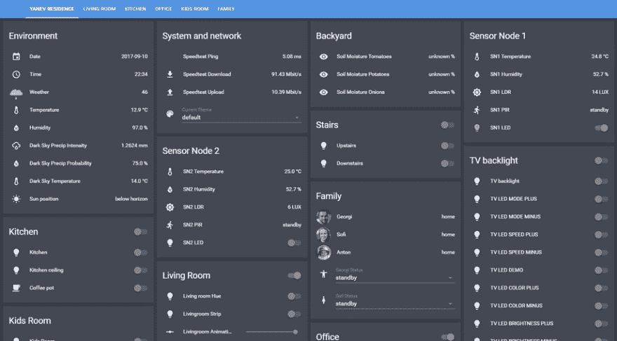

# 智能家居自动化生活一年

> 原文:[https://dev . to/jumpalottahigh/living-with-smart-home-automation-a-year-47eg](https://dev.to/jumpalottahigh/living-with-smart-home-automation-for-a-year-47eg)

在这篇博文中，我将分享我在智能家居中生活一年的经验和收获。然而，在我们开始之前，让我们以免责声明列表的形式来解决一些问题:

*   这不会是一个指南
*   这篇文章可能传达了很多有意的家务助理偏见< 3
*   这不是一个全面的智能家居改造，而是改造和逐步实现组件
*   我假设你至少对智能家居自动化的总体概念有所了解
*   我将介绍我的 3 个主要使用案例，因为我认为这些案例与考虑加入俱乐部的人更相关

[T2】](https://blog.georgi-yanev.com/static/271f9d1921251db241f86be2f48309dc/b94f3/living-in-a-smart-home.png)

### 💡用例 1:灯

大约两年前(2016 年初)，我第一次对智能家居和家庭自动化技术产生了兴趣，在第一年的时间里，就是这样，只是兴趣。阅读文章，探索软件。

#### 这一切都是从去年圣诞节开始的，当时我得到了一台[飞利浦 Hue](https://amzn.to/2haOccI) 电视机，还找到了[家庭助理](https://home-assistant.io)

那是一见钟情。虽然有其他可行的开源解决方案，我也玩过几个( [OpenHab](https://www.openhab.org/) 和 [Node-RED](https://nodered.org/) )，但真正让我进入智能家庭自动化的是[家庭助手](https://home-assistant.io)，它一直坚持到今天。

因此，像大多数其他人一样，他们获得一些智能照明来控制我的灯，起初我只是在我的手机上使用飞利浦 Hue 应用程序，我妻子在她的手机上使用它。我们甚至把它设置在 iPads 上。感觉到什么是可能的是很好的，我们继续使用了大概一个月。直到我在 [Raspberry Pi](https://bit.ly/2IbRatc) 上运行了我们的第一个“稳定的”家庭助理实例。智能灯的问题是(在许多情况下，这是人们进入智能家庭自动化的障碍)，每次你只想快速打开或关闭灯时，都必须拿出手机，这是非常次优的。有很多解决办法，这取决于你的耐心以及你适应和改变习惯的意愿。

不过在那个时候，我们还没有语音自动化(这是后来才出现的，帮助很大)。我们从来没有真正开始在墙上安装实际的硬件按钮(尽管这对一些人来说可能有用)，所以我们只有一种方法可以做到这一点，而不会对此感到愤怒并放弃整个想法——自动化。

#### 这就是家庭助手的用武之地，它大放异彩

你可以设置非常强大的自动化，有大量关于如何配置组件的[文档和示例](https://home-assistant.io/components/)，由 Ben 制作的棒极了的 [YouTube 视频(在一开始对我的起步起到了巨大的作用，所以感谢并大声说出来！).另外，这个社区**很棒**，我强烈推荐](https://www.youtube.com/channel/UCLecVrux63S6aYiErxdiy4w/videos)[播客](https://hasspodcast.io/feed/podcast)，加入[不和谐频道](https://discord.gg/c5DvZ4e)或者查看[论坛](https://community.home-assistant.io/)寻求帮助和想法。

下面是我正在运行的几个轻量级自动程序:

```
# Turn on lights at sunset
- alias: 'Lights on 30 mins before sunset'
  trigger:
    platform: sun
    event: sunset
    offset: '-00:30:00'
  action:
    - service: light.turn_on
      data:
        entity_id:
          - light.office_hue
          - light.living_room_hue
          - light.kitchen
        brightness: 225
        color_temp: 327
        transition: 5
    - service: tts.google_say
      entity_id: media_player.living_room_home
      data:
        message: 'Turning on all lights.'

# Turn off lights at 23:45
- alias: 'Lights off at 23:45 (sun-thu)'
  trigger:
    - platform: time
      at: '23:45'
  condition:
    - condition: time
      weekday:
        - mon
        - tue
        - wed
        - thu
        - sun
  action:
    - service: light.turn_off
      data:
        entity_id:
          - light.office_hue
          - light.living_room_hue
          - light.kitchen
        transition: 5
    - service: homeassistant.turn_off
      entity_id: switch.livingroom_window_lights
    - service: homeassistant.turn_off
      entity_id: switch.livingroom_ball_lights
    - service: homeassistant.turn_off
      entity_id: switch.livingroom_charger 
```

<svg width="20px" height="20px" viewBox="0 0 24 24" class="highlight-action crayons-icon highlight-action--fullscreen-on"><title>Enter fullscreen mode</title></svg> <svg width="20px" height="20px" viewBox="0 0 24 24" class="highlight-action crayons-icon highlight-action--fullscreen-off"><title>Exit fullscreen mode</title></svg>

这个`yaml`代码是配置 Home Assistant 的方式之一。这很容易理解，从某种意义上说，它与 JSON 非常相似，都是用键值对的思想进行操作的。阅读和配置自动化通常由一个`trigger`和一个`action`组成，中间还有一个可选的额外的`condition`，这非常简单。如果你对这个话题完全陌生，那就使用免费的开源高速文本编辑器 [VS Code](https://code.visualstudio.com/) ，观察 yaml 配置文件的间距和有效性。

在第一个例子中，我使用 Home Assistant 的`sun`组件来获取日落时间数据，并在日落前半小时打开某些灯，并在 Google Home 扬声器上宣布该事件。在许多情况下，这比硬编码的时间值要好得多，因为硬编码的时间值需要经常更改。

另一个自动化在周日至周四晚上 11:45 关灯，有 5 秒钟的过渡。这可能是一个很好的时机来提及我在家里使用飞利浦 Hue、[小米 Mi Yeelight](https://bit.ly/2K7lwyy) 和 [Ikea Tradfri](http://bit.ly/2towFFd) 灯泡。最棒的是，这一点都不重要，一切都无缝地工作，我不必在我的手机上使用 3 个独立的应用程序。这一切都是通过家庭助理来实现的。

小米和宜家的灯泡也让我惊喜不已。我从 2017 年 2 月开始使用小米灯泡，从 2017 年 3 月开始使用宜家灯泡，没有任何抱怨和故障。值得一提的是，Ikea Tradfri 可能拥有最好的实施安全性(使用 Coap ),并因此受到了广泛的赞誉。他们还使用像飞利浦 Hue 这样的网关。我想很快我就能摆脱其中一个网关，因为控制宜家和飞利浦灯泡的支持正在进入宜家网关。另一方面，小米灯泡不需要网关，因为它们直接连接到 Wi-Fi。

### 🔌用例 2:插座

根据经验，最好带着以下问题着手下一个家庭自动化项目:

*   我在解决什么问题？
*   这种自动化将如何提高我的生活质量？
*   这会节省我的时间吗？

任何你认为可以提高生活质量和节省时间的事情都可能是一个好项目，值得自动化。我喜欢在较小的任务上减少无意义的日常决策，更喜欢把认知资源用在重要的地方。

一个这样的项目让我不用每天早上煮咖啡。

当然，我仍然需要每天晚上装满咖啡机，所以我不会把所有的努力都留给自己，但只是准备好咖啡就让我在早上少考虑一件事。此外，醒来闻到煮咖啡的味道也很不错。

我已经让这种自动化运行了将近一年，它已经失败了大约 1-2 次，这就是为什么我发现我真的很怀念拥有它。简单来说，我的咖啡机工作日 6:50 开机，7:00 关机。煮大约 2 分钟的咖啡，然后保温，直到我把它倒进我的外带杯，然后离开家。条件和触发器在家庭助手中设置，如下所示:

```
# Make coffee at 6:50
- alias: Make morning coffee
  trigger:
    - platform: time
      at: 06:50
  condition:
    - condition: time
      weekday:
        - mon
        - tue
        - wed
        - thu
        - fri
  action:
    - service: switch.turn_on
      entity_id: switch.kitchen_coffee_pot
    - delay: 00:10:00
    - service: switch.turn_off
      entity_id: switch.kitchen_coffee_pot 
```

<svg width="20px" height="20px" viewBox="0 0 24 24" class="highlight-action crayons-icon highlight-action--fullscreen-on"><title>Enter fullscreen mode</title></svg> <svg width="20px" height="20px" viewBox="0 0 24 24" class="highlight-action crayons-icon highlight-action--fullscreen-off"><title>Exit fullscreen mode</title></svg>

这很简单，网上也有很多其他的例子。就硬件而言，在这种情况下，我使用的是可通过远程控制但易于重新编程的 [433 MHz 插座](https://bit.ly/2yxJykZ)，因此我也有一些便宜的 [433 MHz 发射器和接收器](https://bit.ly/2MKTH0I)连接到基于 [ESP8266 的 NodeMCU](https://bit.ly/2KdC4s0) 板，该板运行这个[令人惊叹的网关软件，该软件可双向处理 MQTT-to-433](https://github.com/1technophile/OpenMQTTGateway/) 等事务。当然，这听起来可能有点拗口，一开始可能看起来有点吓人或太复杂，但我向你保证，这比你想象的要简单得多。

归根结底，还有其他方法来实现这个项目。走适合你生活方式的路。对我来说，在不影响电源电压的情况下无缝改造咖啡机很重要，这是一个巨大的成功。现在我可以每天喝咖啡了:)

### 💬用例 3:语音控制并将其结合在一起

家庭自动化项目的最大推动者之一是[谷歌主页](http://bit.ly/2IaDPkF)和[亚马逊回声](https://amzn.to/2x6Dpus)。使用`emulated hue`组件，您可以将家庭助手中的任何设备和传感器暴露给那些语音助手。然后你就可以控制那些没有直接应用程序的东西了。我没有最喜欢的，两个都用。对于一些事情，我更喜欢 Alexa 在她执行命令后的简单响应`OK`。对于大多数其他事情和非家庭自动化的事情，音乐，使用 [Chromecast](http://bit.ly/2yvG8z9) 在电视上播放，信息丰富的回答，提醒，我只使用 Google Home 的计时器。

在家庭助理场景中使用语音控制是智能家庭自动化感觉非常强大和未来感的时候。我最喜欢的两个是`'Hey Google, time for bed'`和`'Hey, Google it's movie time'`,前者基本上关闭房子，后者关闭除客厅以外的所有灯，将电视背光设置为蓝绿色，并使客厅变暗。

我们真的已经习惯于使用这些来快速控制，谷歌之家肯定会因为能够通过数到 10、说字母表、唱摇篮曲和根据提示播放动物声音来娱乐我的儿子而加分。

### ✨的结论和结果

无论是系统还是设备都还处于早期阶段。事情会随着时间的推移而变化和发展，所以如果你是一个现在就想参与其中的爱好者，你必须忍受其中的一些问题，并愿意在这个过程中学习和适应。

我的建议是:

*   去做**改善你生活的小项目**看看真正的价值
*   **从简单的**开始，以后再微调项目
*   给它时间来适应各种技术
*   许多项目都是努力建立起来的，但之后几个月或几年内你都不用去碰它们，同时获得收益

因此，如果我设法激起你的兴趣，去拿一份[家庭助手](https://home-assistant.io)的拷贝，设置好并开始试验。这是我在 GitHub 上的[配置库](https://github.com/jumpalottahigh/YAR-Home-Assistant-Configuration)，这是另一个由 [ccostan](https://github.com/CCOSTAN/Home-AssistantConfig/) 提供的有更多例子的配置库。

就我而言，我从总体上了解了很多关于**智能家庭自动化**，关于 **MQTT** 和传感器，并爱上了 **esp8266** 芯片。我接触了许多不同的产品、软件和嵌入式设备。我做了大量的焊接工作，并从中获得了很多乐趣，尽管我只是触及了一些可能的表面。我获得了一个令人敬畏的有趣的爱好，它不会去任何地方，非常适合做一些有趣的事情，尤其是在芬兰漫长的冬天。

这样做的同时，我也能够为 GitHub 上的一些不同的家庭助理项目贡献一些 pr(尽管是小规模的)。这是开始为开源项目做贡献的好方法。我真的很期待能够在 2018 年为家庭助手做出更多贡献。

最后，我想留给你们一份经过整理的资源清单。这并不意味着是一个广泛的列表，我当然无意中错过了一些最伟大的资源，但它肯定会帮助你。

**资源列表:**

*   [家庭助理-现场](https://home-assistant.io)
*   [Ben 关于开始使用家庭助手的精彩视频](https://www.youtube.com/channel/UCLecVrux63S6aYiErxdiy4w/videos)
*   [家庭助理播客](https://hasspodcast.io/feed/podcast)
*   [家庭助理不和频道](https://discord.gg/c5DvZ4e)
*   [家庭助手论坛](https://community.home-assistant.io/)
*   [乔治的家庭助理配置库](https://github.com/jumpalottahigh/YAR-Home-Assistant-Configuration)
*   [本的家庭助理配置库](https://github.com/bruhautomation/BRUH3-Home-Assistant-Configuration)
*   [CCOSTAN 的家庭助理配置库](https://github.com/CCOSTAN/Home-AssistantConfig/)

尽情享受自动化吧！