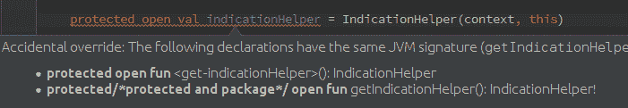

# 战壕里的科特林

> 原文：<https://dev.to/devexperts/kotlin-from-the-trenches-da1>

在过去的几年中，围绕 Kotlin 编程语言的炒作增长与比特币价格的增长差不多。这种密切的关注在 2017 年 5 月更加强烈，当时谷歌宣布正式支持 Kotlin 开发 Android。当然，我们情不自禁地加入了这个主题的研究，并决定在我们新的基于 Android 的项目中使用 Kotlin 进行实验。

Kotlin 是一种静态类型的编程语言，运行在 JVM 之上；它是由 JetBrains 开发的。Kotlin 结合了面向对象和函数式编程语言的原则。根据开发者的说法，它实用、简洁、可互操作。用它编写的应用程序可以在 JVM 上运行，也可以用 JavaScript 编译，原生编译支持指日可待。值得注意的是，该语言是与开发工具同时创建的，并经过微调以与它们一起使用。

到目前为止，已经有许多文章专门研究科特林，也有许多关于科特林的报道。我们将尽量不去关注这种语言的独特之处，对其褒贬不一，而是关注我们从其特点中获益的实际经验。

所以，让我们考虑一下提到的每一个方面…

## 最好的工装

Kotlin 语言的开发者是 JetBrains，这是一家软件开发公司，为 Java 和许多其他编程语言开发了可能是最好的 IDE。尽管 Java 语言冗长，但编写速度仍然非常快:环境“为您编写代码”。

有了 Kotlin，你会有一种感觉，你买了一个新键盘，但仍然无法习惯它，尽管你尝试了，但还是无法触摸输入。智能感知往往只是跟不上打字的速度；IDE 将为 Java 生成一个完整的类，而对于 Kotlin，你将会看到进度条。问题不仅仅在于新文件:主动浏览项目可能会导致 IDE 冻结，所以只有重启它才能帮到你。

令人沮丧的是，你习惯的许多技巧都不起作用了。例如，实时模板。Android Studio(一个用于 Android 开发的 IntelliJ IDEA 版本)附带了一组用于经常使用的操作的方便模板，比如日志。logm + Tab 组合将插入一个代码，该代码将记录一条消息到日志中，该消息是关于调用了哪个方法和哪个参数:

```
Log.d(TAG, "method() called with: param = [" + param + "]"); 
```

Enter fullscreen mode Exit fullscreen mode

这样，这个模板“知道如何正确地确定方法和参数，这取决于您应用它的地方。

然而，它在科特林不起作用。此外，您必须创建一个单独的模板(例如，klogd + Tab)并基于编程语言使用它。为什么 100% IDE 兼容的语言需要管理两次设置，对我们来说仍然是个谜。

## 好学吗？

尽管有编译成 JavaScript 和潜在的本地代码的可能性(使用 Kotlin。Native)，主要是一种用于 JVM 的语言，它的目的是让 Java 开发人员避免不必要的和潜在危险的(容易出错的)样板文件。然而，假设从一开始就用科特林语写作实际上就是科特林语，那就错了。打个比方，首先你会用带有浓重 Java 口音的西班牙语写作。我们在一段时间后审查我们自己的代码时，以及在观察刚开始学习该语言的同事的代码时，看到了这一点。这在处理空类型和非空类型时表现得最明显，也表现在表达式的过度“冗长”,这是一个很难改掉的习惯。此外，大量的新功能，如扩展方法，打开了编写黑魔法咒语的潘多拉魔盒，在不必要的地方增加了额外的复杂性，使代码更加混乱和难以审查。一个很好的例子是 invoke()方法重载，它允许在一个构造函数调用下屏蔽它的调用，这样可视化地创建一个 Dog 类型的对象，你可以得到几乎任何东西:

```
class Dog private constructor(){
  companion object{
      operator fun invoke(): String = "MAGIC"
  }
}

object DogPrinter {
  @JvmStatic
  fun main(args: Array<String>) {
      println(Dog()) // MAGIC
  } 
```

Enter fullscreen mode Exit fullscreen mode

因此，尽管掌握语法不会花你超过一周的时间，但学会正确应用语言的特性可能需要几个月的时间。在某些情况下，对某些语法糖的操作原理的更详细的研究，包括对所获得的字节码的研究，将是必要的。在使用 Java 的时候，可以随时参考[有效 Java](https://www.amazon.com/Effective-Java-2nd-Joshua-Bloch/dp/0321356683) 这样的资源，避免很多麻烦。即使 Kotlin 的设计是为了消除“Java 带来的麻烦”，但 Kotlin 带来的麻烦仍有待揭示。

## 空安全

科特林语言有一个复杂的类型系统。在大多数情况下，它允许您避免 Java 中最常见的问题——NullPointerException。根据这种类型的变量是否可以为空，每种类型有两个选项。如果可以将 null 赋给变量，则问号会添加到类型中。示例:

```
val nullable: String? = null
val notNull: String = "" 
```

Enter fullscreen mode Exit fullscreen mode

可空变量方法是使用。？接线员。如果对 null 变量调用此类方法，则整个表达式的结果也将为 null；但是，不会调用该方法，也不会发生 NullPointerException。当然，该语言的开发人员留下了一种方法，无论如何都可以在可空变量上调用该方法，并得到一个 NullPointerException。去做这个，而不是？你将不得不写！！:

```
nullable!!.subSequence(start, end) 
```

Enter fullscreen mode Exit fullscreen mode

这一行不和谐，代码失去了整洁。两个连续感叹号可能表明这样的代码是故意编写的。另一方面，很难想象在什么情况下使用！！操作员是必要的。

在全部代码都用 Kotlin 编写之前，一切看起来都很好。然而，如果在现有的基于 Java 的项目中使用 Kotlin，一切都会变得更加复杂。编译器无法跟踪哪些变量将为空，因此要正确确定类型几乎是不可能的。对于来自 Java 的变量，空测试在编译时不可用。因此，开发人员将负责选择正确的类型。此外，为了让从 Java 到 Kotlin 的自动转换正常工作，Java 中的代码必须包含@Nullable/@Nonnull 注释。[点击链接](https://github.com/JetBrains/kotlin/blob/master/core/descriptors.jvm/src/org/jetbrains/kotlin/load/java/JvmAnnotationNames.kt)查看支持注释的完整列表。

然而，如果一个空值从 Java 代码进入 Kotlin，那么除了以下几种情况之外，崩溃是不可避免的:

```
FATAL EXCEPTION: main
Process: com.devexperts.dxmobile.global, PID: 16773
java.lang.RuntimeException: Unable to start activity ComponentInfo{com.devexperts.dxmobile.global/com.devexperts.dxmarket.client.ui.generic.activity.GlbSideNavigationActivity}: java.lang.IllegalArgumentException: Parameter specified as non-null is null: method kotlin.jvm.internal.Intrinsics.checkParameterIsNotNull, parameter savedInstanceState 
```

Enter fullscreen mode Exit fullscreen mode

反汇编字节码后，我们可以找到抛出异常的地方:

```
ALOAD 1
LDC "param"
INVOKESTATIC kotlin/jvm/internal/Intrinsics.checkParameterIsNotNull(Ljava/lang/Object;Ljava/lang/String;)V 
```

Enter fullscreen mode Exit fullscreen mode

交易是，对于非私有方法的所有参数，编译器增加了一个特殊的检查:标准库方法被称为

```
kotlin.jvm.internal.Intrinsics.checkParameterIsNotNull(param, "param") 
```

Enter fullscreen mode Exit fullscreen mode

如有必要，您可以使用编译器指令
禁用它

```
-Xno-param-assertions 
```

Enter fullscreen mode Exit fullscreen mode

这个指令应该保留给极端的情况，因为它只是以可能的可靠性损失为代价，稍微提高了性能。

对于所有具有 get()方法的类，可以在 Kotlin 中使用[]操作符。非常方便。例如:

```
val str = "my string"
val ch = str[2] 
```

Enter fullscreen mode Exit fullscreen mode

但是，索引访问运算符只能用于非空类型。可空版本并不存在，在这种情况下，您必须显式调用 get()方法:

```
var str: String? = null
val ch = str?.get(2) 
```

Enter fullscreen mode Exit fullscreen mode

## 属性

Kotlin 使处理类字段变得更加容易。您可以将字段作为普通变量来访问，所需字段的 getter 或 setter 将被调用。

```
// Java code
public class IndicationViewController extends ViewController {
    private IndicationHelper indicationHelper;
    protected IndicationHelper getIndicationHelper() {
        return indicationHelper;
    }
} 
```

Enter fullscreen mode Exit fullscreen mode

```
// Kotlin code
val indicationViewController = IndicationViewController()
val indicationHelper = indicationViewController.indicationHelper 
```

Enter fullscreen mode Exit fullscreen mode

如果需要覆盖 Kotlin 类中的 Java 类 getter，事情会变得复杂。乍一看，似乎 indicationHelper 是一个与 Kotlin 兼容的成熟属性。事实上，情况并非如此。如果我们试图“正面”覆盖它，我们肯定会得到一个编译错误:

```
class GlobalAccountInfoViewController(context: Context) : IndicationViewController(context) {
    protected open val indicationHelper = IndicationHelper(context, this)
} 
```

Enter fullscreen mode Exit fullscreen mode

[T2】](https://blog.devexperts.com/wp-content/uploads/2017/11/kotlin-example.png)

所有操作都是正确的:子类中声明了一个属性，其 getter 的签名与超类 getter 的签名完全相同。那是什么问题呢？编译器会照顾我们，提示覆盖是错误发生的。甚至在[科特林论坛](https://discuss.kotlinlang.org/t/how-to-implement-getter/388)也有关于这个话题的讨论。在那里我们可以学到两件重要的事情:

1.  " Java getters 不被视为 Kotlin 的属性访问器"
2.  不过，这一功能在未来可能会得到增强

似乎只有一个正确的方法来实现我们的目标(也来自论坛):创建一个私有变量，同时覆盖 getter。

```
class GlobalAccountInfoViewController(context: Context) : IndicationViewController(context) {
    private val indicationHelper = IndicationHelper(context, this)
    override fun getIndicationHelper() = indicationHelper
} 
```

Enter fullscreen mode Exit fullscreen mode

## 100% Java-interop

也许我们应该把这一段放在第一位，因为正是 Java-interop 让这种新语言如此迅速地流行起来，甚至 Google 也宣布官方支持这种语言用于 Android 的开发。不幸的是，我们也没有避免意外。

让我们考虑一个所有 Java 开发人员都知道的简单事情:访问修饰符或可见性修饰符。在 Java 中，有四种类型:公共的、私有的、受保护的和包私有的。默认情况下使用 Package-private，除非您另外指定。在 Kotlin 中，默认使用的修饰符是 public，它(像 protected 和 private 一样)的调用和工作方式与 Java 完全一样。然而，Kotlin 中的 package-private 修饰符被称为“internal ”,它的工作方式有些不同。

语言设计者希望解决应用 package-private 修饰符时破坏封装的潜在能力问题。解决方案是在客户机代码中创建一个与库代码和预定义方法同名的包。当编写单元测试时，为了不让为测试目的而创建的方法“对外公开”,经常使用这种技巧。这就是内部修饰符出现的方式，它使对象在模块内部可见。

名称模块适用于以下情况:

*   IntelliJ Idea 项目中的模块
*   Maven 中的项目
*   Gradle 中的源集
*   通过一次 ant 脚本启动编译的一组源代码

问题是 internal 实际上是 public final。因此，当在字节码级别编译时，您可能会意外地覆盖您不想覆盖的方法。正因为如此，编译器会给你的方法重新命名，这样这样的事情就不会发生了，反过来也就不可能从 Java 代码中调用这个方法了。即使包含此代码的文件在同一个模块中，在同一个包中。

```
class SomeClass {
   internal fun someMethod() {
       println("")
   }
}

public final someMethod$production_sources_for_module_test()V 
```

Enter fullscreen mode Exit fullscreen mode

您可以使用内部修饰符编译 Kotlin 代码，并将其作为依赖项添加到 Java 项目中。在这种情况下，您可以在 protected 修饰符不允许您这样做的情况下调用此方法，也就是说，您可以访问包外部的私有 API(因为该方法实际上是公共的)，尽管您不能重写。人们可能会觉得内部修饰符不是作为“实用语言”的一部分设计的，而是作为 IDE 的一个特性。这种行为可以通过使用注释来实现，例如，尽管许多声明说在 Kotlin 中保留了很少的关键字，例如，对于协程，internal 实际上将基于 Kotlin 的项目链接到 JetBrains IDE。如果您正在开发一个包含大量模块的复杂项目，并且在一个纯基于 Java 的项目中，其中一些模块可能被同事用作依赖项，那么在用 Kotlin 编写公共部分之前，请仔细考虑。

## 数据类

接下来，可能是该语言最著名的特性之一，是数据类。数据类允许你快速方便地编写 POJO-objects、equals、hashCode、toString 和其他方法，编译器将为你编写。

这确实是一件方便的事情，但是，要注意与项目中使用的库的兼容性中的陷阱。在我们的一个项目中，我们使用 Jackson 来序列化/反序列化 JSON。当我们决定在 Kotlin 中重写一些 POJOs 时，结果是 Jackson 注释不能与 Kotlin 一起正常工作，为了兼容，有必要另外连接一个单独的 jackson-module-kotlin。

## 总之

尽管这篇文章可能是批评性的，但我们确实喜欢科特林！尤其是在 Android 上，Java 卡在 1.6 版本，成了真正的救星。我们知道科特林。本机、协程和其他语言的新特性是非常重要和正确的东西，但它们可能并不是对每个人都有用。同时，IDE 支持是每个开发人员所使用的，IDE 的缓慢工作抵消了我们从冗长的 Java 切换到 Kotlin 所获得的速度优势。虽然切换到 Kotlin 或暂时留在 Java 上的决定是由每个单独的团队做出的，但我们想要的是分享我们必须面对的问题，这有望节省您的宝贵时间。

[](https://blog.devexperts.com/wp-content/uploads/2017/11/tvaleev.jpg) 蒂穆尔·瓦列夫，Devexperts 公司的软件工程师

[](https://blog.devexperts.com/wp-content/uploads/2017/11/Vereschagin_opt.jpg) 亚历山大·韦列沙金，Devexperts 公司的软件工程师