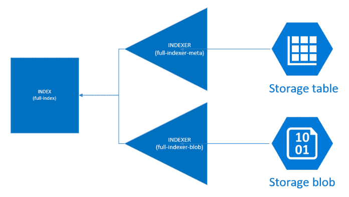

# 带有两个数据源的 Azure 搜索索引

> 原文：<https://dev.to/rkosta/azure-search-index-with-2-datasources-f96>

最近，我需要索引存储在 Azure 存储 Blobs 中的文档。此外，我还想使用 blob 存储元数据向这些文档添加一些信息。因为我需要关于元数据的富文本信息，所以我可以直接使用 blob 存储元数据。Se [这里](http://blogit.create.pt/ricardocosta/2017/11/10/azure-blob-storage-metadata-400-bad-request/)为什么。

所以我不得不使用两个不同的数据源。一个用于文档，另一个用于元数据。所以我选择了 Azure Blob 存储和 Azure Table 存储。这是最终解决方案的完整示意图:

[T2】](https://i1.wp.com/blogit-create.com/wp-content/uploads/2017/11/AzureSearch01.png)

索引器负责用两个不同数据源的内容更新索引。有一个非常重要的字段，在我的例子中它被称为 **UniqueIdentifier** 字段，因为这个字段标记有**键**属性。这是唯一标识 Azure 搜索索引上每个文档的字段。

这个字段负责关联来自一个数据源的项目(来自 blob 存储的文档)和来自另一个数据源的项目(来自表存储的记录)。

blob 存储中插入的每个文档都有一个名为 UniqueIdentifier 的自定义元数据属性，该属性将有一个与相应元数据相关联的表存储记录。

```
// Retrieve storage account from connection string.
CloudStorageAccount storageAccount = CloudStorageAccount.Parse( CloudConfigurationManager.GetSetting("StorageConnectionString"));

// Create the blob client.
CloudBlobClient blobClient = storageAccount.CreateCloudBlobClient();

// Retrieve a reference to a container.
CloudBlobContainer container = blobClient.GetContainerReference("mycontainer");

// Create the container if it doesn't already exist.
container.CreateIfNotExists();

// Add some metadata to the container.container.
Metadata.Add("UniqueIdentifier", "bla bla bla"); 
```

表存储记录将这些值存储在 RowKey 上，索引器有一个映射指令将起点(RowKey)映射到目的地(UniqueIdentifier)。您可以稍后在索引器架构中检查此映射指令。

首先我创建了索引:

(我突出显示了 **UniqueIdentifier** 字段，其中**键**属性设置为 **TRUE** )

```
{  "@odata.context":  "https://something.search.windows.net/$metadata#indexes/$entity",  "@odata.etag":  "\"0x8D477848BDEFA50\"",  "name":  "full-index",  "fields":  [  {  "name":  "ClientCode",  "type":  "Edm.String",  "searchable":  false,  "filterable":  true,  "retrievable":  true,  "sortable":  true,  "facetable":  true,  "key":  false,  "indexAnalyzer":  null,  "searchAnalyzer":  null,  "analyzer":  null  },  {  "name":  "UniqueIdentifier",  "type":  "Edm.String",  "searchable":  false,  "filterable":  true,  "retrievable":  true,  "sortable":  false,  "facetable":  false,  "key":  true,  "indexAnalyzer":  null,  "searchAnalyzer":  null,  "analyzer":  null  },  {  "name":  "ETag",  "type":  "Edm.String",  "searchable":  false,  "filterable":  false,  "retrievable":  false,  "sortable":  false,  "facetable":  false,  "key":  false,  "indexAnalyzer":  null,  "searchAnalyzer":  null,  "analyzer":  null  },  {  "name":  "Timestamp",  "type":  "Edm.DateTimeOffset",  "searchable":  false,  "filterable":  false,  "retrievable":  false,  "sortable":  false,  "facetable":  false,  "key":  false,  "indexAnalyzer":  null,  "searchAnalyzer":  null,  "analyzer":  null  },  {  "name":  "Key",  "type":  "Edm.String",  "searchable":  false,  "filterable":  false,  "retrievable":  false,  "sortable":  false,  "facetable":  false,  "key":  false,  "indexAnalyzer":  null,  "searchAnalyzer":  null,  "analyzer":  null  },  {  "name":  "Opportunity",  "type":  "Edm.String",  "searchable":  true,  "filterable":  false,  "retrievable":  true,  "sortable":  false,  "facetable":  false,  "key":  false,  "indexAnalyzer":  null,  "searchAnalyzer":  null,  "analyzer":  "pt-Pt.lucene"  },  {  "name":  "OpportunityCode",  "type":  "Edm.String",  "searchable":  false,  "filterable":  false,  "retrievable":  true,  "sortable":  false,  "facetable":  false,  "key":  false,  "indexAnalyzer":  null,  "searchAnalyzer":  null,  "analyzer":  null  },  {  "name":  "DocumentExtension",  "type":  "Edm.String",  "searchable":  false,  "filterable":  true,  "retrievable":  true,  "sortable":  false,  "facetable":  true,  "key":  false,  "indexAnalyzer":  null,  "searchAnalyzer":  null,  "analyzer":  null  },  {  "name":  "DocumentType",  "type":  "Edm.String",  "searchable":  false,  "filterable":  true,  "retrievable":  true,  "sortable":  false,  "facetable":  true,  "key":  false,  "indexAnalyzer":  null,  "searchAnalyzer":  null,  "analyzer":  null  },  {  "name":  "ClientName",  "type":  "Edm.String",  "searchable":  true,  "filterable":  true,  "retrievable":  true,  "sortable":  true,  "facetable":  true,  "key":  false,  "indexAnalyzer":  null,  "searchAnalyzer":  null,  "analyzer":  "pt-Pt.lucene"  },  {  "name":  "Year",  "type":  "Edm.Int32",  "searchable":  false,  "filterable":  true,  "retrievable":  true,  "sortable":  true,  "facetable":  true,  "key":  false,  "indexAnalyzer":  null,  "searchAnalyzer":  null,  "analyzer":  null  },  {  "name":  "Path",  "type":  "Edm.String",  "searchable":  false,  "filterable":  false,  "retrievable":  true,  "sortable":  false,  "facetable":  false,  "key":  false,  "indexAnalyzer":  null,  "searchAnalyzer":  null,  "analyzer":  null  },  {  "name":  "LocalPath",  "type":  "Edm.String",  "searchable":  false,  "filterable":  false,  "retrievable":  true,  "sortable":  false,  "facetable":  false,  "key":  false,  "indexAnalyzer":  null,  "searchAnalyzer":  null,  "analyzer":  null  },  {  "name":  "Name",  "type":  "Edm.String",  "searchable":  true,  "filterable":  false,  "retrievable":  true,  "sortable":  true,  "facetable":  false,  "key":  false,  "indexAnalyzer":  null,  "searchAnalyzer":  null,  "analyzer":  "pt-Pt.lucene"  },  {  "name":  "content",  "type":  "Edm.String",  "searchable":  true,  "filterable":  false,  "retrievable":  false,  "sortable":  false,  "facetable":  false,  "key":  false,  "indexAnalyzer":  null,  "searchAnalyzer":  null,  "analyzer":  "pt-Pt.lucene"  },  {  "name":  "metadata_storage_content_type",  "type":  "Edm.String",  "searchable":  false,  "filterable":  false,  "retrievable":  true,  "sortable":  false,  "facetable":  false,  "key":  false,  "indexAnalyzer":  null,  "searchAnalyzer":  null,  "analyzer":  null  },  {  "name":  "metadata_storage_size",  "type":  "Edm.Int64",  "searchable":  false,  "filterable":  false,  "retrievable":  true,  "sortable":  false,  "facetable":  false,  "key":  false,  "indexAnalyzer":  null,  "searchAnalyzer":  null,  "analyzer":  null  },  {  "name":  "metadata_storage_last_modified",  "type":  "Edm.DateTimeOffset",  "searchable":  false,  "filterable":  false,  "retrievable":  true,  "sortable":  false,  "facetable":  false,  "key":  false,  "indexAnalyzer":  null,  "searchAnalyzer":  null,  "analyzer":  null  },  {  "name":  "metadata_storage_content_md5",  "type":  "Edm.String",  "searchable":  false,  "filterable":  false,  "retrievable":  true,  "sortable":  false,  "facetable":  false,  "key":  false,  "indexAnalyzer":  null,  "searchAnalyzer":  null,  "analyzer":  null  },  {  "name":  "metadata_storage_name",  "type":  "Edm.String",  "searchable":  false,  "filterable":  false,  "retrievable":  true,  "sortable":  false,  "facetable":  false,  "key":  false,  "indexAnalyzer":  null,  "searchAnalyzer":  null,  "analyzer":  null  },  {  "name":  "metadata_storage_path",  "type":  "Edm.String",  "searchable":  false,  "filterable":  false,  "retrievable":  true,  "sortable":  false,  "facetable":  false,  "key":  false,  "indexAnalyzer":  null,  "searchAnalyzer":  null,  "analyzer":  null  },  {  "name":  "metadata_author",  "type":  "Edm.String",  "searchable":  false,  "filterable":  false,  "retrievable":  true,  "sortable":  false,  "facetable":  false,  "key":  false,  "indexAnalyzer":  null,  "searchAnalyzer":  null,  "analyzer":  null  },  {  "name":  "metadata_content_type",  "type":  "Edm.String",  "searchable":  false,  "filterable":  false,  "retrievable":  true,  "sortable":  false,  "facetable":  false,  "key":  false,  "indexAnalyzer":  null,  "searchAnalyzer":  null,  "analyzer":  null  },  {  "name":  "metadata_creation_date",  "type":  "Edm.DateTimeOffset",  "searchable":  false,  "filterable":  false,  "retrievable":  true,  "sortable":  false,  "facetable":  false,  "key":  false,  "indexAnalyzer":  null,  "searchAnalyzer":  null,  "analyzer":  null  },  {  "name":  "metadata_last_modified",  "type":  "Edm.DateTimeOffset",  "searchable":  false,  "filterable":  false,  "retrievable":  true,  "sortable":  false,  "facetable":  false,  "key":  false,  "indexAnalyzer":  null,  "searchAnalyzer":  null,  "analyzer":  null  }  ],  "scoringProfiles":  [],  "defaultScoringProfile":  "",  "corsOptions":  null,  "suggesters":  [  {  "name":  "temp-suggester",  "searchMode":  "analyzingInfixMatching",  "sourceFields":  [  "ClientCode",  "Opportunity",  "ClientName",  "Name"  ]  }  ],  "analyzers":  [],  "tokenizers":  [],  "tokenFilters":  [],  "charFilters":  []  } 
```

创建索引后，我创建了容器并上传了我的文件。这是相应的数据源:

```
{  "@odata.context":  "https://something.search.windows.net/$metadata#datasources/$entity",  "@odata.etag":  "\"0x8D526E01DDB35F4\"",  "name":  "opportunities-datasource",  "description":  "",  "type":  "azureblob",  "subtype":  null,  "credentials":  {  "connectionString":  null  },  "container":  {  "name":  "opportunities",  "query":  null  },  "dataChangeDetectionPolicy":  null,  "dataDeletionDetectionPolicy":  null  } 
```

我还创建了表存储并插入了元数据记录。这是数据来源:

```
{  "@odata.context":  "https://something.search.windows.net/$metadata#datasources/$entity",  "@odata.etag":  "\"0x8D526E01DB70AF2\"",  "name":  "ecmcreatemeta",  "description":  "",  "type":  "azuretable",  "subtype":  null,  "credentials":  {  "connectionString":  null  },  "container":  {  "name":  "opportunities",  "query":  null  },  "dataChangeDetectionPolicy":  null,  "dataDeletionDetectionPolicy":  null  } 
```

这些是索引器。文档索引器:

```
{  "@odata.context":  "https://something.search.windows.net/$metadata#indexers/$entity",  "@odata.etag":  "\"0x8D477862D23289E\"",  "name":  "full-indexer-blob",  "description":  "",  "dataSourceName":  "opportunities-datasource",  "targetIndexName":  "full-index",  "schedule":  null,  "parameters":  {  "batchSize":  10,  "maxFailedItems":  10,  "maxFailedItemsPerBatch":  10,  "base64EncodeKeys":  false,  "configuration":  {  "dataToExtract":  "contentAndMetadata",  "failOnUnsupportedContentType":  false,  "indexedFileNameExtensions":  ".pdf, .docx, .doc, .xlsx, .xls, .pptx, .ppt, .msg, .html, .htm, .xml, .zip, .eml, .txt, .json, .csv"  }  },  "fieldMappings":  [],  "disabled":  null  } 
```

和元数据索引器:

```
{  "@odata.context":  "https://something.search.windows.net/$metadata#indexers/$entity",  "@odata.etag":  "\"0x8D47784D3CE80DF\"",  "name":  "full-indexer-meta",  "description":  "",  "dataSourceName":  "ecmcreatemeta",  "targetIndexName":  "full-index",  "schedule":  null,  "parameters":  {  "batchSize":  null,  "maxFailedItems":  0,  "maxFailedItemsPerBatch":  0,  "base64EncodeKeys":  false,  "configuration":  {}  },  "fieldMappings":  [  {  "sourceFieldName":  "PartitionKey",  "targetFieldName":  "ClientCode",  "mappingFunction":  null  },  {  "sourceFieldName":  "RowKey",  "targetFieldName":  "UniqueIdentifier",  "mappingFunction":  null  }  ],  "disabled":  null  } 
```

这就是 RowKey UniqueIdentifier 映射函数。这就是 Azure Search 如何将表存储中的记录映射到索引中的文档。

帖子 [Azure 搜索索引有两个数据源](https://blogit.create.pt/ricardocosta/2017/11/10/azure-search-index-with-2-datasources/)首先出现在[博客 IT](https://blogit.create.pt) 上。