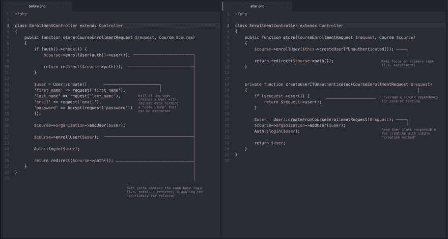
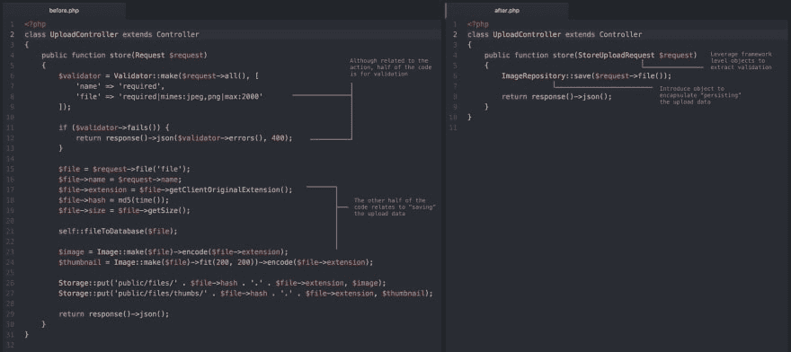
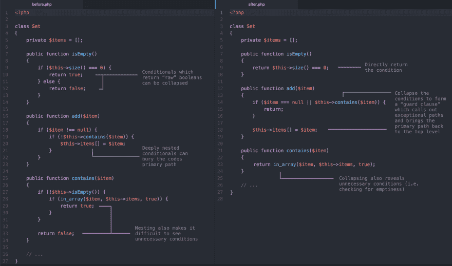
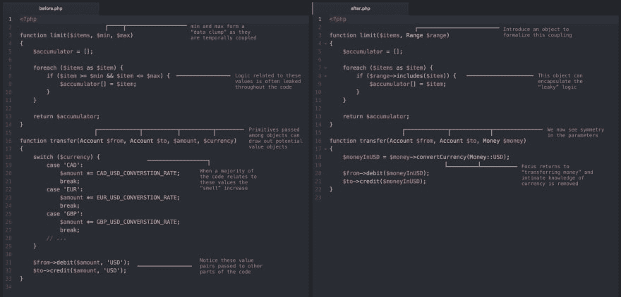

# 一个月的干净代码

> 原文:[https://dev.to/gonedark/a-month-of-clean-code-tips-709](https://dev.to/gonedark/a-month-of-clean-code-tips-709)

过去一个月的每个星期，我都在前发布*，在*后发布*代码示例，呼吁清理代码的方法。反应令人惊讶，许多人收到了数百个赞。虽然我会继续分享这些每周一次的干净代码样本，但我想把以前的收集到一个帖子里。*

## 分手长方法

在这条[第一条推文中](https://twitter.com/gonedark/status/918576634755731463)一个开发者提交了一个他们想要清理的长 Laravel 控制器动作。在高级别上，控制器操作处理课程注册请求。在底层，代码有两个注册用户的路径。

[T2】](https://res.cloudinary.com/practicaldev/image/fetch/s--Aqpd-LRp--/c_limit%2Cf_auto%2Cfl_progressive%2Cq_auto%2Cw_880/https://thepracticaldev.s3.amazonaws.com/i/nlrp1nhwrubhu4b3mqd6.png)

评估一个长方法时要问的主要问题是*谁负责这段代码*？这个问题的答案将有助于确定代码是否可以移动到其他地方。在这种情况下，用户的创建可以被移动到模型中。我们还可以通过创建一个私有的、有条件的方法来简化这两条路径。该方法在必要时执行创建用户的分支逻辑。

结果是一个小得多的方法。有些人可能会说我们只是移动了代码。然而，我们最初方法的意图更简洁，其组成部分也更容易理解。两者都改善了交流——这是对干净代码的度量。

正如推特上指出的那样，代码后面的*确实有一些错误，比如遗漏了`createUserIfUnauthenticated`的参数。然而，这些都是微不足道的错误，不会改变清理。*

> 杰森·麦克里[@戈纳达克](https://dev.to/gonedark)一段之前和之后提交的代码片段。试图突出重点区域( [@steveschoger](https://twitter.com/steveschoger) style)来识别…[twitter.com/i/web/status/9…](https://t.co/ZANEgpKJqy)2017 年 10 月 20:38PM[](https://twitter.com/intent/tweet?in_reply_to=918576634755731463)[](https://twitter.com/intent/retweet?tweet_id=918576634755731463)[](https://twitter.com/intent/like?tweet_id=918576634755731463)

* * *

## 借力对象

第二条推文是一个开发者提交的 Laravel 控制器动作。在高层次上，控制器操作处理存储图像上传。在底层，控制器自己做所有的事情——验证、图像处理、存储。

[T2】](https://res.cloudinary.com/practicaldev/image/fetch/s--Hxp_KC-w--/c_limit%2Cf_auto%2Cfl_progressive%2Cq_auto%2Cw_880/https://thepracticaldev.s3.amazonaws.com/i/zsjw5rp1l1yt4rgprgi6.jpg)

为了清理这段代码，策略是利用其他对象来处理所有的事情。一个 [Laravel 表单请求](https://laravel.com/docs/5.5/validation#form-request-validation)对象可以用于验证。我们可以采用存储库模式引入一个对象来协调图像的存储。

与之前类似，结果是一个更小的方法。这种情况的不同之处在于利用了框架中现有的可用对象。我们还应用了适合我们代码的模式。开发人员经常通过逆向调整代码来适应模式。让一个模式从代码中浮现出来是一个更干净的方法。

> 

* * *

## 清理条件代码

第三条推文关注于清理构成我们大部分代码库的条件代码。这是迄今为止最受欢迎的清理。可能是因为基本代码允许它应用于许多语言。

[T2】](https://res.cloudinary.com/practicaldev/image/fetch/s--qNUKf9Os--/c_limit%2Cf_auto%2Cfl_progressive%2Cq_auto%2Cw_880/https://thepracticaldev.s3.amazonaws.com/i/v3qxt9u73pahbt6u4cd3.png)

这些清理大多属于第三种*编写干净代码*实践- [避免嵌套代码](https://dev.to/gonedark/writing-clean-code)。任何时候你想自己清理条件代码的时候有两个问题:

1.  可以直接退条件吗？
2.  颠倒条件逻辑是否能改善沟通？

> Jason McCreary[@ gone dark](https://dev.to/gonedark)几种清理构成你大部分代码库的条件代码的方法。从简单到嵌套再到点点滴滴 unn…[twitter.com/i/web/status/9…](https://t.co/0wiediaFks)2017 年 10 月 26 日下午 14:31[](https://twitter.com/intent/tweet?in_reply_to=923557577593458689)[](https://twitter.com/intent/retweet?tweet_id=923557577593458689)[](https://twitter.com/intent/like?tweet_id=923557577593458689)

* * *

## 看点原始执念

第四条推特关注于发现[的原始痴迷](https://refactoring.guru/smells/primitive-obsession)。我们对使用原始数据类型的痴迷经常导致相关代码的重复。这不是完全相同的代码，这使得它更难发现。随着时间的推移，这些代码会泄漏到系统中，并且变得越来越难以清除。

[T2】](https://res.cloudinary.com/practicaldev/image/fetch/s--TYjyAJag--/c_limit%2Cf_auto%2Cfl_progressive%2Cq_auto%2Cw_880/https://thepracticaldev.s3.amazonaws.com/i/xl9ppip19z7an5gndnry.jpg)

这些提示并没有引出这些*值对象*的一些附加特征。几乎和封装一样重要的是它们是不可变的。这限制了状态，使它们相对容易添加，甚至更容易维护。关于`Range`的更多细节和例子，请阅读马丁·福勒的 [RangeObject。](https://martinfowler.com/eaaDev/Range.html)

是的，我绝对会重构`limit()`来利用数组过滤。这将是下一次清理:

```
function limit($items, Range $range)
{
    return array_filter($items, function ($item) use ($range) {
        return $range->includes($item);
    });
} 
```

<svg width="20px" height="20px" viewBox="0 0 24 24" class="highlight-action crayons-icon highlight-action--fullscreen-on"><title>Enter fullscreen mode</title></svg> <svg width="20px" height="20px" viewBox="0 0 24 24" class="highlight-action crayons-icon highlight-action--fullscreen-off"><title>Exit fullscreen mode</title></svg>

> 杰森·麦克里[@戈纳达克](https://dev.to/gonedark)“原始执念”会让相关代码的重复很难被发现。可以通过 intro 清理代码……[twitter.com/i/web/status/9…](https://t.co/DLW5JdJYSc)2017 年 11 月 09 日下午 14:59[](https://twitter.com/intent/tweet?in_reply_to=928638252516544513)[](https://twitter.com/intent/retweet?tweet_id=928638252516544513)[](https://twitter.com/intent/like?tweet_id=928638252516544513)

* * *

***想要更多清理技巧？** [在推特](https://twitter.com/gonedark)上关注我，获取每周提示或注册我即将发布的[现场指南](https://basecodefieldguide.com)。*