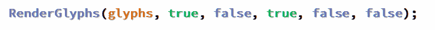

# 如何用 toggle params 改进函数？

> 原文：<https://dev.to/fenbf/how-to-improve-functions-with-toggle-params-99a>

[T2】](https://res.cloudinary.com/practicaldev/image/fetch/s--6dkK3nSE--/c_limit%2Cf_auto%2Cfl_progressive%2Cq_auto%2Cw_880/https://4.bp.blogspot.com/-WCTFB09SbTc/WLPOamLMC8I/AAAAAAAAC3Y/jUVFyIAHmCEvsux8Falv9N0xyDFT1Y4qwCLcB/s1600/toggleFunc.png)

如何围绕函数改进代码:

```
RenderGlyphs(true, false, true, false); 
```

Enter fullscreen mode Exit fullscreen mode

对那些参数进行推理并不容易。

我们不仅希望有更有表现力的代码，而且希望有更安全的代码。

例如，如果混合两个参数并改变它们的顺序会怎么样？编译器帮不了你多少！

我们可以添加注释:

```
RenderGlyphs(glyphs,
             /*useChache*/true, 
             /*deferred*/false, 
             /*optimize*/true, 
             /*finalRender*/false); 
```

Enter fullscreen mode Exit fullscreen mode

尽管上面的代码可读性更好，但我们仍然没有获得更多的安全性。

那么我们还能做些什么呢？

**注意**:这篇文章最初出现在我的博客上是: [Bartek 的编码博客:关于切换参数](http://www.bfilipek.com/2017/03/on-toggle-parameters.html)。

## 思想

这里有一些想法，你可以用来使这样的代码更好:

### 小枚举

理论上我们可以写下面的声明:

```
enum class UseCacheFlag    { True, False };
enum class DeferredFlag    { True, False };
enum class OptimizeFlag    { True, False };
enum class FinalRenderFlag { True, False };

// and call like:
RenderGlyphs(glyphs,
             UseCacheFlag::True, 
             DeferredFlag::False, 
             OptimizeFlag::True, 
             FinalRenderFlag::False); 
```

Enter fullscreen mode Exit fullscreen mode

使用枚举是一种很好的方法，但是有一些缺点:

*   需要很多额外的名字！
    *   也许我们可以重用一些类型，我们应该在项目中定义一些公共标志吗？如何组织那些类型？
*   值不能直接转换成 bool，所以你必须在函数体内显式地与`Flag::True`进行比较。

所需的显式比较是 Andrzej 编写他自己的[小库](https://github.com/akrzemi1/explicit/blob/master/include/ak_toolkit/tagged_bool.hpp)的原因，该库创建转换为`bool`的 toggles。

最初，我认为我们没有语言的直接支持是令人失望的。但是过了一段时间，我改变了主意。显式的比较并不难写，所以把它包含在语言规范中可能有点矫枉过正。引入显式强制转换甚至可能会导致一些问题。

尽管如此，我还是不太喜欢写这么多的小枚举...因为我很懒，所以我可能不会对我所有代码都应用这样的规则:)

### 参数结构

如果你有几个参数(比如 4 或 5，取决于上下文)，为什么不把它们包装成一个单独的结构呢？

```
struct RenderGlyphsParam
{
    bool useCache;
    bool deferred;
    bool optimize;
    bool finalRender;
};
void RenderGlyphs(Glyphs &glyphs, const RenderGlyphsParam &renderParam);

// the call:
RenderGlyphs(glyphs,
             {/*useChache*/true, 
             /*deferred*/false, 
             /*optimize*/true, 
             /*finalRender*/false}); 
```

Enter fullscreen mode Exit fullscreen mode

好...这个没多大帮助！您需要管理额外的代码，而调用者使用几乎相同的代码。

那么它为什么会有帮助呢？

*   它把问题转移到另一个地方。您可以将强类型应用于结构的单个成员。
*   如果你需要添加更多的参数，你可以扩展这个结构。
*   如果更多的函数可以共享这样的参数结构，这将非常有用。

顺便说一句:你也可以把`glyphs`变量放在`RenderGlyphsParam`中，这只是一个例子。

### 消除

我们可以试着修正语法并使用巧妙的技巧。但是用更简单的方法呢？如果我们提供更多的功能，而只是消除参数呢？

有一个或者两个切换参数是可以的，但是如果你有更多的话，可能意味着一个函数试图做太多了？

在我们的简单例子中，我们可以尝试:

```
RenderGlyphsDeferred(glyphs,
             /*useChache*/true, 
             /*optimize*/true);
RenderGlyphsForFinalRender(glyphs,
             /*useChache*/true, 
             /*optimize*/true; 
```

Enter fullscreen mode Exit fullscreen mode

我们可以对互斥的参数进行更改。在我们的示例中，延迟不能与最终运行一起发生。

你可能有一些内部函数`RenderGlyphsInternal`仍然接受那些切换参数(如果你真的不能分离代码的话)。但至少这样的内部代码会对公共 API 隐藏起来。如果可能，您可以稍后重构该内部函数。

所以我觉得看看函数声明，复习一下有没有互斥参数就好了。可能是功能做多了？如果有，那就把它切成几个更小的函数。

写完这一节后，我注意到了来自 [Martin Fowler 的关于标志参数](https://martinfowler.com/bliki/FlagArgument.html)的提示。在文本中，他也试图避免切换。

你也可以阅读罗伯特·c·马丁的干净代码技巧#12:消除布尔参数中的这篇文章。更多信息请见他的书 [**干净的代码:敏捷软件工艺手册**](http://amzn.to/2m3g2LS)

### 未来 C++2z 有什么？

有篇论文:[指定初始化，P0329R0](http://www.open-std.org/jtc1/sc22/wg21/docs/papers/2016/p0329r0.pdf) 可能进 C++20。

基本上，你可以使用类似于 C99 的方法，并命名传递给函数的参数:

```
copy(.from = a, .to = b); 
```

Enter fullscreen mode Exit fullscreen mode

甚至已经有了一个 CLang 实现，请看这个:[统一指定的 C++初始化器和参数](http://jamboree.github.io/designator-draft.html)。

### 更强的类型

使用小型枚举或结构是使用更强类型的更一般主题的一部分。当有几个 int 作为参数或字符串时，可能会出现类似的问题...

您可以阅读更多信息:

*   简化 C++:使用更强的类型！-
*   在 C++中键入安全句柄——我喜欢大的部分
*   [强接口的强类型- Fluent C++](http://www.fluentcpp.com/2016/12/08/strong-types-for-strong-interfaces/)
*   [foonathan::blog() -类型安全-零开销实用程序，提供更多类型安全](http://foonathan.net/blog/2016/10/11/type-safe.html)
*   [序列化- BOOST_STATIC_WARNING](http://www.boost.org/doc/libs/1_61_0/libs/serialization/doc/strong_typedef.html)

## 举一个例子

最近，我有机会将枚举/更强类型的一些想法应用到我的代码中。这里有一个大概的轮廓:

```
// functions:
bool CreateContainer(Container *pContainer, bool *pOutWasReused);

void Process(Container *pContainer, bool bWasReused);

// usage
bool bWasReused = false;
if (!CreateContainer(&myContainer, &bWasReused))
   return false;

Process(&myContainer, bWasReused); 
```

Enter fullscreen mode Exit fullscreen mode

简而言之:我们创建一个容器，然后处理它。但是容器可能被重用(一些池，重用现有的对象，等等)。，一些内部逻辑)。

我认为它看起来不好看。我们使用一个输出标志，然后将它作为输入标志传递给其他函数。

更重要的是，我们传递一个指针，所以应该发生一些额外的验证。还有，现代 C++不鼓励输出参数，反正有也不好。

我们怎样才能做得更好？

让我们使用枚举！

```
enum class ContainerCreateInfo { Err, Created, Reused };
ContainerCreateInfo CreateContainer(Container *pContainer);

void Process(Container *pContainer, ContainerCreateInfo createInfo);

// usage
auto createInfo = CreateContainer(&myContainer)
if (createInfo == ContainerCreateInfo::Err);
   return false;

Process(&myContainer, createInfo); 
```

Enter fullscreen mode Exit fullscreen mode

不是更好吗？

这里没有通过指针输出的东西；对于“toggle”参数，我们有一个强类型。

同样，如果你需要在那个`CreateInfo`枚举中传递更多的信息，你可以只添加一个枚举值并在适当的地方处理它，函数原型不必改变。

当然，在实现中，您必须与枚举值进行比较(不仅仅是转换为`bool`)，但这并不困难，甚至更冗长。

## 总结

切换参数并不是完全错误的，完全避免它们也是不可能的。尽管如此，当您想在一行中添加第三个或第四个参数时，最好检查一下您的设计:)

也许你可以减少切换/标志的数量，让代码更有表现力？

有些问题要问你:

你尝试重构切换参数了吗？你在代码中使用强类型了吗？

### 行动号召

如果你喜欢我的更多编程故事，就注册我的每周简讯: [Bartek 的编码博客简讯](http://eepurl.com/caCAun)
(你还会得到一些 C++17 奖金)