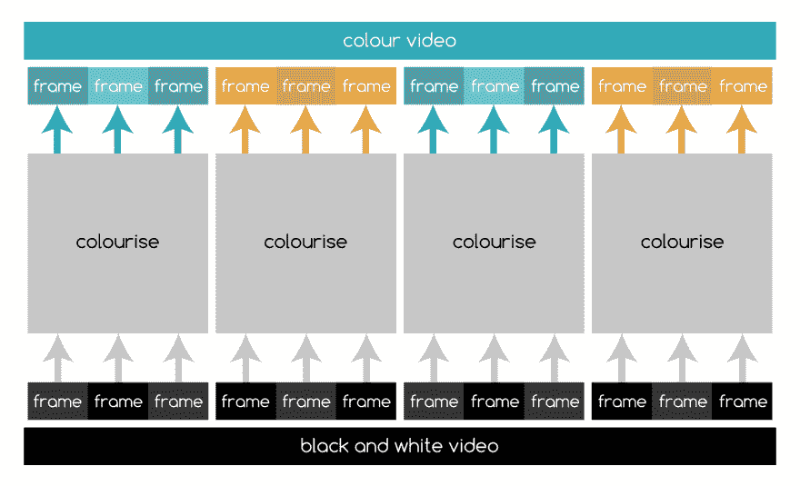

# 用无服务器机器学习给视频着色

> 原文:[https://dev . to/develop ius/colourizing-video-with-server less-machine-learning-c8a](https://dev.to/developius/colourising-video-with-serverless-machine-learning-c8a)

*本文最初发表于[我的博客](https://finnian.io/blog/colourising-video-with-openfaas-serverless-functions/)T3*

今年早些时候，我在 Mashable 上看到一个帖子，里面有一些二战时期的惊人照片。他们真的将这个时代带入了生活，所以我在想我们如何自动化给照片着色的过程，并节省大量ðÿ'——专业地给视频着色可能需要高达 3k/分钟的成本。

DockerCon EU 快到了，我真的很想参加。我的想法听起来像是解决我问题的完美方案！在我的朋友[奥利·卡拉汉](https://twitter.com/olicallaghan_)的帮助下，我们开始编写代码。我们尝试了几种不同的方法，特别是用 C++从头开始编写我们自己的机器学习框架，并训练 tensorflow 网络。归根结底，这些解决方案总是受限于一件事:时间。DockerCon 只有几周时间，而我们的网络花了太长时间来训练(我们说的是几周)。

所以，我们被迫采用另一种方法。我们决定以张曦轲等人的作品为基础，用他们预先建立的模型给我们的照片上色。我们能够使用开源的无服务器框架 [OpenFaaS](https://www.openfaas.com/) 成功部署他们的 Caffe 模型。使用 OpenFaaS 使我们能够专注于色彩的集成，而不是底层的基础设施。

在一个无服务器的功能中实现了着色之后，我们决定扩展它，这样我们在 DockerCon 的观众就可以参与进来。

利用 OpenFaaS 的灵活性，我们编写了一些额外的无服务器函数，允许人们向 [@colorisebot](https://twitter.com/colorisebot) 发送黑白图像，并让它回复彩色图像。

这是我们的函数堆栈的样子:

[T2】](https://res.cloudinary.com/practicaldev/image/fetch/s--jl672nLZ--/c_limit%2Cf_auto%2Cfl_progressive%2Cq_auto%2Cw_880/https://finnian.io/blog/conteimg/2017/10/Screen-Shot-2017-10-19-at-01.57.29.png)

一些非常棒的人在 DockerCon 后派对上试用了我们的机器人，包括独一无二的克洛伊·康登和 T2·乔纳斯·罗斯兰。

> 可儿康登🎀[@ chloecondon](https://dev.to/chloecondon)好了你们这些家伙 [@developius](https://twitter.com/developius) 造了一个把黑&白【他 17】的照片上色的机器人。我不配🙌🙌🙌[twitter.com/colorisebot/st…](https://t.co/mgi9dD7PuY)2017 年 10 月 18 日晚 20 点Colorise Bot@ Colorise Bot214

好的，我们可以给照片上色。然而，我们的主要目标一直是给视频着色。这是怎么回事？相当好！

[https://www.youtube.com/embed/K4QVi-BSjGw](https://www.youtube.com/embed/K4QVi-BSjGw)

它是这样工作的。我们简单地将视频分割成帧，然后将它们放入 OpenFaaS 函数堆栈，收集彩色帧，并用 ffmpeg 将它们拼接在一起。

[T2】](https://res.cloudinary.com/practicaldev/image/fetch/s--0CMKGu28--/c_limit%2Cf_auto%2Cfl_progressive%2Cq_auto%2Cw_880/https://finnian.io/blog/conteimg/2017/10/Screen-Shot-2017-10-19-at-20.51.03.png)

# 社区

OpenFaaS 社区非常支持我们，帮助测试、开发和激励我和 Oli 不断改进这个项目。虽然最初的想法是我们的，但开发和部署是团队的努力。

特别是，我们要对 OpenFaaS 的项目负责人 [Alex Ellis](https://twitter.com/alexellisuk) 表示由衷的感谢，感谢他一直以来的帮助和支持。他是一位伟大的导师，在从演示指南到 OpenFaaS 设置和配置的各个不同方面给了我们宝贵的建议。他甚至写了一个[简洁的函数，使图像正常化](https://github.com/faas-and-furious/autocolour)，以帮助实现棕褐色效果，这已经产生了很好的效果。

Alex 刚刚在 OpenFaaS 社区推出了“Pods”的想法。这是一个帮助管理项目工作和分散领导权的想法。亚历克斯写道:

豆荚是:

*   7 +/- 2 人
*   混合能力
*   被吸引到他们最感兴趣的项目领域
*   在 GitHub 问题、PRs 和发行说明中获得特别提及
*   合作或独立工作
*   由愿意为 Pod 和项目投入时间的 Pod 倡导者代表

我真的很兴奋这个想法，并期待加入一个荚！OpenFaaS 社区是非常包容和友好的，如果你有兴趣加入，只需给 alex@openfaas.com T2 发一封电子邮件，他就会把你加入 Slack 小组。

# 总结

请随意在 twitter 上与 [@colorisebot](https://twitter.com/colorisebot) 玩一玩，并让我们知道您的想法！

代码都是开源的(查看原始帖子[这里](https://finnian.io/blog/colourising-video-with-openfaas-serverless-functions/))所以看看吧。

我有一个很酷的小 grafana 仪表板，连接到 OpenFaaS Prometheus metrics，这样我就可以实时看到发生了什么。顺便说一下，这个周末对机器人来说是非常忙碌的一段时间，在 Twitter 上积累了超过 1130 张彩色图片！我在这里收集了一些最好的:[https://storify.com/developius/best-of-colorisebot](https://storify.com/developius/best-of-colorisebot)

[T2】](https://res.cloudinary.com/practicaldev/image/fetch/s--M7qjFvzB--/c_limit%2Cf_auto%2Cfl_progressive%2Cq_auto%2Cw_880/https://thepracticaldev.s3.amazonaws.com/i/qjif667n1yssxovcogab.png)

# 下一步

未来，我们希望在 GPU 上运行转换，这样我们就可以利用图形处理器的能力来更快地运行我们的网络。我们认为，通过使用 GPU，我们可以将执行时间减少 100 倍(5 秒到 50 毫秒)。

我们还想尝试在循环网络上运行我们的网络，该网络从当前网络之前的帧中学习。这应该有助于视频转换，看起来闪烁，因为有些帧稍微不正确。

我们的幻灯片在这里[可以看到](https://www.slideshare.net/Docker/repainting-the-past-with-distributed-machine-learning-and-docker)，你可以在这里观看[我们的 DockerCon 对话。奥利还](https://dockercon.docker.com/watch/1sEyvPTJuVUADbbLYJLpi8)[写了一篇关于机器学习的来龙去脉(一语双关)的帖子](http://olicallaghan.com/post/repainting-the-past-with-machine-learning-and-openfaas)，还讲述了我们如何将程序改编成视频。