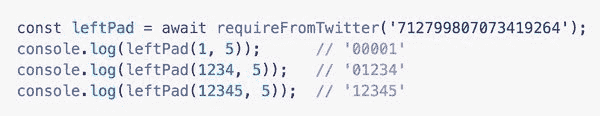

# 愚蠢的代码:从 tweet 导入 Redux！#javascript

> 原文:[https://dev . to/Joel net/let-write-some-silly-code-with-require-from-Twitter-and-redux-cd6](https://dev.to/joelnet/lets-write-some-silly-code-with-require-from-twitter-and-redux-cd6)

编程不应该总是和工作有关。有时候你只需要找点乐子，写点傻逼的东西。这正是 [@rauchg](https://twitter.com/rauchg) 在创造 [`require-from-twitter`](https://gist.github.com/rauchg/5b032c2c2166e4e36713) 时所做的。

> Guillermo Rauch@ rauchg然后简单地用‘requirefromtwitter’。移过 NPM
> [gist.github.com/rauchg/5b032c2…](https://t.co/wAGGg5pfnz)2016 年 3 月 24 日上午 00:36[](https://twitter.com/intent/tweet?in_reply_to=712800259089391617)[](https://twitter.com/intent/retweet?tweet_id=712800259089391617)[](https://twitter.com/intent/like?tweet_id=712800259089391617)

当你可以直接从 Twitter 上获得代码时，谁还需要 NPM 呢？这太荒谬了！现在让我们找点乐子，一起玩吧！

如果你还没看过，请查看 [Redux:从零开始实现商店](https://egghead.io/lessons/react-redux-implementing-store-from-scratch)。简直是*惊艳*， [@dan_abramov](https://twitter.com/dan_abramov) 在不到 3 分钟的时间内从零开始打造 Redux 的`createStore`。

所以我从视频中的代码开始:

```
export default (reducer) => {
  let state
  let listeners = []

  const getState = () => state

  const dispatch = (action) => {
    state = reducer(state, action)
    listeners.forEach(listener => listener())
  }

  const subscribe = (listener) => {
    listeners.push(listener)
    return () => {
      listeners = listeners.filter(l => l !== listener)
    }
  }

  dispatch({})

  return { getState, dispatch, subscribe }
} 
```

<svg width="20px" height="20px" viewBox="0 0 24 24" class="highlight-action crayons-icon highlight-action--fullscreen-on"><title>Enter fullscreen mode</title></svg> <svg width="20px" height="20px" viewBox="0 0 24 24" class="highlight-action crayons-icon highlight-action--fullscreen-off"><title>Exit fullscreen mode</title></svg>

...并使用[挑战:没有变量的程序#javascript](https://dev.to/joelnet/challenge-program-without-variables-javascript-egk)
中的技术将其简化为一个表达式

```
export default (reducer, state = reducer(undefined, {}), listeners = []) => ({
  getState: () => state,
  dispatch: (action) => (
    state = reducer(state, action),
    listeners.forEach(listener => listener())
  ),
  subscribe: (listener) => (
    listeners.push(listener),
    () => {
      listeners = listeners.filter(l => l !== listener)
    }
  )
}) 
```

<svg width="20px" height="20px" viewBox="0 0 24 24" class="highlight-action crayons-icon highlight-action--fullscreen-on"><title>Enter fullscreen mode</title></svg> <svg width="20px" height="20px" viewBox="0 0 24 24" class="highlight-action crayons-icon highlight-action--fullscreen-off"><title>Exit fullscreen mode</title></svg>

哦。对 twitter 来说还是太大了。好吧，让我们缩小这个东西。

```
export default (a,b=a(void 0,{}),c=[])=>({getState:()=>b,dispatch:d=>(b=a(b,d),c.forEach(e=>e())),subscribe:d=>(c.push(d),()=>{c=c.filter(e=>e!==d)})}) 
```

<svg width="20px" height="20px" viewBox="0 0 24 24" class="highlight-action crayons-icon highlight-action--fullscreen-on"><title>Enter fullscreen mode</title></svg> <svg width="20px" height="20px" viewBox="0 0 24 24" class="highlight-action crayons-icon highlight-action--fullscreen-off"><title>Exit fullscreen mode</title></svg>

我现在假设我已经将代码减少到 153 个字符，twitter 有一个新的 280 个字符的限制，这就足够了，但我最终在使用 [`twit`](https://github.com/ttezel/twit) 时收到了截断的文本。(滚动到最后看截断)

```
// Redux createStore
export default (a,b=a(void 0,{}),c=[])=&gt;({getState:()=&gt;b,dispatch:d=&gt;(b=a(b,d),c.forEach(e=&gt;e(… https://t.co/jNSo5bd60k 
```

<svg width="20px" height="20px" viewBox="0 0 24 24" class="highlight-action crayons-icon highlight-action--fullscreen-on"><title>Enter fullscreen mode</title></svg> <svg width="20px" height="20px" viewBox="0 0 24 24" class="highlight-action crayons-icon highlight-action--fullscreen-off"><title>Exit fullscreen mode</title></svg>

嗯。所以让我们去掉`unsubscribe`函数，看看我们是否能把它精简一下。

```
// 124 characters
export default(a,b=a(void 0,{}),c=[])=>({getState:()=>b,dispatch:d=>(b=a(b,d),c.forEach(e=>e())),subscribe:d=>c.push(d)}) 
```

<svg width="20px" height="20px" viewBox="0 0 24 24" class="highlight-action crayons-icon highlight-action--fullscreen-on"><title>Enter fullscreen mode</title></svg> <svg width="20px" height="20px" viewBox="0 0 24 24" class="highlight-action crayons-icon highlight-action--fullscreen-off"><title>Exit fullscreen mode</title></svg>

这应该行得通。

下一步，将代码发布到 Twitter 上

> joelnet[@ joelnet](https://dev.to/joelnet)//createStore
> 导出默认(a，b=a(void 0，{})，c =[])=>({ getState:)=>b，dispatch:d= > (b=a(b，d)，c.forEach(e= > e())，subscribe:d =>

最后是样例 app！

```
import requireFromTwitter from './require-from-twitter'

(async () => {
  const createStore = await requireFromTwitter('928882286883254272')

  const reducer = (store = 0, { type }) =>
    type === 'INCREASE'   ? store + 1
    : type === 'DECREASE' ? store - 1
                          : store

  const store = createStore(reducer)

  store.subscribe(() => {
    console.log('state', store.getState())
  })

  store.dispatch({ type: 'INCREASE' })
  store.dispatch({ type: 'INCREASE' })
  store.dispatch({ type: 'DECREASE' })
  store.dispatch({ type: 'DECREASE' })
})()

// state 1
// state 2
// state 1
// state 0 
```

<svg width="20px" height="20px" viewBox="0 0 24 24" class="highlight-action crayons-icon highlight-action--fullscreen-on"><title>Enter fullscreen mode</title></svg> <svg width="20px" height="20px" viewBox="0 0 24 24" class="highlight-action crayons-icon highlight-action--fullscreen-off"><title>Exit fullscreen mode</title></svg>

注意:如果你得到一些奇怪的错误`TypeError: Path must be a string`，它在升级 npm 包后消失了。

# 总结

这段代码写起来非常有趣。感谢吉列尔莫·劳奇创造了`require-from-twitter`。

一些很酷的改进

*   twit 可以支持更大的 tweet 大小。
*   需要一个类似 npm 的服务来永久保存推文。
*   require-from-twitter 可以升级，以支持大量代码导入的多 tweet。

不管怎样，这很有趣，我想是时候结束了。

在评论区说说你做过什么样的傻逼项目？

在 Twitter [@joelnet](https://twitter.com/joelnet) 或 [LinkedIn](https://www.linkedin.com/in/joel-thoms/) 上关注我

干杯！