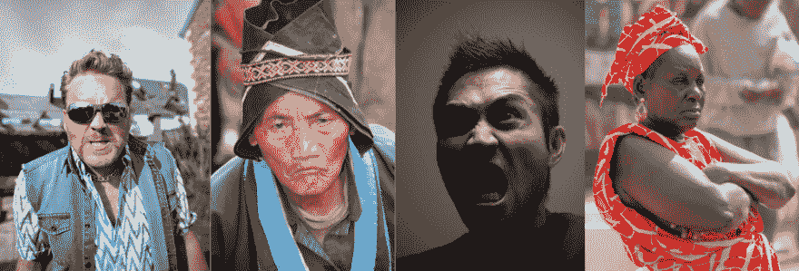
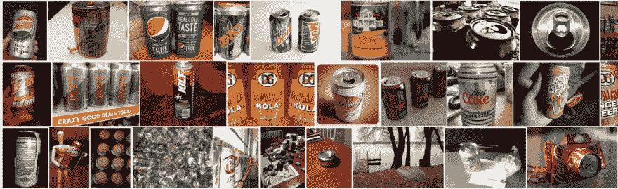
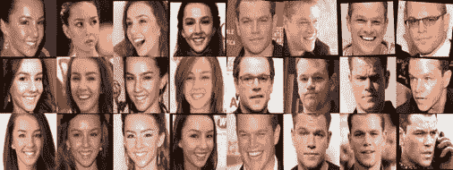
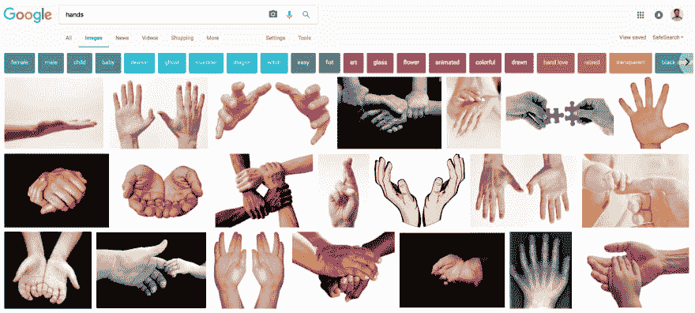

# Clarifai 如何建立准确和公正的人工智能技术

> 原文:[https://dev . to/clari fai/how-clari fai-builds-accurate-and-unbiased-ai-technology-9hg](https://dev.to/clarifai/how-clarifai-builds-accurate-and-unbiased-ai-technology-9hg)

在 Clarifai，我们有一个名为数据策略团队的团队，这是一群尽职尽责、多元化的人，他们训练我们的视觉识别模型。他们确保我们正在构建准确、无偏见的人工智能——了解他们做什么，以及如何将他们的最佳实践应用到您自己的模型构建中！

早在计算时代的早期，公司曾经依赖团队手工完成复杂的计算。这些操作现在只需计算机几分之一秒就能完成。今天，似乎每个公司都想建立或整合人工智能，使任务比由人类完成时更快、更准确。然而，有些关于人类思维的东西，我们无法单独用计算机完全复制(目前还不行！).

在 Clarifai，我们有一个非常棒的团队，我们称之为数据策略团队，帮助我们管理和评估数据质量，以创建强大的人工智能模型。与研究、工程和我们的客户成功团队一起，该团队提取了他们从各个方面获得的关于定制模型的所有反馈，并致力于不断改进 API，以最好地反映这个巨大而美丽的世界。团队的多元化背景让他们看到了其他人可能看不到的东西。当建立一个人工智能模型时，团队必须问，“我们应该看到什么？我们所要求的是可见的和可区分的吗？如果我们自己都不能回答这些问题，那么让计算机来做这件事有意义吗？”以下是我们的数据策略团队在构建模型时需要考虑的一些建议！

### **分解视觉成分**

人工智能模型接收输入，因此我们需要确保我们的输入具有模型能够理解的正确元素。如果我们制作一个模型，并希望它能识别植物上的一片叶子，会怎么样呢？当我们给它一些不同物种的图像时，我们就在教育模型树叶可以呈现的不同形状、颜色和纹理。我们有这些视觉上有形的方面让它识别。如果我们想训练我们的模型来识别像愤怒这样的情绪会怎么样？不同的文化和不同的人表达愤怒的方式不同。

[T2】](https://res.cloudinary.com/practicaldev/image/fetch/s--2RG1BieR--/c_limit%2Cf_auto%2Cfl_progressive%2Cq_auto%2Cw_880/https://blog.clarifai.com/wp-content/uploads/2017/11/emotion.png)

当试图教授一个更形而上学的概念时，你需要确保你的输入也代表那些变化。确定代表你的概念的事物，并确保它们的例子被整合到训练集中。这将为您希望模型关注的内容实现更高的准确性。评估输入后，您将能够改进准确性。

### **合并相关训练数据**

对人工智能模型的最大误解之一是，它们每次都能正确识别所有东西。模型的好坏取决于用来训练它的数据。由于训练数据看起来不像将要测试的数据，模型可能无法做出准确的预测。想象一下，如果你想建立一个模型，可以检测不同的回收物品。然而，你所有的训练数据都是关于桌子上的物品的库存照片，这些物品正被人们拿着喝着或吃着。当你希望有人使用这个模型时，这是我们打算使用的方式吗？这个模型能探测到世界上人们垃圾桶的照片吗？大概不会。

[T2】](https://res.cloudinary.com/practicaldev/image/fetch/s--sp_5a31R--/c_limit%2Cf_auto%2Cfl_progressive%2Cq_auto%2Cw_880/https://blog.clarifai.com/wp-content/uploads/2017/11/Screen-Shot-2017-11-09-at-12.21.22-PM.png)

你不仅要确保你加入的数据是相关的，还要确保你的训练数据和预期的测试数据有相同的视觉效果。你的测试数据会反转或者模糊吗？它是灰度的还是彩色的？这些也会影响模型的精确性和准确性。一个模型只是一块粘土，你的工作就是尽可能地使它的形状有效。

### **不惜一切代价消除偏见**

就像人类一样，人工智能模型容易受到它所教授的内容的影响。对模型来说，输入是描述其世界的真理的来源，它只能从其教导中理解世界。我们已经在谷歌对照片标签的错误预测和微软的聊天机器人对照片标签的错误预测这两个极端案例中看到了这一点。当我们塑造模型时，我们希望确保我们没有引入任何人类偏见。

当你给出描述一个职业的概念时，你可能想代表所有相关的人口统计数据，而不仅仅是最突出的。即使是公认的数据集也可能偏向于它们所在的文化。看看 [FaceScrub](http://vintage.winklerbros.net/facescrub.html) ，一个流行的名人面部检测数据集。

[T2】](https://res.cloudinary.com/practicaldev/image/fetch/s--NRkEQLmJ--/c_limit%2Cf_auto%2Cfl_progressive%2Cq_auto%2Cw_880/https://blog.clarifai.com/wp-content/uploads/2017/11/facescrub.jpg)

这个数据集包含白人占多数的名人。我们可以通过吸收更多来自世界其他地方的名人来提高其有效性。如果我们在收集一组数据时不承认我们的偏见，我们只会建立我们所知道的，而不会超越它。

### **何去何从？**

机器学习模型通常是根据从互联网上盲目搜集的数据进行训练的。毕竟，在成千上万的图像上使用搜索词，然后将它们作为训练数据上传是很容易的。

[T2】](https://res.cloudinary.com/practicaldev/image/fetch/s--KL3j4sTc--/c_limit%2Cf_auto%2Cfl_progressive%2Cq_auto%2Cw_880/https://blog.clarifai.com/wp-content/uploads/2017/11/Screen-Shot-2017-11-09-at-12.32.49-PM.png)

然而，这并没有反映出我们的世界是多么的多样化。有了这些技巧，你就有能力认识到这些细微差别，并构建出能给出有意义结果的模型。我知道在 Clarifai，我们知道这些可能的影响因素，我们使用我们的数据策略团队来仔细改进我们的神经网络模型。该团队与我们的企业客户合作，以确保满足他们的需求，并迭代构建可以增强平台体验的模型。如果您有任何问题或想了解更多关于构建有效模型的信息，请通过[hackers@clarifai.com](mailto:hackers@clarifai.com)联系我们！

帖子[clari fai 如何构建准确和无偏见的人工智能技术](https://blog.clarifai.com/data-strategy-team-builds-accurate-unbiased-ai-technology/)首先出现在 [Clarifai 博客|人工智能在行动](https://blog.clarifai.com)上。