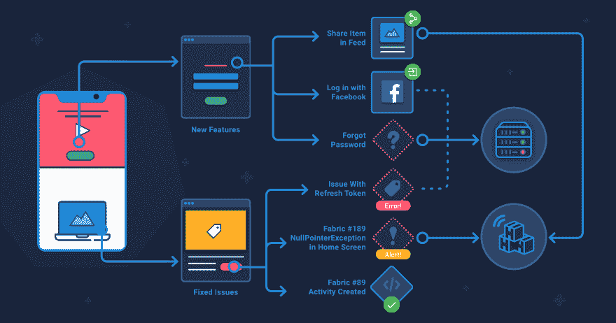

# 如何发布应用程序

> 原文:[https://dev.to/bugfenderapp/how-to-release-apps-ab8](https://dev.to/bugfenderapp/how-to-release-apps-ab8)

[T2】](https://res.cloudinary.com/practicaldev/image/fetch/s--VC79cNuW--/c_limit%2Cf_auto%2Cfl_progressive%2Cq_auto%2Cw_880/https://bugfender.com/wp-content/uploads/2017/11/How-to-Release-Apps.jpg)

*本帖最初发表于[bugfender.com](https://bugfender.com/blog/how-to-release-apps/)T3】*

一块坚韧的猪肉。一杯淡茶。一条部分痊愈的腿筋被送回赛场。电子游戏。

有些东西需要更多的时间才能达到巅峰。驱使我们的欲望——饥饿、干渴、胜利、财务上的成功——可以压倒耐心的需要。如果你匆忙行事，你可能会得到一个不令人满意的猪肉三明治，或者一堆被埋在墨西哥垃圾填埋场的游戏卡带。

对于移动应用，过早发布的后果各不相同。您的第一批用户可能会遇到一个有点恼人的小问题。或者他们可能会下载一个经常崩溃的应用程序，促使他们快速点击“卸载”按钮。

在 Bugfender，我们希望避免这两种情况。测试中会有漏洞——我们只是普通人。但是在发布之前检查应用程序是至关重要的。

所以我们想出了一个清单。可以把它想象成我们的慢煮烧烤猪肉食谱。我们还写了一本关于把你的错误减少到零的书。

## 决定如何释放

测试和发布应用程序有两种常见的方式:手动和持续集成。

持续集成是一个自动化的过程，我们将很快在另一篇博客文章中进行介绍。

在这里，我们将重点关注手动检查应用程序问题的关键方面。在用户接触到你的应用程序之前，越多的人关注它越好。因此，你需要大量的时间和团队协作。

 
*我们在移动爵士巴塞罗那办公室的工程师*

## 让质量保证成为日常生活的一部分

一些应用程序开发机构——甚至可能是他们的客户——有一个内部质量保证(QA)团队。团队负责测试应用程序并提供反馈，然后给项目经理开绿灯。

然而，专业的质量保证团队是奢侈品，不是每个公司都能负担得起的。在这种情况下，让每个人都负责质量保证；工程师、项目经理和客户。

## 进入迷宫

早点开始 QA。在开发过程中，将应用程序的各个部分或功能分配给不同的工程师进行构建和测试。

但是在测试的时候有一个问题。工程师不会像新用户那样使用应用程序。如果你看过《硅谷》，你就会知道当用户测试他的应用程序并发现它完全无法使用时，天才工程师理查德·亨德里克斯变得怀疑和困惑的场景。

还记得硅谷的这一幕吗？工程师对一个 app 的流程看得极其清楚。就像迷宫的创造者一样，他们对每个转弯、螺旋和死胡同都有自上而下的看法。对他们来说，穿越迷宫绝对轻而易举。真正的用户将第一次体验迷宫，并遇到工程师只会避开的障碍。

 
*就像迷宫的创造者一样，工程师对一个应用中的每一个转弯、螺旋、死胡同都有自上而下的看法。*

工程师可以通过简单地意识到这个问题来防止这一点。虽然他们无法从脑海中抹去该应用的地图(至少在未来几年内不会)，但他们可以戴上另一顶帽子——在这种情况下是新用户的帽子——以全新的视角来看待该应用。如果你在应用程序中用语言描述你在做什么，并不断质疑，你可能会发现一个新问题。

## 驾驭工程师的超能力

这种工程师的氪石被一种超能力所抵消——对一个应用程序的所有部分以及它们如何相互交互的深入了解。对用户注册屏幕的更改将影响用户资料屏幕。结果应该测试两个屏幕。

对工程师来说，可视化应用程序中的流程是很自然的事情。但是即使是工程师的超能力也不是万无一失的。首次发布或发布更新都是关键时刻。你不会想错过应用程序中被修改但未被检查的部分。

解决办法？拿起一个软件，一个白板——甚至是一张纸——画出这些流程。为您更改的每个功能创建思维导图，以及这些更改会影响哪些功能、组件或屏幕。

简而言之，如果应用于组件 A 的变更改变了组件 B，那么测试必须同时覆盖 A 和 B。

## 测试，测试，测试

到目前为止，你的应用程序已经被开发的工程师测试过了，你的项目经理已经用思维导图覆盖了视野中所有可用的空白区域。

您还可以采取其他保护措施来彻底测试一切:

*   单元测试:对应用程序各个部分的测试。测试的内容将根据应用程序的这一部分做什么而变化，并且测试通常是自动化的。假设你有一个单位的登记表。您可以使用虚拟数据填写表单，并将一些字段留空。然后确保表单的验证要求填写空白字段，否则返回错误消息。
*   集成测试:现在是缩小范围的时候了。集成测试将组成应用程序的单元组合起来，作为一个组进行测试。集成测试有多种方法，每种方法都有优缺点，这取决于你的应用程序的结构。这种类型的测试与我们在本文前面提到的思维导图相关，因为您可以测试不同的单元如何相互作用。
*   验收测试:应用发布前的试用。它旨在复制产品的真实使用情况，以确保用户得到的东西功能齐全，符合他们的期望。

 
*跨多个设备检查应用程序是发布前必不可少的一步。*

## 检查设备

为发布/生产编译应用程序。然后，在多个真实设备上安装应用程序。一个模拟器在这里是不行的。对照你的思维导图，确保一切正常。

如果有什么东西不起作用呢？回过头来看看构建它的工程师，他给出了问题的详细信息。一旦解决了，回到 QA，再一次经历这些阶段。

在这里，挡泥板派上了用场。它跟踪使用日志，使工程师能够看到问题发生在哪里，并帮助他们解决问题。

## 铺开

谁给公开发行开绿灯？代理商和客户需要携手合作。如果客户决定不经测试就发布——这就像一个腿筋部分愈合的球员回到赛场上。

比方说，你已经完成了一系列不同的测试。你得到了客户的批准，可以出版了——很好。现在你只要按照各个应用商店的发布说明去做就行了。就这样，对吗？没有更多的决定要做？

你可以考虑分阶段推出这款应用。为什么？因为您仍然可能捕捉到那些测试中漏掉的 bug 或错误。并且您将在成千上万的用户遇到该错误之前发现它们。不言而喻，一个拥有海量用户群的破 app 是不好的。非常糟糕。

首先考虑扩展到 20%-50%的用户群。一些客户喜欢在大规模推广之前寻找 beta 测试人员。太酷了。不管你怎么做，我们强烈建议在你的用户面前从小处着手，然后再扩展。

对于更新，请确保您重新研究这些思维导图。找出任何可能受影响的功能，并在更新前再次测试。

## Appy Days(支持天数)

恭喜你。你发布了一个无错误的应用程序。或者，至少，一个问题很少的应用程序和一个能够立即发现任何问题的团队。

你是这样做的:

*   通过让工程师在开发时进行测试，你让 QA 成为了日常工作的一部分。
*   你作为一个普通用户进入迷宫，而不是一个有线索的工程师。
*   您使用 Bugfender 来标记问题(当然)。
*   你利用了工程师的超能力，创造了思维导图。
*   您运行了单元、集成和验收测试。
*   您将应用程序安装到真实的设备上，并对它们进行了测试。
*   您首先向一小部分用户推广，并对错误/错误做出响应。

通过以仔细、周到和有计划的方式进行测试，您避免了“匆忙”综合症，并提供了一批完美的猪肉。你也没有创造电子游戏《外星人》。

认真对待测试–[点击此处免费注册](https://app.bugfender.com/signup)bug fender。

* * *

这篇文章由史蒂夫·豪编辑，他是一名作家兼翻译，有着为年轻人和高危人群提供社会服务的背景。你会发现他在巴塞罗那试图:学习加泰罗尼亚语，踢足球，并追捕在这个城市最好的咖喱。点击此处查看更多他的作品。

*本帖最初发表于[bugfender.com](https://bugfender.com/blog/how-to-release-apps/)T3】*