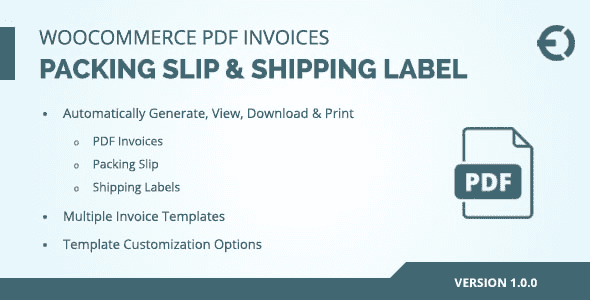
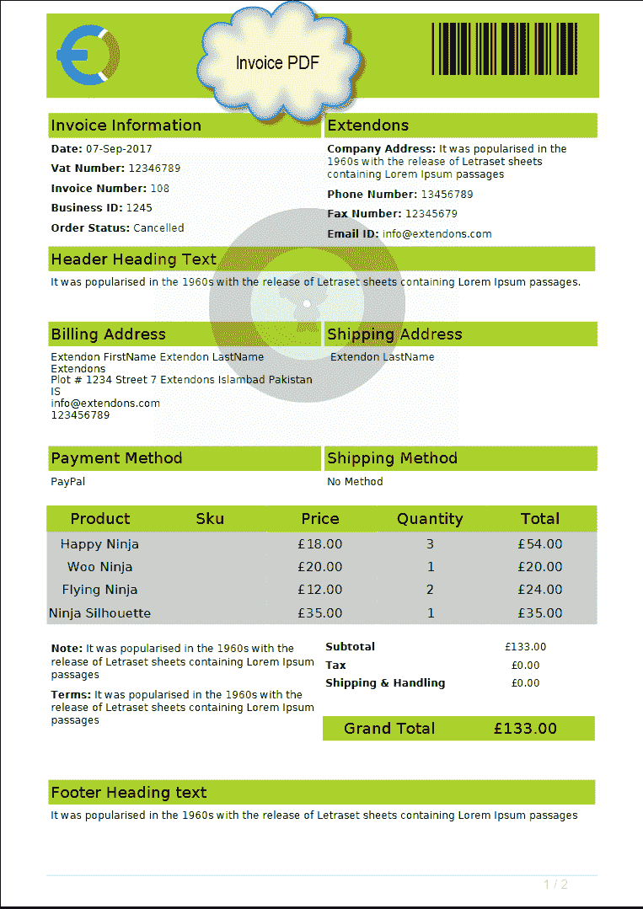
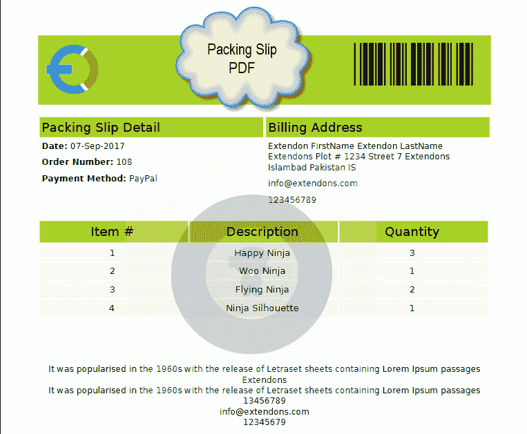
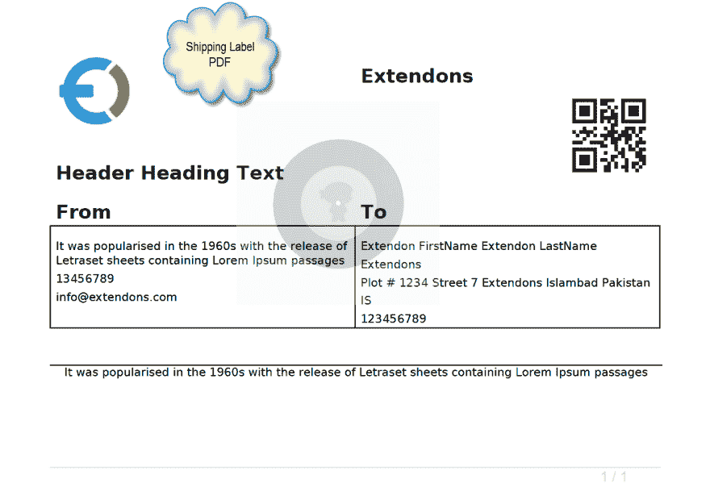
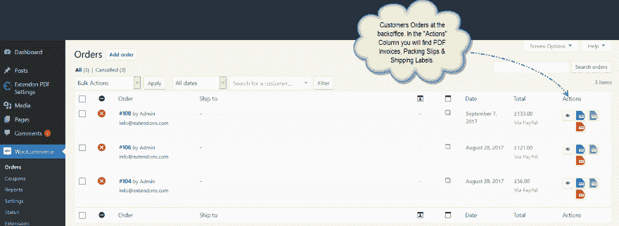

# WooCommerce Pdf 发票和装箱单

> 原文：<https://dev.to/carolynhall123/woocommerce-pdf-invoices--packing-slips-c84>

 
如果你正在寻找一个可以帮助你自动生成发票的插件，那么 **WooCommerce pdf 发票&装箱单**就是你的完美插件。有了这个插件，您不必手动制作发票和单据，因为它会自动生成 pdf 发票、运输标签和装箱单。
**[WooCommerce pdf 发票&装箱单](https://codecanyon.net/item/woocommerce-pdf-invoice-packing-slip-shipping-label/20631799)** 插件也允许你编辑发票，如果你需要进行修改。这个插件还启用了发票和单据的模板，所以你可以选择任何模板并相应地定制它。您可以在发票中添加您的企业名称、徽标和地址，并将其发送给您的客户。这个插件的价格只有 35 美元。

**截图:**

