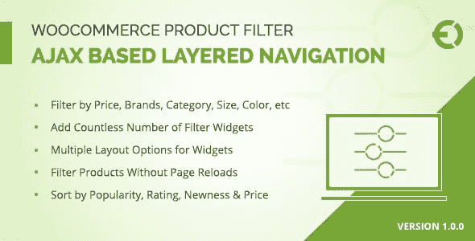
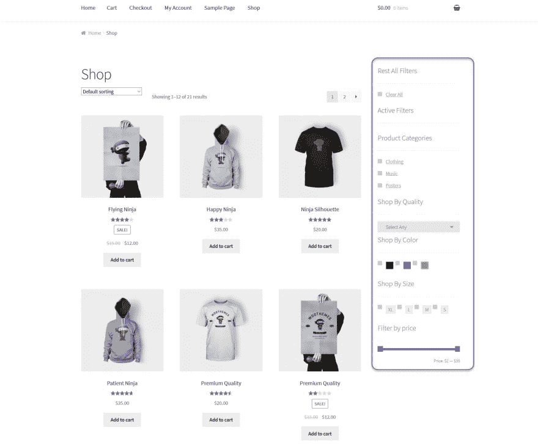
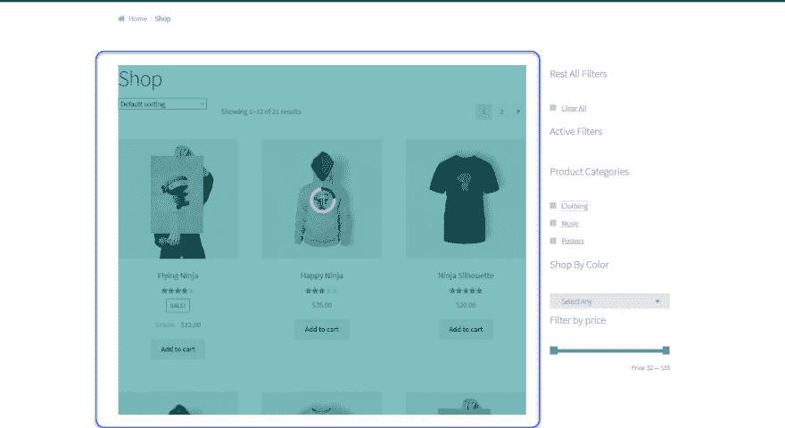
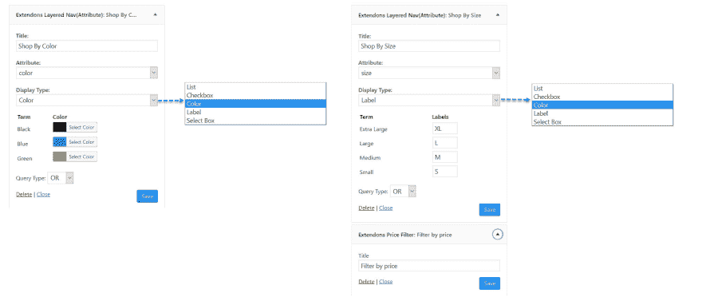
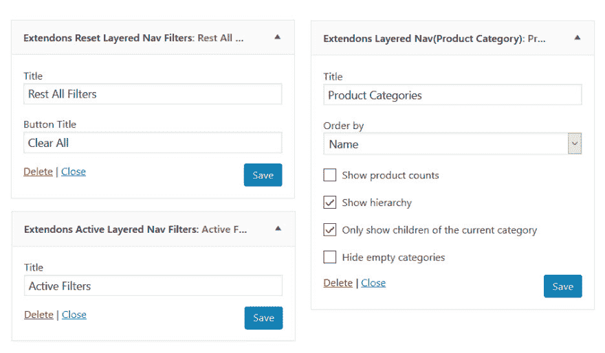

# WooCommerce Ajax 分层导航

> 原文:[https://dev . to/carolynhall 123/woo commerce-Ajax-layered-navigation-cm0](https://dev.to/carolynhall123/woocommerce-ajax-layered-navigation-cm0)

**woo commerce Ajax 分层导航插件 by Extendons** 在你的电子商店上安装各种过滤器。有了这些过滤器，顾客可以按类别、品牌、颜色、尺寸等搜索产品。你也可以从后台定制过滤器。
**[WooCommerce Ajax 分层导航](https://codecanyon.net/item/woocommerce-product-filter-ajax-layered-navigation/20465060)** 插件也显示了重新加载页面的结果，因为它使用 Ajax 技术过滤结果。这个插件有助于改善你的电子商店的用户体验，因为客户可以很容易地从庞大的目录中找到任何产品。这个强大的插件只花了你 30 美元，并附带 6 个月的免费支持和升级。
**截图**

