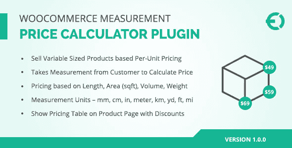
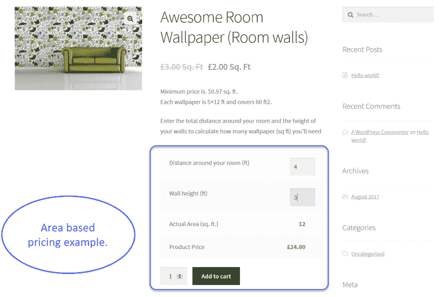
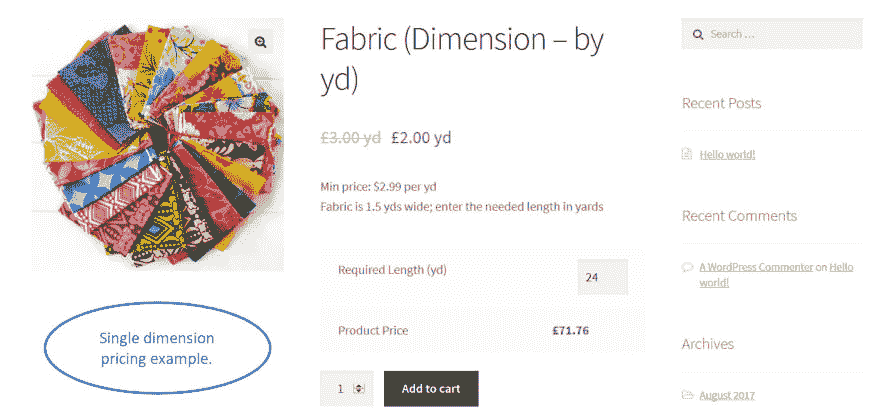
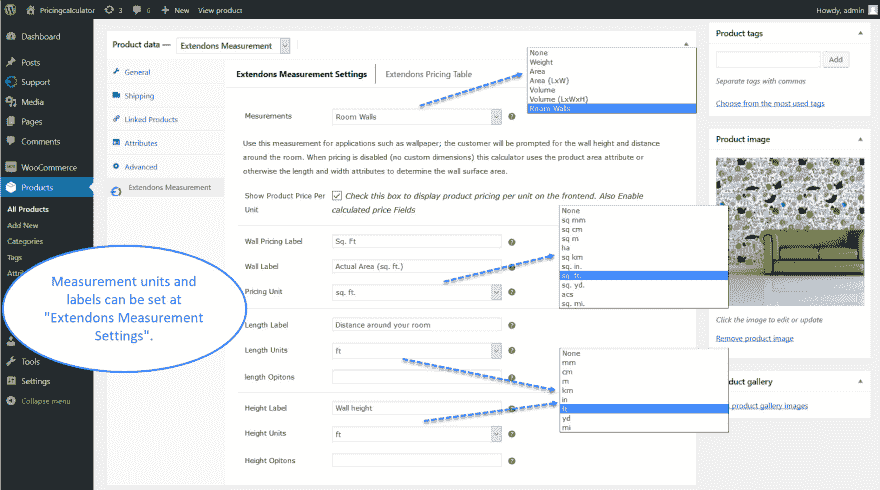
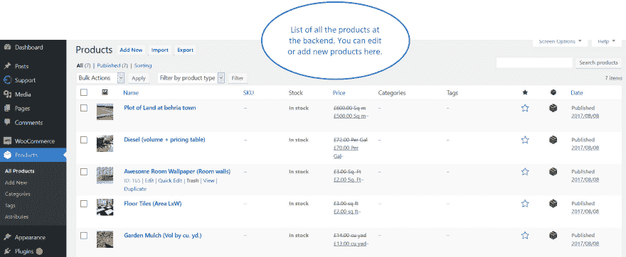

# WooCommerce 测量价格计算器

> 原文：<https://dev.to/carolynhall123/woocommerce-measurement-price-calculator-a4d>

 
**WooCommerce 计量价格计算器插件**帮助电商对其电子商店上的任何类型的商品，如地板、壁纸、饮料、瓷砖、电线等进行计量。这个插件允许你通过使用不同的单位，按重量、长度和面积出售产品。

有了 **[WooCommerce 计量价格计算器](https://codecanyon.net/item/woocommerce-measurement-price-calculator-plugin/20515113)** 你可以按数字、千克、英尺、平方英尺、升等出售产品。当顾客指定他们想要购买的单位时，这个插件也显示商品的总价。它通过测量单价来计算总价。这个插件的价格只有 79 美元，并附带 100%退款保证。

**截图**

