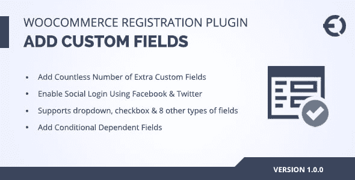
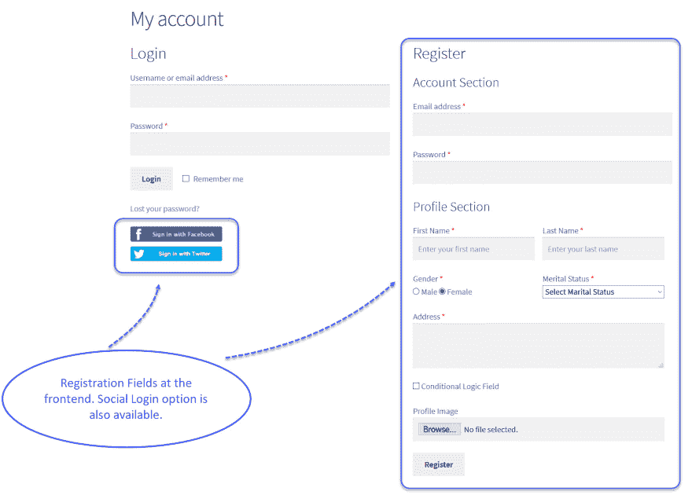
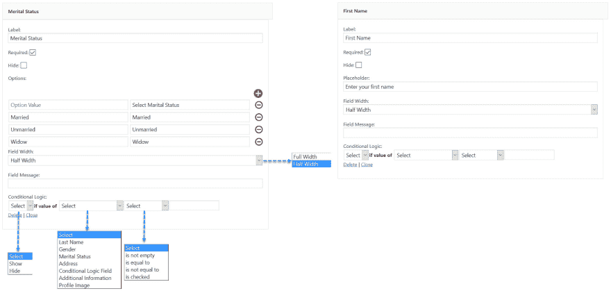
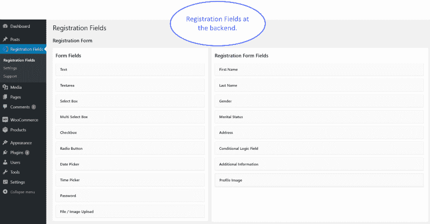
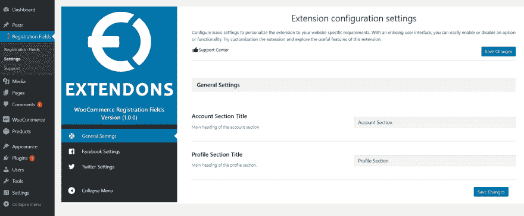

# WooCommerce 注册插件

> 原文：<https://dev.to/carolynhall123/woocommerce-registration-plugin-bl2>

[T2】](https://res.cloudinary.com/practicaldev/image/fetch/s--4k4sFrQd--/c_limit%2Cf_auto%2Cfl_progressive%2Cq_auto%2Cw_880/https://thepracticaldev.s3.amazonaws.com/i/f7rjo4ng0gypuoo47c57.png)

**WooCommerce 注册插件 by Extendons** 支持 10 种类型的注册字段来定制用户注册表单。您可以添加字段并自定义标签，以便注册的客户可以理解。 **[WooCommerce 注册插件](https://codecanyon.net/item/woocommerce-registration-plugin-add-custom-registration-fields/20515456)** 帮助您从客户那里获得额外的信息，用于营销目的，并与客户进行更多的个性化交流。还可以借助这个插件了解客户的好恶。这个插件的价格只有 39 美元，你也可以用这个插件免费获得社交登录扩展。
支持以下字段。
文本区
文本框
选择框
复选框
多选框
单选按钮
时间选择器
日期选择器
密码
文件或图像上传

**截图:**

