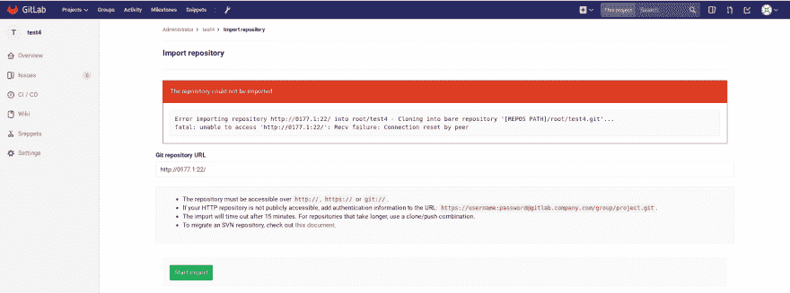
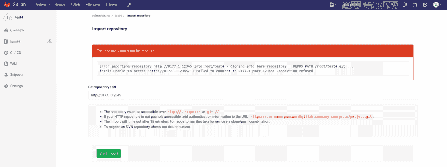
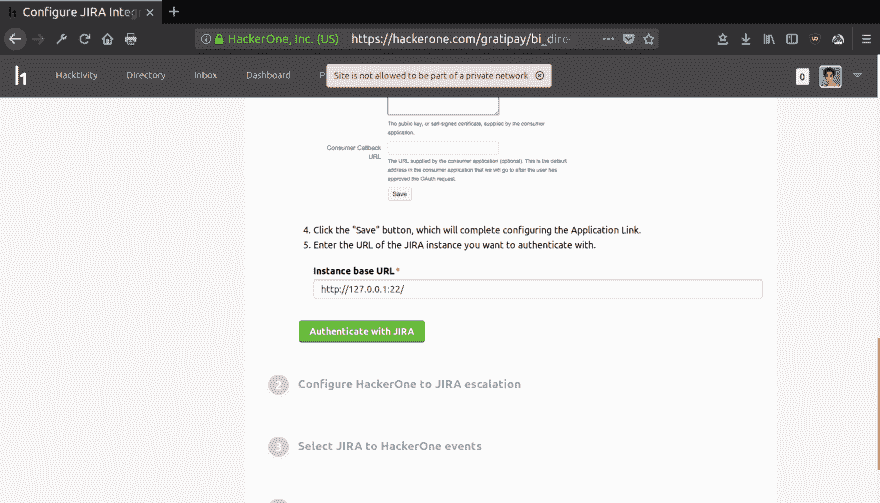
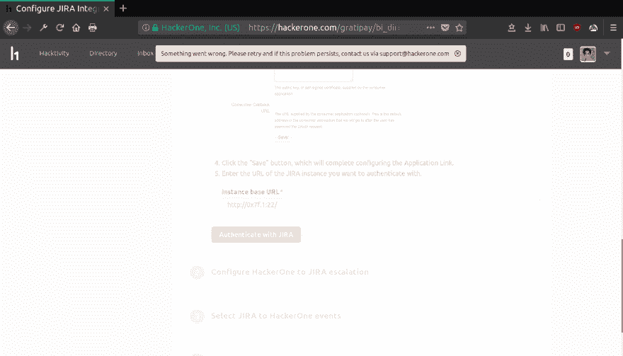

# 通过滥用 Ruby 原生解析器中的一个 bug 绕过服务器端请求伪造过滤器。

> 原文:[https://dev . to/edoverflow/bypassing-server-side-request-forge-filters-by-abuse-a-bug-in-rubys-native-resolver-1g0j](https://dev.to/edoverflow/bypassing-server-side-request-forgery-filters-by-abusing-a-bug-in-rubys-native-resolver--1g0j)

## 总结

这是我在`Resolv::getaddresses`中发现的一个漏洞的安全建议，这个漏洞使我能够绕过多个服务器端请求伪造过滤器。GitLab 和 HackerOne 等应用都受到了这个 bug 的影响。本公告中引用的所有报告的披露遵循 [HackerOne 的漏洞披露指南](https://www.hackerone.com/disclosure-guidelines)。

这个 bug 被分配 [CVE-2017-0904](http://www.cve.mitre.org/cgi-bin/cvename.cgi?name=2017-0904) 。

## 漏洞详情

依赖于操作系统，因此通过使用不同的 IP 格式可以返回空值。该漏洞可被滥用来绕过通常用于防范 SSRF 病毒的排除列表。

| 💻机器 1 | 💻机器 2 |
| --- | --- |
| ruby 2 . 3 . 3 p 222(2016-11-21)[x86 _ 64-Linux-GNU] | ruby 2 . 3 . 1 p 112(2016-04-26)[x86 _ 64-Linux-GNU] |

💻机器 1

```
irb(main):002:0> Resolv.getaddresses("127.0.0.1")
=> ["127.0.0.1"]
irb(main):003:0> Resolv.getaddresses("localhost")
=> ["127.0.0.1"]
irb(main):004:0> Resolv.getaddresses("127.000.000.1")
=> ["127.0.0.1"] 
```

<svg width="20px" height="20px" viewBox="0 0 24 24" class="highlight-action crayons-icon highlight-action--fullscreen-on"><title>Enter fullscreen mode</title></svg> <svg width="20px" height="20px" viewBox="0 0 24 24" class="highlight-action crayons-icon highlight-action--fullscreen-off"><title>Exit fullscreen mode</title></svg>

💻机器 2

```
irb(main):008:0> Resolv.getaddresses("127.0.0.1")
=> ["127.0.0.1"]
irb(main):009:0> Resolv.getaddresses("localhost")
=> ["127.0.0.1"]
irb(main):010:0> Resolv.getaddresses("127.000.000.1")
=> [] # 😱 
```

<svg width="20px" height="20px" viewBox="0 0 24 24" class="highlight-action crayons-icon highlight-action--fullscreen-on"><title>Enter fullscreen mode</title></svg> <svg width="20px" height="20px" viewBox="0 0 24 24" class="highlight-action crayons-icon highlight-action--fullscreen-off"><title>Exit fullscreen mode</title></svg>

这个问题在 Ruby 的最新稳定版本中重现:

```
$ ruby -v
ruby 2.4.3p201 (2017-10-11 revision 60168) [x86_64-linux]
$ irb
irb(main):001:0> require 'resolv'
=> true
irb(main):002:0> Resolv.getaddresses("127.000.001")
=> [] 
```

<svg width="20px" height="20px" viewBox="0 0 24 24" class="highlight-action crayons-icon highlight-action--fullscreen-on"><title>Enter fullscreen mode</title></svg> <svg width="20px" height="20px" viewBox="0 0 24 24" class="highlight-action crayons-icon highlight-action--fullscreen-off"><title>Exit fullscreen mode</title></svg>

## 概念证明

```
irb(main):001:0> require 'resolv'
=> true
irb(main):002:0> uri = "0x7f.1"
=> "0x7f.1"
irb(main):003:0> server_ips = Resolv.getaddresses(uri)
=> [] # The bug!
irb(main):004:0> blocked_ips = ["127.0.0.1", "::1", "0.0.0.0"]
=> ["127.0.0.1", "::1", "0.0.0.0"]
irb(main):005:0> (blocked_ips & server_ips).any?
=> false # Bypass 
```

<svg width="20px" height="20px" viewBox="0 0 24 24" class="highlight-action crayons-icon highlight-action--fullscreen-on"><title>Enter fullscreen mode</title></svg> <svg width="20px" height="20px" viewBox="0 0 24 24" class="highlight-action crayons-icon highlight-action--fullscreen-off"><title>Exit fullscreen mode</title></svg>

## 根本原因

下一节描述了这个错误的根本原因。我在代码片段中添加了一些注释，以帮助读者理解。

当我们在调试模式(`irb -d`)下运行 irb 时，会返回以下错误:

```
irb(main):002:0> Resolv.getaddresses "127.1"
Exception `Resolv::DNS::Config::NXDomain' at /usr/lib/ruby/2.3.0/resolv.rb:549 - 127.1
Exception `Resolv::DNS::Config::NXDomain' at /usr/lib/ruby/2.3.0/resolv.rb:549 - 127.1
=> [] 
```

<svg width="20px" height="20px" viewBox="0 0 24 24" class="highlight-action crayons-icon highlight-action--fullscreen-on"><title>Enter fullscreen mode</title></svg> <svg width="20px" height="20px" viewBox="0 0 24 24" class="highlight-action crayons-icon highlight-action--fullscreen-off"><title>Exit fullscreen mode</title></svg>

所以例外源于`fetch_resource()`<sup>[【1】](https://github.com/ruby/ruby/blob/e16bd0f4d81ef74035712853a5eb527f28abb342/lib/resolv.rb#L514-L554)</sup>。“NXDOMAIN”响应表示解析程序找不到相应的 PTR 记录。这并不奇怪，因为正如我们将在后面看到的，`resolv.rb`使用操作系统的解析器。

```
# Reverse DNS lookup on 💻 Machine 1.
$ nslookup 127.0.0.1
Server: 127.0.0.53
Address: 127.0.0.53#53

Non-authoritative answer:
1.0.0.127.in-addr.arpa name = localhost.

Authoritative answers can be found from:

$ nslookup 127.000.000.1
Server: 127.0.0.53
Address: 127.0.0.53#53

Non-authoritative answer:
Name: 127.000.000.1
Address: 127.0.0.1

# NXDOMAIN for 127.1.
$ nslookup 127.1
Server: 127.0.0.53
Address: 127.0.0.53#53

** server can't find 127.1: NXDOMAIN 
```

<svg width="20px" height="20px" viewBox="0 0 24 24" class="highlight-action crayons-icon highlight-action--fullscreen-on"><title>Enter fullscreen mode</title></svg> <svg width="20px" height="20px" viewBox="0 0 24 24" class="highlight-action crayons-icon highlight-action--fullscreen-off"><title>Exit fullscreen mode</title></svg>

现在，下面的代码片段演示了为什么`Resolv::getaddresses`依赖于操作系统。

`getaddresses`获取地址(`name`)并将其传递给`each_address`，在那里一旦被解析，它就被附加到`ret`数组中。

```
# File lib/resolv.rb, line 100
def getaddresses(name)
  # This is the "ret" array.
  ret = []
  # This is where "address" is appended to the "ret" array.
  each_address(name) {|address| ret << address}
  return ret
end 
```

<svg width="20px" height="20px" viewBox="0 0 24 24" class="highlight-action crayons-icon highlight-action--fullscreen-on"><title>Enter fullscreen mode</title></svg> <svg width="20px" height="20px" viewBox="0 0 24 24" class="highlight-action crayons-icon highlight-action--fullscreen-off"><title>Exit fullscreen mode</title></svg>

`each_address`通过`@resolvers`运行`name`。

```
# File lib/resolv.rb, line 109
def each_address(name)
    if AddressRegex =~ name
      yield name
      return
    end
    yielded = false
    # "name" is passed on to the resolver here.
    @resolvers.each {|r|
      r.each_address(name) {|address|
        yield address.to_s
        yielded = true
      }
      return if yielded
    }
end 
```

<svg width="20px" height="20px" viewBox="0 0 24 24" class="highlight-action crayons-icon highlight-action--fullscreen-on"><title>Enter fullscreen mode</title></svg> <svg width="20px" height="20px" viewBox="0 0 24 24" class="highlight-action crayons-icon highlight-action--fullscreen-off"><title>Exit fullscreen mode</title></svg>

`@resolvers`在`initialize()`中初始化。

```
# File lib/resolv.rb, line 109
def initialize(resolvers=[Hosts.new, DNS.new])
    @resolvers = resolvers
end 
```

<svg width="20px" height="20px" viewBox="0 0 24 24" class="highlight-action crayons-icon highlight-action--fullscreen-on"><title>Enter fullscreen mode</title></svg> <svg width="20px" height="20px" viewBox="0 0 24 24" class="highlight-action crayons-icon highlight-action--fullscreen-off"><title>Exit fullscreen mode</title></svg>

此外，`initialize`实际上是通过将`config_info`设置为`nil`来初始化的，在这种情况下`/etc/resolv.conf`使用默认配置。

```
# File lib/resolv.rb, line 308
# Set to /etc/resolv.conf ¯\_(ツ)_/¯
def initialize(config_info=nil)
  @mutex = Thread::Mutex.new
  @config = Config.new(config_info)
  @initialized = nil
end 
```

<svg width="20px" height="20px" viewBox="0 0 24 24" class="highlight-action crayons-icon highlight-action--fullscreen-on"><title>Enter fullscreen mode</title></svg> <svg width="20px" height="20px" viewBox="0 0 24 24" class="highlight-action crayons-icon highlight-action--fullscreen-off"><title>Exit fullscreen mode</title></svg>

以下是默认配置:

```
# File lib/resolv.rb, line 959
def Config.default_config_hash(filename="/etc/resolv.conf")
  if File.exist? filename
    config_hash = Config.parse_resolv_conf(filename)
  else
    if /mswin|cygwin|mingw|bccwin/ =~ RUBY_PLATFORM
      require 'win32/resolv'
      search, nameserver = Win32::Resolv.get_resolv_info
      config_hash = {}
      config_hash[:nameserver] = nameserver if nameserver
      config_hash[:search] = [search].flatten if search
    end
  end
  config_hash || {}
end 
```

<svg width="20px" height="20px" viewBox="0 0 24 24" class="highlight-action crayons-icon highlight-action--fullscreen-on"><title>Enter fullscreen mode</title></svg> <svg width="20px" height="20px" viewBox="0 0 24 24" class="highlight-action crayons-icon highlight-action--fullscreen-off"><title>Exit fullscreen mode</title></svg>

这表明`Resolv::getaddresses`是依赖于操作系统的，并且当提供了一个在反向 DNS 查找中失败的 IP 地址时，`getaddresses`返回一个空的`ret`数组。

## 缓解

我建议完全远离`Resolv::getaddresses`，使用`Socket`库。

```
irb(main):002:0> Resolv.getaddresses("127.1")
=> []
irb(main):003:0> Socket.getaddrinfo("127.1", nil).sample[3]
=> "127.0.0.1" 
```

<svg width="20px" height="20px" viewBox="0 0 24 24" class="highlight-action crayons-icon highlight-action--fullscreen-on"><title>Enter fullscreen mode</title></svg> <svg width="20px" height="20px" viewBox="0 0 24 24" class="highlight-action crayons-icon highlight-action--fullscreen-off"><title>Exit fullscreen mode</title></svg>

Ruby 核心开发团队建议使用相同的库。

> 检查地址的正确方法是使用操作系统的解析器，而不是 resolv.rb，如果地址是由操作系统的解析器解析的。比如可以使用 socket 库的 Addrinfo.getaddrinfo。
> 
> *   田中彰

```
% ruby -rsocket -e '
as = Addrinfo.getaddrinfo("192.168.0.1", nil)
p as
p as.map {|a| a.ipv4_private? }
'
[#<Addrinfo: 192.168.0.1 TCP>, #<Addrinfo: 192.168.0.1 UDP>, #<Addrinfo: 192.168.0.1 SOCK_RAW>]
[true, true, true] 
```

<svg width="20px" height="20px" viewBox="0 0 24 24" class="highlight-action crayons-icon highlight-action--fullscreen-on"><title>Enter fullscreen mode</title></svg> <svg width="20px" height="20px" viewBox="0 0 24 24" class="highlight-action crayons-icon highlight-action--fullscreen-off"><title>Exit fullscreen mode</title></svg>

## 受影响的应用和宝石

### GitLab 社区版和企业版

*链接报道:[https://hackerone.com/reports/215105](https://hackerone.com/reports/215105)T3】*

对[穆斯塔法哈桑](https://hackerone.com/strukt)的[报告](https://hackerone.com/reports/135937) ( [)的修复！17286](https://gitlab.com/gitlab-org/gitlab-ce/issues/17286) )很容易被滥用这个 bug 绕过。GitLab 引入了一个排除列表，但是会使用`Resolv::getaddresses`解析用户提供的地址，然后将输出与排除列表中的值进行比较。这意味着人们不能再使用某些地址，如`http://127.0.0.1`和`http://localhost/`，穆斯塔法·哈桑在最初的报告中使用过这些地址。旁路允许我扫描 GitLab 实例的内部网络。

[T2】](https://res.cloudinary.com/practicaldev/image/fetch/s--a7kqEogN--/c_limit%2Cf_auto%2Cfl_progressive%2Cq_auto%2Cw_880/https://user-images.githubusercontent.com/18099289/32322200-fed2e176-bfc3-11e7-8bc1-e2dc241abf6b.png)

[T2】](https://res.cloudinary.com/practicaldev/image/fetch/s--ecbEGaN7--/c_limit%2Cf_auto%2Cfl_progressive%2Cq_auto%2Cw_880/https://user-images.githubusercontent.com/18099289/32322478-ec02630e-bfc4-11e7-9d76-d481d27db8f3.png)

GitLab 已经提供了补丁:[https://about . git lab . com/2017/11/08/git lab-10-dot-1-dot-2-security-release/](https://about.gitlab.com/2017/11/08/gitlab-10-dot-1-dot-2-security-release/)。

### [私人 _ 地址 _ 支票](https://github.com/jtdowney/private_address_check)作者[约翰·唐尼](https://twitter.com/jtdowney)

*链接报道:[https://github.com/jtdowney/private_address_check/issues/1](https://github.com/jtdowney/private_address_check/issues/1)T3】*

[private_address_check](https://github.com/jtdowney/private_address_check) 是一种红宝石，有助于预防 SSRF。实际的过滤发生在`lib/private_address_check.rb`中。该过程首先尝试用`Resolv::getaddresses`解析用户提供的 URL，然后将返回值与黑名单中的值进行比较。我又一次能够使用与之前 GitLab 相同的技术来绕过这个滤波器。

```
# File lib/private_address_check.rb, line 32
def resolves_to_private_address?(hostname)
  ips = Resolv.getaddresses(hostname)
  ips.any? do |ip| 
    private_address?(ip)
  end
end 
```

<svg width="20px" height="20px" viewBox="0 0 24 24" class="highlight-action crayons-icon highlight-action--fullscreen-on"><title>Enter fullscreen mode</title></svg> <svg width="20px" height="20px" viewBox="0 0 24 24" class="highlight-action crayons-icon highlight-action--fullscreen-off"><title>Exit fullscreen mode</title></svg>

因此， [HackerOne 受到了这个旁路](https://hackerone.com/reports/287245)的影响，因为他们使用 *private_address_check* 宝石来阻止“集成”面板上的 SSRF:`https://hackerone.com/{BBP}/integrations`。

[T2】](https://res.cloudinary.com/practicaldev/image/fetch/s--WQg-2k6N--/c_limit%2Cf_auto%2Cfl_progressive%2Cq_auto%2Cw_880/https://user-images.githubusercontent.com/18099289/32408319-5f50eb78-c196-11e7-8aee-c6ffd572597f.png)

[T2】](https://res.cloudinary.com/practicaldev/image/fetch/s--ayuwo9UW--/c_limit%2Cf_auto%2Cfl_progressive%2Cq_auto%2Cw_880/https://user-images.githubusercontent.com/18099289/32408337-7bcdd874-c196-11e7-9fcc-1de5283bd7b0.png)

不幸的是，我无法利用这个 SSRF，因此，这个问题只包括一个过滤器旁路。HackerOne 仍然鼓励我报告它，因为他们会考虑任何潜在的安全问题，而这种绕过证明了潜在的风险。

此问题已在[0 . 4 . 0 版](https://github.com/jtdowney/private_address_check/commit/58a0d7fe31de339c0117160567a5b33ad82b46af)中得到修补。

## 未受影响的应用和宝石

### [ssrf _ filter](https://github.com/arkadiyt/ssrf_filter)by[arka DIY Tetelman](https://twitter.com/arkadiyt)

这个 gem 不容易受到攻击，因为它检查返回值是否为空。

```
# File lib/ssrf_filter/ssrf_filter.rb, line 116
raise UnresolvedHostname, "Could not resolve hostname '#{hostname}'" if ip_addresses.empty?

irb(main):001:0> require 'ssrf_filter'
=> true
irb(main):002:0> SsrfFilter.get("http://127.1/")
SsrfFilter::UnresolvedHostname: Could not resolve hostname '127.1'
  from /var/lib/gems/2.3.0/gems/ssrf_filter-1.0.2/lib/ssrf_filter/ssrf_filter.rb:116:in `block (3 levels) in <class:SsrfFilter>'
  from /var/lib/gems/2.3.0/gems/ssrf_filter-1.0.2/lib/ssrf_filter/ssrf_filter.rb:107:in `times'
  from /var/lib/gems/2.3.0/gems/ssrf_filter-1.0.2/lib/ssrf_filter/ssrf_filter.rb:107:in `block (2 levels) in <class:SsrfFilter>'
  from (irb):2
  from /usr/bin/irb:11:in `<main>' 
```

<svg width="20px" height="20px" viewBox="0 0 24 24" class="highlight-action crayons-icon highlight-action--fullscreen-on"><title>Enter fullscreen mode</title></svg> <svg width="20px" height="20px" viewBox="0 0 24 24" class="highlight-action crayons-icon highlight-action--fullscreen-off"><title>Exit fullscreen mode</title></svg>

### [法拉第限制 ip 地址](https://rubygems.org/gems/faraday-restrict-ip-addresses/versions/0.1.1)作者[本·拉文德](https://github.com/bhuga)

这个 gem 使用了 Ruby 代码开发团队推荐的`Addrinfo.getaddrinfo`。

```
# File lib/faraday/restrict_ip_addresses.rb, line 61
def addresses(hostname)
      Addrinfo.getaddrinfo(hostname, nil, :UNSPEC, :STREAM).map { |a| IPAddr.new(a.ip_address) }
    rescue SocketError => e
      # In case of invalid hostname, return an empty list of addresses
      []
end 
```

<svg width="20px" height="20px" viewBox="0 0 24 24" class="highlight-action crayons-icon highlight-action--fullscreen-on"><title>Enter fullscreen mode</title></svg> <svg width="20px" height="20px" viewBox="0 0 24 24" class="highlight-action crayons-icon highlight-action--fullscreen-off"><title>Exit fullscreen mode</title></svg>

## 结论

作者要感谢在发现漏洞期间[汤姆·哈德森](https://twitter.com/TomNomNom)和[亚辛·索利曼](https://twitter.com/SecurityYasin)提供的帮助。

约翰·唐尼和 T2·阿卡迪·泰特尔曼反应都非常迅速。约翰唐尼能够立即提供一个补丁，和 Arkadiy Tetelman 帮助我找出为什么他们的宝石没有受到影响的问题。

* * *

更新(2017 年 11 月 10 日，星期五):我扩展了“根本原因”部分，以便更好地解释实际问题。