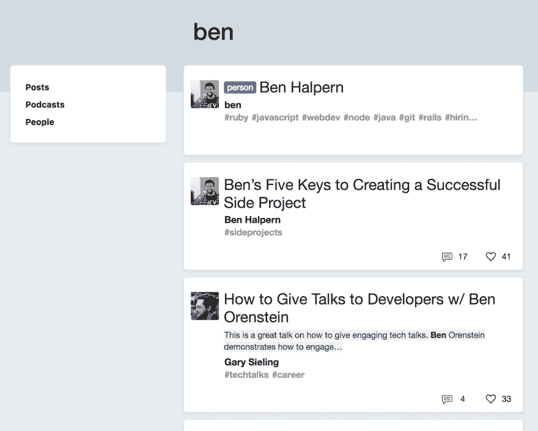

# 变更日志:新的搜索过滤器

> 原文:[https://dev.to/ben/changelog-new-search-filters-25n](https://dev.to/ben/changelog-new-search-filters-25n)

当我们推动影响用户体验的改变时，我们有了制作简短的“变更日志”类帖子的想法。这是第一个。

您现在可以搜索*个人*并过滤您的搜索结果。它还没有想象中的所有功能*，我们还没有谷歌级别的搜索质量*，但这里有很多价值。我个人经常使用我们的内部搜索*，所以我有动力去改进它。***

 ***[T2】](https://res.cloudinary.com/practicaldev/image/fetch/s--vYbhniZP--/c_limit%2Cf_auto%2Cfl_progressive%2Cq_auto%2Cw_880/https://thepracticaldev.s3.amazonaws.com/i/j66910mwrceur2rdot9m.png)

如您所见，默认视图显示了多种结果类型。

如果我在寻找一些小技巧，我可能会搜索这个术语，并很快得到一些答案。

[T2】](https://res.cloudinary.com/practicaldev/image/fetch/s--uazNJqqf--/c_limit%2Cf_auto%2Cfl_progressive%2Cq_auto%2Cw_880/https://thepracticaldev.s3.amazonaws.com/i/z6r5wl2adi4xq6li6oon.png)

如果我想深入相关的讨论，我可能会跳到播客标签。

[T2】](https://res.cloudinary.com/practicaldev/image/fetch/s--xEtj6tIP--/c_limit%2Cf_auto%2Cfl_progressive%2Cq_auto%2Cw_880/https://thepracticaldev.s3.amazonaws.com/i/us5ywo6jkfi3t2lhaxo3.png)

过滤器还没有出现在手机上，但我们很快会添加侧边栏功能，类似于现在手机主页上的功能。我希望你喜欢它。现在是`v0`，但是今天的搜索比昨天好。***