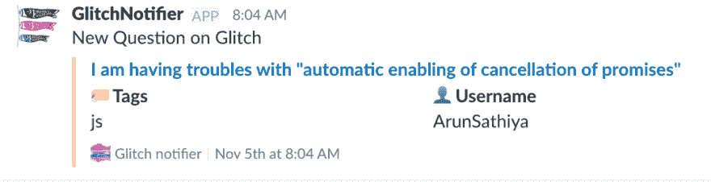

# 通过在 Glitch 问题上帮助他人来提高编程水平

> 原文：<https://dev.to/picsoung/get-better-at-programming-by-helping-others-on-glitch-1b4>

大约 15 年前开始学习编程。在一个没有 Github 和学习资源非常有限的时代。我早期的很多知识都是通过模仿现有网站获得的。我会检查他们的源代码，将其中的一部分复制粘贴到我的代码上，并通过修改来理解它在做什么。

经过几年的实践，我有了足够的基础知识来帮助其他初学者解决公告栏上的问题。这是一个回报社区的好方法，当我开始的时候，社区欢迎我。我真的很享受这份工作，因为我可以站在别人的角度，理解他们的问题，并帮助他们解决问题。当你重新强化你的编码知识时，这会教会你教育学和移情。
*现在想来，那些早期的日子可能是我的开发者倡导者职业生涯ðÿ˜‡的基础*

## 贡献和回馈ðÿðÿ——

当你刚开始学习一项技术时，回报给社区可能真的很吓人。在 Github 上提交第一个 Pull 请求并不容易。或者回答你第一个关于栈溢出的问题。人们创造了像 [YourFirstPR](https://twitter.com/yourfirstpr) 或 [Hacktoberfest](https://hacktoberfest.digitalocean.com) 这样的倡议来降低进入门槛，让公关不那么可怕。

我觉得有了像 [Glitch](https://glitch.com) 这样的工具，贡献和回馈变得容易多了。
我已经在之前的[帖子](https://hackernoon.com/is-glitch-developer-advocates-best-friend-b91af5b57656)中提到过故障，特别是从开发者倡导者的角度。使用*混音*功能，你可以克隆一个项目，并添加你自己的酱料。如果你遇到困难，你可以点击*帮助*按钮向社区寻求帮助。

如果你有兴趣帮助他人，你可以经常查看 Glitch 主页，看看人们是否需要帮助。你可以加入人们的项目，提供帮助，并开始指导他们找到解决方案。最后，他们会在你的个人资料上加一个ðÿ'–来感谢你。

但是问题仍然很少，而且会随机出现，所以您可能无法满足社区协作的愿望。

我想更多地参与进来，所以我创建了一个小工具，每当有人提问时，我都会收到通知。

满足:[故障通知器](https://glitch-notifier.glitch.me/)。

[T2】](https://glitch-notifier.glitch.me/)

我是 Slack 的重度用户，所以很自然地，我想在 Slack 上直接得到通知。

[T2】](https://res.cloudinary.com/practicaldev/image/fetch/s--1upEG5LU--/c_limit%2Cf_auto%2Cfl_progressive%2Cq_auto%2Cw_880/https://thepracticaldev.s3.amazonaws.com/i/eer5ant6bz2rnsrjwvmy.png)

[故障通知程序](https://glitch-notifier.glitch.me/)开放给社区使用。您登录 Slack，选择您想要关注的标签，并将通知应用程序添加到您的 Slack 团队。然后，只要有问题符合您的标准，您就会收到通知。

你可以通过[再混合](https://glitch.com/~glitch-notifier)它来为这个项目做贡献。

我已经测试这个工具几个星期了。我帮助了大约 10 个人，接待了 8 次ðÿ'–。在一个月内，大约有 100 个问题被问到，涉及各种各样的话题。我记得曾帮助某人设置他们的环境变量，或者帮助某人在 Messenger 中构建聊天机器人...

无论你的经验或技能如何，你都能够帮助社区中的某个人！

如果你有兴趣了解它是如何建成的，请继续阅读ðÿ˜‰

## 是怎么建成的？ðŸ' ðŸ›

像过去一样，查看 page 的源代码可以获得很多信息。这就是我如何发现 Glitch 有一个未记录的 API。

到目前为止，我已经找到了 3 个端点:

*   得到[https://api.glitch.com/projects](https://api.glitch.com/projects)列表项目
*   获取[https://api.glitch.com/users](https://api.glitch.com/users)列表用户
*   获取[https://api.glitch.com/projects/questions](https://api.glitch.com/projects/questions)列表当前未解决的问题

最后一个端点是我们感兴趣的。它返回一个问题数组，或者当没有问题时返回一个空数组。

为了定期(每分钟)检查这个端点上是否有未解决的问题，我使用[无服务器](https://serverless.com)设置了一个小的 Lambda 函数( [github repo](https://github.com/picsoung/lambda-glitch-monitoring) )。

如果有问题，我会将它们发送到 Glitch 应用程序上的特定端点(`/questions/hook`)。

在那里，我们将检查我们的数据库中是否已经有这个问题。我们使用 [FaunaDB](https://faunadb.com) ，作为我们的云数据库。

如果问题还不在我们的数据库中，我们应该通知我们的用户。

在我们的数据库上做一个地图请求，我们发现哪些用户在关注这个问题的标签，我们在 Slack 上通知他们。

下面是相应的代码

```
var notifyPeople = function(question) {
  var users_in_db = client.query(
              q.Paginate(
              q.Union(
                q.Map(question.details.tags,
                  function(tag) {
                    return q.Match(q.Index("user_by_tag"), tag)
                  }))));

    users_in_db.then(function(result){ // request match results
       var usersRef = result.data
       usersRef.forEach(function(userRef){
         var user = client.query(q.Get(userRef));
         user.then(function(u){
           slack.sendQuestionToSlack(u.data.incoming_webhook.url, question)
         })
       })
    }).catch(function(err){ // does not exist
      console.log("err", err)
    }) 
```

Enter fullscreen mode Exit fullscreen mode

为了在空闲时通知人们，我们使用了一个传入的 webhook 集成，并做了一些格式化，这样看起来更好。

导致松弛信道:

[T2】](https://res.cloudinary.com/practicaldev/image/fetch/s--1upEG5LU--/c_limit%2Cf_auto%2Cfl_progressive%2Cq_auto%2Cw_880/https://thepracticaldev.s3.amazonaws.com/i/eer5ant6bz2rnsrjwvmy.png)

希望你喜欢它，让我知道你是否有任何问题或意见。

*Unsplash 上[tefan tefan AK](https://unsplash.com/@cikstefan)的照片*