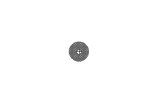
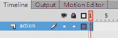
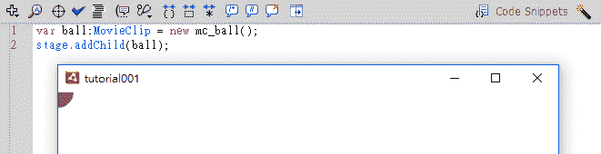
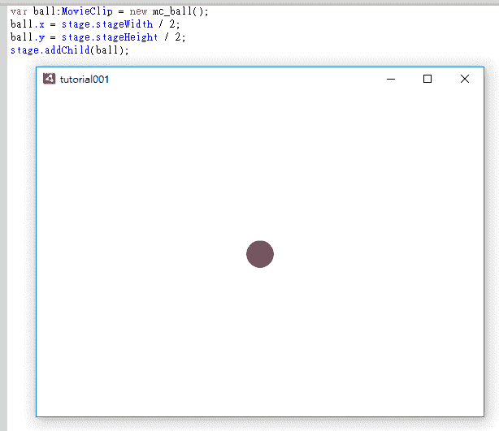
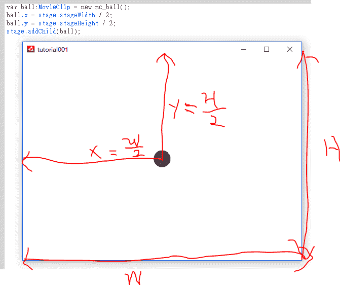

# 学习如何轻松编写程序！-教程 1

> 原文：<https://dev.to/supercatex/learn-how-to-write-program-easily---tutorial-1-5kc>

### 为什么是 ActionScript？

这种编程语言对于想学习有趣的程序逻辑的初学者来说很好。ActionScript 是我的第一门编程语言，是我自学的。我认为处理图形和动画是容易的，让我们把注意力集中在主要的程序逻辑上。

**第一步——创建一个新的 MovieClip**
MovieClip 是一个对象。它应该是一个简单的图形或动画。在本教程中，我们将在电影剪辑上画一个圆，并使用程序在屏幕上添加电影剪辑。我们开始吧！

1.  按 Ctrl-F8 组合键创建新的电影剪辑
2.  填名字:“mc_ball”
3.  点击“高级”
4.  单击“为 ActionScript 导出”
5.  点击“确定”按钮
6.  画一个圆

**第二步——通过编程将电影剪辑放到屏幕上**

1.  返回主屏幕
2.  选择第一帧
3.  按 F9 打开“操作”窗口
4.  编码

```
var ball:MovieClip = new mc_ball();
stage.addChild(ball); 
```

Enter fullscreen mode Exit fullscreen mode

**第三步——让我们查看结果**
按 Ctrl——回车
[](https://res.cloudinary.com/practicaldev/image/fetch/s--ygy_1XhO--/c_limit%2Cf_auto%2Cfl_progressive%2Cq_auto%2Cw_880/https://thepracticaldev.s3.amazonaws.com/i/9tm2pl2hjroj5wnrlxqp.PNG)

### 了解更多编程知识！

```
var ball:MovieClip = new mc_ball();

/*
Do you remember "mc_ball"? This is the name of MovieClip which we created at the step one.

"Export for ActionScript" is very important. 
It cannot use this MovieClip in the programming if you skip this step.

The whole line means create a new MovieClip "mc_ball" and named it "ball" to use in the program.
*/ 
```

Enter fullscreen mode Exit fullscreen mode

```
stage.addChild(ball);

/*
Put "ball" on the screen.

"stage" is a key word represent the root of the screen.
*/ 
```

Enter fullscreen mode Exit fullscreen mode

**让球在屏幕中央。**

```
var ball:MovieClip = new mc_ball();
ball.x = stage.stageWidth / 2;
ball.y = stage.stageHeight / 2;
stage.addChild(ball);

/*
We can control the "ball" and set x-axis, y-axis to change it's position.

"stage.stageWidth" means screen width.
"stage.stageHeight" means screen height. 
*/ 
```

Enter fullscreen mode Exit fullscreen mode

[T2】](https://res.cloudinary.com/practicaldev/image/fetch/s--I62k5N8B--/c_limit%2Cf_auto%2Cfl_progressive%2Cq_auto%2Cw_880/https://thepracticaldev.s3.amazonaws.com/i/2xyndmiolmiw1nz9qq08.PNG)

**数学**
x 轴中心等于载物台宽度的一半。
y 轴中心等于载物台高度的一半。
[](https://res.cloudinary.com/practicaldev/image/fetch/s--dAj3ZiEE--/c_limit%2Cf_auto%2Cfl_progressive%2Cq_auto%2Cw_880/https://thepracticaldev.s3.amazonaws.com/i/1dwg36ozkthh9qyhdmdc.PNG)

谢谢~