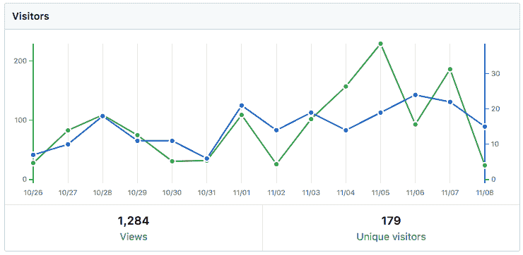
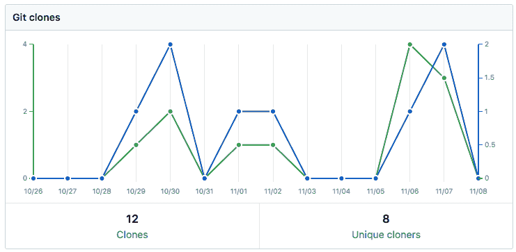
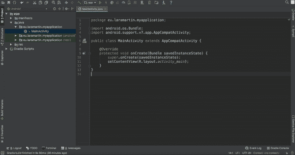
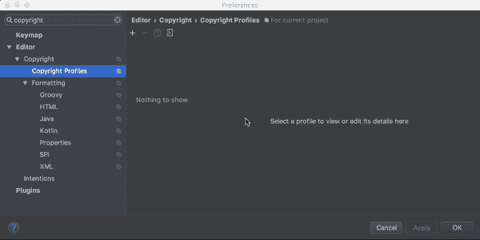

# 为什么我向我的 Udacity 项目添加许可证

> 原文:[https://dev . to/lariki/why-I-added-licenses-to-my-uda city-projects-58](https://dev.to/lariki/why-i-added-licenses-to-my-udacity-projects-58)

我用 GitHub 托管我的库，包括我为 Udacity Android Nanodegrees 做的所有项目。这有助于我组织它们，在未来检查我是如何执行事情的，最重要的是**个人可见性**。

我用 GitHub 作为我的 Android 作品集。在每个存储库中，我都添加了一个自述文件，描述这个项目，它包含的 Android 好东西，还添加了一些最终应用程序的截图。

## 问题

我拥有的最受欢迎的回购之一是我为 Udacity 的 Android 基础 Nanodegree 做的一个项目，该项目包括构建一个[库存应用](https://github.com/laramartin/android_inventory)。这个项目需要使用本地 SQLite 数据库、光标、列表视图和一些权限创建一个简单的应用程序。

自从我把它上传到 GitHub 后，它开始频繁地被分叉(甚至得到了一些星星！â ).我意识到，大多数叉它的人，后来删除了它。这意味着这可能不是他们所期望的，对吗？嗯，我注意到有些人叉了一下，后来删除了我的名字，上传了我的同一个项目(有时甚至没有改名字！)进行新的回购。这与将 repo 下载到您的本地机器并上传到您的 GitHub 是一样的，**删除所有 g it 历史和我的作者身份的任何痕迹**。

> [……]有些人叉了一下，后来删除了我的名字，在一个新的回购上上传了我的同一个项目[……]。

此时，我对这个事实感到好奇，并开始定期检查我的存储库的流量。不幸的是，GitHub 只显示过去 14 天的分析，但据我所知，平均每两周有 150 个独立访客。对于这样的项目来说，我觉得太多了！

然而，我不仅有访客，还有克隆人。平均每两周克隆 5 次。

[](https://res.cloudinary.com/practicaldev/image/fetch/s--ksfGCMCn--/c_limit%2Cf_auto%2Cfl_progressive%2Cq_auto%2Cw_880/https://thepracticaldev.s3.amazonaws.com/i/xdotkqtmrt5odqxmcwk3.png)
[T6】](https://res.cloudinary.com/practicaldev/image/fetch/s--XH0UGve---/c_limit%2Cf_auto%2Cfl_progressive%2Cq_auto%2Cw_880/https://thepracticaldev.s3.amazonaws.com/i/w2d01v3soonu0a8l5ee3.png)

当人们只是复制粘贴所有项目内容或只是更改我的名字以提交给 Udacity 作为自己的作品时，真正的问题就来了。当你注册 Udacity 纳米学位时，你必须同意 Udacity 荣誉代码**，这表明你正在提交自己的作品。因此，打破这一点可能会导致你被驱逐出一个程序，没有退款。**

 **## 那么，为什么要在 Udacity 项目中使用 GitHub 呢？

首先， **Udacity 鼓励你将你的项目上传到 GitHub** ，因为这将帮助你建立你的作品集。在我考 Android Nanodegrees 的时候，Udacity 建议用 GitHub，也参考了他们的课程[“如何使用 Git 和 GitHub”](https://www.udacity.com/course/how-to-use-git-and-github--ud775)。提交项目有两种方式，要么链接 GitHub 库，要么上传 ZIP 文件。

其次，将我的 Udacity 项目上传到 GitHub 是我的作品集，**给了我潜在雇主的可见性**。如果你用谷歌搜索“Udacity 库存应用”,你可能会看到我的项目是第一批结果之一。

此外**它帮助学生**:有一个指导帮助他们摆脱困境。我怎么知道？我收到一些学生的留言，感谢我的回复，因为他们帮助了他们。只有几个，但它总是让我开心！ðŸ˜

> 今天有人写信给我，感谢我在 Android Nanodegree 上的 GitHub 项目。让我很开心！pic.twitter.com/VImYK2PaXq 的ðÿ˜
> 
> — Lara Martín ([@lariki](https://dev.to/lariki) ) [July 27, 2017](https://twitter.com/lariki/status/890557312766758912?ref_src=twsrc%5Etfw)

## 许可证

因为我想公开这些转发来展示我的作品，并潜在地帮助其他人，我发现添加许可证可以帮助警告剽窃问题。

我添加的许可证是 MIT 许可证加上一些关于 Udacity 荣誉代码的个人文字:

```
PROJECT LICENSE

This project was submitted by Lara Martín as part of the Nanodegree At Udacity.

As part of Udacity Honor code, your submissions must be your own work, hence
submitting this project as yours will cause you to break the Udacity Honor Code
and the suspension of your account.

Me, the author of the project, allow you to check the code as a reference, but if
you submit it, it's your own responsibility if you get expelled.

Copyright (c) 2017 Lara Martín

Besides the above notice, the following license applies and this license notice
must be included in all works derived from this project.

MIT License

Permission is hereby granted, free of charge, to any person obtaining a copy
of this software and associated documentation files (the "Software"), to deal
in the Software without restriction, including without limitation the rights
to use, copy, modify, merge, publish, distribute, sublicense, and/or sell
copies of the Software, and to permit persons to whom the Software is
furnished to do so, subject to the following conditions:
[...] 
```

[https://gist . github . com/laramartin/7796d 730 BBA 8 cf 689 f 628d 9 b 011 e 91d 8](https://gist.github.com/laramartin/7796d730bba8cf689f628d9b011e91d8)

我将此许可证添加到自述文件和所有项目文件中。谢天谢地 Android Studio 帮了你，让我解释一下如何实现这一点。

## 使用 Android Studio 向所有文件添加许可证

要将许可证添加到您的项目中，首先您需要创建一个带有文本的模板。进入*偏好设置- >编辑- >版权- >版权简介*。在这里添加一个新的配置文件，给它一个名字，并粘贴您的许可证。

[T2】](https://res.cloudinary.com/practicaldev/image/fetch/s--0zwdyn1d--/c_limit%2Cf_auto%2Cfl_progressive%2Cq_66%2Cw_880/https://thepracticaldev.s3.amazonaws.com/i/372bik6706qs1rtegsi6.gif)

一旦您有了想要使用的版权配置文件，您可以将其添加到您想要的特定文件或所有文件中:

1.  将其添加为您的默认项目版权:*首选项- >编辑器- >版权- >选择想要的版权文件*
2.  更新版权:*选择要添加许可证的文件- >右键- >更新版权*。在单个文件中添加版权时也有一个快捷方式，在 mac 中使用`cmd + N`或者在 Windows 中使用`Alt + Insert`即可。

[T2】](https://res.cloudinary.com/practicaldev/image/fetch/s--e2nwM-Bu--/c_limit%2Cf_auto%2Cfl_progressive%2Cq_66%2Cw_880/https://thepracticaldev.s3.amazonaws.com/i/xhdm3i3i8bf83qn1gzzp.gif)

第一

现在有了这些许可证，我觉得我已经足够警告学生们剽窃的危险了。尽管如此，我希望我的回复能帮助你在学习上取得进步！ðŸ'š

[最初发布于我的媒体博客。](https://medium.com/@laramartin/why-i-added-licenses-to-my-udacity-projects-3070f602006e)**