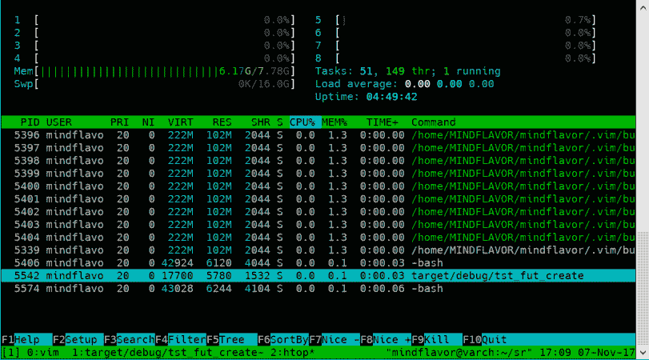
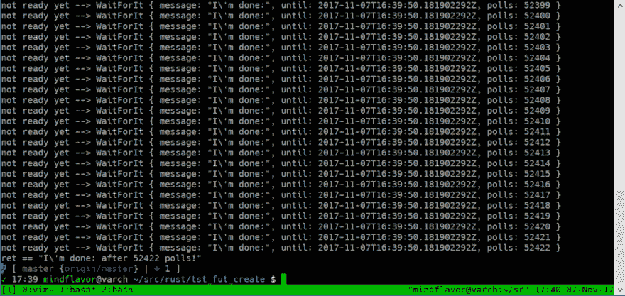
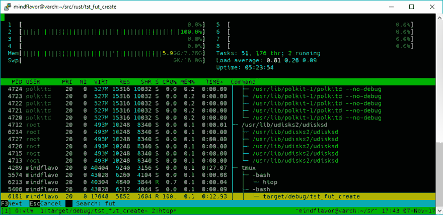
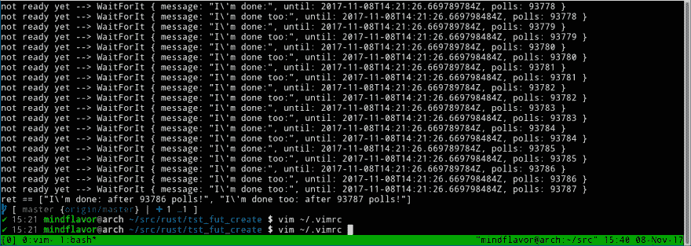

# 生锈的未来:一个未受教育的，简短的，希望不无聊的教程-第 3 部分-反应堆

> 原文:[https://dev . to/mind flavor/rust-futures-an-uneuced-short-and-hope-not-boring-tutorial-part-3-the-reactor-433](https://dev.to/mindflavor/rust-futures-an-uneducated-short-and-hopefully-not-boring-tutorial---part-3---the-reactor-433)

## [T1】简介](#intro)

在这篇文章中，我们将尝试解释反应堆是如何工作的。在以前的文章中，我们广泛使用它来执行我们的期货，但我们把它当作一个黑箱。是时候阐明这一点了！

### 反应堆？循环？

简而言之，反应堆是一个回路。为了解释它，我想打个比方是合适的。假设你用电子邮件邀请一个女孩/男孩去约会(是的，我知道，这很老套)。你*期待*一个答复，所以你检查你的电子邮件。检查你的电子邮件。检查你的电子邮件。直到最后，你得到答案。

Rust 的反应堆就是这样。你给它一个未来，它一遍又一遍地检查它的状态，直到完成(或出错)。它调用一个名为`poll`的函数。由实现者来编写`poll`函数。你所要做的就是返回一个`Poll<T,E>`结构(更多细节见[投票文档](http://alexcrichton.com/futures-rs/futures/type.Poll.html))。实际上，反应器不会无休止地轮询你的函数，但是，现在，让我们在这里停下来，从一个例子开始。

### 一个从零开始的未来

为了测试我们的反应堆知识，我们将从头实现一个`future`。换句话说，我们将手动实现`Future`特征。我们将实现现有的最简单的未来:一个在特定的时间到来之前不会返回的未来。

我们将调用我们的结构`WaitForIt` :

```
#[derive(Debug)]
struct WaitForIt {
    message: String,
    until: DateTime<Utc>,
    polls: u64,
} 
```

<svg width="20px" height="20px" viewBox="0 0 24 24" class="highlight-action crayons-icon highlight-action--fullscreen-on"><title>Enter fullscreen mode</title></svg> <svg width="20px" height="20px" viewBox="0 0 24 24" class="highlight-action crayons-icon highlight-action--fullscreen-off"><title>Exit fullscreen mode</title></svg>

我们的结构将保存要等待的时间、自定义字符串消息以及它被轮询的次数。为了帮助清理我们的代码，我们也将实现`new`函数:

```
impl WaitForIt {
    pub fn new(message: String, delay: Duration) -> WaitForIt {
        WaitForIt {
            polls: 0,
            message: message,
            until: Utc::now() + delay,
        }
    }
} 
```

<svg width="20px" height="20px" viewBox="0 0 24 24" class="highlight-action crayons-icon highlight-action--fullscreen-on"><title>Enter fullscreen mode</title></svg> <svg width="20px" height="20px" viewBox="0 0 24 24" class="highlight-action crayons-icon highlight-action--fullscreen-off"><title>Exit fullscreen mode</title></svg>

`new`函数将创建并初始化一个`WaitForIt`实例。

现在我们将实现`Future`特征。我们需要做的就是提供`poll`方法:

```
impl Future for WaitForIt {
    type Item = String;
    type Error = Box<Error>;

    fn poll(&mut self) -> Poll<Self::Item, Self::Error> {
        let now = Utc::now();
        if self.until < now {
            Ok(Async::Ready(
                format!("{} after {} polls!", self.message, self.polls),
            ))
        } else {
            self.polls += 1;

            println!("not ready yet --> {:?}", self);
            Ok(Async::NotReady)
        }
    }
} 
```

<svg width="20px" height="20px" viewBox="0 0 24 24" class="highlight-action crayons-icon highlight-action--fullscreen-on"><title>Enter fullscreen mode</title></svg> <svg width="20px" height="20px" viewBox="0 0 24 24" class="highlight-action crayons-icon highlight-action--fullscreen-off"><title>Exit fullscreen mode</title></svg>

让我们一步一步来。这些尴尬的台词:

```
 type Item = String;
    type Error = Box<Error>; 
```

<svg width="20px" height="20px" viewBox="0 0 24 24" class="highlight-action crayons-icon highlight-action--fullscreen-on"><title>Enter fullscreen mode</title></svg> <svg width="20px" height="20px" viewBox="0 0 24 24" class="highlight-action crayons-icon highlight-action--fullscreen-off"><title>Exit fullscreen mode</title></svg>

被称为[的关联类型](https://doc.rust-lang.org/book/first-edition/associated-types.html)。它们意在表明未来在完成(或出错)后会有什么回报。所以我们说:我们的意志未来将分解成`String`或`Box<Error>`。
这一行:

```
 fn poll(&mut self) -> Poll<Self::Item, Self::Error> { 
```

<svg width="20px" height="20px" viewBox="0 0 24 24" class="highlight-action crayons-icon highlight-action--fullscreen-on"><title>Enter fullscreen mode</title></svg> <svg width="20px" height="20px" viewBox="0 0 24 24" class="highlight-action crayons-icon highlight-action--fullscreen-off"><title>Exit fullscreen mode</title></svg>

定义`poll`功能。`Self::Item`和`Self::Error`部分是先前指定的相关类型的占位符。在我们的例子中，方法读作:`fn poll(&mut self) -> Poll<String, Box<Error>>`。

现在我们的逻辑将是:

```
let now = Utc::now();
 if self.until < now {
   // Tell reactor we are ready!
 } else {
   // Tell reactor we are not ready! Come back later!
 } 
```

<svg width="20px" height="20px" viewBox="0 0 24 24" class="highlight-action crayons-icon highlight-action--fullscreen-on"><title>Enter fullscreen mode</title></svg> <svg width="20px" height="20px" viewBox="0 0 24 24" class="highlight-action crayons-icon highlight-action--fullscreen-off"><title>Exit fullscreen mode</title></svg>

我们怎么能告诉反应堆我们还没完成呢？我们用`Async::NotReady`枚举返回`Ok`。如果我们完成了，我们返回`Ok`和`Async::Ready(T)`。所以我们的函数变成:

```
impl Future for WaitForIt {
    type Item = String;
    type Error = Box<Error>;

    fn poll(&mut self) -> Poll<Self::Item, Self::Error> {
        let now = Utc::now();
        if self.until < now {
            Ok(Async::Ready(
                format!("{} after {} polls!", self.message, self.polls),
            ))
        } else {
            self.polls += 1;

            println!("not ready yet --> {:?}", self);
            Ok(Async::NotReady)
        }
    }
} 
```

<svg width="20px" height="20px" viewBox="0 0 24 24" class="highlight-action crayons-icon highlight-action--fullscreen-on"><title>Enter fullscreen mode</title></svg> <svg width="20px" height="20px" viewBox="0 0 24 24" class="highlight-action crayons-icon highlight-action--fullscreen-off"><title>Exit fullscreen mode</title></svg>

为了运行我们的未来，我们必须在`main`中创建一个`reactor`，并要求它`run`我们未来的实现结构。

```
fn main() {
    let mut reactor = Core::new().unwrap();

    let wfi_1 = WaitForIt::new("I'm done:".to_owned(), Duration::seconds(1));
    println!("wfi_1 == {:?}", wfi_1);

    let ret = reactor.run(wfi_1).unwrap();
    println!("ret == {:?}", ret);
} 
```

<svg width="20px" height="20px" viewBox="0 0 24 24" class="highlight-action crayons-icon highlight-action--fullscreen-on"><title>Enter fullscreen mode</title></svg> <svg width="20px" height="20px" viewBox="0 0 24 24" class="highlight-action crayons-icon highlight-action--fullscreen-off"><title>Exit fullscreen mode</title></svg>

现在，如果我们运行它，我们希望我们的未来等待 1 秒钟，然后完成。让我们运行它:

```
Running `target/debug/tst_fut_create`
wfi_1 == WaitForIt { message: "I\'m done:", until: 2017-11-07T16:07:06.382232234Z, polls: 0 } not ready yet -->  WaitForIt { message: "I\'m done:", until: 2017-11-07T16:07:06.382232234Z, polls: 1 } 
```

<svg width="20px" height="20px" viewBox="0 0 24 24" class="highlight-action crayons-icon highlight-action--fullscreen-on"><title>Enter fullscreen mode</title></svg> <svg width="20px" height="20px" viewBox="0 0 24 24" class="highlight-action crayons-icon highlight-action--fullscreen-off"><title>Exit fullscreen mode</title></svg>

Aaaand...代码会被卡住。同样值得注意的是，该进程不消耗任何 CPU:

[T2】](https://res.cloudinary.com/practicaldev/image/fetch/s--fdithOVs--/c_limit%2Cf_auto%2Cfl_progressive%2Cq_auto%2Cw_880/https://thepracticaldev.s3.amazonaws.com/i/fkexggaa054071ek2n5m.png)

但这是为什么呢？这就是反应堆的神奇之处:除非被明确告知，否则反应堆不会`poll`执行*暂停功能*。在我们的例子中，反应器立即调用了我们的函数。我们返回了`Async::NotReady`，所以反应堆*停在了*我们的功能。除非我们的函数出了问题，否则反应堆不会再调用它。当等待时，反应器基本上是空闲的，所以它不消耗任何 CPU，如上所示。这产生了很高的效率，因为我们不会浪费 CPU 周期一次又一次地请求完成。在我们的电子邮件示例中，我们可以避免手动检查邮件，而是等待通知。所以我们现在可以自由地玩毁灭战士了。

另一个更有意义的例子是从网络接收数据。我们可以阻塞我们的线程来等待一个网络包，或者我们可以在等待的时候做些别的事情。您可能想知道为什么这种方法比使用 OS 线程更好。长话短说，它通常效率更高。

### 解锁

但是我们如何纠正我们的例子呢？我们需要以某种方式解开我们的`future`。理想情况下，我们应该有一些外部事件来解包我们的未来(例如按键或网络数据包)，但在我们的例子中，我们将使用下面这条简单的线手动解包:

```
futures::task::current().notify(); 
```

<svg width="20px" height="20px" viewBox="0 0 24 24" class="highlight-action crayons-icon highlight-action--fullscreen-on"><title>Enter fullscreen mode</title></svg> <svg width="20px" height="20px" viewBox="0 0 24 24" class="highlight-action crayons-icon highlight-action--fullscreen-off"><title>Exit fullscreen mode</title></svg>

所以我们的`future`实现变成了:

```
impl Future for WaitForIt {
    type Item = String;
    type Error = Box<Error>;

    fn poll(&mut self) -> Poll<Self::Item, Self::Error> {
        let now = Utc::now();
        if self.until < now {
            Ok(Async::Ready(
                format!("{} after {} polls!", self.message, self.polls),
            ))
        } else {
            self.polls += 1;

            println!("not ready yet --> {:?}", self);
            futures::task::current().notify();
            Ok(Async::NotReady)
        }
    }
} 
```

<svg width="20px" height="20px" viewBox="0 0 24 24" class="highlight-action crayons-icon highlight-action--fullscreen-on"><title>Enter fullscreen mode</title></svg> <svg width="20px" height="20px" viewBox="0 0 24 24" class="highlight-action crayons-icon highlight-action--fullscreen-off"><title>Exit fullscreen mode</title></svg>

现在让我们运行代码:

[T2】](https://res.cloudinary.com/practicaldev/image/fetch/s--2shfyxll--/c_limit%2Cf_auto%2Cfl_progressive%2Cq_auto%2Cw_880/https://thepracticaldev.s3.amazonaws.com/i/4f7ddaajww3z2ih9ucm3.png)

现在代码完成了。注意，在我的例子中，这个函数在一秒钟内被调用了 50k 次！这是对资源的浪费，也清楚地表明了为什么你应该只在发生了什么事情的时候才解除对你的`future`的锁定。这是显而易见的期待和我们的进程的 CPU 消耗:

[T2】](https://res.cloudinary.com/practicaldev/image/fetch/s--PcmA_F1L--/c_limit%2Cf_auto%2Cfl_progressive%2Cq_auto%2Cw_880/https://thepracticaldev.s3.amazonaws.com/i/rgcrv4sy8pho8iilil06.png)

还要注意循环是如何只消耗一个线程的。这是设计使然，也是效率的来源之一。当然，如果需要，您可以使用更多的线程。

### 加入

反应器的一个有用特性是能够同时运行多个期货。这就是我们如何利用单线程循环的效率:当一个`future`停止时，另一个可以继续。

对于这个例子，我们将重用我们的`WaitForIt`结构。我们只是同时叫它两次。我们开始创建我们的`future` :
的两个实例

```
let wfi_1 = WaitForIt::new("I'm done:".to_owned(), Duration::seconds(1));
println!("wfi_1 == {:?}", wfi_1);
let wfi_2 = WaitForIt::new("I'm done too:".to_owned(), Duration::seconds(1));
println!("wfi_2 == {:?}", wfi_2); 
```

<svg width="20px" height="20px" viewBox="0 0 24 24" class="highlight-action crayons-icon highlight-action--fullscreen-on"><title>Enter fullscreen mode</title></svg> <svg width="20px" height="20px" viewBox="0 0 24 24" class="highlight-action crayons-icon highlight-action--fullscreen-off"><title>Exit fullscreen mode</title></svg>

现在我们可以调用[futures::future::join _ all](http://alexcrichton.com/futures-rs/futures/future/fn.join_all.html)函数。函数需要一个迭代器来处理我们的未来。对于我们的目标，一个简单的向量就可以了:

```
let v = vec![wfi_1, wfi_2]; 
```

<svg width="20px" height="20px" viewBox="0 0 24 24" class="highlight-action crayons-icon highlight-action--fullscreen-on"><title>Enter fullscreen mode</title></svg> <svg width="20px" height="20px" viewBox="0 0 24 24" class="highlight-action crayons-icon highlight-action--fullscreen-off"><title>Exit fullscreen mode</title></svg>

`join_all`函数基本上返回一个可枚举的已解析的未来。

```
let sel = join_all(v); 
```

<svg width="20px" height="20px" viewBox="0 0 24 24" class="highlight-action crayons-icon highlight-action--fullscreen-on"><title>Enter fullscreen mode</title></svg> <svg width="20px" height="20px" viewBox="0 0 24 24" class="highlight-action crayons-icon highlight-action--fullscreen-off"><title>Exit fullscreen mode</title></svg>

所以我们完整的代码将是:

```
fn main() {
    let mut reactor = Core::new().unwrap();

    let wfi_1 = WaitForIt::new("I'm done:".to_owned(), Duration::seconds(1));
    println!("wfi_1 == {:?}", wfi_1);
    let wfi_2 = WaitForIt::new("I'm done too:".to_owned(), Duration::seconds(1));
    println!("wfi_2 == {:?}", wfi_2);

    let v = vec![wfi_1, wfi_2];

    let sel = join_all(v);

    let ret = reactor.run(sel).unwrap();
    println!("ret == {:?}", ret);
} 
```

<svg width="20px" height="20px" viewBox="0 0 24 24" class="highlight-action crayons-icon highlight-action--fullscreen-on"><title>Enter fullscreen mode</title></svg> <svg width="20px" height="20px" viewBox="0 0 24 24" class="highlight-action crayons-icon highlight-action--fullscreen-off"><title>Exit fullscreen mode</title></svg>

现在让我们运行它。输出将是这样的:

[T2】](https://res.cloudinary.com/practicaldev/image/fetch/s--Hb-_yl-J--/c_limit%2Cf_auto%2Cfl_progressive%2Cq_auto%2Cw_880/https://thepracticaldev.s3.amazonaws.com/i/l0t0gixmfp3omoecsirr.png)

这里的关键点是这两个请求是交错的:第一个 future 被调用，然后第二个，然后第一个等等，直到两个都被完成。正如你在上面的图像中看到的，第一个未来在第二个之前完成。同样，第二个在完成之前会被调用两次。

## 选择

在`future`特性中有更多的功能。这里另一个值得探讨的是`select`函数。选择功能运行两个(如果是`select_all`，则运行更多个)`futures`，并返回第一个完成的结果。这对于实现超时很有用。我们的例子可以简单地说:

```
fn main() {
    let mut reactor = Core::new().unwrap();

    let wfi_1 = WaitForIt::new("I'm done:".to_owned(), Duration::seconds(1));
    println!("wfi_1 == {:?}", wfi_1);
    let wfi_2 = WaitForIt::new("I'm done too:".to_owned(), Duration::seconds(2));
    println!("wfi_2 == {:?}", wfi_2);

    let v = vec![wfi_1, wfi_2];

    let sel = select_all(v);

    let ret = reactor.run(sel).unwrap();
    println!("ret == {:?}", ret);
} 
```

<svg width="20px" height="20px" viewBox="0 0 24 24" class="highlight-action crayons-icon highlight-action--fullscreen-on"><title>Enter fullscreen mode</title></svg> <svg width="20px" height="20px" viewBox="0 0 24 24" class="highlight-action crayons-icon highlight-action--fullscreen-off"><title>Exit fullscreen mode</title></svg>

## 结束语

在[第 4 部分](https://dev.to/mindflavor/rust-futures-an-uneducated-short-and-hopefully-not-boring-tutorial---part-4---a-real-future-from-scratch-734)中，我们将创建一个更加“真实的生活”`future`:一个不使用不必要的 CPU 资源，并且在`reactor`中使用时表现如预期的生活。

* * *

快乐编码，

弗朗切斯科·科努