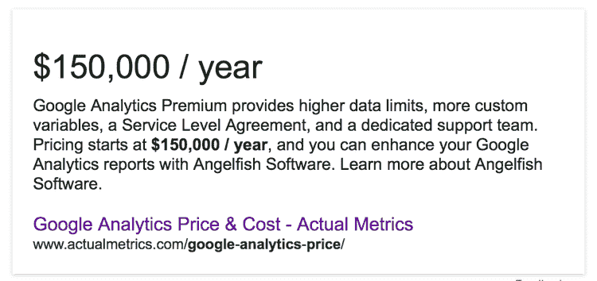
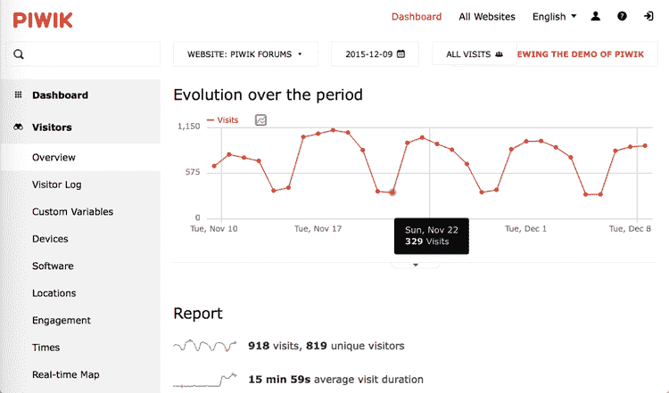
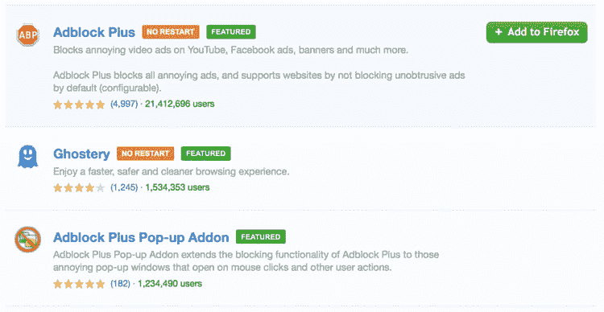
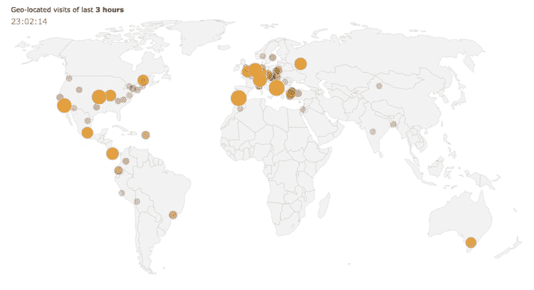

# 超越 Google Analytics 的世界——Piwik——跟踪访问者的免费和自托管替代方案

> 原文：<https://dev.to/msedzielewski/the-world-beyond-google-analytics---piwik---free--self-hosted-alternative-for-tracking-visitors-6mk>

如果你经营一个电子商务网站，你很有可能使用访问者跟踪工具。或者至少你考虑用一些。首先，对网站所有者来说，最明显和最有吸引力的解决方案是 [Google Analytics](https://www.google.com/analytics/#?modal_active=none) (GA)。但市场上还有其他替代产品，如 [Heap Analytics](https://heapanalytics.com) 、 [KISSMetrics](https://www.kissmetrics.com/home/) 、 [Clicky](https://clicky.com/) 、 [Woopra](https://www.woopra.com/) 或 [Piwik](https://piwik.org/) 。在本文中，我们将重点关注 Piwik。

### 为什么会有人考虑离开 GA？我们为什么？

首先，我们需要**原始访客数据**来建立一个定制的商业智能模型，我们不想每年花费 150，000 美元购买谷歌分析高级版。我们需要一个能够处理**重负载**(每分钟高达 1000 个动作)和大量数据的工具。更重要的是，我们不想放弃一个方便的**用户界面**。因此，简而言之，我们在寻找 GA Premium，但**是免费的**。Piwik 符合标准，因此有时被称为“强有力的竞争者”。
 
Piwik 是一个自托管的开源解决方案，被超过 900，000 个网站使用。在欧洲尤其受欢迎，例如，它在德国拥有 [16%的市场份额](https://w3techs.com/technologies/segmentation/tld-de-/traffic_analysis)(基于顶级域名)。它得到了蓬勃发展的社区和优秀团队的支持。由于它主要是一个**自托管**软件，所以需要一些时间投入，但换来的回报是很多的。
*(免责声明-我们不以任何方式隶属于此处列出的任何提供商)*

### 拥有数据的是你

数据隐私是许多用户关心的主要问题。你的网络活动可能会泄露你的生活或工作的任何信息。更不用说大多数网站都被几个公司跟踪了。在过去的几年里，人们对这个话题的认识不断提高。

使用 Piwik，您可以 100%确定日志或报告不会被发送到其他服务器——最终，您的所有数据都会安全地存储在您的 MySQL 数据库中，绝不会与第三方共享。

### 原始数据科学

另一个优势是在访问原始数据时获得的灵活性。

对于在营销方面投入大量资金、跨越多个营销渠道、技术、活动和国家的大公司来说，能够精确衡量他们所有营销行动的影响至关重要。

这些公司通常采用复杂的**定制报告、商业智能**解决方案来聚合多个来源的数据，甚至实施**机器学习**辅助解决方案来帮助跟踪定义的 KPI。

如果无法访问原始数据，几乎不可能实施这些高级解决方案。使用 Piwik，您可以访问现成的原始数据(SQL 数据库或 CSV 导出)。然而，要获得 GA，您需要每年支付额外的费用。

### 对付广告拦截器

在恼人的广告世界里，广告拦截软件变得非常流行。一些报告声称“在过去的 12 个月里，全球广告拦截增长了 41%”。因此，这些广告拦截工具极大地限制了第三方广告商的营销跟踪能力。因此，您的客户分析数据很可能是不完整的或有偏见的。
 
显然，开发人员有办法用 GA 来解决这些限制，但这通常注定是一场与侵略性和弹性阻挡者的败仗。

一个开源和自托管的解决方案——如 Piwik——让你有可能[定制](https://www.codelibrary.me/2015/05/24/avoid-ad-blockers-with-piwik-analytics/)跟踪像素脚本或重写跟踪器 url，以有效地绕过广告拦截器，从而保持你的分析数据更加完整。

### 《饼干定律》

> 【2011 年 3 月，德国独立隐私保护中心(ULD)推荐 Piwik 作为符合隐私要求的网络分析软件。 [**(来源)**](https://piwik.org/privacy/)
> 
> 【2014 年 1 月，法国数据隐私保护中心(CNIL)推荐 Piwik 作为唯一一款能够轻松确保完全遵守隐私法规的工具。2014 年 7 月，法国 CNIL 推荐 Piwik:唯一不需要 Cookie 许可的分析工具。 [**(来源)**](https://piwik.org/privacy/)
> 
> 许多政府机构已经信任并依赖 Piwik(在欧洲、亚洲、北美和非洲)提供自托管网络分析，这也反映了 Piwik 的隐私合规性。 [**(来源)**](https://piwik.org/privacy/)

简而言之，Piwik 通过禁用 cookie、匿名访客 IP 地址和网站上的选择退出按钮，让您遵守欧洲法律，而不会收到烦人的 cookie 通知，同时您仍能收集您需要的客户分析。
[T3】](https://res.cloudinary.com/practicaldev/image/fetch/s--Gg2v-2tq--/c_limit%2Cf_auto%2Cfl_progressive%2Cq_auto%2Cw_880/https://daks2k3a4ib2z.cloudfront.net/58fe5d0657dd045f17ae234e/59dde6b18a727a000146ab48_ccc.png)

### 安全港协议

安全港协议是美国国务院制定的一套规则。该协议于 2000 年达成，为美国公司提供了一种从欧洲获取数据的便捷方式，同时又不违反欧洲法律。

**2015 年 10 月 6 日，安全港协议已经失效**。这是什么意思？基本上，作为一家欧洲公司，在与第三方分享用户的个人或敏感数据时，你必须小心，因为保证足够的数据保护水平是**你的责任**。

实际上，包括谷歌在内的 5000 多家美国公司将不得不注册并告知欧盟数据保护机构其隐私做法，并发布新的数据处理条款或附录(例如[谷歌](https://www.google.com/analytics/terms/dpa/dataprocessingamendment_20130906.html)、 [Salesforce](http://www.salesforce.com/assets/pdf/misc/data-processing-addendum.pdf) )。

使用 Piwik 作为自托管解决方案，您可以自由选择存储数据的方式和位置。你不需要担心你在美国的服务提供商是否有足够的保护来处理你的敏感数据。

### 更何况？

Piwik 的大多数功能都达到了谷歌分析的标准，如实时报告、细分、可定制的仪表板、跟踪行为和转换、移动和电子商务分析等。
 
除此之外，还有一些领域皮维克似乎击败了 GA:

*   跟踪文件下载(GA 需要发送自定义事件来完成)，
*   跟踪出站链接，
*   跟踪弃车情况，
*   一个清晰的[路线图](https://piwik.org/roadmap/)以及要实现的长期目标，
*   跟踪某个特定的访客及其行为和购物车历史，而不是只收集一般的流量统计数据，
*   允许额外功能的第三方插件。

它也有一些不好的一面:

*   不过，你不会深入了解 Google AdWords 或 AdSense，
*   你不会得到谷歌提供的额外背景信息，比如:年龄、性别、兴趣。###在我们的案例中，我们使用 Piwik 原始数据来测量电视广告活动期间网站的流量，并跟踪访问者的行为。简而言之，我们的目标是——如何衡量电视广告的整体影响力？

棘手的部分是**电视广告并不是一个可直接追踪的营销渠道**——也就是说，在电视上展示一个特定的位置后，很难计算出你赢得了多少付费客户。最明显的想法是观察在线流量，并假设在电视广告播出后几分钟内访问你网站的人来自你的竞选团队。除此之外，还有更精确的技术，考虑到来自其他营销渠道和活动的干扰，或季节性趋势。

我们与我们的业务合作伙伴一起，使用了与**时间典型相关分析**相关的间接方法。简而言之，通过**将 KPI 时间序列**分解为与特定营销渠道相关的 KPI 时间序列，以及与副作用相关的 KPI 时间序列，我们能够解释电视活动如何影响给定的 KPI。

简而言之，我们需要原始的访问者数据输入到我们的商业智能机器中，并尽可能多地挤出信息，以便更好地为计划好的即将到来的广告活动做准备。由于预算有限，而且只有 GA，我们无法处理它。

因此，我们帮助提高了电视广告支出的长期投资回报率。此外，根据收集的数据，我们还能够改善未来广告的预算分配。

### 结论

Piwik 可能是谷歌分析的一个强有力的竞争对手。它们都提供了惊人的功能。虽然 GA 的设置非常简单，但使用 Piwik 时，您必须投入几个小时来设置基础架构，然后可能还需要几个小时来根据您的需求和流量对软件进行微调。

如果你是一个没有特殊要求的普通用户，你可以选择 GA。但是如果完全控制数据的好处远远超过自托管的缺点，那么您绝对应该考虑 Piwik。

请继续关注——我们在 Piwik 系列的下一篇文章将在技术方面提供更多的信息——在 OpenShift 和 Amazon EC2 上建立基础设施、负载测试和性能调优、操作和可伸缩性。

-
*原载于 [www.voucherify.io](https://voucherify.io/?utm_campaign=tech&utm_medium=Post&utm_source=devto)*