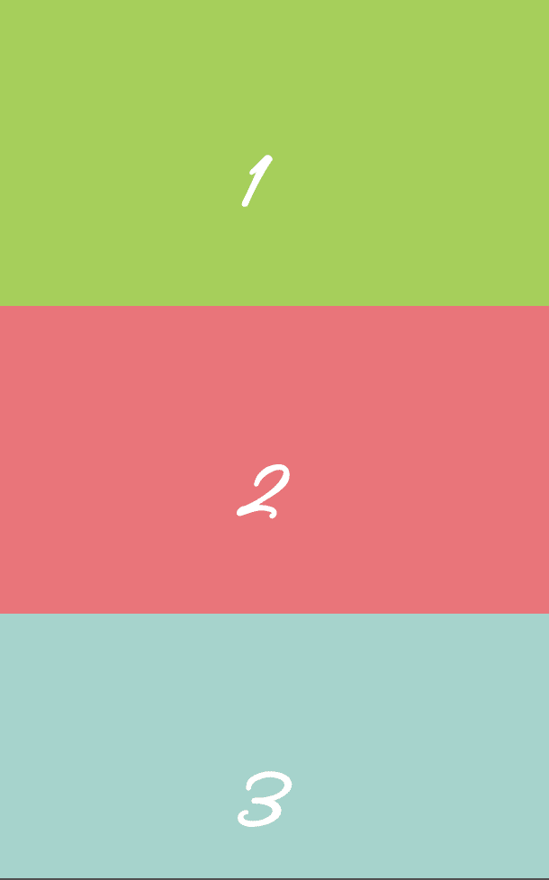
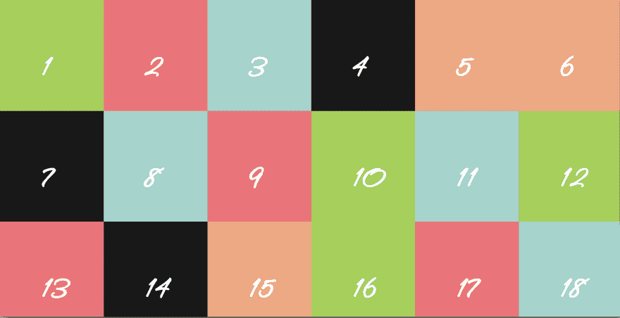
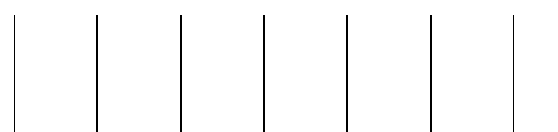
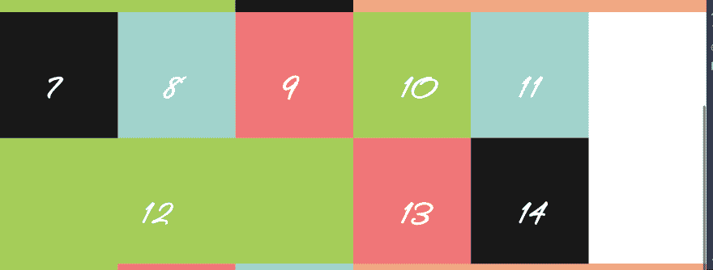

# 探索 CSS 网格及其神奇之处

> 原文:[https://dev . to/aurelkurtula/exploring-CSS-grids-and-they-awesome-7o 0](https://dev.to/aurelkurtula/exploring-css-grids-and-their-awesomeness-7o0)

本教程是关于 CSS 网格的。我是在阅读了 mozilla 文档并构建了一些我认为非常酷的东西之后写的，所有这些东西都很快且仓促。

计划是花几天时间，用网格创建一些有用的东西，然后写一个适当的介绍性教程，介绍我是如何创建这样一个网站的，但现在必须先放一放，因为我只想和你分享这个。当我决定写一篇后续文章时，这将是一份很好的文件。

这是我创作的:

[T2】](https://res.cloudinary.com/practicaldev/image/fetch/s--cCHApCip--/c_limit%2Cf_auto%2Cfl_progressive%2Cq_auto%2Cw_880/https://thepracticaldev.s3.amazonaws.com/i/trwiiazxeiud8dfo9rk5.png)

那看起来不酷吗？我以前试过用 floats 做这件事，但是我从来没有得到一个满意的结果，它需要大量的修改，而且结构就是这样！

有了网格，实现起来真的很容易。

## 我们开始创建网格

首先，我们将得到基本的东西。我们需要在 html 文件中的 20 个 div，我们需要给他们基本的样式。

下面是 html

```
<div id="wrap">
    <div class="box" id="id1"><h1>1</h1></div>
    <div class="box" id="id2"><h1>2</h1></div>
    <!-- ...20 divs -->
</div> 
```

<svg width="20px" height="20px" viewBox="0 0 24 24" class="highlight-action crayons-icon highlight-action--fullscreen-on"><title>Enter fullscreen mode</title></svg> <svg width="20px" height="20px" viewBox="0 0 24 24" class="highlight-action crayons-icon highlight-action--fullscreen-off"><title>Exit fullscreen mode</title></svg>

(如果你使用 emmet，你可以输入`#wrap>div.box#id$*20>h1{$}`然后回车。)

现在让我们添加一些初学者 css。

```
@import url('https://fonts.googleapis.com/css?family=Lovers+Quarrel');
*{margin: 0; padding: 0;}

.box{
  height: 35vh;
  display: block;
  text-align: center;
  font-family: Lovers Quarrel;
  font-size: 4rem;
  color: white;
  position: relative;
}
.box h1{
  position: absolute;
  top: 40%;
  left: 40%;
}
#id1, #id10, #id12, #id16{ background-color: #A5CB57;}
#id2, #id9, #id13, #id17{ background-color: #F77775;}
#id3, #id8, #id11, #id18{ background-color: #9CD3CD;}
#id4, #id7, #id14, #id19{ background-color: #181818;}
#id5, #id6, #id15, #id20{ background-color: #F8A880;} 
```

<svg width="20px" height="20px" viewBox="0 0 24 24" class="highlight-action crayons-icon highlight-action--fullscreen-on"><title>Enter fullscreen mode</title></svg> <svg width="20px" height="20px" viewBox="0 0 24 24" class="highlight-action crayons-icon highlight-action--fullscreen-off"><title>Exit fullscreen mode</title></svg>

首先，我们导入一个谷歌字体——因为我们可以，所以为什么不呢！下一行重置所有元素的填充和边距。

然后给`.box`一些高度，使用我们导入的字体，让字体变大。将`h1`标签置于盒子中央。

最终结果是这样的:

[T2】](https://res.cloudinary.com/practicaldev/image/fetch/s--05_j9n7k--/c_limit%2Cf_auto%2Cfl_progressive%2Cq_auto%2Cw_880/https://thepracticaldev.s3.amazonaws.com/i/1ume7a8ztqbuk8b45ybw.png)

现在，请注意，因为这真的又快又简单！

```
#wrap{
  width: 100%;
  display: grid;
  grid-template-columns: 1fr 1fr;
} 
```

<svg width="20px" height="20px" viewBox="0 0 24 24" class="highlight-action crayons-icon highlight-action--fullscreen-on"><title>Enter fullscreen mode</title></svg> <svg width="20px" height="20px" viewBox="0 0 24 24" class="highlight-action crayons-icon highlight-action--fullscreen-off"><title>Exit fullscreen mode</title></svg>

嘣！我们刚刚创建了一个包含两列的网格。我们的盒子从左向右流动，每个都是 50%宽。

`grid-template-columns`很有趣，而`fr`单元更有趣。我们可以使用任何单位。合乎逻辑的选择可能是`%` :

```
grid-template-columns: 50% 50%;
grid-template-columns: 200px 200px; 
```

<svg width="20px" height="20px" viewBox="0 0 24 24" class="highlight-action crayons-icon highlight-action--fullscreen-on"><title>Enter fullscreen mode</title></svg> <svg width="20px" height="20px" viewBox="0 0 24 24" class="highlight-action crayons-icon highlight-action--fullscreen-off"><title>Exit fullscreen mode</title></svg>

如果我们使用上面的第一行，结果将是相同的——创建两列，每列 50%宽。第二行创建了两列，但是每一列都是`200px`宽的——没有这样做的实际理由，但是你可以这样做。

相反，我们应该使用`fr`单位。他们是新的，从[规格](https://www.w3.org/TR/css3-grid-layout/#fr-unit)我们了解到

> 灵活长度或`<flex>`是以`fr`为单位的尺寸，它代表网格容器中自由空间的一部分。

因此，通过使用两个`1fr`,我们将容器分成两列。

虽然我在这里的任务是创建一个照片/报价网格，实际应用将在其他时间讨论，一个有两个侧栏和中间内容的网站，可能会使用下面的网格模板:

```
grid-template-columns: 1fr 3fr 1fr 
```

<svg width="20px" height="20px" viewBox="0 0 24 24" class="highlight-action crayons-icon highlight-action--fullscreen-on"><title>Enter fullscreen mode</title></svg> <svg width="20px" height="20px" viewBox="0 0 24 24" class="highlight-action crayons-icon highlight-action--fullscreen-off"><title>Exit fullscreen mode</title></svg>

出于我们的目的，我们需要一个 6 列网格！

```
#wrap{
  width: 100%;
  display: grid;
  grid-template-columns: 1fr 1fr 1fr 1fr 1fr 1fr;
} 
```

<svg width="20px" height="20px" viewBox="0 0 24 24" class="highlight-action crayons-icon highlight-action--fullscreen-on"><title>Enter fullscreen mode</title></svg> <svg width="20px" height="20px" viewBox="0 0 24 24" class="highlight-action crayons-icon highlight-action--fullscreen-off"><title>Exit fullscreen mode</title></svg>

显然，读写 6 个单元是很糟糕的，而且容易出错，所以我们可以在 css 中使用 repeat 函数。

```
#wrap{
  width: 100%;
  display: grid;
  grid-template-columns: repeat(6, 1fr);
} 
```

<svg width="20px" height="20px" viewBox="0 0 24 24" class="highlight-action crayons-icon highlight-action--fullscreen-on"><title>Enter fullscreen mode</title></svg> <svg width="20px" height="20px" viewBox="0 0 24 24" class="highlight-action crayons-icon highlight-action--fullscreen-off"><title>Exit fullscreen mode</title></svg>

这是我们网格的最终结果。

[T2】](https://res.cloudinary.com/practicaldev/image/fetch/s--yDnB-ItT--/c_limit%2Cf_auto%2Cfl_progressive%2Cq_auto%2Cw_880/https://thepracticaldev.s3.amazonaws.com/i/3bokp2nqb9cyh7pjcttg.png)

我应该用更多的颜色，但你可以看到六个网格。我觉得即使我们停在这里，它也只是美丽的。

网格让我们能够选择任何一个盒子并放大它们，而其他的盒子只能环绕剩余的空间。

```
#id1 {
  grid-column-start: 1;
  grid-column-end: 3;
} 
```

<svg width="20px" height="20px" viewBox="0 0 24 24" class="highlight-action crayons-icon highlight-action--fullscreen-on"><title>Enter fullscreen mode</title></svg> <svg width="20px" height="20px" viewBox="0 0 24 24" class="highlight-action crayons-icon highlight-action--fullscreen-off"><title>Exit fullscreen mode</title></svg>

用简单的英语说，那没有意义！我们希望 div 占据两列——那么为什么要在三列结束呢？嗯，如果你去掉`background-color`，加上`border-left`和`border-right`，你会看到七行。所以如果你要从第一行到第三行画一个盒子，你要用两列。

[T2】](https://res.cloudinary.com/practicaldev/image/fetch/s--x6ObL5cm--/c_limit%2Cf_auto%2Cfl_progressive%2Cq_auto%2Cw_880/https://thepracticaldev.s3.amazonaws.com/i/b2w6vckxfj0je3o39yfo.png)

最后，让我们对行做同样的事情。我们希望那个盒子是一个合适的正方形，我们让它占据两列，它也应该占据两行才是合适的，让我们更新上面的

```
#id1 {
  grid-column-start: 1;
  grid-column-end: 3;
  grid-row-start: 1;
  grid-row-end: 3;
  height: 100%;
} 
```

<svg width="20px" height="20px" viewBox="0 0 24 24" class="highlight-action crayons-icon highlight-action--fullscreen-on"><title>Enter fullscreen mode</title></svg> <svg width="20px" height="20px" viewBox="0 0 24 24" class="highlight-action crayons-icon highlight-action--fullscreen-off"><title>Exit fullscreen mode</title></svg>

从上到下完全一样的东西。

我发现有趣的是我们需要高度！如果我们不把它加进去，div 仍然会表现得好像它占据了一行，而网格已经把空间划分成了两行(试着去掉 hight 属性就明白我的意思了)！

让我们对另一个盒子做同样的事情

```
#id5{
  grid-column-start: 5;
  grid-column-end: 7;
  grid-row-start:1;
  grid-row-end:  3;
  height: 100%;
} 
```

<svg width="20px" height="20px" viewBox="0 0 24 24" class="highlight-action crayons-icon highlight-action--fullscreen-on"><title>Enter fullscreen mode</title></svg> <svg width="20px" height="20px" viewBox="0 0 24 24" class="highlight-action crayons-icon highlight-action--fullscreen-off"><title>Exit fullscreen mode</title></svg>

我们仍然在创建一个包含两列两行的盒子，但是现在我们希望它从第 5 行(第 5 列)开始，到第 7 行(第 6 列)结束。

你可以把第 20 个盒子放在第一行。最终，将网站的每一部分真正视为一个独立的组件，这将是它的能力之一。

## 让我们跨越一些盒子

到目前为止，我们选择了其中一个盒子(一个 div)并将其准确地放置在我们想要的位置(例如，从网格的第 1 行到第 3 行)。我们并不关心原来的位置在哪里。同样，因为这非常重要，我们可以拿任何一个盒子，把它放在网格中的任何地方，其他元素就会移动。

不过，还有另一种方法。使用`span`,我们可以将一个盒子从它所在的任何地方扩展到我们想要的任何地方。

```
#id15{
  grid-column-end: span 3;
  grid-row-end:span 2;
  height: 100%;
} 
```

<svg width="20px" height="20px" viewBox="0 0 24 24" class="highlight-action crayons-icon highlight-action--fullscreen-on"><title>Enter fullscreen mode</title></svg> <svg width="20px" height="20px" viewBox="0 0 24 24" class="highlight-action crayons-icon highlight-action--fullscreen-off"><title>Exit fullscreen mode</title></svg>

我们正在跨越 id 为`id15`的盒子，从它可能在的地方向左三列，向下两行。注意，这次数字`3`代表三列，`2`代表两行。

## 我遇到了一个尚未调查的困境。

我们可以向右跨，但不能向左跨！`grid-column-end: span 3`从左到右加宽元素。如果元素在最右边，有没有办法跨越到左边？

此时，如果我们这样做，我们会得到一个空的网格单元:

```
#id12{
  grid-column-end: span 3;
  grid-row-end:span 2;
  height: 100%;
} 
```

<svg width="20px" height="20px" viewBox="0 0 24 24" class="highlight-action crayons-icon highlight-action--fullscreen-on"><title>Enter fullscreen mode</title></svg> <svg width="20px" height="20px" viewBox="0 0 24 24" class="highlight-action crayons-icon highlight-action--fullscreen-off"><title>Exit fullscreen mode</title></svg>

最终结果是:

[T2】](https://res.cloudinary.com/practicaldev/image/fetch/s--XuvY9xxt--/c_limit%2Cf_auto%2Cfl_progressive%2Cq_auto%2Cw_880/https://thepracticaldev.s3.amazonaws.com/i/uadt2s31kg8sdjsawt15.png)

在一个正常的设计中，我们会想知道所有东西在哪里，这可能不是问题，但这是我注意到的事情，虽然我可以说服自己认为这是一件好事，但我不能说我没有谷歌它作为一个错误！

## 结论

玩这个格子很有趣。这是照片网格的[演示。照片来自 unsplash.com 的 T2，引语来自独一无二的拉尔夫·沃尔多·爱默生。](https://aurel-84637.netlify.com/)

正如我将在我将要写的大多数教程中尝试做的那样，演示总是会有一些额外的东西，这些额外的代码只是为了娱乐我，对我探索的核心概念没有任何帮助。在这种情况下:几个块引号和 css 伪元素的使用不值得离题。

我在我的 mac 上试用了这个演示，它可以在我所有的三种浏览器(chrome、firefox 和 safari)上运行。我在一台 windows 笔记本电脑上试了一下，网格根本不能工作，但是[can use 网站](https://caniuse.com/#feat=css-grid)会告诉你更多关于支持的信息(也许我试的电脑有旧版本的浏览器)

*注意，我没有使用媒体查询，所以演示只在大屏幕上有用。下一个关于网格的教程将包括所有内容*