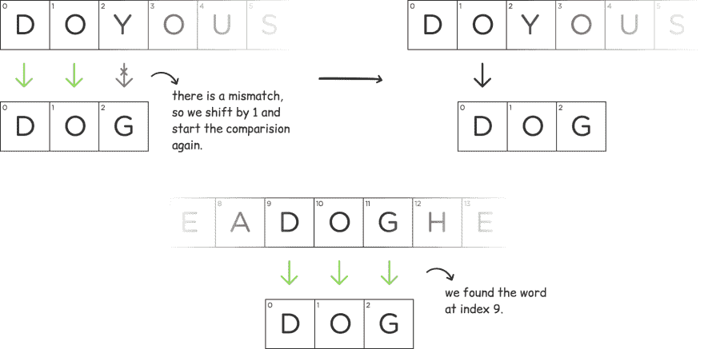
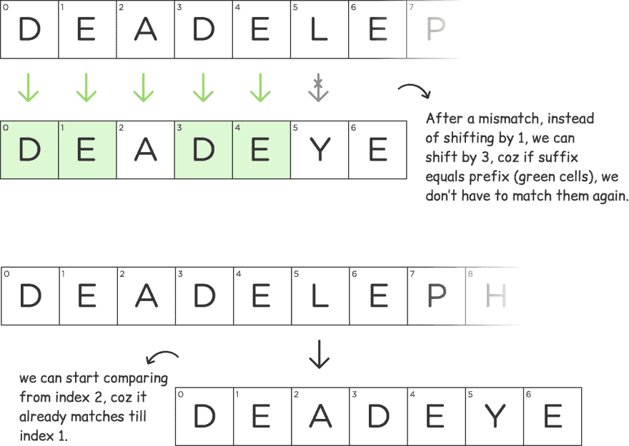
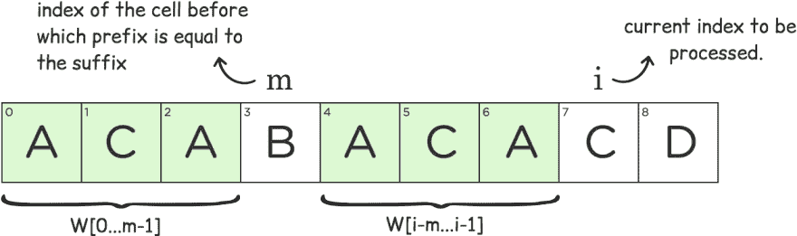
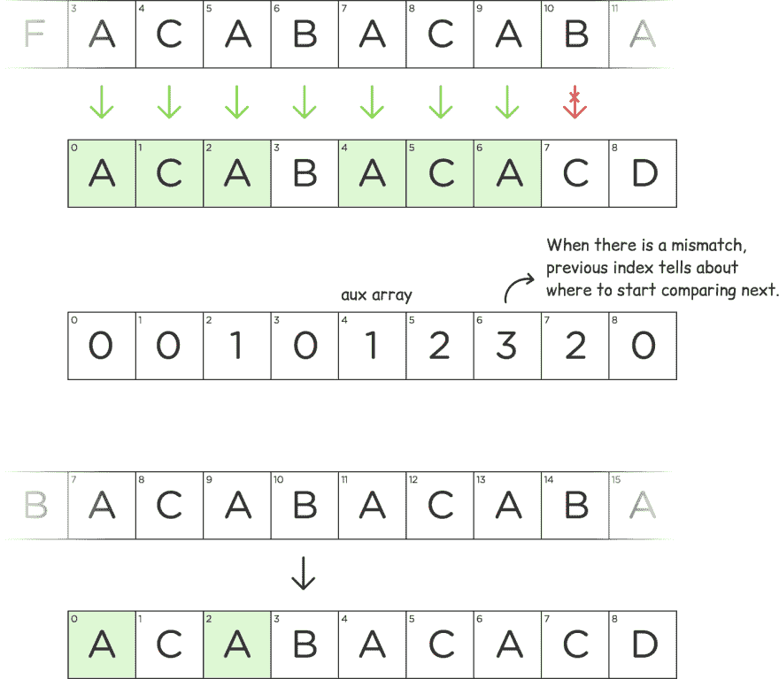

# 字符串匹配(KMP 算法)

> 原文：<https://dev.to/girish3/string-matching-kmp-algorithm-cie>

[T2】](https://res.cloudinary.com/practicaldev/image/fetch/s--vFlijGMk--/c_limit%2Cf_auto%2Cfl_progressive%2Cq_auto%2Cw_880/https://thepracticaldev.s3.amazonaws.com/i/br126i9530td5l268g5f.jpg)

字符串匹配问题又称“大海捞针”，是经典问题之一。这个简单的问题在信息安全、模式识别、文档匹配、生物信息学(DNA 匹配)等领域有很多应用。找到一个线性时间算法是一个挑战，然后我们的父亲 *Donald Knuth* 和 *Vaughan Pratt* 在 1970 年通过彻底分析天真的方法构思了一个线性时间解决方案。同年，它也被*詹姆士·莫里斯*独立发现。三人于 1977 年共同发表了这篇论文，从那时起，这篇论文就被称为 *Knuth-Morris-Pratt* 又名 KMP 算法。

这是我这个系列的第一篇博客，我遵循的方法是从基础开始，然后继续构建，直到我们达到最佳的解决方案。我将使用`Python`作为代码片段，因为它非常简洁易读。我们开始吧..

### 问题陈述:

在主文本 **T** 中查找单词 **W** 的出现。
解决这个问题的一个简单方法是将 W 的每个字符与 t 进行比较。每次出现不匹配时，我们将 W 向右移动 1，然后重新开始比较。让我们举个例子:

**T:doyouseedagohere**(将对所有示例进行不区分大小写的搜索)
**W:dog**
[](https://res.cloudinary.com/practicaldev/image/fetch/s--C-khyxvl--/c_limit%2Cf_auto%2Cfl_progressive%2Cq_auto%2Cw_880/https://thepracticaldev.s3.amazonaws.com/i/jxgl1scmdz8nj4k2fxow.jpg)

```
# Here is the working code of the naive approach. def bruteSearch(W, T):
    # edge case check
    if W == "":
            return -1

    # getting the length of the strings
    wordLen = len(W)
    textLen = len(T)

    # i is the index of text T from where we will start comparing the
    # the word W
    i = 0

    # length of the subtext has to be equal to the length of the word,
    # so no need to check beyond (textLen - wordLen + 1)
    while i < (textLen - wordLen + 1):
        # we set match to false if we find a mismatch
        match = True

        for j in range(wordLen):
            if W[j] != T[i + j]:
                # A mismatch
                match = False
                break

        if match:
            # We found a match at index i
            print "There is a match at " + str(i)

        # incrementing i is like shifting the word by 1
        i += 1

    return -1 
```

Enter fullscreen mode Exit fullscreen mode

这种简单方法的时间复杂度是 O(mn)，其中 m 和 n 分别是单词 W 和文本 T 的长度。让我们看看如何能做得更好。再举一个古怪的例子，W 中的*都是独特的字符。
T3】T:duce duckT5】T6】W:duckT8】T9[T11】T12】](https://res.cloudinary.com/practicaldev/image/fetch/s--xwOOPib0--/c_limit%2Cf_auto%2Cfl_progressive%2Cq_auto%2Cw_880/https://thepracticaldev.s3.amazonaws.com/i/m67ve8ae230hc58xl8vj.jpg)*

正如您在上面的图像中看到的，在索引 3 处有一个不匹配。根据天真的方法，下一步是将 W 移位 1。由于 W 中的所有字母都是不同的，我们实际上可以将 W 移动发生不匹配的索引(在本例中为 3)。我们可以肯定地说，这两者之间不会有任何匹配。我建议您尝试一些其他类似的例子，并亲自检查一下。这个想法是找出当有一个不匹配时，单词 W 移动多少。到目前为止，我们只针对 W 中所有字符都是唯一的特殊情况优化了这种方法。再举一个离奇的例子。这次会有点棘手，所以做好准备。

**T:死象**
T3】W:死眼

[T2】](https://res.cloudinary.com/practicaldev/image/fetch/s--2uOVzuVB--/c_limit%2Cf_auto%2Cfl_progressive%2Cq_auto%2Cw_880/https://thepracticaldev.s3.amazonaws.com/i/p6m8q71mixo5brteskk1.jpg)

确保你理解绿色细胞传达的信息。我会用很多。在上图中，左边子串中的绿色单元格等于右边子串中的绿色单元格。它实际上是最大的前缀，也等于直到单词“deadeye”的索引 4 的子串的后缀。假设现在我们已经以某种方式找到了它，稍后我们将努力找出最大的前缀(绿色单元格)。现在让我们通过一个抽象的例子来看看它是如何工作的。

[T2】](https://res.cloudinary.com/practicaldev/image/fetch/s--v8zKkLN6--/c_limit%2Cf_auto%2Cfl_progressive%2Cq_auto%2Cw_880/https://thepracticaldev.s3.amazonaws.com/i/87rrwg9n4gebgawigqk8.jpg)

str1 = str2(绿色单元格)，str2 = str3。当 str2 之后出现不匹配时，我们可以直接将单词移动到 str1 之后，如图所示。如果有不匹配，绿色单元格实际上告诉我们下一步应该从哪里开始比较的索引。

我想你现在明白了，如果我们为单词 W 的每个前缀找出绿色单元，我们可以跳过一些不必要的匹配，提高算法的效率。这实际上是 knuth-Morris-Pratt(kmp)算法背后的思想。

## 寻找绿色细胞

我们将使用 aux[]数组来存储索引。与 Naive 算法不同，在 Naive 算法中，我们将单词 W 移动一位，并在每次移动时比较所有字符，我们使用 aux[]中的值来决定下一个要匹配的字符。不需要匹配我们知道会匹配的字符。让我们再举一个奇怪的例子。

**W: acabacacd**

[T2】](https://res.cloudinary.com/practicaldev/image/fetch/s--PCDWS--0--/c_limit%2Cf_auto%2Cfl_progressive%2Cq_auto%2Cw_880/https://thepracticaldev.s3.amazonaws.com/i/9lwpjqnquspmn4j83gqu.jpg)

`m`和`i`定义了我们算法的状态，并表示在`m`之前的单词 W 的前缀等于子串的后缀，直到`i-1`，即`W[0…m-1] = W[i-m…i-1]`。对于上面的图像状态，2(`m`的值)存储在 aux[]数组中，用于子串，直到索引 4( `i-1`)。

```
def createAux(W):
    # initializing the array aux with 0's
    aux = [0] * len(W)

    # for index 0, it will always be 0
    # so starting from index 1
    i = 1
    # m can also be viewed as index of first mismatch
    m = 0
    while i < len(W):
        # prefix = suffix till m-1
        if W[i] == W[m]:
            m += 1
            aux[i] = m
            i += 1
        # this one is a little tricky,
        # when there is a mismatch,
        # we will check the index of previous
        # possible prefix.
        elif W[i] != W[m] and m != 0:
            # Note that we do not increment i here.
            m = aux[m-1]
        else:
            # m = 0, we move to the next letter,
            # there was no any prefix found which 
            # is equal to the suffix for index i
            aux[i] = 0
            i += 1

    return aux 
```

Enter fullscreen mode Exit fullscreen mode

下面是单词*acabacad*的辅助数组

[T2】](https://res.cloudinary.com/practicaldev/image/fetch/s--OJRlxvZK--/c_limit%2Cf_auto%2Cfl_progressive%2Cq_auto%2Cw_880/https://thepracticaldev.s3.amazonaws.com/i/i4mopp24q5hspsvx73np.jpg)

现在让我们使用上面的 aux 数组在下面的文本中搜索单词 *acabacacd* 。

**T:acfacabacabacacdk**T2】

```
 W = "acabacacd"
T = "acfacabacabacacdk"

# this method is from above code snippet. aux = creatAux(W)

# counter for word W i = 0
# counter for text T j = 0
while j < len(T):
    # We need to handle 2 conditions when there is a mismatch
    if W[i] != T[j]:
        # 1st condition
        if i == 0:
            # starting again from the next character in the text T
            j += 1
        else:
            # aux[i-1] will tell from where to compare next
            # and no need to match for W[0..aux[i-1] - 1],
            # they will match anyway, that’s what kmp is about.
            i = aux[i-1]
    else:
        i += 1
        j += 1
        # we found the pattern
        if i == len(W):
            # printing the index
            print "found pattern at " + str(j - i)
            # if we want to find more patterns, we can 
            # continue as if no match was found at this point.
            i = aux[i-1] 
```

Enter fullscreen mode Exit fullscreen mode

下面是上述代码在一些中间运行状态下的快照。

[T2】](https://res.cloudinary.com/practicaldev/image/fetch/s--sIuKzZP6--/c_limit%2Cf_auto%2Cfl_progressive%2Cq_auto%2Cw_880/https://thepracticaldev.s3.amazonaws.com/i/v0zycstq7juyvsgx2u7i.jpg)

你刚刚搞定了 Knuth-Morris-Pratt 算法:)