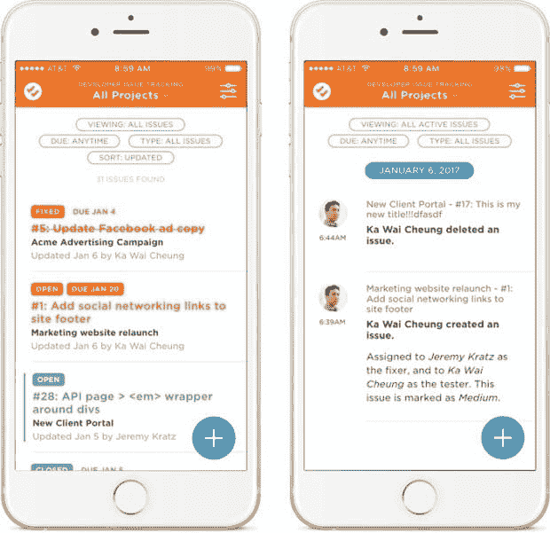
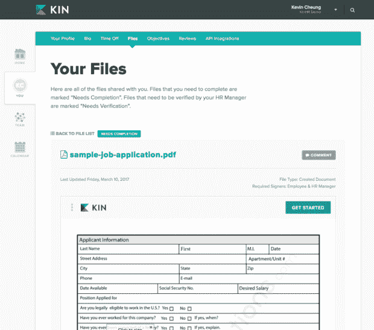

# 一个制造商管理项目的方法

> 原文:[https://dev . to/developerscode/a-makers-approach-to-managing-projects-HB](https://dev.to/developerscode/a-makers-approach-to-managing-projects-hb)

*转载自[我们是猛犸博客](https://medium.com/we-are-mammoth/a-makers-approach-to-managing-projects-498a4fa503e2)。*

在保罗·格拉厄姆所谓的创造者与管理者之间，我站在创造者一边。我总是喜欢创造东西。相比之下，管理对我来说从来都不自然。所以，当涉及到管理一个项目时，我会做一些不寻常的事情——用我称之为*制造者的方法*。

在过去的六个月里，我监督了两个非常不同的产品开发项目，分别是 [DoneDone](https://www.getdonedone.com) 和 [Kin](https://www.kinhr.com) 。8 月至 12 月期间，我负责监督我们的 iOS 移动应用程序的开发。然后，从一月初到二月底的七个星期里，我监督了 Kin 的电子签名功能的开发。

[T2】](https://res.cloudinary.com/practicaldev/image/fetch/s--Vo1wgx3A--/c_limit%2Cf_auto%2Cfl_progressive%2Cq_auto%2Cw_880/https://thepracticaldev.s3.amazonaws.com/i/7e4n0nqyfpsi5tl7z8ox.jpg)

[T2】](https://res.cloudinary.com/practicaldev/image/fetch/s--mfyU3nkg--/c_limit%2Cf_auto%2Cfl_progressive%2Cq_auto%2Cw_880/https://thepracticaldev.s3.amazonaws.com/i/hb7ziqimyyznth1heg5g.png)

在这两个项目中，我们只和几个经验丰富的开发人员一起工作，没有大量的前期规划。我们尽可能早地深入到建筑中。虽然对一些人来说，这可能看起来有些吓人，但这是一种可以与制造者的心态一起工作的环境。在这种情况下，作为一名管理者，我会采取以下几种方法。

# 果酱时段

我提倡让开发周期的开始尽可能不受约束。考虑到还没有任何具体的东西可以咀嚼，我不喜欢从一开始就规定开发的顺序。

对于 DoneDone Mobile 来说，我关心过团队首先在做什么吗？如果我能在创建问题之前测试问题列表的行为，这有什么关系吗？如果活动提要是在活动屏幕的搜索过滤器之前构建的，会有什么不同吗？不，不，不。

在开发移动应用程序时，我们还面临着一个独特的挑战。整个开发团队(Grant、Jeremy 和 Chris)同时向 Xamarin 过渡。Net 框架来构建我们用于 DoneDone 的移动应用。格兰特已经完成了他的培训和认证；但是将学到的知识应用到一个真正的项目中总是一个思维上的跳跃。

因此，在开发的前两周，在我完成了一个单页的功能集之后，我给了 Grant 一个特别的计划:从任何地方开始。选择一个地方开始实施，然后出发。在发展的早期阶段，唯一的目标是*取得进展*。与此同时，我们的设计师 Mike 花了两周时间，根据我为团队准备的功能集进行设计。他的倡议？也可以从任何地方开始。

在那两个星期快结束的时候，Grant 已经完成了一些底层管道和基本视图，Mike 完成了这些视图的设计。然后 Jeremy 开始关注 UI 的细节。还是那句话，我不在乎顺序。Jeremy 在构建一些整体 UI 结构和润色 Grant 之前连接的视图之间摇摆不定。

我把这个发展阶段比作即兴表演。大脑自由消除了严格的早期发展路线图带来的任何摩擦。艺术品以令人惊讶的方式组合在一起。最终工作还是完成了——而且通常比我们一开始就制定路线图的速度更快。

通过保持目标的开放性，人们可以着手于他们此刻最感兴趣的部分。当对他们来说有意义时，他们可以随意移动应用程序。他们会发现最初无法预见的障碍是什么，以及如何应对。最重要的是，我认为这种方法有助于开发者建立势头。

现在，在某一点上，jam 会话的无限性与其说是帮助，不如说是阻碍。足够多的最初骗局已经变成了实际的产品。正是在这一点上，制定出剩余工作的路线图是有意义的。

当这种情况发生时，并没有精确的科学依据。这是房间里的一种感觉。但是，理想情况下，jam 会话占用的时间不应该超过构建总时间的 20%。这样就剩下 80%的时间来处理如何从战术上处理剩下的事情——利用动量的巨大好处和团队在即兴表演中所学到的知识。

# 螺旋式 QA

传统上，正式的质量保证测试开始于开发过程的末尾。它停在开发完成和发布之间的某个地方。然而，我更喜欢在开发期间尽早*开始 QA。就 DoneDone Mobile 而言，这是在即兴表演结束后不久。*

最好从广泛的冲程测试开始 QA。随着时间的推移，你逐渐进入魔鬼般的细节。我们在这两个项目中经历的 QA 过程就像是在螺旋式下降。

[T2】](https://res.cloudinary.com/practicaldev/image/fetch/s--PFUPlIa5--/c_limit%2Cf_auto%2Cfl_progressive%2Cq_auto%2Cw_880/https://thepracticaldev.s3.amazonaws.com/i/q0io448m37mxv22tjppu.jpg)

开始时，我关注的是全局功能问题(“我不能创建问题或“当我被分配一个文档时，我没有收到电子邮件通知”)。尽管有明显的 UI 改进，但作为一名测试人员，我倾向于在我的最初几轮测试中忽略这些——它们只是目前对该功能不太重要。这也不是开发人员关注的焦点。随着迭代的改进，问题变得更加细化(“问题搜索屏幕上选择器之间的间距不一致”)。最终，我们螺旋式下降到我们想要的实际特征。

因为 QA 和开发同时关注大致相同级别的范围(开始时的大事情逐渐螺旋上升到后来的更小细节)，螺旋上升的 QA 也允许大量的迭代。我发现这需要一些时间和压力，从一开始就搞清楚太多的功能——尤其是所有的小细节。换句话说，为了更早地开始开发(和螺旋式 QA ),我们在传统特性周期的开始交换了一些范围界定时间。这给了我们更多的时间来迭代真实的东西，而不是草图。我觉得最后的结果总是更好。

# 发展棒球

当我管理一个项目时，我并不是 100%的时间都在主动管理——没有必要在项目生命周期的每一个特定时刻都这样做。这样做通常会给制造商带来所有不必要的额外时间中断，正如保罗·格拉厄姆所描述的。我不喜欢提前几周安排每天或每周的检查。我认为一周一次计划会议更有价值。有些星期你需要更多，有些星期你需要更少。让手头的工作来决定吧。

相反，我认为我的角色更像是过去棒球时代的混合球员兼经理人。当我管理的时候，我会寻找机会让自己成为一名开发人员。好处是多方面的:

*   首先，我可以充分了解我的团队正在开发的代码。这有助于我了解痛点可能在哪里。我可以处理更多的真实情况。
*   第二，它通常有助于在固定的时间内获得额外的推动力。当开发者的带宽有一定的灵活性时，这给了我们的团队更多的信心来赶上最后期限。因为我已经在其他方面沉浸在项目中了(范围界定、QA 等。)，我的额外人手*应该*帮助而不是伤害——这不会导致 Brooks 臭名昭著的定律:“增加人力到一个晚期软件项目会使它更晚。”

我在哪里伸出援手将因项目而异。对于 DoneDone Mobile 来说，我来晚了是最有意义的，可以帮助重构一个正在学习新框架的团队自然引入的一些债务。在过去，我把这个[称为先发/后援发展](https://medium.com/we-are-mammoth/quality-starts-and-a-save-starter-reliever-development-8767fce581df)。

[T2】](https://res.cloudinary.com/practicaldev/image/fetch/s--m6mTMQ0C--/c_limit%2Cf_auto%2Cfl_progressive%2Cq_auto%2Cw_880/https://thepracticaldev.s3.amazonaws.com/i/pxsrrwkwymwuu79hshib.jpg)

相比之下，对于 Kin 的电子签名功能，我一开始就支持开发团队。当 Jeremy 和 Waylon 忙于在 Kin 中构建支持电子签名的基础设施时，我在开发周期的第一周研究了文档上传和签名的最佳第三方集成。声明一下，我们最终集成了 HelloSign，并对结果欣喜若狂。

到周末的时候，我已经用 C#建立了概念验证来创建、嵌入和共享我交给团队的文档。从某种意义上来说，我扮演了一个临时打手的角色——在一个孤立的一次性任务中工作，这个任务“后来被合并到实际的构建中”。

# 信任篡夺重过程

我用来管理项目的方法不是教科书式的。每种方法的清晰都需要你的队友之间的信任和信赖。如果我只和我的开发团队成员一起工作了几个月，我会对如何运行 jam 会话感到有些厌倦。但是，我有和我一起工作了五年多的队友。

随着一个开发团队的长寿，[信任成为我最大的信心砝码](https://dev.to/developerscode/there-are-rockstars-and-there-are-bands)。而且，结果肯定证明了这一点。