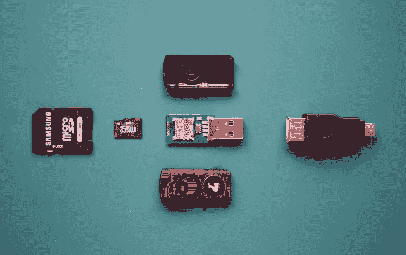
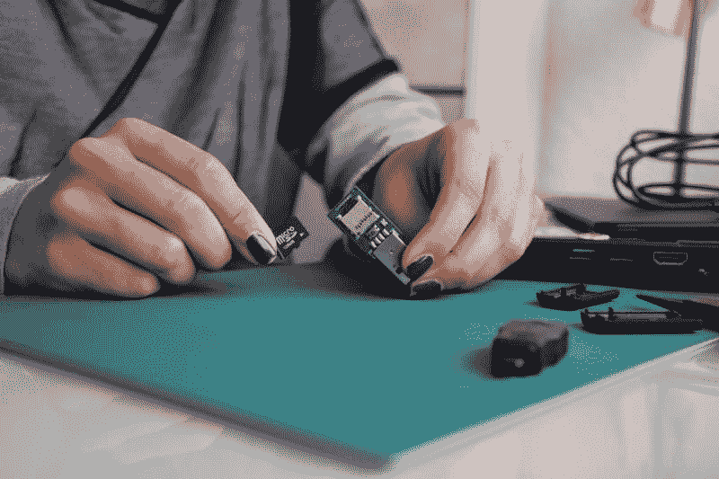

# 橡胶鸭子

> 原文：<https://dev.to/terceranexus6/rubber-ducky-293>

你可能听说过 ducky 调试技术，在这种技术中，你告诉一只橡皮鸭子你的开发问题，然后你知道如何解决它们，但事实并非如此，我们在这里谈论的是令人讨厌的 Ducky，而不是可爱的问题解决者。

不管名字是什么，橡皮鸭是一种黑客注射装置的名字，它由一个笔式驱动器和一个微型 SD 组成。包本身也附带了外壳和几个 USB 适配器。

[T2】](https://res.cloudinary.com/practicaldev/image/fetch/s--QjafFWQX--/c_limit%2Cf_auto%2Cfl_progressive%2Cq_auto%2Cw_880/https://cdn-images-1.medium.com/max/800/1%2ALxlmHycPbysH9w3ezFnEzw.jpeg)

该设备模仿人类键盘输入，“人类使用键盘。计算机相信人类祈祷这句格言。过程很简单，在 micro SD 中我们保存了一个名为“inject.bin”的程序，这是我们之前基于代码生成的。我们连接鸭子体内的微型 SD 并连接目标计算机中的代码，然后它将发挥它的魔力。

[T2】](https://res.cloudinary.com/practicaldev/image/fetch/s---iq3gHjn--/c_limit%2Cf_auto%2Cfl_progressive%2Cq_auto%2Cw_880/https://cdn-images-1.medium.com/max/800/1%2A0dFQs9g3YLSiy64yxBN_4Q.jpeg)

不久前，我的一个朋友将黑客描述为某种魔术师。他们做他们的事，没人知道他们是怎么做的，幕后有一个诡计，你觉得离知道真相还很远。这种情况下的技巧在 [Github Wiki](https://github.com/hak5darren/USB-Rubber-Ducky/wiki) 上有完整的记录，它解释了如何编写随后将被编码的代码。

这是官方的命令崩溃

```
DELAY x — Delay in milli-secs
STRING xyz — types following characters
GUI — Windows Menu Key
GUI r — Windows Run box
COMMAND — OSX Command Key
UP | UPARROW — Up Key
DOWN | DOWNARROW — Down Key
LEFT | LEFTARROW — Left Key
RIGHT | RIGHTARROW — Right Key
CAPS |CAPSLOCK — Capslock Key
ENTER — Return/Enter key
SPACE — Spacebar
REPEAT x — Repeat previous command X times. 
```

Enter fullscreen mode Exit fullscreen mode

你甚至可以使用一些(但不是全部)两个或三个组合键:

```
SHIFT-ENTER
CTRL-ALT-DEL
ALT-F4 
```

Enter fullscreen mode Exit fullscreen mode

有了这些和一些我们将要注射鸭子的操作系统的知识，应该足以做出最简单的步骤。当然，你的行为完全由你负责，这个设备可以用作测试器、社交工程伙伴或武器。这取决于你。