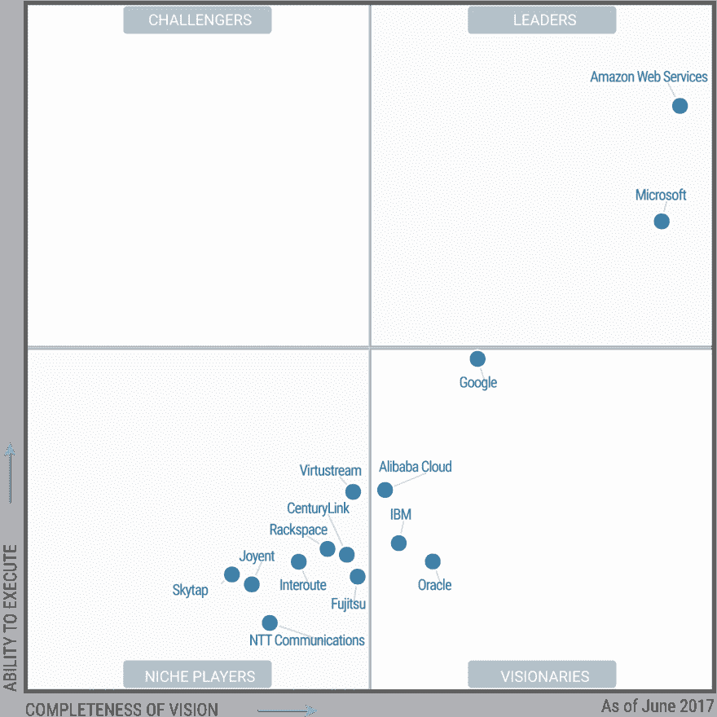

# 云的末日还没有到来

> 原文：<https://dev.to/kylegalbraith/the-end-of-the-cloud-is-not-coming-7dp>

这是一个周六的早上，我正在浏览我的各种提要，这时我看到了 Venture Beat 的这篇文章，“云的末日即将到来”。现在诱饵，我喝了一口咖啡，点击通过。

声明:如果你确实相信云的末日即将到来，那就继续前进，因为你不会喜欢这篇文章。

这样一来，我将继续讨论这篇文章中使用的推理。作者陈述了云即将终结的四个不同原因。让我们继续讨论每一个问题，以及为什么这个推理是完全荒谬的。

### 无法满足长期缩放需求。

老实说，作者在这里使用的论点有点令人震惊。网络是作者认为 AWS、Google Cloud 和 Azure 等云提供商无法满足长期扩展需求的原因。我们正在通过网络推送前所未有的大量数据。

> 随着服务器移向云，即在亚马逊或谷歌的数据中心的亚马逊或谷歌的计算机上，靠近这些地方的网络需要有难以置信的吞吐量来处理所有这些数据。

的确，如今我们在网络上发送了更多的比特。但是，认为靠近亚马逊或谷歌数据中心的网络无法处理负载的想法是一个没有教养的答案。稍微研究一下或者看一两个视频，你就会发现 AWS 利用了他们自己的网络。

作者接着说，CPU 和硬盘驱动器将达到为每个用户提供内容的极限。有人没听说过缓存吗？流媒体优化？显然不是。

### 它集中而脆弱。

这是你通常反复提到的关于如何在一个集中的地方存储所有数据的论点。这里还有一个很好的恐吓策略:

> 如果亚马逊的数据中心被洪水淹没、被小行星撞击或被龙卷风摧毁，该怎么办？

截至今年 9 月，每个主要的云提供商，AWS，Google Cloud 和 Azure 都有多个地区和可用性区域。因此，如果你担心僵尸会像作者认为的那样袭击你的数据中心，那就把朝鲜氢弹复制到多个 AZ 甚至地区。

### 它要求信任，但不提供保证。

通过像 AWS 这样的中间人传递数据，你是在暗中信任中间人。如果你把一篇半生不熟的博客文章从你的笔记本电脑上传给你在 VB 的联系人，你无疑是信任了一个中间人。

区别？在 AWS 网络中传递数据您相信 Amazon 会处理您的数据。在网上冲浪时，你信任你的 ISP 作为中间人。鉴于目前[网络中立](https://arstechnica.com/tech-policy/2017/11/comcast-asks-the-fcc-to-prohibit-states-from-enforcing-net-neutrality/)的状态，你更倾向于哪一种？

### 它让我们和我们的数据成为活靶子。

是的服务正在收集我们的大量信息。不幸的是，为了玩《愤怒的小鸟》或《口袋妖怪 GO 》,我们都太快地放弃了我们生活的细节。不幸的是，当有更好的方法赚钱时，技术却坚持要靠信息赚钱。

也就是说，位于云提供商数据中心的数据是安全的。但是如果作者想把数据放在他们自己的数据中心，比如佐治亚州的 Equixfax 数据中心，我有什么资格说不呢？

### 平息神话

好吧，对位论点和咆哮结束。我确实相信作者试图得到一个更大的观点。重点是，相对于传统的数据中心，对等网络可能成为未来的趋势。理论上这很好，区块链科技在这方面有很多进展。

[T2】](https://res.cloudinary.com/practicaldev/image/fetch/s--SxUFvW3H--/c_limit%2Cf_auto%2Cfl_progressive%2Cq_auto%2Cw_880/https://www.gartner.com/resources/315200/315215/315215_0001.png%3Bwa4036249d8f17fcd1%3FreprintKey%3D1-2G2O5FC)

不过，云不会很快消失。魔力象限在 AWS 遥遥领先的情况下非常清楚地说明了这一点。真正要问的问题是云接下来会如何发展？微软和谷歌正在努力削弱亚马逊。这就引出了一个问题，推动事情向前发展的下一批创新是什么？

### 饿着肚子学亚马逊 Web 服务？

有很多人渴望学习亚马逊网络服务。受到这个事实的启发，我创建了一个课程，专注于通过使用它来学习 Amazon Web Services。关注静态网站的托管、保护和交付问题。通过构建问题的解决方案，您可以学习 S3、API Gateway、CloudFront、Lambda 和 WAF 等服务。

AWS 周围有大量的信息。很容易迷失方向，在学习上没有任何进步。通过解决这个问题，我们可以简化信息，加快你的学习。我用这本书和视频课程的目的是与你分享我所学到的。

听起来有趣吗？查看登录页面了解更多信息，并选择适合您的套餐，[此处](https://www.kylegalbraith.com/learn-aws/)。