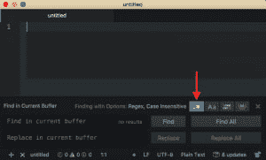
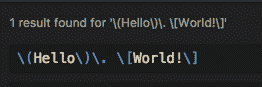

# 使用 Atom 学习正则表达式

> 原文:[https://dev . to/program lift off/learn-regular-expressions-using-atom-alk](https://dev.to/programliftoff/learn-regular-expressions-using-atom-alk)

*这篇文章最初发表在[programmingliftoff.com](http://programmingliftoff.com/)上，名为[使用 Atom](http://programmingliftoff.com/learn-regular-expressions-using-atom/) 学习正则表达式。*

这是一个简短的帖子，目的是帮助你学习难以捉摸的正则表达式！

这利用了 Atom 文本编辑器中内置的正则表达式特性。它也可以在其他文本编辑器中工作，所以请在您最喜欢的文本编辑器或 IDE 中尝试一下。如果不行，你可以[在这里](https://atom.io/)下载 Atom(别担心，它是免费的！).

## 辅导的

首先，在 Atom 编辑器中创建新文件。

接下来，键入一行文本。这是我将使用的代码行`(Hello). [World!]`。

接下来键入 CMD+f(Windows 上的 Ctrl+f)打开查找和替换实用程序。

然后选择“regex”选项，将搜索项视为正则表达式(见下面的红色箭头)。

[T2】](https://res.cloudinary.com/practicaldev/image/fetch/s--escllnQi--/c_limit%2Cf_auto%2Cfl_progressive%2Cq_auto%2Cw_880/http://programmingliftoff.com/wp-content/uploads/2017/11/AtomRegexOption-1-300x181.png)

最后，突出显示您键入的文本行，然后按 CMD+f(Windows 上的 Ctrl+f)。搜索框应该会更新，以显示格式化为正则表达式的选择。

[T2】](https://res.cloudinary.com/practicaldev/image/fetch/s--d6slQlNv--/c_limit%2Cf_auto%2Cfl_progressive%2Cq_auto%2Cw_880/http://programmingliftoff.com/wp-content/uploads/2017/11/Atom-Regex.png)

恭喜你！您现在知道如何使用 Atom 来构建正则表达式了！

## 理解生成的表达式

回想一下，原来的字符串是`(Hello). [World!]`。圆括号和方括号是正则表达式中的特殊符号，所以它们必须用`\`字符进行转义。注意，句点`.`也是一个特殊的正则表达式字符。这是正则表达式中最容易被误用的字符之一，因为句点本身可以匹配任何字符！简单地键入一个`.`来匹配字符串中的一个句点将会匹配该字符串，但是它也将匹配包含任何其他字符来代替句点的任何字符串。

## 限制

这只适用于单行表达式。:(即使是魔法也有它的极限:)。

## 附加链接

[【https://regexone.com/】](https://regexone.com/)-一个学习正则表达式的很棒的互动教程。

[https://regex101.com/](https://regex101.com/)——一个正则测试者。您必须知道正则表达式，或者尝试键入正则表达式，直到它们与您输入的示例文本匹配。

[掌握正则表达式](http://amzn.to/2yabQ0p) -学习如何编写正则表达式的好书。(这是一个附属链接。)