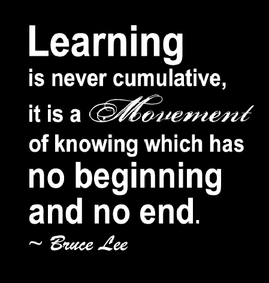

# 不停地学习

> 原文:[https://dev.to/robencom/non-stop-learning-amg](https://dev.to/robencom/non-stop-learning-amg)

[T2】](https://res.cloudinary.com/practicaldev/image/fetch/s--IYUSq0LD--/c_limit%2Cf_auto%2Cfl_progressive%2Cq_auto%2Cw_880/https://thepracticaldev.s3.amazonaws.com/i/qfszcbvdd3dbcg81w469.jpg)

作为初级开发人员或初学者，你肯定有很多东西要学，如果你在工作，那么你每天都被迫学习新技术、新功能和克服问题的新方法。

当我刚开始作为一名初级 web 开发人员工作时，我通常从早上 9:00 工作到下午 6:00，但通常我会呆得比下午 6:00 长一点，以进一步推进我的工作并确保我在公司的地位。但是我几乎没有时间读书或者学习新的东西。

然后，有一天我和一个资深开发者讨论。他告诉我，每天晚上下班回家后，他都会阅读关于新技术和任何其他工作相关话题的文章。他过去通常从早上 8 点工作到晚上 8 点。

我知道他每天都比我早来上班，而且每天都在工作中呆得更久，远在我回家之后，而且他已经结婚了，有两个孩子，而我是一个独居的单身男人，我不禁问自己:他怎么能每天都有时间看书呢？他可以放松放松，为什么要花那么多时间在阅读上呢？

很多年来，我就是这么做的。我白天工作，晚上玩乐。不准看书。

在编程领域，无论是 web 还是其他编程，经验就是一切。时间会教会你比最好的老师更多的东西。时间教会了我，虽然我们应该在工作之余放松和娱乐，但是如果你想在编程方面有一个成功的职业生涯，你需要学会如何热爱学习！

学习不应该被认为是一件麻烦事。学习应该是你的朋友。面对现实吧，你必须这么做！但是不要为此感到难过。相反，你会乐于学习，因为不断的学习，即使是每天 15 分钟，也会增强你的信心，提高你在同龄人中的价值。

我不建议下班后学习超过一个小时，除非你真的很喜欢这样做。

这位资深开发人员给我的一个好建议是，在漫长的一天工作之后，一定要让大脑休息一下。疲惫的大脑不是编程的大脑。它将无法创建代码。编码是创造和想象，为此你需要一个冷静和放松的大脑。而且，你需要每天给它灌输知识，这样你就可以拓展它的想象力和创造力。

我们所有的开发人员，不管我们处于什么水平，我们都知道我们应该改进什么，我们应该从头开始学习什么，以及什么将把我们带到下一个水平。我们必须日复一日地这样做，直到我们在职业生涯中达到那个位置。

请记住，编程的世界有你想象的那么大。这里面有无穷无尽的东西要学。你不需要全都学会。您只需要交付一个类别的软件/应用程序。

你每天读一个小时就是成功！自我感觉良好！感觉你头脑中的创造力盒子变平了。增强你的自信。毕竟，一方面，时间会给你经验，另一方面，你不断的学习，随着时间的推移，会增强你的信心，有了这两者，你总会找到一份工作，你将走上伟大的道路！