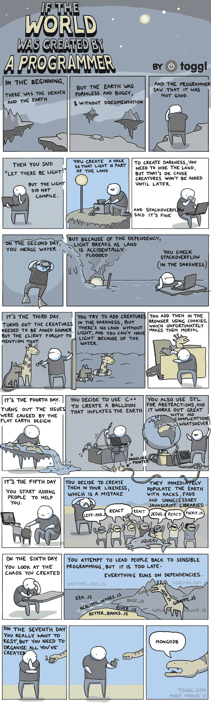

# 建议搞笑发展相关连环画！

> 原文：<https://dev.to/jannolii/suggest-funny-development-related-comic-strips-4o1>

有时候你需要关掉你的大脑，放松一下...查看一些开发相关的漫画，例如。我偶然看到了由团队成员 Mart Virkus 创作的有趣漫画。

[https://blog.toggl.com/world-created-programmer](https://blog.toggl.com/world-created-programmer)
*你可以在博文下面找到他其他漫画的链接(上面的链接)。*

我还知道 [xkcd](https://xkcd.com) (不只是 dev 相关)。

还有别的吗？建议？