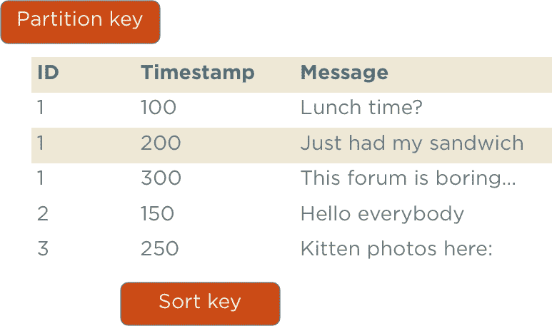
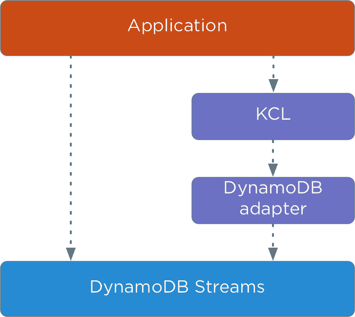
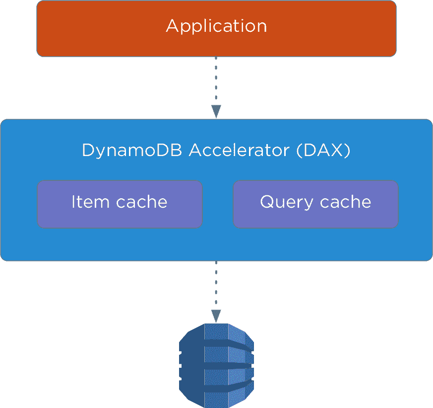

# 应该使用 DynamoDB 吗？

> 原文:[https://dev.to/mushketyk/should-you-use-dynamodb-5m5](https://dev.to/mushketyk/should-you-use-dynamodb-5m5)

为新项目选择合适的技术总是一件令人紧张的事情。我们需要找到能够满足所有现有需求、不会限制进一步增长、能够实现必要的性能、不会带来沉重的运营负担等的解决方案。选择一个数据库可能很棘手，这是很自然的。

在本文中，我将描述由 AWS 创建的 DynamoDB 数据库。我的目标是给你足够的知识，让你能够回答一个简单的问题:“我应该在我的下一个项目中使用 DynamoDB 吗？”。我将描述在什么情况下可以有效地使用 DynamoDB，以及应该避免什么陷阱。我希望这将帮助你使你的生活更容易。

本文将从 DynamoDB 的概述开始；然后我将展示如何为 DynamoDB 构建数据，以及使用 DynamoDB 有哪些选项。本文最后将简要介绍 DynamoDB 的一些高级特性。

# 什么是 DynamoDB

先说什么是 AWS DynamoDB。DynamoDB 是一个 [NoSQL](https://brewing.codes/2017/10/30/nosql-guide/) ，面向键值/文档的数据库。作为一个键值数据库，它允许存储一个带有 id 的条目，然后再取回一个条目。作为面向文档的数据库，它允许存储复杂的嵌套文档。

DynamoDB 是一个无服务器数据库，这意味着当您使用它时，您不需要担心单独的机器。事实上，甚至没有办法找出亚马逊使用了多少台机器来提供数据。您需要指定数据库应该处理多少个读写请求，而不是使用单独的服务器。

一方面，这允许 Amazon 提供可预测的低延迟，根据许多来源，如果请求来自同一 AWS 区域的 EC2 主机，则延迟小于 10 ms。如果为 DynamoDB 启用缓存，延迟甚至可以更低(< 1 ms)(在后面的小节中会详细介绍)。

另一方面，指定请求的数量而不是服务器的数量，可以让您专注于数据库的业务价值，而不是实现细节。如果您对需要处理的请求数量有一个估计，那么您需要做的就是在 AWS 控制台中指定一个数量或者执行一个 API 请求。这再简单不过了。

使用 DynamoDB 的价格主要取决于为 DynamoDB 数据库提供的容量。越高，每月的账单就越高。DynamoDB 还提供少量所谓的“突发容量”,可用于在短时间内读取或写入您的调配容量允许的更多数据。如果您已经使用了它，但仍在读取或写入更多数据，DynamoDB 将返回一个`ProvisionedThroughputExceededException`，您需要重试一个操作或提供更多容量。

除了这些主要特性之外，还有一些其他原因可以让您考虑使用 DynamoDB:

*   **大规模**——就像其他 AWS 服务 DynamoDB 可以大规模工作一样。Airbnb、Lyft 和 Duolingo 等许多其他公司都在生产中使用 DynamoDB。
*   **低运营开销**–您仍然需要完成一些运营任务，例如，确保您有足够的调配容量，但是大部分运营负载都由 AWS 团队承担。
*   **可靠**–尽管很少停机，DynamoDB 已经证明是坚如磐石的数据库解决方案。此外，写入 DynamoDB 的所有数据都被复制到三个不同的位置。
*   无模式——正如许多其他 NoSQL 数据库一样，DynamoDB 并不强加严格的模式，而是允许更大的灵活性。
*   **简单 API**–dynamo db API 非常简单。总的来说，它有不到二十种方法，其中只有一小部分与读写数据有关。
*   **自动伸缩**–伸缩 DynamoDB 数据库非常简单。您需要做的只是在特定的表上启用自动伸缩，AWS 将根据当前负载自动增加或减少供应的容量。或者，您可以执行 [UpdateTable](http://docs.aws.amazon.com/amazondynamodb/latest/APIReference/API_UpdateTable.html) API 调用并更改供应的容量。
*   **与其他 AWS 服务的集成**–dynamo db 是核心的 AWS 服务之一，与其他服务有很好的集成。您可以将它与 CloudSearch 一起使用，以实现全文搜索，使用 AWS EMR 执行数据分析，使用 AWS Data Pipeline 备份数据等。

# DynamoDB 中的数据模型

现在我们来看看如何在 DynamoDB 中存储数据。DynamoDB 中的数据被分成表。当您创建一个表时，您需要决定您的表将具有的键类型。DynamoDB 有两种类型的关键点，当您选择一种关键点类型并且一旦选择就不能更改时:

*   **简单键**–在这种情况下，您需要确定表中的哪个属性包含一个键。这个键称为分区键。对于这种键类型，DynamoDB 没有给你很大的灵活性，你能有效完成的唯一操作是用一个键存储一个元素并通过一个键返回一个元素。
*   **组合键**–在这种情况下，您需要指定两个键值，称为分区键和排序键。和前面的例子一样，您可以通过键获得一个条目，但是您也可以用一种更精细的方式查询这个数据。例如，您可以获得具有相同分区键的所有项目，根据排序键的值对结果数据进行排序，使用排序键的值过滤项目，等等。每个项目的分区/排序对应该是唯一的。

让我们看一些使用简单键和组合键的例子。例如，如果我们想在数据库中存储一个包含用户的表，我们可以使用一个包含简单键的表，并像这样存储它:

[T2】](https://res.cloudinary.com/practicaldev/image/fetch/s--7E0oi5A9--/c_limit%2Cf_auto%2Cfl_progressive%2Cq_auto%2Cw_880/https://brewing.codes/wp-content/uploads/2017/11/partition-key-3.png)

有了这个表，我们可以有效执行的唯一操作是通过 id 获取用户。

组合键允许更大的灵活性。例如，我们可以定义一个包含存储论坛消息的复合表，并选择用户 id 作为分区键，时间戳作为排序键:

[T2】](https://res.cloudinary.com/practicaldev/image/fetch/s--LnYyCJHT--/c_limit%2Cf_auto%2Cfl_progressive%2Cq_auto%2Cw_880/https://brewing.codes/wp-content/uploads/2017/11/composite-key-2.png)

这种结构允许执行更复杂的查询，如:

*   获取由具有指定 id 的用户撰写的所有论坛帖子
*   让指定用户写的所有论坛帖子按时间排序(我们可以这样做，因为我们有排序键)
*   获取在指定时间间隔内撰写的所有论坛帖子(我们可以这样做，因为我们可以在排序关键字上指定过滤表达式)

请注意，在这种情况下，您只能查询指定分区键的数据。如果您想要跨分区键搜索项目，您需要使用扫描操作。它允许在一个表中查找匹配指定过滤表达式的所有项目。这个操作没有前两个操作那么严格，但是它没有利用任何关于数据存储在 DynamoDB 中的位置的知识，并最终扫描整个表。

您应该尽量少使用扫描操作。虽然它提供了更大的灵活性，但速度明显较慢，并且消耗更多调配的容量。如果您广泛依赖于扫描大表，您将无法实现高性能，并且将不得不提供更多的容量，从而支付更多的钱。

## DynamoDB 中的一致性

与许多其他 NoSQL 数据库一样，在使用 DynamoDB 执行操作时，可以选择一致性级别。DynamoDB 存储每个项目的三个副本，当您向 DynamoDB 写入数据时，它只在三个副本中的两个被更新后才确认写入。第三个副本稍后更新。

当您从 DynamoDB 读取数据时，有两种选择。您可以使用强一致性，在这种情况下，DynamoDB 将从两个副本中读取数据并返回最新的数据，或者您可以选择最终一致性，在这种情况下，DynamoDB 将仅随机从一个副本中读取数据，并可能返回过时的数据。

## 指标

简单键和组合键模型限制性很强，不足以支持复杂的用例。为此，DynamoDB 支持两种索引类型:

*   **本地二级索引**–与组合键非常相似，用于定义额外的排序顺序或根据不同的标准过滤项目。与组合键的主要区别在于，一对分区/排序键应该是唯一的，但是一对分区/辅助索引不应该是唯一的。
*   **全局二级索引**–这允许为您的数据使用不同的分区键。如果您想通过两个 id 中的一个从表中获取一个项目，可以使用全局二级索引，例如，网上商店中的一本书可以有两个 id:ISBN-10 和 ISBN-13。与常规表一样，全局辅助索引可以有简单键和组合键。

在内部，全局二级索引只是在一个单独的 DynamoDB 表中用不同的键复制原始数据。当一个项被写入一个具有全局二级索引的表中时，DynamoDB 在后台复制数据。因此，将数据写入全局辅助节点最终总是一致的。

使用 DynamoDB，每个表最多可以创建五个本地二级索引和五个全局二级索引。

## 复杂数据

到目前为止，所有的例子都以表格的形式呈现数据，但是 DynamoDB 也支持复杂的数据类型。除了数字和字符串等简单数据类型，DynamoDB 还支持以下类型:

*   **嵌套对象**–dynamo db 中的属性值可以是复杂的嵌套对象
*   **Set**–一组数字、字符串或二进制值
*   **列表**–可以包含任何值的非类型化列表

# 程序化访问

如果你想访问 DynamoDB，f 你有两个主要的选择:[低级 API](http://docs.aws.amazon.com/amazondynamodb/latest/APIReference/API_Operations_Amazon_DynamoDB.html) 和 DynamoDB mapper。与 DynamoDB 的所有通信都是通过 HTTP 执行的。要读取数据，只有四种方法:

*   **GetItem**–从数据库中按 id 获取单个项目
*   **batch getitem**–通过 id 在一次调用中获取多个项目
*   **查询**–查询组合键或索引
*   **扫描**–扫描整个表格

在 DynamoDB 中，只有四种方法可以改变数据:

*   **put item**–向表格中写入一个新项目
*   **BatchWriteItem**–将多个项目写入表格
*   **update item**–更新指定项目中的一些字段
*   **删除项目**–通过 id 删除项目

所有方法都在表级别上工作。没有跨不同表工作的方法。

低级 API 是这些 HTTP 方法的一个薄薄的包装器。使用起来冗长繁琐。例如，要从 DynamoDB 表中获取一个条目，您需要编写这么多代码:

```
// Create DynamoDB client
AmazonDynamoDB client = AmazonDynamoDBClientBuilder.standard().build();

// Create a composite key
HashMap<String, AttributeValue> key = new HashMap<>();
key.put(”UserId”, new AttributeValue()
    .withN(”1”));
key.put(”Timestamp”,new AttributeValue().withN(“1498928631”));

// Create a request object
GetItemRequest request = new GetItemRequest()         
    .withTableName(”ForumMessages”)
    .withKey(key);

// Perform API request
GetItemResult result = client.getItem(request);
// Get attribute from the result item
AttributeValue year = result.getItem().get(”Message");
// Get string value 
String message = attributeValue.getS(); 
```

<svg width="20px" height="20px" viewBox="0 0 24 24" class="highlight-action crayons-icon highlight-action--fullscreen-on"><title>Enter fullscreen mode</title></svg> <svg width="20px" height="20px" viewBox="0 0 24 24" class="highlight-action crayons-icon highlight-action--fullscreen-off"><title>Exit fullscreen mode</title></svg>

代码非常简单。首先，我们创建一个键来通过键获取一个条目，然后像其他 AWS API 方法一样，我们创建一个请求对象并执行一个请求。这个例子是用 Java 编写的，但是 AWS 的 API 客户端也适用于其他语言，比如 Python。NET 平台和 JavaScript。

现在你可能想知道是否有一个库可以帮助避免这些大量的样板代码。事实上，AWS 为此实现了一个名为 DynamoDB mapper 的高级库。要使用它，你首先需要定义你的数据结构，就像你用 ORM 框架定义它一样:

```
// Specify table name
@DynamoDBTable(tableName=“ForumUsers”)
public class User {
    // "UserId" attribute is a key
    @DynamoDBHashKey(attributeName=“UserId”)
    public int getUserId() {
        return userId;
    }

    // Map this value to the "Name" attribute
    @DynamoDBAttribute(attributeName = ”Name”)
    public int getName() {
        return name;
    }
} 
```

<svg width="20px" height="20px" viewBox="0 0 24 24" class="highlight-action crayons-icon highlight-action--fullscreen-on"><title>Enter fullscreen mode</title></svg> <svg width="20px" height="20px" viewBox="0 0 24 24" class="highlight-action crayons-icon highlight-action--fullscreen-off"><title>Exit fullscreen mode</title></svg>

现在在 DynamoDB 中访问数据简单多了。我们需要做的就是创建一个`DynamoDBMapper`的实例并调用`load`方法:

```
// Create DynamoDB client (just as in the previous example)
AmazonDynamoDB client = AmazonDynamoDBClientBuilder.standard().build();
// Create DynamoDB mappper
DynamoDBMapper mapper = new DynamoDBMapper(client);

// Create a key instance
User key = new User();
key.setUserId(1);

// Get item by keys
User result = mapper.load(key); 
```

<svg width="20px" height="20px" viewBox="0 0 24 24" class="highlight-action crayons-icon highlight-action--fullscreen-on"><title>Enter fullscreen mode</title></svg> <svg width="20px" height="20px" viewBox="0 0 24 24" class="highlight-action crayons-icon highlight-action--fullscreen-off"><title>Exit fullscreen mode</title></svg>

注意，现在要指定一个条目的键，我们可以使用一个 Java POJO 类，而不是像前一个例子中的`HashMap`实例。

除非您需要访问 DynamoDB 的一些细节，或者需要实现一种自定义的做事方式，否则我建议您使用 DynamoDB mapper，并且只在必要时使用低级 API。这里的例子是用 Java 提供的，但是也有其他语言的 DynamoDB mapper 实现，比如[。NET 平台](http://docs.aws.amazon.com/amazondynamodb/latest/developerguide/DotNetSDKHighLevel.html)和 [Python](http://dynamodb-mapper.readthedocs.io/en/latest/) 。

您也可以使用非官方的库来访问 DynamoDB。例如，如果你正在使用 Spring，你可以考虑使用 Amazon DynamoDB 模块来处理 Spring 数据。

# 高级功能

到目前为止描述的所有特性都是 DynamoDB 的核心特性，但是它还有一些额外的更高级的特性，可以用来构建复杂的应用程序。在这一节中，我将提供一个简短的列表，列出这些特性是什么以及您可以用它们来做什么。

## 乐观锁定

分布式系统中的一个常见问题是，不同的参与者在并行执行操作时会互相影响。一个常见的例子是当两个不同的进程试图更新数据库中的同一项时。在这种情况下，第二次更新可以覆盖第一次更新写入的数据。

为了解决这个问题，DynamoDB 允许指定执行更新的条件。如果满足某个条件，则写入新数据，否则，DynamoDB 将返回一个错误。

使用这个在 DynamoDBMapper 中实现的特性的一个常见方法是维护一个带有项目的版本字段，并在每次更新时递增它。如果版本没有改变，进程可以写入新数据。否则，它将不得不重新读取数据并再次尝试执行操作。

这种技术也被称为乐观锁定，类似于用于实现无锁数据结构的[比较和交换](https://en.wikipedia.org/wiki/Compare-and-swap)操作。

## 交易

虽然 DynamoDB 没有对事务的内置支持，但 AWS 已经实现了一个 [Java 库](https://github.com/awslabs/dynamodb-transactions)，它在现有 DynamoDB 特性的基础上实现了事务。这里描述了一个详细的设计，但是简单地说，当你用 DynamoDB 事务库执行一个操作时，它会将一个已执行操作的列表存储到一个单独的表中，并在提交时应用存储的操作。

由于该库是开源的，所以没有什么可以阻止开发人员为其他语言实现类似的解决方案，但目前似乎只为 Java 实现了 DynamoDB 事务支持。

## 生存时间

并非所有存储在 DynamoDB 中的数据都应该永久存储。旧数据可以转移到更便宜的数据存储设备，比如 S3，或者干脆删除。为了自动删除旧数据，DynamoDB 实现了生存时间特性，该特性允许指定一个属性，该属性存储应该删除某个项目时的时间戳。DynamoDB 跟踪过期的项目，并删除它们，没有额外的费用。

## DynamoDB 流

另一个强大的 DynamoDB 特性是 DynamoDB 流。如果启用了它，它允许将不可变的有序更新流读取到 DynamoDB 表中。在执行更新后，一个项被写入流，并允许对 DynamoDB 的更改做出反应。如果您需要实现以下用例之一，这是一个至关重要的特性:

*   **跨区域复制**–您可能希望在一个单独的区域存储一份数据副本，以便更接近您的用户或备份您的数据。要实现它，您可以读取 DynamoDB 流，并在第二个数据库中重放更新操作。
*   **聚合表**–dynamo db 模型可能不适合您需要执行的一些查询。例如，如果需要按数据分组，DynamoDB 不支持开箱即用。为了实现这个特性，您可以读取 DynamoDB 更新流并维护一个符合 DynamoDB 模型并允许高效查询的聚合表。
*   **保持数据同步**–在许多情况下，您需要在不同的数据存储(如缓存或 CloudSearch)中维护数据的副本。DynamoDB streams 为此提供了巨大的帮助。因为 DynamoDB 流中的记录只有在数据存储在 DynamoDB 中时才会出现。

[T2】](https://res.cloudinary.com/practicaldev/image/fetch/s--_LgkQ0gI--/c_limit%2Cf_auto%2Cfl_progressive%2Cq_auto%2Cw_880/https://brewing.codes/wp-content/uploads/2017/11/kcl-image-2.png)

DynamoDB streams 的实现与另一个名为 Kinesis 的 AWS 服务非常相似。它们都有类似的 API，要从任何系统中读取数据，您可以使用 [Kinesis 客户端库](https://github.com/awslabs/amazon-kinesis-client) (KCL)，它提供了一个高级接口，用于从 Kinesis 或 DynamoDB 流中读取数据。请记住，DynamoDB streams API 和 Kinesis API 略有不同，所以您需要使用一个[适配器](https://github.com/awslabs/dynamodb-streams-kinesis-adapter)来使用 KCL 和 DynamoDB。

## DynamoDB 加速器(DAX)

与其他所有数据库一样，如果您使用 DynamoDB，使用缓存会有好处。不幸的是，[保持缓存一致性](https://martinfowler.com/bliki/TwoHardThings.html)可能很棘手。如果你使用像[elastic cache](https://aws.amazon.com/elasticache/)这样的缓存解决方案，利用 DynamoDB 流在缓存中维护你的数据副本可能是个好主意，但是最近 DynamoDB 引入了一个叫做 DynamoDB 加速器的新功能。

DAX 是 DynamoDB 的直写缓存层。它有和 DynamoDB 完全一样的 API，如果你启用了它，你应该通过它读写 DynamoDB。DAX 跟踪哪些数据被写入 DynamoDB，并且仅在 DynamoDB 确认写入时才存储这些数据。

[T2】](https://res.cloudinary.com/practicaldev/image/fetch/s--LO_M-lxO--/c_limit%2Cf_auto%2Cfl_progressive%2Cq_auto%2Cw_880/https://brewing.codes/wp-content/uploads/2017/11/dax-image-2.png)

使用 DAX 的主要优势之一是它具有亚毫秒级延迟，如果您有严格的 SLA，这一点可能尤为重要。

# 结论

DynamoDB 是一个很棒的数据库。它具有丰富的功能集、可预测的低延迟，并且几乎没有操作负载。有效使用它的关键是理解它的数据模型，并检查您的数据是否适合 DynamoDB。请记住，为了获得出色的性能，您需要尽可能多地使用查询，并尽量避免扫描操作。

这是一篇关于 DynamoDB 的介绍性文章，我会写更多，敬请关注。在此期间，你可以看看我的[深潜 DynamoDB 课程](http://bit.ly/dynamo-deep-dive)。你可以在这里观看[课程的预告。](http://bit.ly/dynamodb-preview)

你应该使用 DynamoDB 吗？最早出现在[酿造代号](https://brewing.codes)上。