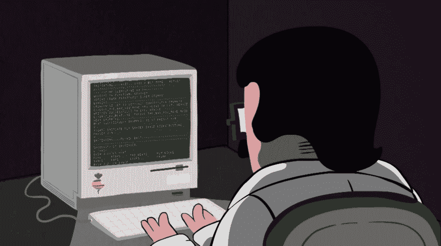

# 使用 Node.js 的简单电报 bot

> 原文:[https://dev . to/zaphodias/simple-telegraphs-bot-with-nodejs-317](https://dev.to/zaphodias/simple-telegrams-bot-with-nodejs-317)

第一篇文章在这里，耶！

今天我们要做一个很棒的电报机器人。
你需要一点 Node.js 和 [Telegram 的 bot 平台](https://core.telegram.org/bots/api)知识。是的，我不会教你你已经在别处读过的东西。

我们将使用 [Telegraf.js](https://telegraf.js.org/) 作为 Telegram API 的*包装器/框架*。这是一个非常棒的库，它简化了你在开发机器人时会遇到的许多烦人的任务。
T5 加上，就是[中间件驱动的](https://en.wikipedia.org/wiki/Message-oriented_middleware)。

说得够多了，我们开始吧。我们的机器人将有一个关键字列表，或命令，这将触发回复。机器人回复可以是简单的文本消息、贴纸或动画 GIF:

[T2】](https://res.cloudinary.com/practicaldev/image/fetch/s--OT5e8N1N--/c_limit%2Cf_auto%2Cfl_progressive%2Cq_66%2Cw_880/https://res.cloudinary.com/zaphodias/image/upload/f_auto/v1509899478/batman.gif)

## 1。创建 bot 帐户

假设你已经熟悉 Telegram，联系 [@BotFather](https://t.me/BotFather) 并创建你的 bot 账户。

请注意令牌(类似于`410509983:AAF3kbJrAGKIrW6ceOdrUg-zLlk5Tuy-NhU`)，我们稍后会用到它。

现在你必须*禁用隐私模式*，以使机器人能够阅读*所有*分组信息，而不仅仅是命令。

## 2。初始化目录

很简单。

```
$ mkdir coolbot
$ cd coolbot
$ npm init
# I'm assuming you already have Node & NPM installed. If not:
# https://nodejs.org/en/download/package-manager/ 
```

<svg width="20px" height="20px" viewBox="0 0 24 24" class="highlight-action crayons-icon highlight-action--fullscreen-on"><title>Enter fullscreen mode</title></svg> <svg width="20px" height="20px" viewBox="0 0 24 24" class="highlight-action crayons-icon highlight-action--fullscreen-off"><title>Exit fullscreen mode</title></svg>

现在回答 NPM 会问的几个问题-好了。我们现在可以安装 Telegraf.js 了。

为此:

```
$ npm install --save telegraf 
```

<svg width="20px" height="20px" viewBox="0 0 24 24" class="highlight-action crayons-icon highlight-action--fullscreen-on"><title>Enter fullscreen mode</title></svg> <svg width="20px" height="20px" viewBox="0 0 24 24" class="highlight-action crayons-icon highlight-action--fullscreen-off"><title>Exit fullscreen mode</title></svg>

您的文件夹中会有一个 package.json 文件，编辑`scripts`部分以添加一个“开始”脚本:

```
"scripts": {
  "start": "node main.js",
  "test": "echo \"Error: no test specified\" && exit 1"
}, 
```

<svg width="20px" height="20px" viewBox="0 0 24 24" class="highlight-action crayons-icon highlight-action--fullscreen-on"><title>Enter fullscreen mode</title></svg> <svg width="20px" height="20px" viewBox="0 0 24 24" class="highlight-action crayons-icon highlight-action--fullscreen-off"><title>Exit fullscreen mode</title></svg>

## 3。让我们编码

[T2】](https://res.cloudinary.com/practicaldev/image/fetch/s--95y5eU9n--/c_limit%2Cf_auto%2Cfl_progressive%2Cq_66%2Cw_880/https://res.cloudinary.com/zaphodias/image/upload/f_auto/v1509903780/coding.gif)

我认为代码很容易理解，我添加了一些注释使它更容易理解。

我们希望机器人有一个触发器列表，并为每个触发器发送回复。回复可以是短信、贴纸或 GIF。

作为一个漂亮的特性，我们还希望如果我使用触发器之一回复约翰的消息，机器人应该发送他的消息来回复约翰的消息。

我知道，这里的英语很差。)

稍后将在一个单独的文件中定义这些触发器。现在，让我们来看看机器人的核心: