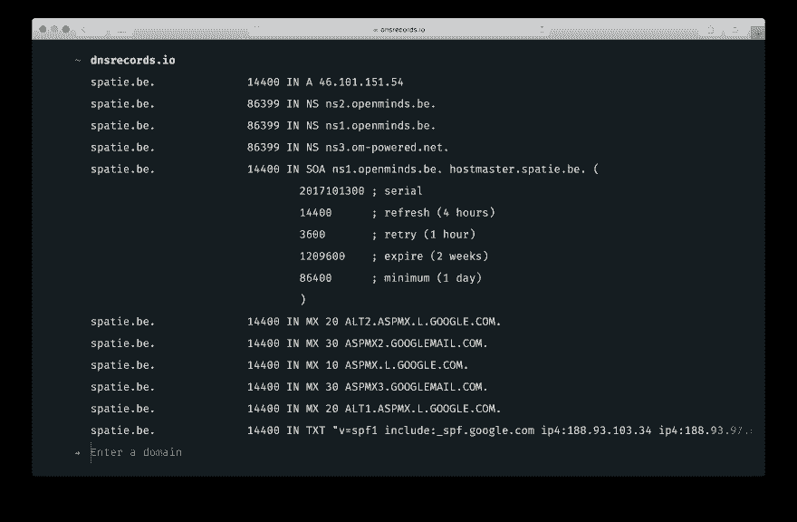
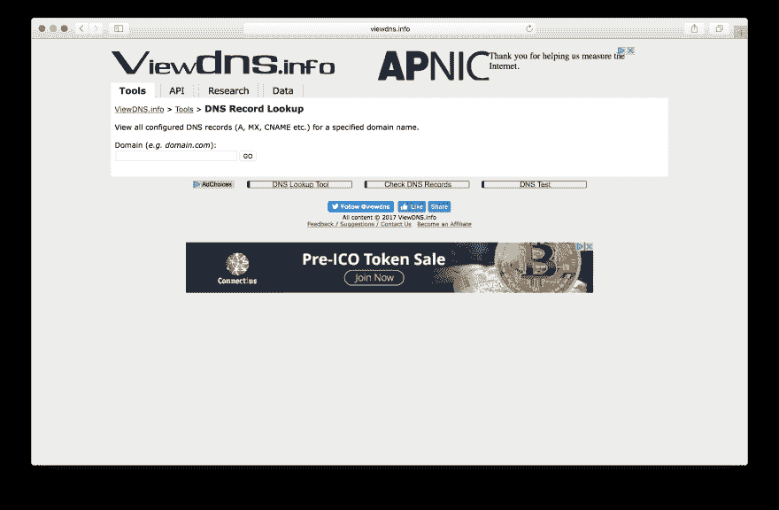
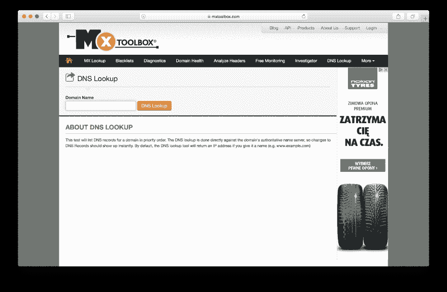
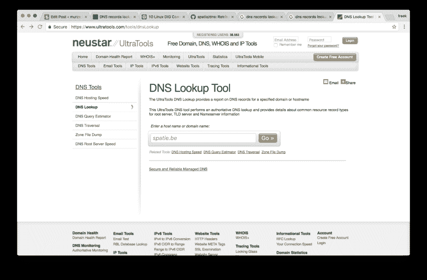
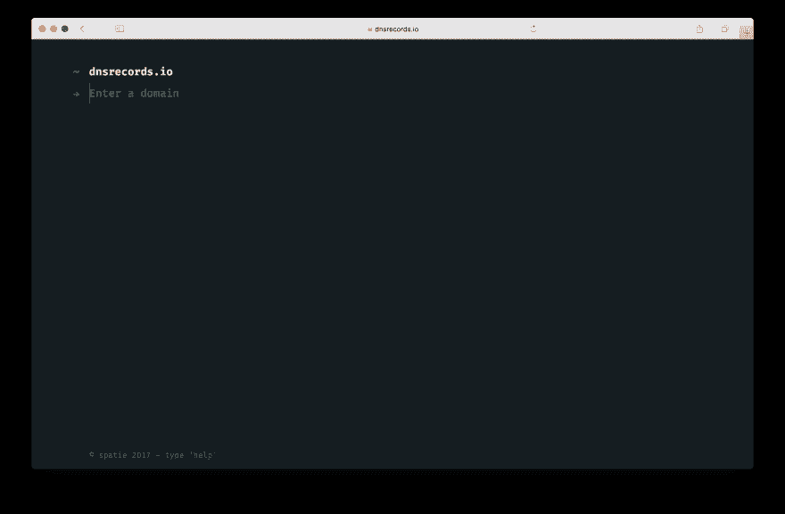
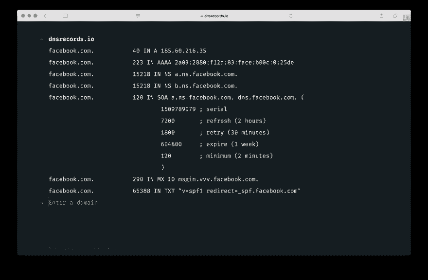
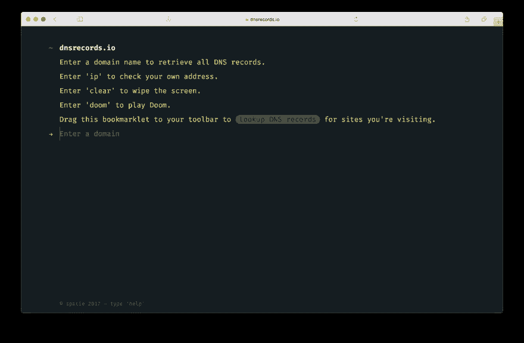

# ★一个漂亮的获取 dns 记录的 webapp

> 原文：<https://dev.to/freekmurze/a-beautiful-webapp-to-fetch-dns-records-1nfp>

最近[我的公司 Spatie](https://spatie.be) 推出了 [https://dnsrecords.io](https://dnsrecords.io) ，一个快速查找 dns 记录的漂亮网站。

[T2】](https://res.cloudinary.com/practicaldev/image/fetch/s--0TiKxUNv--/c_limit%2Cf_auto%2Cfl_progressive%2Cq_auto%2Cw_880/https://freek.dev/uploads/2017/11/Screen-Shot-2017-11-04-at-10.31.58.png)

一如既往，我们也开源了它，这是 GitHub 上的源代码[。如果你想在你自己的应用中做一些 dns 查找，你会很高兴知道我们把 dns 查找功能提取到](https://github.com/spatie/dnsrecords.io)[一个包](https://github.com/spatie/dns)。

在这篇博文中，我想分享我们为什么以及如何建立这一切。

### 为什么要创建另一个 dns 查找服务？

几周前[杰夫](https://twitter.com/vdv_jef)，我们在[斯派特](https://spatie.be)的项目经理，被一个客户要求提供一些 dns 相关信息。因为 Jef 不是技术人员。他对终端有一种恐惧/憎恨的关系。所以他总是把这样的技术问题委托给他的队友。他们只是用 [`dig`](http://www.thegeekstuff.com/2012/02/dig-command-examples/) 来快速获取 dns 记录。如果 Jef 可以自己进行 dns 查找，那不是很好吗？一个想法诞生了。

但是不是已经有很多执行 dns 查找的服务了吗？让我们在谷歌上搜索一下。以下是一些最初的成功案例:

[](https://res.cloudinary.com/practicaldev/image/fetch/s--FGpuM4CR--/c_limit%2Cf_auto%2Cfl_progressive%2Cq_auto%2Cw_880/https://freek.dev/uploads/2017/11/Screen-Shot-2017-11-04-at-10.41.16.png)[](https://res.cloudinary.com/practicaldev/image/fetch/s--MzhIZZKX--/c_limit%2Cf_auto%2Cfl_progressive%2Cq_auto%2Cw_880/https://freek.dev/uploads/2017/11/Screen-Shot-2017-11-04-at-10.39.42.png)[](https://res.cloudinary.com/practicaldev/image/fetch/s--xurR3pzv--/c_limit%2Cf_auto%2Cfl_progressive%2Cq_auto%2Cw_880/https://freek.dev/uploads/2017/11/Screen-Shot-2017-11-04-at-10.44.36.png)

大部分服务都可以用，但是真的真的很丑。我们找不到任何好看的 dns 查找服务。所以我们继续创建我们自己的 webapp。

### 介绍 dnsrecords.io

我的同事 [Willem](https://twitter.com/willemvbockstal) 在让 [dnsrecords.io](https://dnsrecords.io) 看起来很漂亮方面做得非常出色。这是你参观网站时看到的。

[T2】](https://res.cloudinary.com/practicaldev/image/fetch/s--6EaCLPNg--/c_limit%2Cf_auto%2Cfl_progressive%2Cq_auto%2Cw_880/https://freek.dev/uploads/2017/11/Screen-Shot-2017-11-04-at-10.50.31.png)

不像其他网站那样让人分心。只要输入一个域就可以得到一些记录。再简单不过了。

[T2】](https://res.cloudinary.com/practicaldev/image/fetch/s--AwBs3CfV--/c_limit%2Cf_auto%2Cfl_progressive%2Cq_auto%2Cw_880/https://freek.dev/uploads/2017/11/Screen-Shot-2017-11-04-at-10.52.17.png)

结果显示在具有可共享链接的链接上。你可以访问 https://dnsrecords.io/facebook.com 获得脸书的域名系统记录。

如果你输入`help`,你会看到一些你可以在我们的应用上执行的额外命令:

[T2】](https://res.cloudinary.com/practicaldev/image/fetch/s--TBizEfN1--/c_limit%2Cf_auto%2Cfl_progressive%2Cq_auto%2Cw_880/https://freek.dev/uploads/2017/11/Screen-Shot-2017-11-04-at-10.57.51.png)

我们真正的杀手锏当然是你可以玩[末日](https://js-dos.com/games/doom.exe.html)。继续和这个优秀的游戏浪费一些时间。当你完成后，继续拖动书签到你的工具栏，查找你访问的网站的 dns 记录。

### 幕后

我们已经开源了整个网站。您可以在 GitHub 上的 repo [中查看实际部署到我们服务器的代码。](https://github.com/spatie/dnsrecords.io)

让我们浏览一下代码。当查看这个项目中唯一的控制器的早期版本时，您会看到[所有的事情都发生在这个控制器内部。但是因为我们想容易地在特性中添加更多的命令，所以我们对它进行了相当多的重构。在](https://github.com/spatie/dnsrecords.io/blob/40de729e67ed38033f9636f6cf5f7843cd898166/app/Http/Controllers/HomeController.php)[当前版本中，控制器](https://raw.githubusercontent.com/spatie/dnsrecords.io/master/app/Http/Controllers/HomeController.php)非常瘦:

```
<?php

namespace App\Http\Controllers;

use App\Services\Commands\CommandChain;
use Illuminate\Http\Request;

class HomeController extends Controller
{
    public function index()
    {
        return view('home.index');
    }

    public function submit($command = null, Request $request)
    {
        $command = $request['command'] ?? $command;

        if (!$command) {
            return $this->index();
        }

        return (new CommandChain())->perform(strtolower($command));
    }
} 
```

每一个提交的`$command`都被委托给一个`CommandChain`。让我们看看那个`CommandChain`的代码。

```
<br />class CommandChain
{
    protected $commands = [
        Manual::class,
        Localhost::class,
        Clear::class,
        Ip::class,
        Doom::class,
        DnsLookup::class,
    ];

    public function perform(string $command): Response
    {
        return collect($this->commands)
                ->map(function (string $commandClassName) {
                    return new $commandClassName;
                })
                ->first->canPerform($command)
                ->perform($command);
    }
} 
```

你会在上面看到，我们向链中注册了一些命令类。在`perform`中，我们将实例化它们。链会问每个类:“你会表演这个`$command`吗？”。第一个会表演 T2 的人。

让我们来看看这样一个命令类。下面是[的代码`Doom`命令](https://github.com/spatie/dnsrecords.io/blob/master/app/Services/Commands/Commands/Doom.php) :

```
namespace App\Services\Commands\Commands;

use App\Services\Commands\Command;
use Symfony\Component\HttpFoundation\Response;

class Doom implements Command
{
    public function canPerform(string $command): bool
    {
        return $command === 'doom';
    }

    public function perform(string $command): Response
    {
        return redirect('https://js-dos.com/games/doom.exe.html');
    }
} 
```

一个`Command`类的`perform`函数总是返回`Illuminate\Http\Response`。在`Doom`命令的情况下，我们将返回一个重定向到你可以玩毁灭战士的网站。

让我们来看看另一个命令，[命令`DnsLookup`命令](https://github.com/spatie/dnsrecords.io/blob/master/app/Services/Commands/Commands/DnsLookup.php) :

```
namespace App\Services\Commands\Commands;

use App\Services\Commands\Command;
use App\Services\DnsRecordsRetriever;
use Spatie\Dns\Dns;
use Symfony\Component\HttpFoundation\Response;

class DnsLookup implements Command
{
    public function canPerform(string $command): bool
    {
        return true;
    }

    public function perform(string $command): Response
    {
        $dns = new Dns($command);

        $dnsRecords = $dns->getRecords();

        $domain = $dns->getDomain($command);

        if ($dnsRecords === '') {
            $errorText = __('errors.noDnsRecordsFound', compact('domain'));

            flash()->error($errorText);

            return redirect('/');
        }

        return response()->view('home.index', ['output' => $dnsRecords, 'domain' => $domain]);
    }
} 
```

注意到`canPerform`返回`true`。这个命令基本上是说，我可以处理一切。如果你再次查看`CommandChain`中的`$commands`数组，你会发现`DnsLookup`是最后注册的。因此，当没有其他命令可以处理`$command`时，`DnsLookup`将完成它的任务。

查找 dns 记录的真正魔力发生在那个`Spatie\Dns\Dns`对象内部，它是我们的[spatie/DNS 包](https://github.com/spatie/dns)的一部分。

你可以这样使用它:

```
$dns = new Spatie\Dns('spatie.be');

$dns->getRecords(); // returns all records

$dns->getRecords('A'); // returns only A records
$dns->getRecords('MX'); // returns only MX records

$dns->getRecords('A', 'MX'); // returns both A and MX records
$dns->getRecords(['A', 'MX']); // returns both A and MX records 
```

通过调用 [`dig`](http://www.thegeekstuff.com/2012/02/dig-command-examples/) (一个查找 dns 相关信息的命令行工具)来实际查找那个包中的 dns 记录。

这是发生调用的[`Spatie\Dns\Dns`类](https://github.com/spatie/dns/blob/master/src/Dns.php)中的相关函数。

```
protected function getRecordsOfType(string $type): string
{
    $command = 'dig +nocmd '.escapeshellarg($this->domain)." {$type} +multiline +noall +answer";

    $process = new Process($command);

    $process->run();

    if (! $process->isSuccessful()) {
        throw new Exception('Dns records could not be fetched');
    }

    return $process->getOutput();
} 
```

### 在关闭

我希望你已经喜欢了这个 [https://dnsrecords.io](https://dnsrecords.io) 的幕后小故事。我想强调的是，创建这项服务是[团队](https://spatie.be/en/team)的努力。我们团队的每个成员都帮助改进了代码。我们还得到了社区的一些巨大贡献，对此我们表示感谢。

这不是我们开源的第一个项目。如果你想看我们团队的更多工作，看看我们的[仪表板](https://freek.dev/2017/06/building-realtime-dashboard-powered-laravel-vue-2017-edition/)，或者我们之前创建的许多[拉弗尔](https://spatie.be/en/opensource/laravel)、 [PHP](https://spatie.be/en/opensource/php) 和 [JavaScript](https://spatie.be/en/opensource/javascript) 包。想要支持我们的开源努力吗？然后考虑，成为[一个 patreon](https://www.patreon.com/spatie) 。