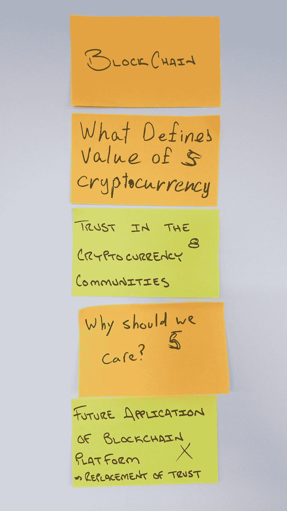

# 区块链上的 DEV3L

> 原文:[https://dev.to/dev3l/dev3l-on-blockchain-6be](https://dev.to/dev3l/dev3l-on-blockchain-6be)

### TL；速度三角形定位法(dead reckoning)

我了解了一点区块链技术...你也可以！

观看这些视频:~50 分钟

*   [初学比特币](https://www.youtube.com/watch?v=Nk-60F3CCx0)
*   [比特币如何在 5 分钟内发挥作用](https://www.youtube.com/watch?v=l9jOJk30eQs)
*   [比特币如何在幕后运作](https://www.youtube.com/watch?v=Lx9zgZCMqXE)

做这个教程:~1-3 个小时:

*   [打造自己的区块链服务器](https://hackernoon.com/learn-blockchains-by-building-one-117428612f46)

* * *

我想找个地方写一些随机的话题。我想这可能会成为我经常做的事情...

# 背景

我在工作中经营一个学习(阅读)小组。我们每周见一次面。我们通过 [Lean Coffee](http://leancoffee.org/) meetup 的形式，一次讨论几章技术书籍。有常客，但出席人数因书或主题而异。

我促成了一场关于区块链技术的对话！我就是这样准备的。

# 探索和学习

我和聪明人一起工作，你也应该这样...

首先，我在工作中询问人们目前热衷的技术兴趣和话题。我发现一些人经常热情地提起比特币和区块链技术！(接下来是机器学习)

他们让我去找一个叫安德烈亚斯·安东诺普洛斯的人。所以，我用谷歌搜索了他...我的专业知识之旅就这样开始了。

我发现安德烈亚斯·安东诺普洛斯(Andreas Antonopoulos)为初学者介绍的比特币(T1)很有帮助。对于任何技术友好的人来说，观看这个 25 分钟的视频会让你的理解水平远远超过许多狂热的比特币爱好者。

我看了其他几个视频，[比特币如何在 5 分钟内工作](https://www.youtube.com/watch?v=l9jOJk30eQs)和[比特币如何在引擎盖下工作](https://www.youtube.com/watch?v=Lx9zgZCMqXE)...这是官方的，我现在是比特币专家。

# Python 中的区块链例子

概念验证是进一步理解主题的好方法！

偶遇并跟随[打造自己的区块链服务器](https://hackernoon.com/learn-blockchains-by-building-one-117428612f46) blogpost 教程， *5/7 满分*。这是一次深入区块链世界的梦幻般的技术实践，强烈推荐。

这是我的 GitHub 库，里面有我的作品:[https://github.com/DEV3L/python-flask-blockchain](https://github.com/DEV3L/python-flask-blockchain)

有一天，我可能会把我的发现作为一个拉取请求贡献给作者的知识库:)

# 阐述

> “现在，这将是一个直接走开，老学校的规则。第一次模特走秀；第二个模型复制，然后阐述。好了，小伙子们——我们去工作吧！”《超级名模》中的大卫·鲍依

我有一个 Heroku 账户。如果你没有，我会推荐它。这是托管原型应用程序的一种免费且简单的方式。你可以跟随这个教程[开始使用 Python](https://devcenter.heroku.com/articles/getting-started-with-python#introduction) 来让你快速上手。

在 Heroku，我创建了两个新的应用程序。每个都指向上面链接的同一个[python-flask-区块链](https://github.com/DEV3L/python-flask-blockchain) GitHub 账户。

现在 heroku 上有两个“节点”:

*   [https://flask-blockchain.herokuapp.com/](https://flask-blockchain.herokuapp.com/)
*   [https://flask-blockchain2.herokuapp.com/](https://flask-blockchain2.herokuapp.com/)

GitHub 库中有一个 postman 集合，可以行使 api - [区块链 Heroku.postman_collection](https://github.com/DEV3L/python-flask-blockchain/blob/master/postman_collections/Blockchain%20Heroku.postman_collection) (对于本地节点也存在集合)。将集合加载到 postman 中显示了一些不言自明的请求。

互相注册 heroku-1 和 heroku-2。我在 heroku-1 上。决心去 heroku-2。由于 heroku-2 的链更小，一致同意用 heroku-1 代替它的链...这是演示区块链技术如何工作的最简单的工作流程！

我们现在都是专家了！

# 跑去精益咖啡聚会

**主题**:持续学习小组——我们来说说:区块链！(比特币)

**描述**:我们组织中有几个人对区块链技术和比特币等加密货币充满热情！大家来说说吧！！！

差不多有十个人来了，相当多。我们以视频[比特币如何在 5 分钟内工作](https://www.youtube.com/watch?v=l9jOJk30eQs)开始了会议。该小组在视频播放时写下了要讨论的话题。我们投票，然后讨论以下每个主题大约五分钟！

[T2】](https://res.cloudinary.com/practicaldev/image/fetch/s--Ukj4UZA5--/c_limit%2Cf_auto%2Cfl_progressive%2Cq_auto%2Cw_880/https://thepracticaldev.s3.amazonaws.com/i/lkywk12zpdm36uec6s0m.jpg)