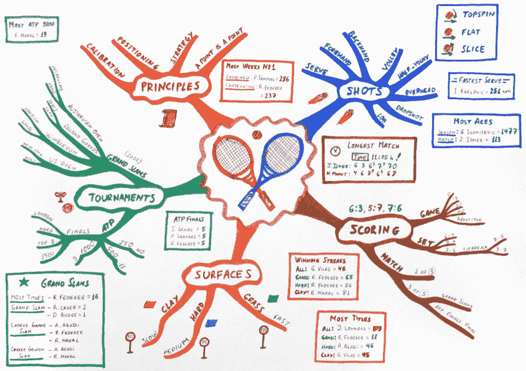

# 如何记录需求并且不让人睡觉

> 原文:[https://dev . to/Shu haid/how-to-document-requirements-and-not-put-people-sleep-dg3](https://dev.to/shuhaid/how-to-document-requirements-and-not-put-people-to-sleep-dg3)

一个项目需求文档，无论是功能性的还是技术性的，对于任何技术人员来说都是一个打盹的节日。项目的开始是最重要的阶段。经过深思熟虑的需求在项目的成功中扮演着重要的角色。但是这可能仍然是软件开发周期中最关键也是最无聊的阶段。

另一方面，想象需求书写者的心态。有人煞费苦心地试图记录下他们可能想象到的每一个场景。非常清楚，当实现开始时，很有可能会遗漏一些东西。

加入一些其他的挑战:

*   您正在与分布在不同地理位置的开发团队打交道。英语不是他们第一语言的地方。在这种情况下，很多东西会在翻译中丢失，这不是任何人的错。*   您有一组需求文档，这些文档捕获了第一天所需的一切。当变化接踵而至时，你如何保持这种趋势？*   您希望您的开发团队对项目有一个整体的看法，即使他们的关注领域仅限于整个项目的一组组件。

就个人而言，我已经开始相信使用[思维导图](https://en.wikipedia.org/wiki/Mind_map)来捕获系统需求是缓解这些挑战的最佳方式。

### 读懂某人的心思或向某人敞开心扉

看看这张描述网球新手的思维导图  *礼貌[维基百科](https://en.wikipedia.org/wiki/Mind_map)*

这张地图涵盖了游戏中的击球类型、得分机制、比赛场地、关键比赛和关键原则。除此之外，它还涵盖了一些琐事，比如最快的发球和其他一些信息。足以将一个人对这项运动的理解从新手提升到业余水平。

如果在一个文档中包含相同级别的信息，将会很冗长，并可能中途失去很大一部分读者。以思维导图的形式书写信息会增加你的读者浏览你所记录的一切的机会。而且，这种格式也增加了概念被理解的机会。

下面是你如何开始在你的项目中使用它。

1.  要开始思维导图，请尝试免费的思维导图，它使创建和分发地图文件变得简单。
2.  下载并安装 FreeMind 后，尝试记录您正在处理的项目或模块。
3.  将您正在记录的项目或模块的名称放在第一个(根)节点中。从格式菜单选项中点击自动布局。这将确保你的地图从一开始就看起来非常正确。您可以随时编辑这些布局选项。
4.  确定你的关键股东，并把它作为你根节点之后的第一组节点。例如，对于票务系统，客户和客户服务团队可能是第一组节点。
5.  接下来，确定每个利益相关者的关键用例。为了前任。客户需要能够提出一张票，并检查他们的票的状态。您可以向这些节点添加后续节点，并详述与您正在处理的节点相关联的字段和规则。
6.  如果您需要向特定节点添加解释或注释，请单击该节点并导航到“查看”菜单选项，然后单击“注释窗口”。

这里的美妙之处在于，每个节点都有一个上下文，因为它位于层次结构中的某个位置。如果你的用户在阅读时丢失了上下文，他们只需要在层次结构中找到上下文。在解释概念或项目功能时，使思维导图易于浏览。

详细的思维导图可以非常大，可以详细地涵盖项目的每个方面。如果你以前没有尝试过，这当然值得一试。这里还有一些思维导图的用法。看看这个。