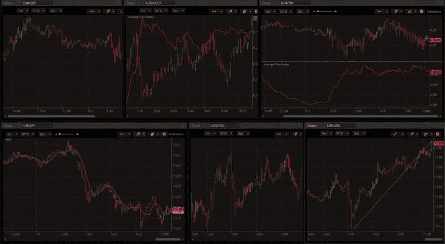
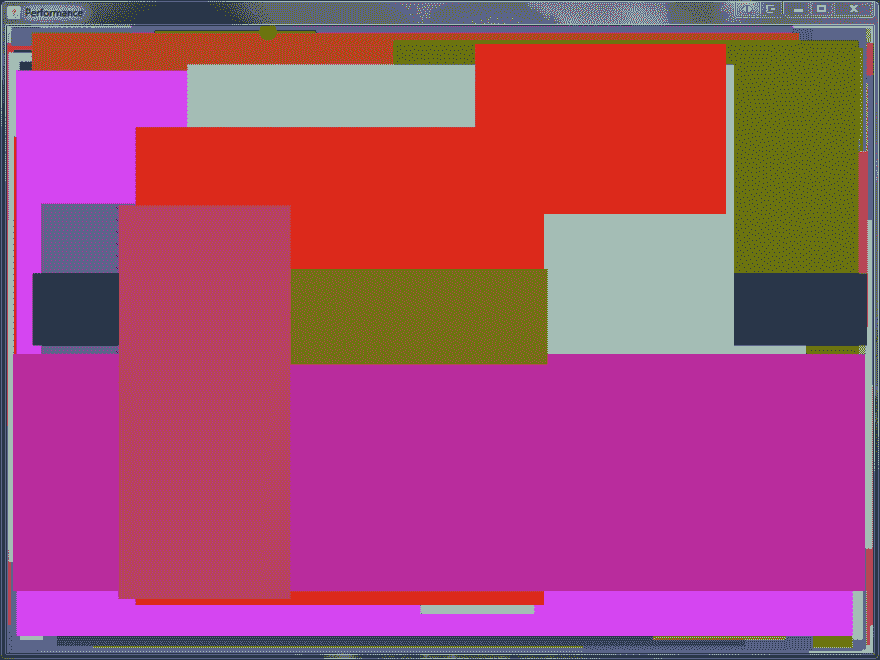
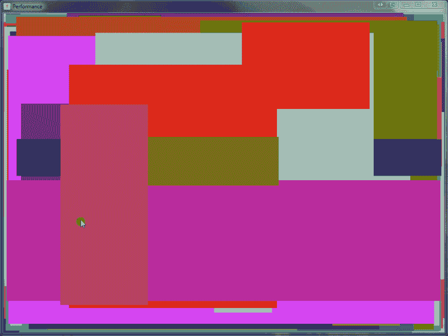
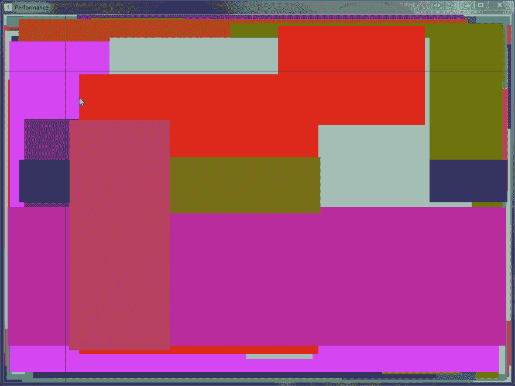
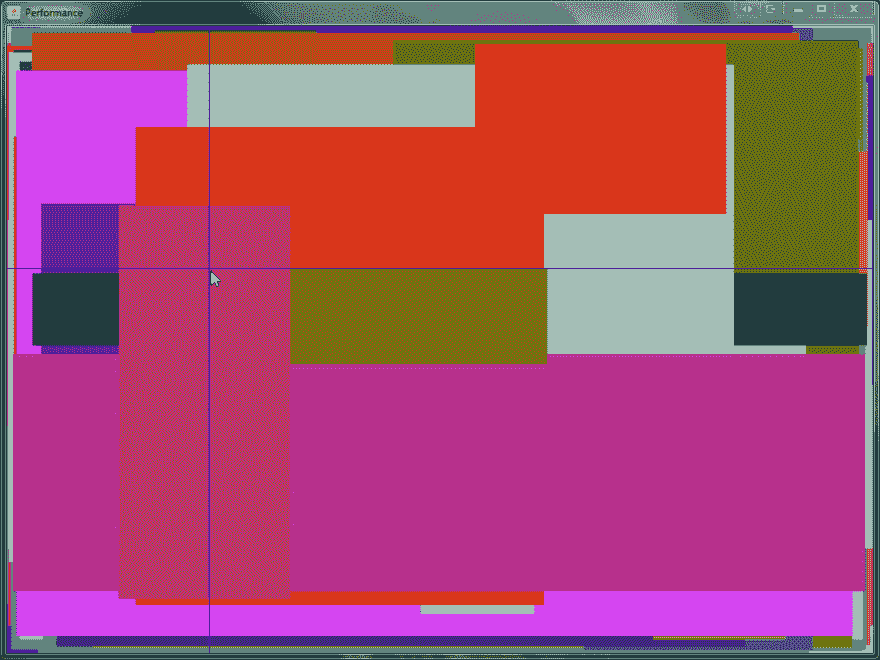

# 摇摆:老歌但歌蒂

> 原文：<https://dev.to/devexperts/swing-oldie-but-goldie-ahe>

没有人谈论 Swing 的退休——尽管它正处于黄金时代。正如您可能想象的那样，它是 GUI 创建中使用最多的 JAVA 库。这是有道理的，因为基于 Swing 的应用程序可以具有任何复杂性，并且看起来(和工作起来！)在任何操作系统上运行时都一样。当然，这是有代价的:随着应用程序变得越来越复杂，积累了大量的自定义图形，您肯定会遇到性能和响应速度方面的问题。

[T2】](https://blog.devexperts.com/wp-content/uploads/2017/10/swing.png)

在 Devexperts，我们开发了这种类型的应用程序，它是经纪人的交易平台。由于在众多窗口中有大量的图形，这个应用程序是为多显示器配置而设计的(见下面的截图)——所以你可能会惊讶地发现它的客户端完全是基于 Swing 的。

在这里，我们将讨论在使用 Swing 时应该记住什么。我们还将分享一些提升应用性能的技巧和诀窍。

**样本应用**

为了简单起见，我们将在一个非常基本的示例应用程序的上下文中讨论所有的例子，没有什么太疯狂的。既然我们聚集在这里是为了图形界面，我们将相应地选择应用程序。让我们画 500 个不同大小的矩形，还有一个圆形作为鼠标光标。这个应用程序的第一个实现如下所示:

```
public class MouseCirclePaintingComponentForSlide extends JPanel {
  private Point currentMousePoint = new Point(-1, -1);

  MouseCirclePaintingComponentForSlide() {
      addMouseMotionListener(new MouseAdapter() {
          @Override
          public void mouseMoved(MouseEvent e) {
              currentMousePoint = e.getPoint();
              repaint();
          }
      });
  }

  @Override
  protected void paintComponent(Graphics g) {
      super.paintComponent(g);
      Graphics2D g2 = (Graphics2D) g.create();

      // paint 500 rectangles
      // paint mouse cursor

      g2.dispose();
  }
} 
```

在普通计算机上启动该应用程序肯定会导致以下结果:

[T2】](https://res.cloudinary.com/practicaldev/image/fetch/s--n1Bh3I_t--/c_limit%2Cf_auto%2Cfl_progressive%2Cq_66%2Cw_880/https://thepracticaldev.s3.amazonaws.com/i/lj1myzpqm4x0yvh8bufi.gif)

你首先看到的是鼠标移动和圆形渲染之间的滞后。虽然找出滞后背后的原因并不完全是火箭科学(剧透:500 个矩形，卡尔！)，让我们假设应用程序很复杂，这个原因还没有揭示。在现实生活中，我们也可以在每次发布时收集指标，看看在我们最近的构建中滞后的情况是否恶化了。这就是为什么这里要讨论的第一件事是测量绘图代码的性能。

**交给侧写师！**

可以预料，最基本和最明显的方法是测量 paintComponent 方法的运行时。这里可能会出什么问题呢？让我们看看！示例代码可能是这样的:

```
@Override
protected void paintComponent(Graphics g) {
    super.paintComponent(g);
    long start = System.nanoTime();

    // paint rectangles here

    long elapsed = System.nanoTime() - start;
    System.out.println("paintComponent: " + TimeUnit.NANOSECONDS.toMillis(elapsed) + " ms");
} 
```

一切都很酷，我们已经这样做过上千次了。启动应用程序，我们将看到以下内容:

```
paintComponent: 0 ms
paintComponent: 0 ms
paintComponent: 0 ms
paintComponent: 0 ms
paintComponent: 0 ms
paintComponent: 0 ms
paintComponent: 0 ms
paintComponent: 0 ms

```

这些数字至少令人困惑。矩形真的画得这么快吗？考虑到光标明显滞后，我们很难相信这一点！让我们看看侧写器里有什么。

对我们的应用程序进行分析后，我们得到了奇怪的结果:AWT 完全闲置了！这是怎么回事？要回答这个问题，我们不妨再看一下分析器。在线程监控图表中，您可以看到这个 D3D 屏幕更新程序线程在 AWT 不活动时工作。深入挖掘一下，您会发现 AWT 不仅仅是不活动，它还在等待什么。而这个东西恰好是 D3D。

这里，有一个简短的题外话是必要的:你不会在每台机器上都看到这个 AWT-D3D 的东西(更不用说你只能在 Windows 上看到 D3D)。根据您的硬件参数，也有可能您根本无法观察到任何额外的线程——但这更像是一个例外。

那么，回到我们的问题——这些线程到底发生了什么？事情是这样的，当你执行像 drawLine 或 drawRect 这样的绘画方法时，绘画并没有真正发生。Swing 试图启用硬件加速——在本例中是 D3D——当调用绘制方法时，命令被记录到一个特殊的缓冲区(RenderBuffer)。另一方面，绘制是在稍后完成的，此时重画管理器在屏幕上完成图像命令副本的绘制周期。这也是将控制传递给 D3D 线程的时刻，该线程执行存储在缓冲区中的所有命令。这意味着 AWT 将等待，直到 D3D 完成。

**测量 101**

那么，我们如何度量方法的执行时间呢？实际上有几种方法可以做到这一点。首先是使用相应的标志简单地关闭硬件加速。这将迫使 Java 在 AWT 中独立完成绘图。当然，这不完全是一个简单的测量方法，但是它至少允许我们测量一些相对的度量。例如，我们将能够定义一个组件相对于另一个组件的绘制速度有多慢。分析器还会显示真实数据。现在我们看到所有的时间都花在画矩形上了。

作为替代，我们可以测量 paintImmediately 方法的执行时间。

还有其他不需要关闭硬件加速的分析方法。这些并不总是精确的(当测量单个组件时),更适合于评估应用程序的整体响应，或者比较新版本和以前的版本。长话短说，它们可能在复杂的应用程序中非常有用。

让我们从重新定义标准 repaintManager 并记录 paintDirtyRegions 方法的执行时间的技术开始。这种方法的一个优点是，它允许我们获得 AWT 中每次迭代的精确度量(包括 D3D 等待时间)。另一方面，它的覆盖范围如此之大，以至于我们无法真正确定哪个组件需要花费最多的时间来绘制。

接下来:EventQueue 的替代品。如果我们用自定义队列替换 EventQueue，我们将可以自由地重新定义 dispatchEvent 方法，并测量队列中每个事件的执行时间。此外，这将允许我们测量某些事件执行前的延迟。根据经验，对于具有返回特定事件的创建时间戳的 getTime 方法的事件，可以这样做。基本上，这些都是鼠标事件，重画事件，以及其他一些事件。该队列中的重画事件通常由 InvocationEvent 类表示。有时这个类代表其他事件，但总的来说，它不影响测量。

这是这种队列最基本的例子。

```
public class MonitoringEventQueue extends EventQueue {
  @Override
  protected void dispatchEvent(AWTEvent event) {
      if (event instanceof InvocationEvent) {
          InvocationEvent invocationEvent = (InvocationEvent) event;
          long waitingInQueueTime = System.currentTimeMillis() - invocationEvent.getWhen();
          System.out.println("In queue: " + waitingInQueueTime + "ms" + " : " + event.toString());
      }
      long start = System.nanoTime();
      super.dispatchEvent(event);
      long elapsed = System.nanoTime() - start;
      System.out.println("dispatchEvent: " + TimeUnit.NANOSECONDS.toMillis(elapsed) + " ms");
  }
} 
```

这种方法既高效又方便，尤其是当您必须测量应用程序的整体响应时——而且它允许冻结捕捉！例如，如果某个事件在队列上花费了太多时间，您可以向用户发送消息。

我们在每个新版本的 UI 客户端的性能测试中使用这种方法。

**优化:回归经典**

那么，我们已经成功地测量了性能，是时候回到我们最初的问题了:如何优化示例应用程序以消除光标滞后？我们知道，在我们的例子中，绘制矩形时速度非常慢。顺便说一下，在大多数情况下，简单的渲染操作似乎是瓶颈。

让我们仔细看看鼠标处理程序的代码。有什么问题吗？很明显，光标只有 20 个像素，但是我们仍然在重新绘制整个组件。

那代价太大了！在许多基于 Swing 的应用程序中，调用 repaint 方法而不指定重画区域是一个常见的错误。让我们重写代码，以便它只重画必要的区域。基本上，我们只需要重新绘制光标最初所在的区域和它所去的区域。是的，就这么简单。

```
@Override
public void mouseMoved(MouseEvent e) {
  currentMousePoint = e.getPoint();
  repaint(lastPaintedPoint.x - 15, lastPaintedPoint.y - 15, 30 , 30);
  repaint(currentMousePoint.x - 15, currentMousePoint.y - 15, 30, 30);
} 
```

启动应用程序后，我们看到性能显著提高。这种方法的一个优点是我们甚至不需要在绘画代码中检查 clipBounds(在当前的实现中)。图形可以很容易地检测到我们正在试图绘制矩形，而不需要花费额外的时间。不过，另一方面，只要有可能，就应该考虑 clipBounds。

[T2】](https://res.cloudinary.com/practicaldev/image/fetch/s--uYelVQFs--/c_limit%2Cf_auto%2Cfl_progressive%2Cq_66%2Cw_880/https://thepracticaldev.s3.amazonaws.com/i/u51bo2g00z7gk9wp26yk.gif)

让我们把例子变得复杂一点。如果我们需要用十字线而不是圆圈来可视化光标位置，该怎么办？让我们看看…使用与我们在 circle 示例中相同的优化不会导致任何性能增强。它会像以前一样保持滞后。

[T2】](https://res.cloudinary.com/practicaldev/image/fetch/s--PVa-J5jF--/c_limit%2Cf_auto%2Cfl_progressive%2Cq_66%2Cw_880/https://thepracticaldev.s3.amazonaws.com/i/9bvv7yiuyfnl63sovtts.gif)

事情是这样的，当调用 repaint 时，没有绘制发生，RepaintManager 只记录脏区域。它还进行区域扩展，实际上是将几个脏区域合并成一个更大的区域。虽然它对圆形有效，但十字线有点复杂，因为合并水平线和垂直线会占用整个显示。太遗憾了，那我们该怎么办？一个可能的选择是使用我们自己的后台缓冲区。如果我们在那里渲染一次矩形，然后在每次渲染时复制它们，这将比绘制 500 个矩形花费更少的时间。然而，我们现在不打算考虑这种方法。让我们看看还有什么别的选择。

**同步绘画**

事实上，重画方法的问题不仅仅是合并重画区域。我们还可能面临一个问题，它是异步的，这导致重画事件发现自己在队列中，所以小的延迟是不可避免的。如果队列还包含其他事件，这种延迟会增加。如果我们可以在鼠标事件处理程序中立即重画鼠标光标，那不是很好吗？我们有办法做到这一点！在 Swing 中，有一个在组件上调用 paintImmediately 方法的选项。调用此方法时，组件的绘制会立即完成。此外，当多次调用此方法时，重画区域不会合并。现在让我们在代码中使用这种方法:

```
@Override
public void mouseMoved(MouseEvent e) {
  currentMousePoint = e.getPoint();
  // erase old
  paintImmediately(0, lastPaintedPoint.y, getWidth(), 1 );
  paintImmediately(lastPaintedPoint.x, 0, 1, getHeight());
  // paint new
  paintImmediately(0, currentMousePoint.y, getWidth(), 1);
  paintImmediately(currentMousePoint.x, 0, 1, getHeight());
} 
```

[T2】](https://res.cloudinary.com/practicaldev/image/fetch/s--la4xpBLJ--/c_limit%2Cf_auto%2Cfl_progressive%2Cq_66%2Cw_880/https://thepracticaldev.s3.amazonaws.com/i/8xpue094xt5ki6sill1o.gif)

启动以查看延迟已经充分减少，并且应用程序工作得更快。然而，我们需要考虑到我们用不同的重画区域多次调用相同的绘制代码。这就是为什么我们让代码也考虑区域是至关重要的，这样就不会执行额外的操作。在我们的例子中，我们这样做不是为了使事情简单。

同步绘制方法确实有许多优点，但是我们也可以观察到一些缺点:

1.  应该总是在 AWT 中调用 paintImmediately 方法，而 repaint 方法不是这种情况

2.  每次调用这个方法时，会发生很多事情，包括双缓冲。在我们的例子中，我们调用它四次，开销相当大。

3.  一般来说，使用这种方法时的绘画代码更复杂，因为我们需要考虑重画区域。尽管在完美的世界中，无论采用什么方法，都应该这样做。

事实上，我们最应该关心的是第二个缺点。我们真的可以避免调用这么重的方法四次吗？看来我们可以！

**激活时间**

主动绘画是解决我们问题的一个有趣的方法。首先，为什么称之为主动？那是因为我们现在直接在屏幕上自己作画，控制整个过程。谢天谢地，Swing 给了我们这个机会。为此，我们可以使用每个 Swing 组件中的 getGraphics 方法，这样我们就可以避免使用任何其他 Swing 机制。当然，绘画优化的负担现在由我们来承担，但我们会很乐意承担，不是吗？这种方法有几个特别之处值得一提:

1.  getGraphics 方法可能返回 null，所以在我们开始采取任何行动之前，我们最好确保该对象存在。

2.  我们将直接绘制到组件的屏幕缓冲区中，这意味着在 Swing 本身绘制的任何内容之上。这就是为什么我们必须解决清除和重新绘制必要组件区域的问题。这也意味着我们可以画一些额外的增量。

3.  框架可以调用 paintComponent 方法，即使没有我们的参与(例如，根据操作系统的请求)，所以你画的所有东西都应该复制到那里(当然，只有在你绝对需要的时候)。画十字线的时候，可能不是必须的，但还是值得记住。

考虑到所有这些，让我们重写我们的例子。因为我们需要在每次十字线渲染后恢复图像，所以我们将图像记录在我们自己的缓冲区中，以避免许多复杂情况。

```
addMouseMotionListener(new MouseAdapter() {
  @Override
  public void mouseMoved(MouseEvent e) {
      Point mousePointNow = MouseInfo.getPointerInfo().getLocation();
      SwingUtilities.convertPointFromScreen(mousePointNow, MouseCrossActivePaintingComponent.this);

      Graphics graphics = MouseCrossActivePaintingComponent.this.getGraphics();
      if (graphics == null)
          return;
      Graphics2D g2 = (Graphics2D) graphics.create();

      // erase previous cross by restoring rectangles from image
      g2.drawImage(backBuffer, 0, 0, null);

      g2.setColor(Color.BLUE);
      g2.drawLine(0, currentMousePoint.y, getWidth(), currentMousePoint.y);
      g2.drawLine(currentMousePoint.x, 0, currentMousePoint.x, getHeight());

      lastPaintedPoint = currentMousePoint;
      g2.dispose();
      Toolkit.getDefaultToolkit().sync();
  }
}); 
```

在上面的例子中，你可能会注意到我们从 MouseInfo 类中获取鼠标位置，而不是从事件中获取。这个小技巧可以让我们进一步减少光标相对于实际鼠标位置的滞后。事件中记录的坐标可能与真实坐标不同，因为事件在被处理之前已经在队列中花费了一些时间。

现在光标滞后完全消除了。

**总结一下**

我们的讨论只涵盖了 Swing 特有的细微差别的一小部分(但也很重要)。现实生活中的应用程序可能包括表格、列表、树等。，此外还有我们简短介绍过的自定义图形。无论我们如何努力，将这些控件的细节整合到一篇文章中几乎是不可能的。但是有一点要记住:应用程序的整体性能取决于其元素的性能。如果有一个元素落后了，其他人就不可能赶上。

感谢阅读！

[T2】](https://blog.devexperts.com/wp-content/uploads/2017/11/Lukashevich.jpg)

*开发专家技术负责人谢尔盖·卢卡舍维奇*