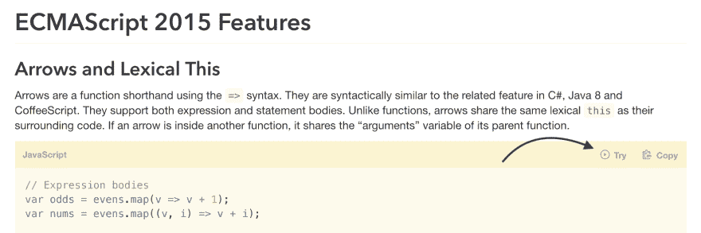
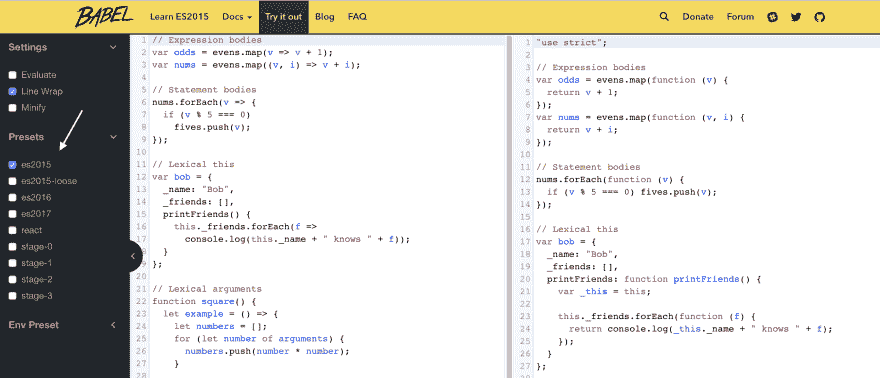
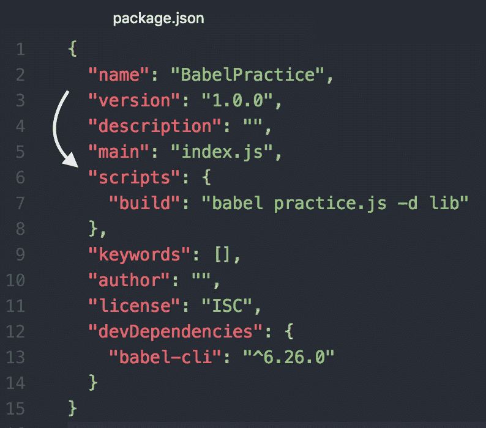
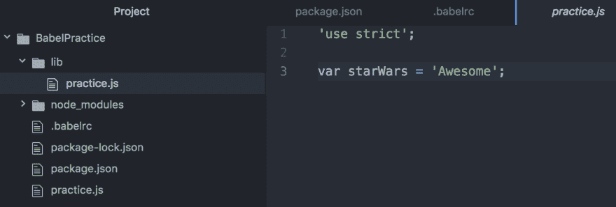

# 巴别塔和 ES6

> 原文：<https://dev.to/matt24ray/babel--es6-dfb>

Babel 是一个 JavaScript 编译器。这意味着有了 Babel，你可以用最新版本的 JavaScript 编写语法，它会把代码转换成浏览器兼容的 JavaScript。这太棒了，因为学习最新版本是很好的，它通常有旧版本没有的新特性。让 JavaScript 与最新版本的浏览器之外的版本兼容很重要，这是因为不是每个人都将浏览器更新到了最新版本。您可以使用最新版本的 JavaScript 编写代码，让 Babel 来处理剩下的事情。

## 撑住！JavaScript 有不同的版本？

有啊！如果你不熟悉 JavaScript 的不同版本，本·麦考密克有一篇很棒的文章解释了[“JavaScript 版本控制是怎么回事。”](https://benmccormick.org/2015/09/14/es5-es6-es2016-es-next-whats-going-on-with-javascript-versioning/)

我们今天要摆弄的 JavaScript 版本被称为 ECMAScript 2015，通常被称为 ES6 或 ES2015。

ECMAScript 是用来标准化 JavaScript 的。你可以在维基百科或维护者网站 ECMA International 上阅读更多相关内容。

要开始熟悉巴别塔和 ES6，请在巴别塔网站上打开[“学习 ES2015”。](http://babeljs.io/learn-es2015/)首先，向下滚动到“箭头函数”示例。然后，点击“尝试”。

[T2】](https://res.cloudinary.com/practicaldev/image/fetch/s--8jDLw1Tt--/c_limit%2Cf_auto%2Cfl_progressive%2Cq_auto%2Cw_880/https://dailydrip-assets.s3.amazonaws.com/DailyDrip/blog_posts/babel-and-es6/image_01.png)

所以，现在你会看到巴别塔回复。单击箭头并选择“es2015”预设，以在左侧查看 ES2015 版本，在右侧查看 babel transpiled 版本。

[T2】](https://res.cloudinary.com/practicaldev/image/fetch/s--fX9-vnf_--/c_limit%2Cf_auto%2Cfl_progressive%2Cq_auto%2Cw_880/https://dailydrip-assets.s3.amazonaws.com/DailyDrip/blog_posts/babel-and-es6/image_02.png)

在你看过 Babel 的操作之后，让我们看看`let`是如何工作的。留在 Repl 里，但是删除左边所有的代码。现在输入:

```
let starWars = 'Awesome'; 
```

Enter fullscreen mode Exit fullscreen mode

如你所见，它编译成:

```
'use strict';

var starWars = 'Awesome'; 
```

Enter fullscreen mode Exit fullscreen mode

在 ES6 [`let`](https://developer.mozilla.org/en-US/docs/Web/JavaScript/Reference/Statements/let) 是新改进的`var`。

现在，我们对巴别塔是什么以及它是如何工作的有了一个概念。让巴贝尔在本地运行。

打开你的终端，新建一个目录:

```
mkdir BabelPractice
cd BabelPractice 
```

Enter fullscreen mode Exit fullscreen mode

Babel 建议逐个项目安装 CLI，而不是全局安装。为此，您只需运行这两个简单的命令:

[第一个命令建立一个 package.json 文件，](https://docs.npmjs.com/cli/init)，在安装 Babel 之前需要有这个文件。
第二个命令在本地安装巴别塔。

```
npm init -f -y
npm install --save-dev babel-cli 
```

Enter fullscreen mode Exit fullscreen mode

安装好 Babel 之后，打开 package.json 文件，您应该会看到与此非常相似的内容。

```
{
  "name": "BabelPractice",
  "version": "1.0.0",
  "description": "",
  "main": "index.js",
  "scripts": {
    "test": "echo \"Error: no test specified\" && exit 1"
  },
  "keywords": [],
  "author": "",
  "license": "ISC",
  "devDependencies": {
    "babel-cli": "^6.26.0"
  }
} 
```

Enter fullscreen mode Exit fullscreen mode

Babel 建议将“脚本”作为字段添加到 package.json 文件中。还有其他方法来运行巴别塔，但现在我们只会保持简单。因此，现在用构建脚本替换“测试”脚本，它将在一个 javascript 文件上运行 Babel，我们称之为“practice.js”。

```
 "build": "babel practice.js -d lib" 
```

Enter fullscreen mode Exit fullscreen mode

现在，这就是你的`package.json`文件应该看起来的样子。

[T2】](https://res.cloudinary.com/practicaldev/image/fetch/s--2UdIkzAY--/c_limit%2Cf_auto%2Cfl_progressive%2Cq_auto%2Cw_880/https://dailydrip-assets.s3.amazonaws.com/DailyDrip/blog_posts/babel-and-es6/image_03.png)

让我们创建 JavaScript 文件，并将我们之前使用的`let`示例放入其中。

```
touch practice.js 
```

Enter fullscreen mode Exit fullscreen mode

```
let starWars = 'Awesome'; 
```

Enter fullscreen mode Exit fullscreen mode

接下来，运行构建。

```
npm run build 
```

Enter fullscreen mode Exit fullscreen mode

如果一切运行正常，您将得到类似于下面的输出:

```
> BabelPractice@1.0.0 build /Users/matt/Desktop/BabelPractice
> babel practice.js -d lib

practice.js -> lib/practice.js 
```

Enter fullscreen mode Exit fullscreen mode

现在您将看到这个命令创建了 lib 目录，但是文件还没有任何更改。我们仍然需要更改配置，以获得与我们在巴别塔 REPL 中使用该示例时看到的类似的输出。请记住，我们使用了“es2015”预设，因此让我们尝试设置我们的配置，使其输出与带有预设“es2015”的 REPL 相同。

先做一个`.babelrc`文件。babelrc 文件是配置 babel 预设的标准位置。
接下来安装' babel-present-env '。

```
touch .babelrc
npm install babel-preset-env --save-dev 
```

Enter fullscreen mode Exit fullscreen mode

接下来，通过将这个 JSON 添加到。' babelrc '文件:

```
{
  "presets": ["env"]
} 
```

Enter fullscreen mode Exit fullscreen mode

`env`预置让你指定你想要的环境来决定发出什么代码。查看`targets`选项来选择你的目标——默认情况下，它将针对每个浏览器的最后两个版本，以及 Safari 以上的版本。

请尝试再次运行生成。

```
npm run build 
```

Enter fullscreen mode Exit fullscreen mode

如果你打开“lib”目录下的“practice.js ”,你应该看到文件已经从 ES6 传输到 ES5。

[T2】](https://res.cloudinary.com/practicaldev/image/fetch/s--dzs0soJv--/c_limit%2Cf_auto%2Cfl_progressive%2Cq_auto%2Cw_880/https://dailydrip-assets.s3.amazonaws.com/DailyDrip/blog_posts/babel-and-es6/image_04.png)

如果你能走到这一步，恭喜你！你已经学会了:

*   巴别塔是什么。
*   巴别塔是如何运作的。
*   ES6 是什么。
*   如何在本地运营巴别塔？

这篇文章是 JavaScript Zero 系列的一部分。本系列的上一篇文章是[林挺(开发环境第二部分)&额外收获:其他有趣的 Atom 包！](https://www.dailydrip.com/blog/linting-development-environment-part-2-bonus-other-fun-atom-packages)