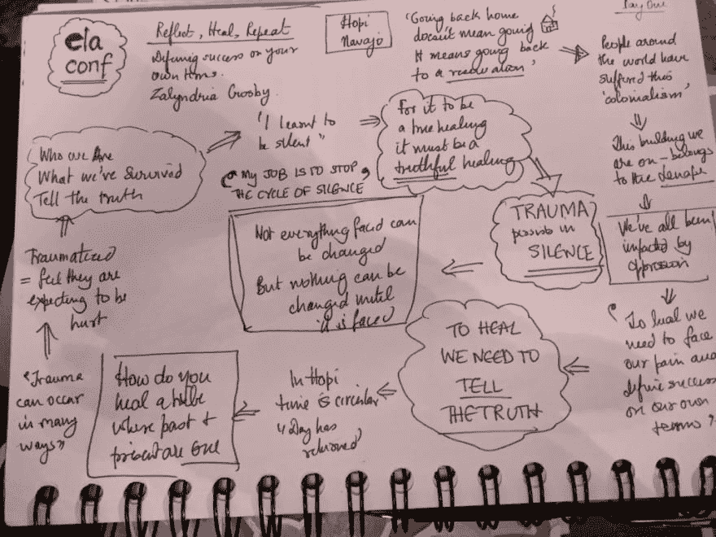
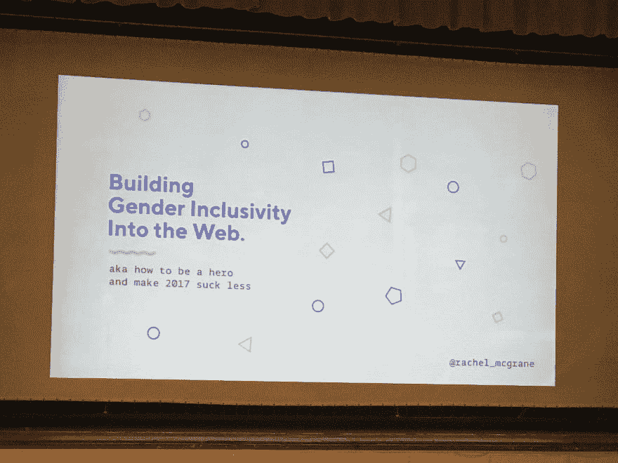

# #ElaConf:为什么重要&我学到了什么(第一部分)

> 原文:[https://dev.to/nitya/elaconf-why-it-matters-我学到了什么-第一部分-67n](https://dev.to/nitya/elaconf-why-it-matters--what-i-learnt-part-1-67n)

这将是一篇很长的阅读。即使这样，它也没有涵盖我真正想说的，但找不到合适的词的一半。这是一篇意识流的帖子——我可能会在以后回到这篇文章中编辑它，以提高可读性，但我想在我还“感觉”到它的时候写它。你想喝杯茶安顿下来吗？前进..我会等的。

### 一些背景

我在技术领域已经工作了 20 多年，在各种行业、学术、开发者和内部会议和活动中发表过很多公开演讲。

但是我总是专注于做**技术** **演讲**并且小心翼翼地避免谈论为其提供动力的**人**——谈论科技工作者面临的挑战、解决方案&机会，以及快速进化的生态系统的非人道步伐所带来的人类代价。

直到 [ElaConf。](http://elaconf.com/)

2017 年 10 月 28 日——我在费城举行的 2017 年 ElaConf 上做了第一次演讲。你可以在这里看到[议程，在这里](http://elaconf.com/#agenda)了解[我的演讲重点。是的，这是我梦寐以求的事情。而现实在各方面都远远超出了我的预期。](http://elaconf.com/2017/agenda/sorry-not-sorry/)

> Nitya Narasimhan[@ Nitya](https://dev.to/nitya)这是重大的。不开玩笑！
> 1。我正在检查我的遗愿清单上的一个项目(在 [@elaconf](https://twitter.com/elaconf) )
> 2 说话)。我在说…[twitter.com/i/web/status/9…](https://t.co/x4MEON9xFE)2017 年 10 月 25 日下午 17:05ela@ elaconf

但是我一会儿就会谈到这些。正如他们所说，在我谈论*那个、*之前，我首先需要谈论一下*这个*。

### *为什么#ElaConf 要紧*

[*这个*就是 ElaConf](http://elaconf.com/) 。在现场，组织者清楚地列出了他们的目标 **:**

> 一个安全、包容的技术领导会议和[社区](http://ela.community/)，供成年(18 岁以上)女性(独联体和跨性别)、跨性别男性和性别同性恋者相互联系和赋权。

但这并不公平。这就是我刚到费城 36 小时后离开时对 ElaConf 的感受。

> ElaConf 是一个让你感到受重视、受欢迎和受关注的社区。这种三连胜是“归属感”的终极表达——在你走进一个充满陌生人的房间后几分钟，你就觉得自己融入了这个房间。>这是我们多元化技术社区的缩影。你带着行李进来，但离开时却感觉负担减轻了——不是因为它走了，而是因为现在有许多看不见的手和你一起举起它。

它体现在自我表达的小东西贴纸(表情符号 FTW)，包含真实身份的性别代词，强调安全的行为准则，以及反复出现的“跌倒没关系，你能行的”的感觉。&我们抓住你了！从全体观众来看，一位主持人(神话般的 [@theonlyruthie](https://twitter.com/theonlyruthie) )如此细心地为每位演讲者精心准备了开场白，直到你已经理解了那场演讲的叙述，你才意识到那是引子。

这是一个最好的社区，分享你的故事，说出你的真相。听到这些故事改变了我内心的某些东西，而我以前并没有意识到它的存在。这让我再次感到自己是人类。我们都被科技联系在一起，是的——但科技并不是定义我们的东西。更确切地说，**的亲身经历** &听听和你一样的人，而*又不像你*的话，会有一种非常强大的力量。

### 我学到了什么

这只是冰山一角——我参加了很多讲座，见了很多人，进行了很多有意义的交流。我没有说出不发言的人的名字，只是因为我想确保他们同意，并且我有上下文权利——希望我可以稍后再告诉他们，如果他们同意，更新它以反映他们的身份。因为他们都值得了解——他们的真诚令人信服，他们的热情真挚。

1.  分享你的真相——只有这样，你才能治愈自己。每个人都是独一无二的，但我们共同的经历将我们联系在一起。你并不孤单。

液体错误:内部

主题演讲人( [@zalyndria](https://twitter.com/zalyndria) )传达了一个关于用自己的方式定义成功的强有力的信息，其核心是一个简单的事实。“创伤在沉默中持续，要想真正成功，我们需要勇敢面对我们的痛苦。拥有它。接受发生的事情，但你活了下来。不加过滤地说出你的真相。只有这样，你才能真正带着希望前进。

<figure> 

<figcaption>我的 sketch ote of @ zalyndria keynote</figcaption>

</figure>

我想到，在 2017 年，作为一个国家，作为女性，作为少数民族，这一直是我们治愈的核心。越来越多的人站出来大胆说出关于偏见、不平等和骚扰的真相。

但是作为题外话，@zalyndria 演讲的一个历史方面震撼了我。我一直支持教育，认为它是战胜仇恨、自卑和不公正的最佳工具。我告诉自己，通过学习，我们能够更好地应对我们无法改变的事情，积极地影响我们能够改变的事情。但是如果教育被用作*强制同化的工具会怎么样？用另一种文化的规范和价值观来取代或根除一种文化的规范和价值观？这对个人身份意味着什么？*我从未想过这件事。现在我知道了。**

**2。在某些情况下，我们都享有特权，而在其他情况下，我们都是少数。了解背景是关键。尽可能扩大你的特权是至关重要的。**

> 【岚娜】伯克@ aburke 626接下来是 [@rachel_mcgrane](https://twitter.com/rachel_mcgrane) 关于网络上的性别和具体跨性别包容性！2017 年 10 月 28 日下午 14:07

我是土生土长的南印度人，入籍成为美国人。我有一个博士学位，管理多个技术社区，在技术会议上组织和发言，拥有 10 多项专利，在技术领域以多种角色工作了 20 多年，在不同的平台和多学科团队工作，是一个通晓多种语言和自学成才的人。

然而，从很多方面来看，我都可以被视为技术领域中代表性不足的少数群体的一员。

平心而论，多年来，我一直对此视而不见。这并不是说我没有面对过相关的挑战、否认、不平等或轻视。我从小就认为这是意料之中的事。这个世界很艰难。生活是不公平的。如果你只是努力工作，妥协，坚持到底，然后你会得到回报。所以要谦虚&不要浪费时间或精力抱怨。但那是后话了。

关键是——我至少是可见的。在我们这个官僚主义盛行的世界里，我已经有了一个既定的身份，我可以在各种表格上打勾。*性别是显而易见的，它几乎出现在每一种形式中。*

> Nitya Narasimhan[@ Nitya](https://dev.to/nitya)。@rachel_mcgrane 关于“在网络中建立性别包容性”的演讲让我思考。网页怎么会“打开”…[twitter.com/i/web/status/9…](https://t.co/nvQstHHnbX)2017 年 10 月 29 日上午 10:50

对我的系统来说，这是一个震惊，对很多人来说( [@rachel_mcgrane](https://twitter.com/rachel_mcgrane) 提到 6%的美国人)这是他们每分钟都必须思考和担心的事情。在复选框占主导地位的数字世界中，这是最糟糕的情绪负担——因为没有人能逃脱&有限的控制。她幽默地指出，IE10 的采用率约为 0.6%，但有更多的人投入时间&资金来支持这一(传统)需求，而性别包容性的 10 倍需求在大多数公司的雷达上甚至不是一个亮点。

我意识到在这里我绝对享有特权。我从来没有想过这个问题。事情是这样的——解决方案很简单(“让我们像对待可访问性一样对待包容性来改善用户界面/UX”——作为核心需求),但采用起来很困难(在数字和物理空间中有数十亿个遗留+新页面/表单),最重要的是*缺乏实施变革的意识。*

我被这个演讲震撼了，不仅仅是因为它让我对这个问题有了新的认识，还因为它让我觉得我至少可以通过一些小的方式来实施改变，通过整合最佳实践或者与他人分享。我不太确定这可能会采取什么形式，但在 2018 年，我想花更多的时间教育自己&以一些可行的方式探索这一点。为此，我非常感谢[@ Rachel _ mcgrane](https://twitter.com/rachel_mcgrane)——这是一场精彩的演讲！

哇——我有太多的话想说，我想我今天已经没有时间了。我想我会将其他事情推迟到第 2 部分..请关注此处的更新链接。