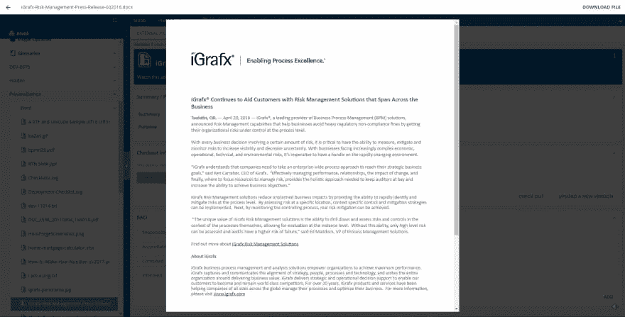
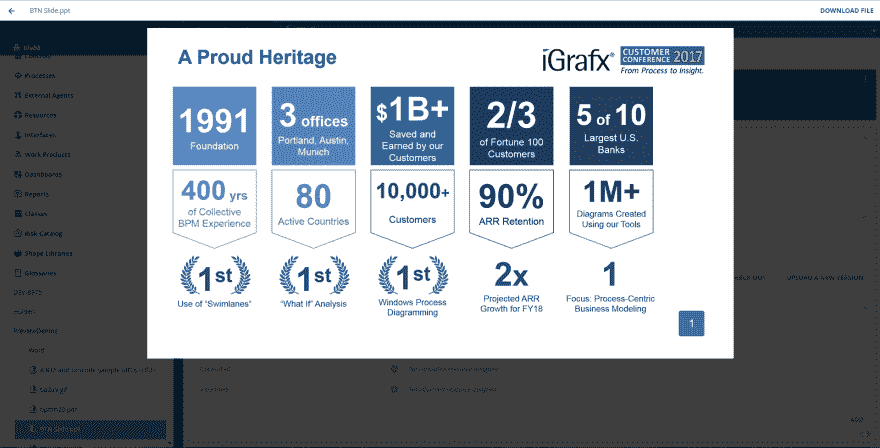
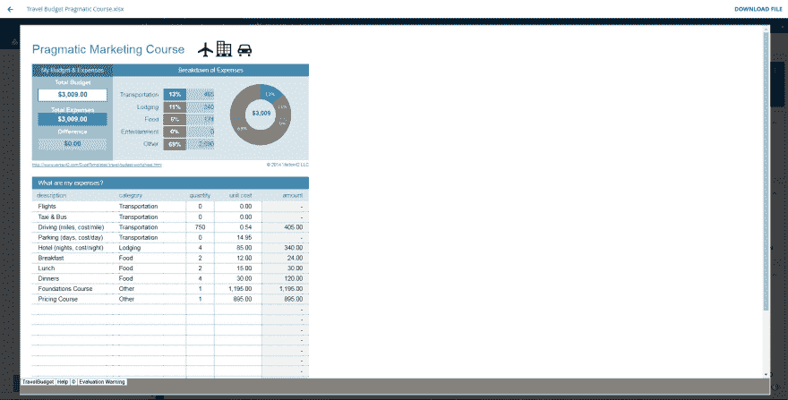

# 使用 Microsoft Office Preview 让客户的生活更轻松

> 原文:[https://dev . to/dalner 21/making-customers-lifes-eastern with-Microsoft-office-preview-9bm](https://dev.to/dalner21/making-customers-lives-easier-with-microsoft-office-preview-9bm)

在旅途中查看 Microsoft Office 文档有时会是一种令人沮丧的体验，尤其是当您的计算机上没有安装 Office 时。即使你的电脑上有 Office，你仍然需要下载文档，然后等待它打开；如果您想快速查看文档，这可能会很麻烦。一个常见的需求是让用户能够在浏览器中预览 iGrafx 平台上的文档，而无需先下载文档。
我们首先尝试了各种免费库(Apache POI、Docx4J 和 JODConverter)来解决这个问题，但不喜欢分辨率、准确性、格式支持和文档，所以我们开始尝试一些付费库。我们第一次尝试创建文档预览是在 Word 中，以获得实现难度的基线，以及我们正在寻找的文档支持。我们尝试的许多库都没有好的文档，它们的 API 令人困惑。最好的一个，也是我们决定使用的一个，是 [Aspose](https://www.aspose.com/) 库，它现在可以让我们预览 Word、Excel 和 PowerPoint 文档。虽然我们现在支持的每种格式的实现并不完美，但它比其他格式好得多。我们喜欢这个库，因为它仍然允许用户在预览中搜索项目，而不是以不可搜索的图像格式显示预览。这个功能虽然微妙，但在时间紧迫的情况下预览长文档时非常重要。我们还可以支持旧的 office 文档格式，这使得这个特性非常有用。现在，当您上传外部文件时；任何文本、PDF、Microsoft Word、Microsoft Excel 和 Microsoft PowerPoint 文档都可以在浏览器中预览，无需先下载文件！
 
我们很高兴使用这个库，因为它为我们提供了未来的功能支持，如更好的 PDF 集成、Microsoft Outlook 电子邮件、Microsoft Project 和 Microsoft OneNote 预览等等。【T10
