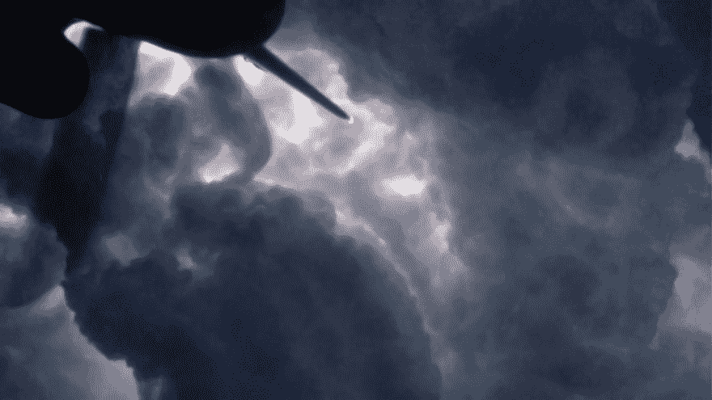

# 音乐和编码

> 原文：<https://dev.to/jasodonnell/music-and-coding-ap0>

很长一段时间以来，我一直将音乐作为我的生产力驱动力。除了咖啡，我还需要合适的电影配乐。Bowie 是基于模式的东西，贝鲁特是样板，化学兄弟是发明。那么是什么驱使着你呢？音乐对你的影响和对我的影响一样吗？

这张照片是在科罗拉多州上空 30k 英尺处拍摄的，在两个巨大的超级细胞之间飞行。
[T3】](https://res.cloudinary.com/practicaldev/image/fetch/s--EK2rTWJc--/c_limit%2Cf_auto%2Cfl_progressive%2Cq_auto%2Cw_880/https://thepracticaldev.s3.amazonaws.com/i/b9u120scy3laea33bc8y.jpg)