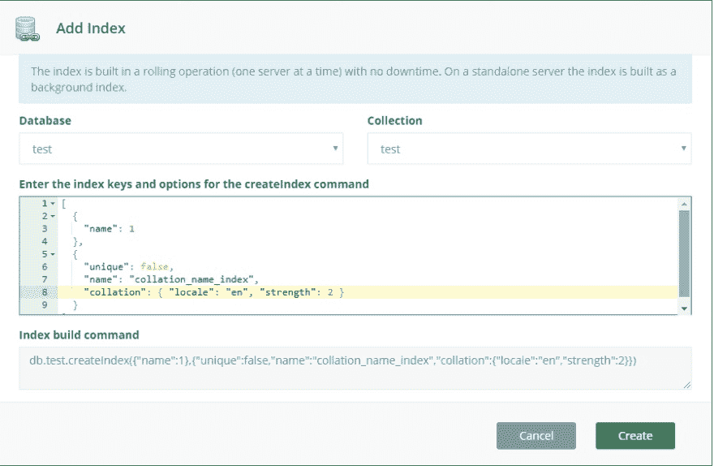

# 如何在 MongoDB 中创建不区分大小写的索引

> 原文:[https://dev . to/scale grid/how-to-create-case-insensitive-indexes-in-MongoDB-96d](https://dev.to/scalegrid/how-to-create-case-insensitive-indexes-in-mongodb-96d)

[T2】](https://scalegrid.io/blog/wp-content/uploads/2017/10/Create-Case-Insensitive-Indexes-in-MongoDB-ScaleGrid-Blog.jpg)

不区分大小写的索引支持执行字符串比较而不考虑字母大小写的查询，有了 [MongoDB 3.4 的](https://www.mongodb.com/mongodb-3.4)对[排序规则](https://docs.mongodb.com/manual/reference/collation/#collation-document-fields)的支持，这些现在都可以构建了。排序规则使您能够为字符串比较指定特定于语言的规则。由于 MongoDB 以前的版本不支持排序，所以您只能执行区分大小写的索引比较。在需要不区分大小写的行为的场景中，唯一的选择是将所有字符串转换/存储为大写或小写，然后进行比较。可以想象，这给查询和索引操作带来了很多麻烦。

# 创建一个不区分大小写的 MongoDB 索引

Collation 属性可以在集合级别设置，也可以在创建索引时显式设置。如果在集合级别设置，则不需要在每个 create-index 命令上指定它，因为索引继承集合的排序规则。除非在创建时明确指定，否则集合没有关联的排序规则。您可以使用下面提供的命令来确定集合的排序规则详细信息:

> db . create collection(" test ")
> db . getcollection infos({ name:test ' })；
> 【
> {
> 【姓名】:【测试】，
> 【类型】:【收藏】，
> 【选项】:{
> }，
> 【信息】:{
> 【只读】:假
> }，
> 【id index】:{
> 【v】:2，
> 【key】:{
> *id】:1
> }，
> 【姓名】::::" _id*

以下是创建集合时显式指定归类的方法:

> db.createCollection("test2 "，{ collation: { locale: 'en_US '，strength:2 } })；
> 
> db . getcollectioninfos({ name:' test2 ' })
> [
> {
> " name ":" test2 "，
> "type" : "collection "，
> " options ":{
> " collection ":{
> " locale ":" en _ US "，
> "caseLevel" : false，
> "caseFirst" : "off "，
> "strength" : 2，
> "numericOrdering" : false，
> "alternate "
> "idIndex" : {
> "v" : 2，
> " key ":{
> "*id ":1
> }，
> " name ":_ id*"，
> "ns" : "test.test2 "，
> " collation ":{
> " locale ":" en _ US "，
> "caseLevel" : false，
> "caseFirst" : "off "，【T34 "

您还可以选择在构建索引时显式设置索引的排序规则。例如，在区域设置为“en”且强度为 2 的测试集合的 name 属性上添加“index ”:

> > db.test.createIndex( { name: 1}，{ collation: { locale: 'en '，strength: 2 } })

## 使用排序规则进行查询

需要在查询时指定排序规则属性，才能使用使用排序规则构建的索引:

> db.test.find({name:'blah'})

由于未指定排序规则，此查询将不使用上面指定的索引。为了利用排序规则，我们需要在查询中明确指定它:

> db.test.find({name:'blah'})。排序规则({区域设置:' en '，强度:2 })

即使您的集合有默认的排序规则，您仍然需要在查询中指定排序规则。否则，MongoDB 不会使用特定的索引:

## 从旧版本(3.2.x)升级时的排序规则

如果从 MongoDB 的旧版本(例如 3.2.x)升级，现有的索引将不支持排序规则。要启动并运行排序规则，第一步是确保 3.4.x 的所有新功能都已打开:

> db . admin command({ setfeaturecompatibility version:" 3.4 " })

关于不兼容性的更多信息在[MongoDB 3 . x 发行说明](https://docs.mongodb.com/v3.4/release-notes/3.4-compatibility/#compatibility-enabled)中提供。请注意，一旦你做了这些步骤，就很难降级回 3.2。我们的下一步是检查索引的版本。

一旦升级到 3.4 版兼容性，您就可以按照我们之前概述的步骤创建新的索引。如果您正在构建大型索引，请使用 [ScaleGrid 滚动索引构建作业](https://scalegrid.io/blog/the-perils-of-building-indexes-on-mongodb/)添加您的索引:

[T2】](https://scalegrid.io/blog/wp-content/uploads/2017/09/indexwithcollation.jpg)