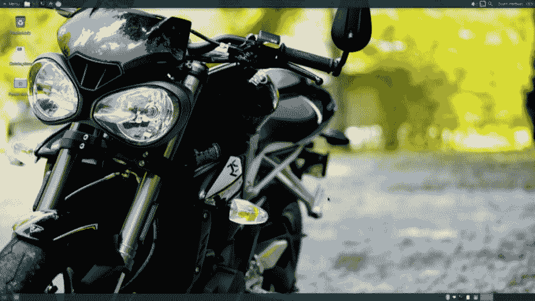

# 穿越拱门——第四卷

> 原文:[https://dev.to/svettwer/traveling-through-the-arch](https://dev.to/svettwer/traveling-through-the-arch--vol-4-oe4)

<figure>[](https://res.cloudinary.com/practicaldev/image/fetch/s--yYridGaZ--/c_limit%2Cf_auto%2Cfl_progressive%2Cq_auto%2Cw_880/https://cdn-images-1.medium.com/max/1024/1%2AAEwB_sQ0eZpf3n-lxLYT4g.png) 

<figcaption>我的桌面—背景图片由 [ChaseOnTwoWheels](https://twitter.com/C2Wtweets)</figcaption>

</figure>

嘿伙计们！我已经有一段时间没有写博客了。但是知道了，还是为了《穿越拱门》最后一集聚一聚吧。这一次，我们将看看系统定制、系统维护以及我迄今为止使用 Arch Linux 的经历。

#### 系统定制

我花了一些时间去了解如何谈论系统定制，因为这是*定制*，取决于你的要求。因此，我没有“终极系统”可以推荐给你。在这一点上，你需要找出你想要建立什么样的系统，以及你真正需要什么。因此，与其给出建议，不如让我指出 Arch 文档中的[一般建议](https://wiki.archlinux.org/index.php/General_recommendations)部分。这是一个很好的起点。从那时起，您可以构建从最小安装到完全成熟的桌面环境的任何东西。

#### 系统维护

当我开始使用 Arch Linux 时，系统维护是我最关心的问题之一。因为该软件是以滚动发布的形式发布的，所以安装一个会导致系统崩溃的更新是绝对有可能的。为了防止这些情况，我设想我必须阅读大量的文章和补丁说明，以确定某个特定的升级是否会使我的系统不稳定。幸运的是，情况并非如此。但是无论如何，您最好保护您的系统，以便能够尽快解决这种情况。

在 Arch Linux wiki 中有一篇关于这个话题的大文章。基本上，这一切都归结为一个命令。

```
pacman -Syu 
```

*   s 将您的系统与远程存储库同步
*   y 更新软件包数据库
*   u 过滤包列表中的过期包。这些是您想要更新的包

但这不是你应该做的一切。我安装了几个额外的程序来帮助我保持系统的稳定性。

*   一个简单的基于终端的工具，用来备份你的 pacman 安装包列表。它不仅可以保存，还可以从给定的包列表中恢复。因此，如果一切都出错了，您仍然有您的已安装软件包列表来开始一个新的安装或尝试恢复。
*   pakbak 一个备份你的 pacman 数据库的工具。这类似于 packup，但是存储更多的数据。此外，还有一个 pakbak.service 规范，以便该工具在您的系统启动时创建备份。不幸的是，脚本包含一些错误，服务定义不是 100%完整。因此，我在使用这个工具时遇到了一些问题。另一个不幸的事实是，维护者至今没有对我的问题做出反应。尽管如此，这是一个很酷的尝试，如果维护者在不久的将来不回应我的请求，我会考虑分支那个项目并自己维护它。
*   etckeeper 是一个使用 scm 的工具，可以在通过 pacman 安装软件包之前和之后保护您的配置。因此，您总是可以通过检查正确的版本来切换到上一次运行的配置。
*   我家的 btrfs 子卷快照这允许我跟踪我的主目录的变化，而无需在外部驱动器上存储大量数据。如果我对我的数据做了一些愚蠢的事情，我只是从我最后一个有效的快照中恢复。有一些工具可以根据某些事件创建所需子卷的快照。一个更受欢迎的解决方案是 [Snapper](https://wiki.archlinux.org/index.php/Snapper) ，但是 btrfs 开发者正在开发他们自己的解决方案，名为 [autosnap](https://btrfs.wiki.kernel.org/index.php/Autosnap) ，它目前不是上游的一部分。然而，这并不能 100%地保护您的数据，因为它位于同一个驱动器上。如果你问我的话，我还需要一个增量式的时间顺序备份系统。

即使涉及到系统维护，您也有大量的选择和可能性。你不必使用某个人为特定问题创建的特定备份解决方案。只要按照你想要的和你认为有用的来设置一切。

#### 摘要

现在我每天都使用 Arch Linux 已经一个多月了，我非常高兴我决定从 Xubuntu 切换过来。我学到了很多关于 Linux 的知识，以及所有的东西是如何一起工作的，我有了一个真正的最小系统，我可以感觉到它比 Xubuntu 运行得更快。系统完全稳定，我觉得如果有什么东西坏了，我真的可以恢复它。这是我在使用过的所有发行版中从未经历过的。我需要的所有软件包都可以从官方资料库或 AUR 获得。此外，我感觉我真的可以*自由*地设置我的系统，而不会错过最新的软件。

所以如果你还没有尝试过 Arch Linux 直到知道，我想推荐给你。有一次，一个人告诉我“如果你做出了改变，你就再也不会变回来了”。先生，你是对的！

本文最初发表于[medium.com/@SvenHettwer](https://medium.com/@SvenHettwer/traveling-through-the-arch-vol-4-77fc924fb612)