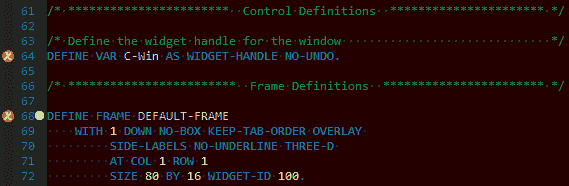

# 过于严格的编译选项

> 原文:[https://dev.to/patricktingen/too-strict-compile-option-3hf7](https://dev.to/patricktingen/too-strict-compile-option-3hf7)

最近我收到一些报告，DataDigger 不能使用 11.7 中新的严格编译设置进行编译。这并没有让我感到惊讶，因为我从来没有关注过这个，所以可能会有一些缩写的关键字徘徊在周围。

事实上有不少。更确切地说是 100 左右。在这个数字中，只有一小部分是由于我的编码，但大多数来自 UIB，它用缩写的关键字生成代码。

因为我预计这个问题会在 UIB 11.7 中得到解决，所以我打开了 UIB 中的 DataDigger 主窗口，并再次保存了它，但是什么也没有改变。所以我创建了一个新的空白窗口，然后检查它。令我惊讶的是，我发现了这个:

[T2】](https://res.cloudinary.com/practicaldev/image/fetch/s--3nhOQ_vm--/c_limit%2Cf_auto%2Cfl_progressive%2Cq_auto%2Cw_880/https://datadigger.files.wordpress.com/2017/11/adrqyhk.png%3Fw%3D840)

请注意排水沟中的红色标记。报告的错误是:

由于

“require-full-keywords”编译器选项，无法将“VARIABLE”作为“VAR”引用。(18494)

对我来说，这听起来像是一个 bug，但是底线是您不能将严格的编译器选项与 DataDigger 结合使用。直到它被修复，也就是说。

更新:我在 PSDN 社区页面上记录了一个[问题](https://community.progress.com/community_groups/openedge_development/f/19/t/35904),这个问题被选中了。这看起来确实是一个错误。