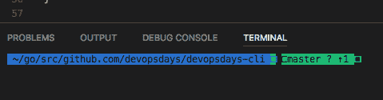
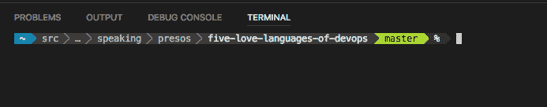

# 使电力线在 Visual Studio 代码终端中工作

> 原文:[https://dev . to/mattstratton/making-power line-work-in-visual-studio-code-terminal-1 M7](https://dev.to/mattstratton/making-powerline-work-in-visual-studio-code-terminal-1m7)

正如我在以前的帖子中提到的，我完全是在 Visual Studio 代码中挖掘嵌入式终端。然而，正如我也提到的，它不能正确地代表我的电力线提示符。

<figure>[](https://res.cloudinary.com/practicaldev/image/fetch/s--EMpKbpPd--/c_limit%2Cf_auto%2Cfl_progressive%2Cq_auto%2Cw_880/https://cdn-images-1.medium.com/max/479/1%2AqdYGhoAJLoaS10kh2ouCqA.png) 

<figcaption>zsh 提示中 VS 代码</figcaption>

</figure>

<figure>[](https://res.cloudinary.com/practicaldev/image/fetch/s--4nIRCraW--/c_limit%2Cf_auto%2Cfl_progressive%2Cq_auto%2Cw_880/https://cdn-images-1.medium.com/max/549/1%2AemmoMqJuY7HC2K48_kUh6A.png)

<figcaption>iTerm 中的 zsh 提示</figcaption>

</figure>

我今天解决了这个问题——如果你有类似的问题，这是一个非常简单的解决方法。当然，我只在 OS X 上证明了这一点，但我相信类似的解决方案也适用于 Windows 或 Linux。

1.  下载合适的补丁字体-[https://github.com/abertsch/Menlo-for-Powerline](https://github.com/abertsch/Menlo-for-Powerline)
2.  在您的用户设置(代码|首选项|设置)中添加以下内容:

```
{
"terminal.integrated.fontFamily": "Menlo for Powerline",
} 
```

<svg width="20px" height="20px" viewBox="0 0 24 24" class="highlight-action crayons-icon highlight-action--fullscreen-on"><title>Enter fullscreen mode</title></svg> <svg width="20px" height="20px" viewBox="0 0 24 24" class="highlight-action crayons-icon highlight-action--fullscreen-off"><title>Exit fullscreen mode</title></svg>

塔达！我的代码提示现在看起来正确了！

[T2】](https://res.cloudinary.com/practicaldev/image/fetch/s--7E0Lzvot--/c_limit%2Cf_auto%2Cfl_progressive%2Cq_auto%2Cw_880/https://i.imgur.com/zcJJats.png)

(是的，颜色看起来和之前的截图不一样；由于拍摄了这些截图，我从使用 powerlevel9k oh-my-zsh 主题改为使用 [powerline-go](https://github.com/justjanne/powerline-go) 。)