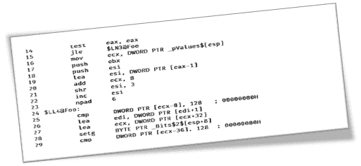
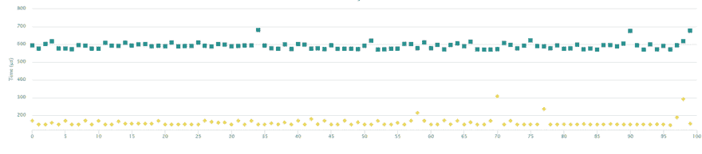
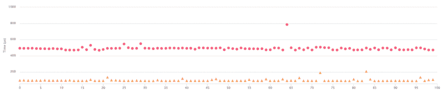
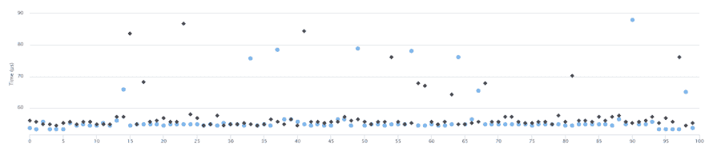
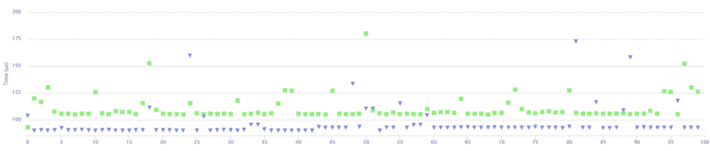

# 分行绩效的奇特案例

> 原文:[https://dev.to/fenbf/curious-case-of-branch-performance-84f](https://dev.to/fenbf/curious-case-of-branch-performance-84f)

[T2】](https://res.cloudinary.com/practicaldev/image/fetch/s--sw4fzcY7--/c_limit%2Cf_auto%2Cfl_progressive%2Cq_auto%2Cw_880/https://1.bp.blogspot.com/-v4w0MB-BNaY/WQ95stMaWDI/AAAAAAAAC88/apmUFg3bEBAFsKYmKOpDVJu1u-1eciqawCLcB/s1600/asm.png)

当我对 bool packing 进行最后一次性能测试时，我有时会得到奇怪的结果。似乎一个常数产生的结果与另一个不同。为什么会这样？让我们快速看一下分支性能。

## 问题

回想一下([第一部分](http://www.bfilipek.com/2017/04/packing-bools.html)，[第二部分](http://www.bfilipek.com/2017/05/packing-bools-2.html))我想将八个布尔(条件的结果)打包成一个字节，每个条件结果一位。这个问题相对简单，但是根据解决方案的不同，您可能会编写 5 倍的代码...比基准版本慢 8 倍。

让我们来看一个使用`std::vector<bool>` :
的简单版本

```
static const int ThresholdValue = X;
std::unique_ptr<int[]> inputValues = PrepareInputValues();
std::vector<bool> outputValues;

outputValues.resize(experimentValue);

// start timer
{
    for (size_t i = 0; i < experimentValue; ++i)
        outputValues[i] = inputValues[i] > ThresholdValue;
}
// end timer 
```

<svg width="20px" height="20px" viewBox="0 0 24 24" class="highlight-action crayons-icon highlight-action--fullscreen-on"><title>Enter fullscreen mode</title></svg> <svg width="20px" height="20px" viewBox="0 0 24 24" class="highlight-action crayons-icon highlight-action--fullscreen-off"><title>Exit fullscreen mode</title></svg>

看看结果:

[T2】](https://res.cloudinary.com/practicaldev/image/fetch/s--AgkVkFfQ--/c_limit%2Cf_auto%2Cfl_progressive%2Cq_auto%2Cw_880/https://1.bp.blogspot.com/--4Rd2XE9EVc/WQxyg-PI1jI/AAAAAAAAC8M/KmmAFHTBAUkrASIhKPTdRJsLX5pAnzkMACLcB/s1600/vec127vs254.png)

图表显示了从运行代码中获取的 100 个样本的计时，向量大小(`experimentValue`)为 1mln。越低越好。

你知道上面的结果有什么区别吗？

只是`X`—`ThresholdValue`的值！

如果是 254，那么你得到黄色的性能，如果是 127，那么你得到那些绿色，蓝色的方块。生成的代码是一样的，为什么我们会看到不同呢？同样的代码可以运行 eve 慢 4 倍！

所以也许矢量实现是错误的？

让我们使用一个(非最佳)手动版本:

```
uint8_t OutByte = 0;
int shiftCounter = 0;

for (int i = 0; i < experimentValue; ++i)
{
    if (*pInputData > Threshold)
        OutByte |= (1 << shiftCounter);

    pInputData++;
    shiftCounter++;

    if (shiftCounter > 7)
    {
        *pOutputByte++ = OutByte;
        OutByte = 0;
        shiftCounter = 0;
    }
} 
```

<svg width="20px" height="20px" viewBox="0 0 24 24" class="highlight-action crayons-icon highlight-action--fullscreen-on"><title>Enter fullscreen mode</title></svg> <svg width="20px" height="20px" viewBox="0 0 24 24" class="highlight-action crayons-icon highlight-action--fullscreen-off"><title>Exit fullscreen mode</title></svg>

结果是:

[T2】](https://res.cloudinary.com/practicaldev/image/fetch/s--tNBqOMu---/c_limit%2Cf_auto%2Cfl_progressive%2Cq_auto%2Cw_880/https://3.bp.blogspot.com/-kgj61gRMORo/WQx5Fe4wK-I/AAAAAAAAC8s/QGGGoA9R2ng36ubjkoKuMMH1_lyCwHTOgCLcB/s1600/manual127vs254.png)

同样，当使用`Threshold=127`运行时，您得到顶部的输出，而`Threshold=254`返回底部的输出。

好吧，但也有一些版本的算法没有暴露这个问题。

比如优化版。“一次”包含 8 个值。

```
uint8_t Bits[8] = { 0 };
const int64_t lenDivBy8 = (experimentValue / 8) * 8;

for (int64_t j = 0; j < lenDivBy8; j += 8)
{
    Bits[0] = pInputData[0] > Threshold ? 0x01 : 0;
    Bits[1] = pInputData[1] > Threshold ? 0x02 : 0;
    Bits[2] = pInputData[2] > Threshold ? 0x04 : 0;
    Bits[3] = pInputData[3] > Threshold ? 0x08 : 0;
    Bits[4] = pInputData[4] > Threshold ? 0x10 : 0;
    Bits[5] = pInputData[5] > Threshold ? 0x20 : 0;
    Bits[6] = pInputData[6] > Threshold ? 0x40 : 0;
    Bits[7] = pInputData[7] > Threshold ? 0x80 : 0;

    *pOutputByte++ = Bits[0] | Bits[1] | Bits[2] | Bits[3] | 
                     Bits[4] | Bits[5] | Bits[6] | Bits[7];
    pInputData += 8;
} 
```

<svg width="20px" height="20px" viewBox="0 0 24 24" class="highlight-action crayons-icon highlight-action--fullscreen-on"><title>Enter fullscreen mode</title></svg> <svg width="20px" height="20px" viewBox="0 0 24 24" class="highlight-action crayons-icon highlight-action--fullscreen-off"><title>Exit fullscreen mode</title></svg>

[T2】](https://res.cloudinary.com/practicaldev/image/fetch/s--yTooGtPZ--/c_limit%2Cf_auto%2Cfl_progressive%2Cq_auto%2Cw_880/https://2.bp.blogspot.com/-sIMtYPI7vs8/WQx5FYxxzTI/AAAAAAAAC8o/LFMwudc-OX0IjOvktXsHtnu60kQ14RsLwCLcB/s1600/opt127vs254.png)

这些样本并没有完全对齐，并且有一些异常值，但是这两次运行非常相似。

还有基线(完全不打包，只是保存到 bool 数组中)

```
std::unique_ptr<uint8_t[]> outputValues(new uint8_t[experimentValue]);

// start timer
{
    for (size_t i = 0; i < experimentValue; ++i)
        outputValues[i] = inputValues[i] > ThresholdValue;
});
// end timer 
```

<svg width="20px" height="20px" viewBox="0 0 24 24" class="highlight-action crayons-icon highlight-action--fullscreen-on"><title>Enter fullscreen mode</title></svg> <svg width="20px" height="20px" viewBox="0 0 24 24" class="highlight-action crayons-icon highlight-action--fullscreen-off"><title>Exit fullscreen mode</title></svg>

[T2】](https://res.cloudinary.com/practicaldev/image/fetch/s--RJyuokDd--/c_limit%2Cf_auto%2Cfl_progressive%2Cq_auto%2Cw_880/https://3.bp.blogspot.com/-MvAOCppM_Y8/WQx5FO3aQMI/AAAAAAAAC8k/UQdTTzG8kocZKpvS7PZ-pNCqsKjiayX9ACLcB/s1600/base127vs254.png)

这一次，`Threshold=254`慢了...但还是没有那么多，只有几个百分点。不是 3 倍...是前两种情况的 4 倍。

那些结果的原因是什么？

## 测试数据

到目前为止，我还没有解释我的输入数据是如何产生的。让我们揭开它。

输入值模拟灰度值，范围从 0 到 255。阈值也在同一范围内。

数据随机生成:

```
std::mt19937 gen(0);
std::uniform_int_distribution<> dist(0, 255);

for (size_t i = 0; i < experimentValue; ++i)
    inputValues[i] = dist(gen); 
```

<svg width="20px" height="20px" viewBox="0 0 24 24" class="highlight-action crayons-icon highlight-action--fullscreen-on"><title>Enter fullscreen mode</title></svg> <svg width="20px" height="20px" viewBox="0 0 24 24" class="highlight-action crayons-icon highlight-action--fullscreen-off"><title>Exit fullscreen mode</title></svg>

## 分支

您可能已经发现，问题在于分支(错误)预测。当阈值较大时，输入值生成 TRUE 的可能性很小。而对于阈值= 127，我们得到 50%的机会(仍然是随机模式)。

这里有一个很棒的实验，展示了分支的一些问题:[快速和慢速 if 语句:现代处理器中的分支预测@igoro.com](http://igoro.com/archive/fast-and-slow-if-statements-branch-prediction-in-modern-processors/) 。还有[分支预测器——维基百科](https://en.wikipedia.org/wiki/Branch_predictor)。

另外，请阅读[软件优化食谱:IA-32 平台的高性能食谱，第二版](http://amzn.to/2ppCE8n)

对于较大的阈值，我的大部分代码都属于错误情况，因此不会执行额外的指令。CPU 在其分支历史中看到这一点，并可以预测接下来的操作。当我们有随机的 50%模式时，CPU 不能有效地选择道路，因此有许多误预测。

不幸的是，我没有工具来衡量这些确切的数字，但对我来说，这是一个相当清楚的情况。也许你可以测量数据？让我知道！

但是为什么另一段代码——优化后的版本没有显示出效果呢？为什么不管常数是多少，它都是相似的？

### 详细信息

我们来看看生成的程序集:[play @ godbolt.org](https://godbolt.org/g/LCGGMi)。

优化版(来自 MSVC)

```
$LL4@Foo:
        cmp      DWORD PTR [ecx-8], 128   ; 00000080H
        lea      edi, DWORD PTR [edi+1]
        lea      ecx, DWORD PTR [ecx+32]
        setg     BYTE PTR _Bits$2$[esp+8]
        cmp      DWORD PTR [ecx-36], 128  ; 00000080H
        setle    al
        dec      al
        and      al, 2
        cmp      DWORD PTR [ecx-32], 128  ; 00000080H
        mov      BYTE PTR _Bits$1$[esp+8], al
        setle    bh
        dec      bh
        and      bh, 4
        cmp      DWORD PTR [ecx-28], 128  ; 00000080H
        setle    dh
        dec      dh
        and      dh, 8
        cmp      DWORD PTR [ecx-24], 128  ; 00000080H
        setle    ah
        dec      ah
        and      ah, 16             ; 00000010H
        cmp      DWORD PTR [ecx-20], 128  ; 00000080H
        setle    bl
        dec      bl
        and      bl, 32             ; 00000020H
        cmp      DWORD PTR [ecx-16], 128  ; 00000080H
        setle    al
        dec      al
        and      al, 64             ; 00000040H
        cmp      DWORD PTR [ecx-12], 128  ; 00000080H
        setle    dl
        dec      dl
        and      dl, 128              ; 00000080H
        or       dl, al
        or       dl, bl
        or       dl, ah
        or       dl, dh
        or       dl, bh
        or       dl, BYTE PTR _Bits$2$[esp+8]
        or       dl, BYTE PTR _Bits$1$[esp+8]
        mov      BYTE PTR [edi-1], dl
        sub      esi, 1
        jne      $LL4@Foo
        pop      esi
        pop      ebx 
```

<svg width="20px" height="20px" viewBox="0 0 24 24" class="highlight-action crayons-icon highlight-action--fullscreen-on"><title>Enter fullscreen mode</title></svg> <svg width="20px" height="20px" viewBox="0 0 24 24" class="highlight-action crayons-icon highlight-action--fullscreen-off"><title>Exit fullscreen mode</title></svg>

第一个手动版本:[https://godbolt.org/g/csLeHe](https://godbolt.org/g/csLeHe)T2】

```
 mov      edi, DWORD PTR _len$[esp+4]
        test     edi, edi
        jle      SHORT $LN3@Foo
$LL4@Foo:
        cmp      DWORD PTR [edx], 128     ; 00000080H
        jle      SHORT $LN5@Foo
        movzx    ecx, cl
        bts      ecx, eax
$LN5@Foo:
        inc      eax
        add      edx, 4
        cmp      eax, 7
        jle      SHORT $LN2@Foo
        mov      BYTE PTR [esi], cl
        inc      esi
        xor      cl, cl
        xor      eax, eax
$LN2@Foo:
        sub      edi, 1
        jne      SHORT $LL4@Foo
$LN3@Foo:
        pop      edi
        pop      esi
        ret      0 
```

<svg width="20px" height="20px" viewBox="0 0 24 24" class="highlight-action crayons-icon highlight-action--fullscreen-on"><title>Enter fullscreen mode</title></svg> <svg width="20px" height="20px" viewBox="0 0 24 24" class="highlight-action crayons-icon highlight-action--fullscreen-off"><title>Exit fullscreen mode</title></svg>

正如我们所看到的，优化版本没有使用分支。它使用`setCC`指令，但这不是一个真正的分支。奇怪的是，GCC 不使用这种方法，而是使用分支，因此代码可能会更慢。

> `SETcc`–如果条件不满足，则将目标寄存器设置为 0，如果条件满足，则将目标寄存器设置为 1。

关于性能的伟大著作:[分支和循环重组以防止预测失误|英特尔软件](https://software.intel.com/en-us/articles/branch-and-loop-reorganization-to-prevent-mispredicts)

另见避免分支的解释: [x86 反汇编/分支 wikibooks](https://en.wikibooks.org/wiki/X86_Disassembly/Branches#Ternary_Operator_.3F:)

因此，如果我是正确的，这就是为什么优化版本没有显示任何分支预测失误的影响。

第一个非优化版本的代码在循环中包含两个跳转，这就是为什么我们会经历性能下降。

不过，请记住，条件移动并不总是比分支更好。例如，在 Krister Walfridsson 的博客上阅读更多细节:比如[条件转移和分支的成本](https://kristerw.blogspot.se/2017/03/the-cost-of-conditional-moves-and.html)。

## 总结

要记住的事情:

*   进行性能基准测试是一件非常微妙的事情。
*   不仅要看代码，还要看使用的测试数据——因为不同的发行版可能会给出完全不同的结果。
*   消除分支，因为它可能会带来巨大的性能提升！

用 Nonius 库制作的图表，在我的[微基准库](http://www.bfilipek.com/2016/01/micro-benchmarking-libraries-for-c.html)博文中可以看到更多。

问你一个问题:

*   如何减少 perf 关键代码中的分支？

### 行动号召

如果你喜欢我的更多故事，就注册我的每周简讯: [Bartek 的编码博客简讯](http://eepurl.com/caCAun)
(你还会得到一些 C++17 奖金)