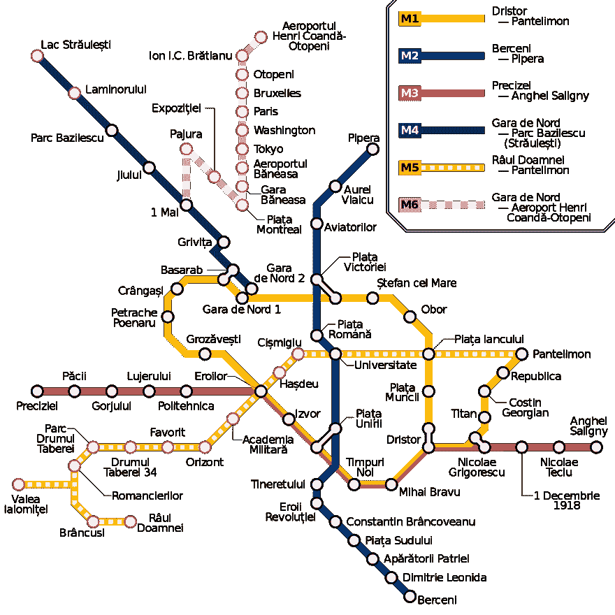

# 共产主义地铁站名研究

> 原文:[https://dev . to/horia 141/on-communist-subway-station-names-156 I](https://dev.to/horia141/on-communist-subway-station-names-156i)

布加勒斯特是我出生、长大和现在居住的城市，有一个中等规模的地铁系统。人们抱怨的一件奇怪的事情是*糟糕的*站名。常年最受欢迎的有《精密》、《T4》、《磨平的磨坊》、《T5》、《和平》、《英雄》、《理工》、《作家》、《地平线》、《摩登时代》、《护国使者》、《飞行员》、《青年》等。

 图片由 [Mliu92](https://commons.wikimedia.org/wiki/User:Mliu92) 制作，以 [CC BY-SA 4.0](https://creativecommons.org/licenses/by-sa/4.0/) 授权发布。

然而，对于不是来自罗马尼亚或前东欧国家的人来说，很难理解他们到底出了什么问题。*的不好*源于他们“听起来像共产主义者”的事实。这基本上意味着它们是抽象的名词或动词，通常与工业、科学或党认为“光荣”的过去有关。大多数时候，它们也是以一种非常具体的方式写的，就好像它们是一个更大的祝贺句子的一部分。因此，正确的英文翻译应该是“Precision”，而不是“这个设备的*精度*是 2 纳米”，而是“致力于*精度*”。或者“献给英雄/飞行员/年轻人/作家等”。

就地铁站而言，泰坦看起来令人印象深刻。而且它的名字不是*那个*共产主义者。图片由 Mihai Petre 提供，根据 [CC BY-SA 3.0](https://creativecommons.org/licenses/by-sa/3.0/) 许可发布。

现在，大多数电台都是以他们服务的周边地区命名的，所以应该向城市提出批评，因为它们的名字不好。然而，由于更改城市区域或街道名称非常困难，而更改地铁站名称相对容易，我认为抱怨后者是合理的。而且在 T1 之前已经有人成功地做过了。2009 年之前，我们还有《联合收割机》、《人民军队》、《工业》。然而，当后两者分别有了体面的新名字，如[、【彼得拉什·波那鲁】、](https://en.wikipedia.org/wiki/Petrache_Poenaru)([钢笔](https://en.wikipedia.org/wiki/Fountain_pen)的发明者)和“卢杰鲁伊”(一个地区的专有名称)时，“工业”变成了“精密”。雪上加霜的是，“Laromet”(又是一家公司的专有名称)变成了“扁平磨坊”。仔细想想，也许那不是最有效的方式。

反正这个帖子没什么意义。只是我想写的东西。所以你有它。