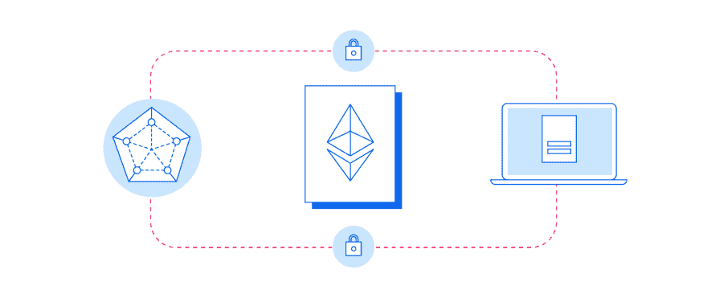

# 智能合同是如何工作的？

> 原文：<https://dev.to/galyna_chekan/how-smart-contracts-work-and-what-industries-they-are-most-likely-to-affect-2kb0>

亚马逊颠覆了零售业。优步淘汰了出租车，全球领先的在线房地产市场 Airbnb 取代了酒店。

现在，最初的颠覆者可能也会发现自己处于危险之中。有一种新技术正在出现——区块链驱动的智能合约——有可能取代现在的位置。

## [什么是智能合约？](https://perfectial.com/blog/smart-contracts-and-industries-they-will-affect/)

[T2】](https://res.cloudinary.com/practicaldev/image/fetch/s--kbeCzrDo--/c_limit%2Cf_auto%2Cfl_progressive%2Cq_auto%2Cw_880/https://perfectial.com/wp-content/uploads/2017/10/img1-1.jpg)

自上世纪 90 年代以来，智能合同一直是科技界许多人的梦想。计算机科学家 Nick Szabo 在 1996 年首次描述了这个概念(也创造了这个短语)，他将它们定义为:

执行合同条款的计算机化交易协议。总体目标是满足常见的合同条件(如支付条款、留置权、保密性，甚至强制执行)，最大限度地减少恶意和意外例外，并最大限度地减少对可信中介的需求。相关的经济目标包括降低欺诈损失、仲裁和执行成本以及其他交易成本。”

20 年后，他设想的技术被实现了。按照尼克的想法，可编程合同将高级合同法的程序与在线商务中使用的协议结合起来，现在可以很容易地在分布式账本系统(也称为区块链)上实现。在完美公司，我们使用智能合同来激励员工，提高工作效率。

## 智能合约是如何工作的？

本质上，智能合约是一些代码块，当满足预定义的标准时，它们可以使用某些参数自动执行某些功能。通常，它们是由某人通过区块链向它们的地址发送交易来激活的，目前，它们主要在名为以太坊的网络上使用。

为了清楚地解释智能合约是如何工作的，人们经常把它比作自动售货机。

你办公室里那个熟悉的盒子，就像一个冰箱，一旦你按下一个合适的按钮，它就会接收你的钱并分发一种产品。为了让机器运转起来，你给它注入现金，然后，这些盒子里都安装了一种内部检测算法，它可以判断你投入投币口的钞票(或硬币)是不是假币。

自动售货机作为一种古老而熟悉的技术，没有人会对它印象深刻。但这是他们运作的核心原则，他们“执行简单协议”的能力，这是尼克萨博智能合同理念背后的灵感。

如果您想了解更多关于智能合同及其为您的企业带来的大量机会，请联系我们的专家。

帖子[智能合同如何工作以及它们最有可能影响哪些行业](https://perfectial.com/blog/smart-contracts-and-industries-they-will-affect/)最先出现在[软件开发公司完美](https://perfectial.com)上。