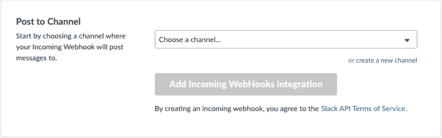
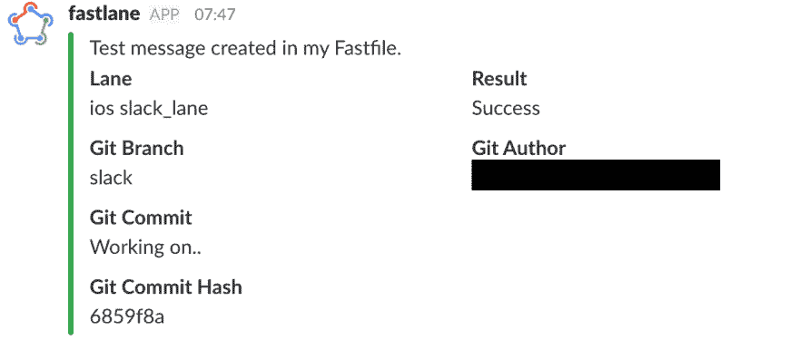
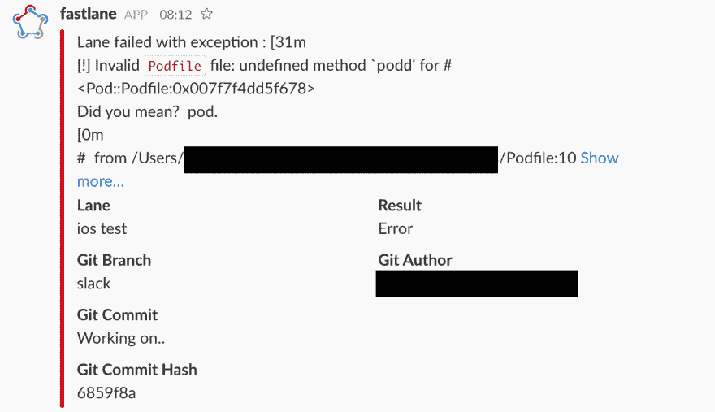
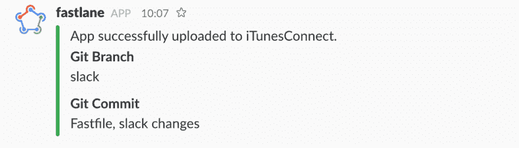
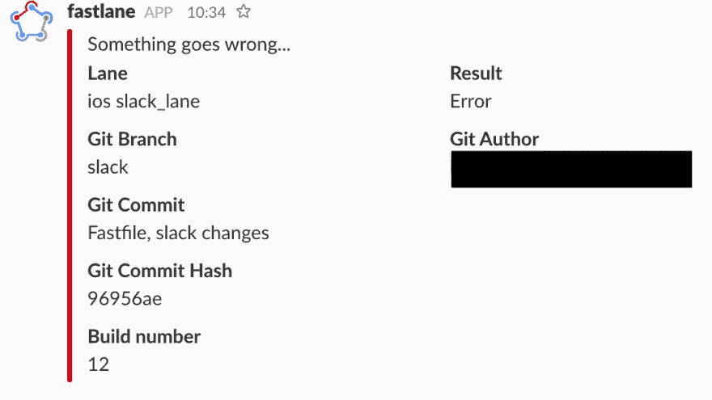
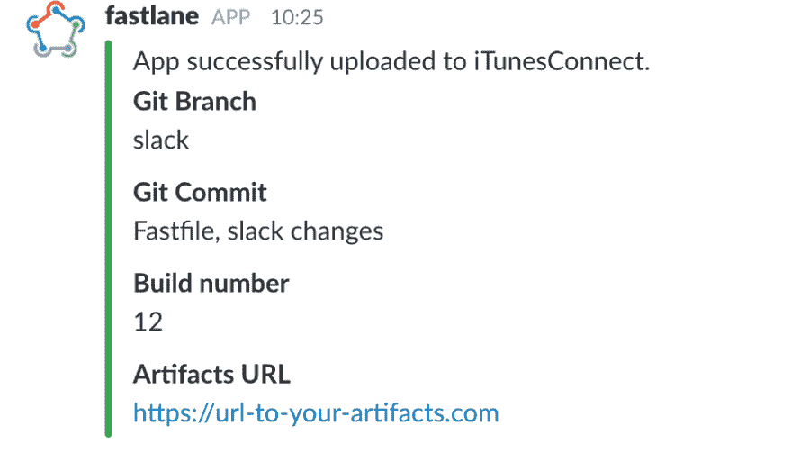
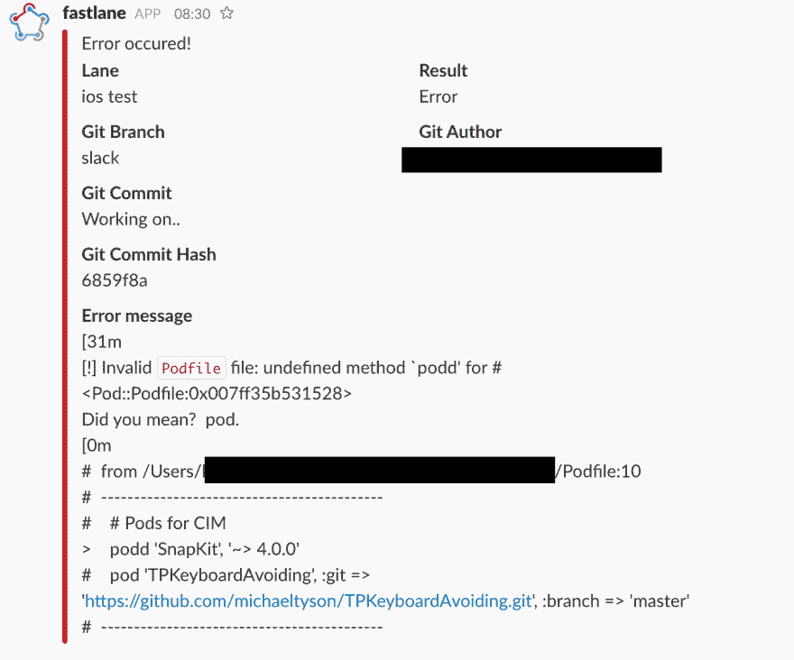

# 松弛+快车道= ❤️.谈持续集成的困惑之一。

> 原文:[https://dev.to/kamwysoc/slack-快车道-谈论连续集成的难题之一-4l9](https://dev.to/kamwysoc/slack--fastlane---talk-about-one-of-puzzles-of-continuous-integration-4l9)

[T2】](https://res.cloudinary.com/practicaldev/image/fetch/s--YU3DFIul--/c_limit%2Cf_auto%2Cfl_progressive%2Cq_auto%2Cw_880/https://wysockikamil.com/assets/posts/slack-fastlane/puzzle.jpg)

职业发展过程包含许多困惑。这些难题包括:单元测试、选择好的架构、干净的代码、持续集成等等。
在这篇文章中，我将关注其中一个难题——持续集成(CI)。iOS 开发过程中 CI 不可或缺的一部分是一个叫做[浪子](https://fastlane.tools/)的伟大工具。
浪子是一个强大的引擎，它可以处理许多任务，比如:处理代码签名，创建`.ipa`文件，生成截图到 AppStore 等等。浪子的一个很酷的特点是松散的集成——这也是我想写的。

# 💪动机💪

在光明发明公司，我正在做几个项目。我们启动的每个项目都从几个基本步骤开始:创建一个新的存储库、基本的应用程序设置以及最重要的...持续集成路径。在 iOS 应用程序上，它从安装浪子开始，在 Fastfile 中创建一些通道，然后将更改推送到我们的新存储库中。下一步是为项目配置一个新的 TeamCity(我们用于 CI 的一个服务)和一个新的代理机器。在那之后...我们的 CI 构建服务已经准备好从存储库中收集变更并为我们的客户触发构建，或者只是构建应用程序并运行我们的单元/UI 测试来检查一切是否正常。

但是如果出了什么问题呢...

[T2】](https://res.cloudinary.com/practicaldev/image/fetch/s--7hdcJIWV--/c_limit%2Cf_auto%2Cfl_progressive%2Cq_auto%2Cw_880/https://wysockikamil.com/assets/posts/slack-fastlane/error.jpg)

比方说，我们正在做一些代码重构，我们提交了变更，并推入了我们的存储库。接下来，我们的构建系统发现有可用的新提交——所以它开始获取和构建它们并运行单元测试。这里有些测试失败了。

[T2】](https://res.cloudinary.com/practicaldev/image/fetch/s--PrnJwigy--/c_limit%2Cf_auto%2Cfl_progressive%2Cq_auto%2Cw_880/https://wysockikamil.com/assets/posts/slack-fastlane/test-failed.png)

当然，当我把一些东西推送到存储库时，我不会一直打开浏览器来检查 Teamcity 站点是否一切顺利。如果出现问题，比如单元测试失败、超时或者编译错误，我希望得到通知。这里有一个关键词——知情。我们的构建代理如何通知我们发生了错误？

### 邮件

[T2】](https://res.cloudinary.com/practicaldev/image/fetch/s--Z5lle1NR--/c_limit%2Cf_auto%2Cfl_progressive%2Cq_auto%2Cw_880/https://wysockikamil.com/assets/posts/slack-fastlane/email.jpeg)

我们使用 TeamCity 内置的电子邮件服务。每条已建车道都有一条规则，上面写着“当出现问题且建设失败时，向所有开发人员发送电子邮件”。这个解决方案运行良好，并且在许多项目和公司中普遍使用。但我个人并不是百分百满意。如果你在几个项目中工作，你会收到越来越多来自客户、吉拉、团队等的电子邮件。此外，让我们从 TeamCity 服务中获取新的电子邮件。当然，我可以创建过滤器并对所有的东西进行分组(我就是这样做的)，但即使这样，对我来说也太多了。此外，还有一个新事物——如果一些构建失败了——在大多数情况下，快速修复它是很重要的。因此，我更喜欢另一种方式——在我看来更快——在发生不好的事情时得到通知。

# fast lane+slack

## 1。用正确的方法创建你的快速文件

让我们考虑一个简单的例子。一个通道编译项目并运行单元测试:

```
platform :ios do
    desc "Runs all the tests"
    lane :test do
        begin
            test_lane()
        rescue => exception
            on_error(exception)
        end
    end
end 
```

可以看到`:test`车道的车身由`begin-rescue-end`结构组成。这是一个 ruby 特有的结构。在`begin`中，你放了一些可能会失败的代码。在`rescue => exception`行之后，你放置了出错时应该执行的代码。在我们的例子中，它将是`on_error(exception)`函数。所以快速文件应该是这样的:

```
platform :ios do
   desc "Runs all the tests"
   lane :test do
       begin
           test_lane()
       rescue => exception
           on_error(exception)
       end
   end
end

### Methods

def test_lane
   cocoapods
   clear_derived_data
   scan(scheme: "YourProjectSchemeName", configuration: "Debug")
end

def on_error(exception)
   slack(
       message: "Some thing goes wrong",
       success: false,
       slack_url: "https://your slack incoming webhook url",
       attachment_properties: {
           fields: [
               {
                   title: "Build number",
                   value: ENV["BUILD_NUMBER"],
               },
               {
                   title: "Error message",
                   value: exception.to_s,
                   short: false
               }
           ]
       }
   )
end 
```

## 2。生成松弛 URL

您可能已经注意到了，`slack`方法带有一个`slack_url`参数。但是我怎样才能得到一个呢？

### 创建传入的 webhook

进入[slack incoming weebbook webiste](https://my.slack.com/services/new/incoming-webhook/)，登录，之后您也可以看到这样的屏幕:

[T2】](https://res.cloudinary.com/practicaldev/image/fetch/s--zOHZ5vqB--/c_limit%2Cf_auto%2Cfl_progressive%2Cq_auto%2Cw_880/https://wysockikamil.com/assets/posts/slack-fastlane/webhook-slack-url.png)

选择您的渠道(出于测试目的，我建议您选择直接向自己发送消息)。点击`Add incoming WebHooks integration`。
下一步是复制 Webhook URL 并将其用作`slack_url`。

当然，在您了解它是如何工作的之后，您可以在您的 slack 团队中为专门创建的通道生成一个 URL。

[T2】](https://res.cloudinary.com/practicaldev/image/fetch/s--Y1ezc2vf--/c_limit%2Cf_auto%2Cfl_progressive%2Cq_auto%2Cw_880/https://wysockikamil.com/assets/posts/slack-fastlane/webhook-slack-url2.png)

## 3。在快速文件中构建松弛消息

首先，[在这里](https://docs.fastlane.tools/actions/slack/)你可以在浪子工具中找到 Slack action 的官方文档。在接下来的部分，我会试着给你一个更近的视角。

代码非常简单。让我们创建一个简单的`slack_message`通道来测试它是如何工作的。
在您的快速文件中添加一个新车道，然后运行:

`fastlane slack_message`，

或者如果您使用捆扎机

`bundle exec fastlane slack_message`。

```
platform :ios do
   desc "Runs all the tests"
   lane :slack_message do
       slack(
           message: "App successfully uploaded to iTunesConnect.",
           success: true,
           slack_url: "https://your slack incoming webhook url"
       )
   end
end 
```

我们的信息看起来是这样的:

[T2】](https://res.cloudinary.com/practicaldev/image/fetch/s--M2XTyVE7--/c_limit%2Cf_auto%2Cfl_progressive%2Cq_auto%2Cw_880/https://wysockikamil.com/assets/posts/slack-fastlane/basic-message.png)

如你所见，默认情况下你会得到一些关于`Git Commit`、`Git Commit Hash`、`Lane`、`Result`、`Git Author`的信息。

# 🔧自定义时差消息🔧

#### 👉`message`

用于创建消息的简单键，该消息将显示在松弛消息的第一行。这可以是任何东西。

*   `message: "App Successfully uploaded to iTunesConnect"`
*   `message: "All tests have been successful"`
*   `message: "Something went wrong"` -我最喜欢的错误信息😉

但是尽量让你的懈怠信息有用。正如你在上面的`Fastfile`中看到的，我在 Ruby 中使用了一个`begin-rescue`结构。这非常有用，因为您可以使用作为参数传递给的异常，并创建一些有意义的错误信息。

我想你们都使用并且知道 [CococaPods](https://cocoapods.org/) 。让我们想象一下我们的`Podfile`有一个错别字的情况

```
platform :ios, '10.0'
inhibit_all_warnings!

target 'MyAppTarget' do
 use_frameworks!

 # Pods for MyApp
 podd 'SnapKit' # <------- should fail because of `podd`
 pod 'Result'
end 
```

现在在我们的`Fastfile`中创建一个将安装我们的 CocoaPods 的通道，并构建项目。

```
fastlane_version "2.54.1"

default_platform :ios

xcode_select ENV["XCODE_PATH"]

platform :ios do
   desc "Runs all the tests"
   lane :build_and_test do
       begin
           build_and_test_lane()
       rescue => exception
           on_error(exception)
       end
   end
end

def build_and_test_lane
   cocoapods
   clear_derived_data
   scan(scheme: "MyAppScheme", configuration: "Debug")
end

def on_error(exception)
       slack(
           message: "Lane failed with exception : #{exception}",
           success: false,
           slack_url: "https://slackurl",
       )
end 
```

如你所见，如果`build_and_test_lane`方法出错，我们的脚本将得到一个`exception`并运行`on_error(exception)`方法。让我们试试看...

`fastlane build_and_test`或`bundle exec fastlane build_and_test`

等待一段时间....和...🔔 🔔

[T2】](https://res.cloudinary.com/practicaldev/image/fetch/s--a3_LPRma--/c_limit%2Cf_auto%2Cfl_progressive%2Cq_auto%2Cw_880/https://wysockikamil.com/assets/posts/slack-fastlane/exception.png)

现在我们的消息是有意义的，我们知道我们的`Podfile`有一些错误。

#### 👉`deafult_payloads`

正如我们在文档中看到的:

> 如果你想要所有的默认有效载荷，不要添加这个键或者传递 nil。可用的默认有效载荷有:`lane`、`test_result`、`git_branch`、`git_author`、`last_git_commit_message`、`last_git_commit_hash`。

我个人认为这是非常重要的信息，但如果你想通过删除其中一些信息来定制信息，你可以看看这个例子:

```
slack(
   message: "App successfully uploaded to iTunesConnect.",
   success: true,
   slack_url: "https://your slack incoming webhook url",
   default_payloads: [:git_branch, :last_git_commit_message]
) 
```

下面是带有定制的`default_payloads`的消息的样子:

[T2】](https://res.cloudinary.com/practicaldev/image/fetch/s--_bKVSGl---/c_limit%2Cf_auto%2Cfl_progressive%2Cq_auto%2Cw_880/https://wysockikamil.com/assets/posts/slack-fastlane/default-payload-message.png)

#### 👉`success`

您还可以定义消息是否成功。在其他情况下，如果您的应用程序成功上传到 iTunesConnect，则可以使用成功信息。

第二种选择是将`success`设置为`false`，然后消息看起来会有点不同:

[T2】](https://res.cloudinary.com/practicaldev/image/fetch/s--4wnH1Bhs--/c_limit%2Cf_auto%2Cfl_progressive%2Cq_auto%2Cw_880/https://wysockikamil.com/assets/posts/slack-fastlane/message-fail.png)

红色表示出了问题，你必须解决它，这是通知你的好方法。

#### 👉`attachment_properties`

这里，一个真正的定制过程开始了。通过使用该属性，您可以向时差消息中添加任何域。假设您想要将`BUILD_NUMBER`和`URL`添加到工件中。

```
slack(
   message: "App successfully uploaded to iTunesConnect.",
   success: true,
   slack_url: "https://your slack incoming webhook url",
   default_payloads: [:git_branch, :last_git_commit_message],
   attachment_properties: {
       fields: [
           {
               title: "Build number",
               value: ENV["BUILD_NUMBER"],
           },
           {
               title: "Artifacts URL",
               value: "https://url-to-your-artifacts.com",
           }
       ]
   }
) 
```

[T2】](https://res.cloudinary.com/practicaldev/image/fetch/s--sDW5DGxa--/c_limit%2Cf_auto%2Cfl_progressive%2Cq_auto%2Cw_880/https://wysockikamil.com/assets/posts/slack-fastlane/message-with-custom-fields.png)

另一个例子...让我们修改一下我们的`on_error(exception)`方法。

```
def on_error(exception)
       slack(
           message: "Error occured!",
           success: false,
           slack_url: "https://slackurl",
           attachment_properties: {
               fields: [
                   {
                       title: "Error message",
                       value: exception
                   }
               ]
           }
       )
end 
```

这里我们得到了一个信息🔔🔔

[T2】](https://res.cloudinary.com/practicaldev/image/fetch/s--j4ktgaWM--/c_limit%2Cf_auto%2Cfl_progressive%2Cq_auto%2Cw_880/https://wysockikamil.com/assets/posts/slack-fastlane/exception2.png)

如您所见，现在错误消息是自定义字段。

#### 👉其他标志...

在这篇文章中，以我个人的浅见，我把重点放在了允许你配置 Slack message 的最重要的键上。其他的分别是:`channel`、`message`、`use_webhook_configured_username_and_icon`、`icon_url`、`payload`。关于这些按键的更多信息，您可以在[官方文档](https://docs.fastlane.tools/actions/slack/)中找到。

# 🎉结论🎉

我❤️快车道工具。它帮助所有开发人员在开发过程中节省大量时间。我觉得这个过程的一个谜题就是 这个词完整意义上的持续整合 ***。我如何理解持续集成？你可以在[维基百科](https://en.wikipedia.org/wiki/Continuous_integration)上读到***

> 在软件工程中，持续集成(CI)是将所有开发人员的工作副本一天几次合并到一个共享主线的实践。

这是 100%真实的，但对我来说，这也是一种状态，当我作为一个开发人员，在将更改推送到存储库之前，CI 代理可以通知我成功和错误，而不需要特别检查它们。但是不要误解我。我不建议在没有编译的情况下提交和推送(因为当出现故障时，我们的 CI 代理会通知我们)。我说的是当你有许多包含许多测试的项目时的情况(是的，我假设你正在编写测试😉).而且我认为您不希望每次在将新的变更推送到存储库之前都运行它们。这就是为什么，你配置整个 CI 的东西来避免它。让 CI 代理为您完成。在大多数情况下，所有的测试都会成功😉)，所以可以连续工作。但是如果不知何故测试失败了——让 CI 代理在你松懈的时候 ping 你😉
另一件事是，你可以被告知一些好事，比如:成功上传`.ipa`到 TestFlight。

下面你可以找到这篇文章中用到的所有链接。

👉[可可布丁](https://cocoapods.org)

👉[浪子](https://fastlane.tools/)

👉[松弛引入的网钩](https://api.slack.com/incoming-webhooks)

👉[浪子懈怠行动](https://docs.fastlane.tools/actions/slack/)

👉[持续集成](https://www.google.com/search?q=continuous+integration)

👉 [TeamCity](https://www.jetbrains.com/teamcity/)

这篇文章最初发表在我公司的博客上

## 关于我

我是波兰格但斯克的软件开发人员。主要是与 iOS 合作，但我对任何其他技术，框架和挑战持开放态度。如果你喜欢我的帖子，请在 twitter 上关注我，阅读我的个人博客。