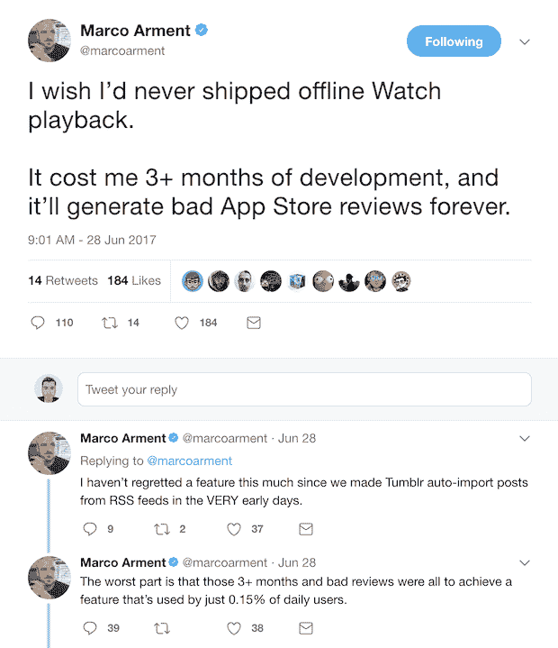

# 不要构建你无力维护的功能

> 原文：<https://dev.to/devtouser432/dont-build-features-you-cant-afford-to-maintain-ef8>

生孩子很有趣，也很愉快。事实上，这是高潮。但是，一对夫妇可以生育的孩子数量往往有一个上限。在某种程度上，这对夫妇大概明白，另一张嘴吸走稀缺资源会对整个家庭不利，而且不可能持续下去。我相信你明白我的意思。

构建新功能非常有趣。事实上，你甚至可以称之为技术世界的高潮。你带来了前所未有的新生命。只需几行代码，几个第三方库，你的应用程序现在就可以做新的事情了，这让你无比自豪。

但是这些暴力的快乐有很高的代价。添加功能是应该谨慎使用的武器。原因如下:

1.  一旦你添加了一个功能，你将无法在不引起大规模混乱的情况下删除它。

    好好想想这个。有点吓人。把你添加的每一个特性都看作是绝对永久的。您将不得不在应用程序的剩余生命周期中维护这个特性，为了您的客户着想，我希望是几十年。你的功能在技术上越令人印象深刻，维护它的成本就越高。如果您的特性依赖于第三方库来实现其核心功能，您将陷入痛苦之中。除了你每天收到的关于核心应用功能的错误报告，你还会有一堆新的关于这个令人印象深刻的功能的错误，这些错误存在于 20，000 行的第三方库中。

    真正地*真正地*在客户要求时尽快添加功能之前，考虑你有多关心你的产品。如果你不这样做，你会对你的公司和你的客户造成伤害。

2.  如果你的新功能不完美，你的评论会受到影响。

    您可以拥有五星级产品，拥有无与伦比的稳定性和性能。但是当你在应用程序的深处添加一个小功能时，只有 1%的用户会使用它，并且这个功能没有按预期工作，你的评论就会受到影响。五星评论将变成一星评论，详细描述你给用户带来的烦恼。你哭了*不公平！该应用程序的其他优秀部分呢？*但这就是人性。你可能在某一刻中了彩票，满心欢喜，但是一会儿之后，你的脚趾被踢了一下，你的心情马上就会被毁掉。用户对你的产品的感觉，在很大程度上，与他们最近的体验有关。你想尽量减少可能出错的地方。这就是为什么我称我的产品为*标准*笔记。它最大限度地减少了功能，所以你永远不必担心踢到你的脚趾。

3.  你的产品不会存活那么久。

    我想假设一个不计后果地添加功能的企业将会比其他企业生存更短的时间。特性意味着代码行，代码行意味着维护和错误。还有一个关于劳动力的并发性问题。你可以有一个拥有无限资源的万亿美元的公司，但是你可以雇佣和管理的工程师的数量仍然是有限的，并且可以在一个给定的项目中同时工作。因此，添加功能和维护它们并不是可以利用资本和资源来为您所用的事情。

最重要的是，增加功能可能不是解决问题的办法。至少对我来说，当我不确定还能做什么来发展时，增加功能是我采用的一种防御机制。有时，添加功能可能正是你的应用程序所缺少的，但这种情况很少见。在大多数情况下，你的销售额低不是因为你的应用程序缺少一些闪亮的功能，而是因为另一个部门的其他基本问题，如营销或客户服务。

最近，Standard Notes 的一个竞争对手为他们的应用程序添加了一个新功能:一个 Apple Watch 配套应用程序。实际上做得非常好，这意味着他们花了一些时间。这对我来说是个好消息。我不认为手表应用对 notes 应用是必要的，这些稀缺资源本可以用于更重要的问题。相反，他们选择使用他们的资源来构建一个复杂的功能，而投资回报率很低。在这种情况下，我所要做的就是继续调整自己的节奏，我有潜力在耐力上超过他们。

最后，注意这个来自一个人的警告，他将永远被一个所有用户都可能没有的功能所束缚:

[T2】](https://res.cloudinary.com/practicaldev/image/fetch/s--t3qeLzNx--/c_limit%2Cf_auto%2Cfl_progressive%2Cq_auto%2Cw_880/https://thepracticaldev.s3.amazonaws.com/i/om7r5sz2e59x7zknju5f.png)